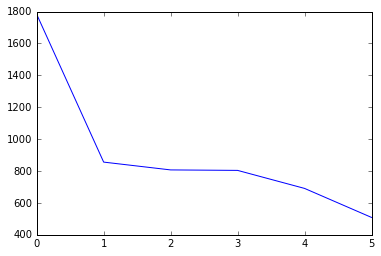

```python
# 데이터 전처리 과정에 필요한 정규표현식 모듈을 불러온다.
import re

before = '$DainelPark,?'
after = re.sub('[=.#/?:$},]', '', before)
print(after)
```

    DainelPark


```python
# Les_Miserables-Victor_Hugo.txt 파일을 연다.
f = open('Les_Miserables-Victor_Hugo.txt', 'r')
```


```python
# 객체에 글의 단어를 담고 읽기를 종료한다.
txt = f.read().split()
f.close()
```

```python
# 데이터 전처리 과정에 들어가기 전의 txt 객체를 출력해본다.
print(txt)
```

   	['Chapter', 'one', 'Jean', 'Valjean', 'One', 'evening', 'in', 'October', '1815,', 'an', 'hour', 'before', 'sunset,', 'a', 'man', 'with', 'a', 'long', 'beard', 'and', 'dusty,', 'torn', 'clothes', 'walked', 'into', 'the', 'town', 'of', 'Digne.', 'He', 'was', 'in', 'his', 'late', 'forties,', 'of', 'medium', 'height,', 'broad-shouldered', 'and', 'strong.', 'A', 'leather', 'cap', 'half-hid', 'his', 'face,', 'which', 'was', 'sunburnt', 'and', 'shining', 'with', 'sweat.', 'His', 'rough', 'yellow', 'shirt', 'was', 'unbuttoned,', 'revealing', 'a', 'hairy', 'chest.', 'On', 'his', 'back', 'was', 'a', 'heavy', "soldier's", 'bag,', 'and', 'in', 'his', 'hand', 'was', 'a', 'large', 'wooden', 'stick.', 'The', 'townspeople,', 'who', 'had', 'never', 'seen', 'him', 'before,', 'watched', 'with', 'interest', 'as', 'he', 'stopped', 'for', 'water', 'at', 'a', 'fountain.', 'Children', 'followed', 'him', 'to', 'the', 'marketplace,', 'where', 'he', 'stopped', 'for', 'more', 'water', 'at', 'another', 'fountain.', 'He', 'then', 'crossed', 'the', 'square', 'towards', 'an', 'inn,', 'and', 'entered', 'by', 'the', 'kitchen', 'door.', 'The', 'innkeeper,', 'who', 'was', 'also', 'the', 'cook,', 'was', 'busy', 'with', 'his', 'pots', 'and', 'pans,', 'preparing', 'a', 'meal', 'for', 'a', 'group', 'of', 'travellers', 'who', 'were', 'laughing', 'and', 'joking', 'in', 'the', 'next', 'room.', "'What", 'can', 'I', 'do', 'for', 'you,', "Monsieur?'", 'he', 'asked', 'without', 'looking', 'up.', "'A", 'meal', 'and', 'a', "bed,'", 'said', 'the', 'stranger.', "'Of", "course.'", 'The', 'innkeeper', 'turned', 'to', 'look', 'at', 'him.', 'Then,', 'seeing', 'the', 'visitors', 'rough', 'appearance,', 'he', 'added,', "'If", 'you', 'can', 'pay', 'for', "it.'", "'I", 'have', "money.'", 'The', 'stranger', 'produced', 'an', 'old', 'leather', 'purse', 'from', 'his', 'jacket.', "'Then", "you're", "welcome,'", 'the', 'innkeeper', 'said.', 'The', 'stranger', 'smiled', 'with', 'relief', 'and', 'sat', 'down', 'by', 'the', 'fire.', 'He', 'did', 'not', 'see', 'a', 'young', 'boy', 'run', 'out', 'with', 'a', 'note', 'that', 'the', 'innkeeper', 'had', 'quickly', 'written.', 'He', 'did', 'not', 'see', 'the', 'boy', 'return', 'a', 'short', 'time', 'later', 'and', 'whisper', 'something', 'to', 'the', 'innkeeper.', "'When", 'will', 'the', 'meal', 'be', "ready?'", 'the', 'stranger', 'asked.', "'I'm", 'sorry,', "Monsieur,'", 'the', 'innkeeper', 'said.', "'You", "can't", 'stay', 'here.', "I've", 'got', 'no', 'free', "rooms.'", "'Then", 'put', 'me', 'in', 'a', 'stable.', 'All', 'I', 'need', 'is', 'a', 'quiet', 'corner', 'somewhere.', 'After', 'dinner', "'You", "can't", 'eat', 'here', "either,'", 'the', 'innkeeper', 'interrupted.', "'I", "haven't", 'enough', "food.'", "'What", 'about', 'all', 'that', 'food', 'in', 'the', "pots?'", 'The', 'innkeeper', 'approached', 'and,', 'bending', 'towards', 'the', 'man,', 'said', 'in', 'a', 'fierce', 'whisper,', "'Get", 'out.', 'I', 'know', 'who', 'you', 'are.', 'Your', 'name', 'is', 'Jean', 'Valjean.', "You've", 'just', 'been', 'released', 'from', 'prison.', 'I', "can't", 'serve', 'people', 'like', 'you', "here.'", 'The', 'man', 'rose', 'without', 'another', 'word,', 'picked', 'up', 'his', 'bag', 'and', 'stick,', 'and', 'left.', 'Outside,', 'it', 'was', 'growing', 'dark', 'and', 'a', 'cold', 'wind', 'was', 'blowing', 'from', 'the', 'mountains', 'in', 'the', 'east.', 'The', 'man', 'looked', 'around,', 'desperate', 'for', 'somewhere', 'to', 'spend', 'the', 'night.', 'He', 'tried', 'another', 'inn,', 'but', 'the', 'same', 'thing', 'happened.', 'He', 'knocked', 'on', 'the', 'doors', 'of', "people's", 'houses,', 'but', 'news', 'of', 'his', 'arrival', 'had', 'quickly', 'spread', 'and', 'nobody', 'would', 'offer', 'him', 'shelter', 'from', 'the', 'cold.', 'He', 'even', 'tried', 'sleeping', 'in', 'a', 'garden,', 'but', 'was', 'chased', 'away', 'by', 'a', 'dog.', 'Finally,', 'he', 'found', 'himself', 'in', 'the', 'cathedral', 'square.', 'He', 'shook', 'his', 'fist', 'at', 'the', 'church', 'and', 'then,', 'cold', 'and', 'hungry,', 'he', 'lay', 'down', 'on', 'a', 'stone', 'bench', 'by', 'the', 'doorway.', 'A', 'few', 'minutes', 'later,', 'an', 'old', 'woman', 'came', 'out', 'of', 'the', 'cathedral', 'and', 'saw', 'him', 'lying', 'there.', "'What", 'are', 'you', "doing?'", 'she', 'asked.', 'He', 'answered', 'angrily,', "'Can't", 'you', 'see?', "I'm", 'trying', 'to', "sleep.'", "'On", 'this', 'bench,', 'in', 'this', 'cold', "wind?'", "'I've", 'slept', 'for', 'nineteen', 'years', 'on', 'a', 'piece', 'of', 'wood.', 'Now', "it's", 'stone.', "What's", 'the', "difference?'", "'Why", "don't", 'you', 'go', 'to', 'an', "inn?'", "'Because", 'I', "haven't", 'any', "money,'", 'he', 'lied.', 'The', 'old', 'woman', 'opened', 'her', 'purse', 'and', 'gave', 'him', 'a', 'few', 'coins.', 'Then', 'she', 'said,', "'Have", 'you', 'tried', "everywhere?'", "'I've", 'knocked', 'at', 'every', "door.'", "'What", 'about', 'that', 'one', 'over', "there?'", 'she', 'said,', 'pointing', 'across', 'the', 'square', 'to', 'a', 'small', 'house', 'beside', 'the', "bishop's", 'palace.', '***', 'The', 'Bishop', 'of', 'Digne', 'was', 'a', 'kind', 'old', 'man', 'who,', 'many', 'years', 'earlier,', 'had', 'given', 'his', 'palace', 'to', 'the', 'town', 'hospital.', 'He', 'lived', 'a', 'simple', 'life', 'with', 'his', 'sister,', 'Mademoiselle', 'Baptistine,', 'and', 'his', 'old', 'servant,', 'Madame', 'Magloire,', 'and', 'he', 'was', 'much', 'loved', 'by', 'the', 'people', 'in', 'the', 'town.', 'He', 'trusted', 'everyone.', 'His', 'doors', 'were', 'never', 'locked,', 'so', 'that', 'anybody', 'who', 'needed', 'his', 'help', 'could', 'find', 'him', 'easily.', 'That', 'evening,', 'Mme', 'Magloire', 'was', 'chatting', 'with', 'Mile', 'Baptistine', 'before', 'serving', 'the', 'meal.', "'People", 'say', "there's", 'a', 'stranger', 'in', "town,'", 'she', 'said.', "'The", 'police', 'say', 'that', 'he', 'looks', 'dangerous,', 'and', 'it', 'would', 'be', 'better', 'for', 'everyone', 'to', 'lock', 'their', 'windows', 'and', "doors.'", "'Brother.'", 'Mile', 'Baptistine', 'turned', 'to', 'the', 'bishop,', 'who', 'was', 'sitting', 'by', 'the', 'fire.', "'Did", 'you', 'hear', 'what', 'Mme', 'Magloire', 'was', "saying?'", "'Something", 'about', 'a', 'dangerous', 'stranger', 'walking', 'the', "streets?'", 'he', 'asked', 'with', 'an', 'amused', 'smile.', "'This", 'is', 'no', "joke,'", 'Mme', 'Magloire', 'said.', "'The", 'man', 'is', 'in', 'rags', 'and', 'has', 'an', 'evil', 'look', 'on', 'his', 'face.', 'Everybody', 'in', 'the', 'town', 'agrees', 'that', 'something', 'terrible', 'will', 'happen', 'tonight.', 'And', 'your', 'sister', 'agrees', 'with', 'me', 'that', 'this', 'house', "isn't", 'safe.', 'If', 'you', 'like,', 'I', 'can', 'make', 'arrangements', 'now', 'to', 'get', 'a', 'lock', 'put', 'on', 'the', 'door', 'Before', 'the', 'bishop', 'could', 'reply,', 'there', 'was', 'a', 'heavy', 'knock', 'on', 'the', 'door.', "'Come", "in,'", 'said', 'the', 'bishop.', 'The', 'door', 'opened', 'and', 'Jean', 'Valjean,', 'the', 'stranger,', 'walked', 'in.', 'Mme', 'Magloire', 'trembled,', 'open-mouthed', 'with', 'fear,', 'while', 'Mile', 'Baptistine', 'rose', 'from', 'her', 'seat', 'with', 'alarm.', 'The', 'bishop,', 'however,', 'looked', 'calmly', 'at', 'his', 'unexpected', 'visitor.', "'My", 'name', 'is', 'Jean', "Valjean,'", 'the', 'stranger', 'said', 'before', 'anybody', 'could', 'speak.', "'I've", 'been', 'in', 'prison', 'for', 'nineteen', 'years.', 'They', 'let', 'me', 'out', 'four', 'days', 'ago.', "I've", 'been', 'walking', 'all', 'day,', 'and', 'nobody', 'in', 'this', 'town', 'will', 'give', 'me', 'food', 'or', 'a', 'bed', 'for', 'the', 'night.', 'A', 'woman', 'saw', 'me', 'lying', 'on', 'a', 'stone', 'bench', 'across', 'the', 'square', 'and', 'suggested', 'that', 'I', 'come', 'here.', 'So', 'here', 'I', 'am.', 'What', 'is', 'this', 'place?', 'Is', 'it', 'an', 'inn?', "I've", 'got', 'money.', 'Will', 'you', 'let', 'me', "stay?'", "'Mme", "Magloire,'", 'said', 'the', 'bishop,', "'will", 'you', 'please', 'prepare', 'another', 'place', 'at', 'the', 'table', 'for', 'this', "gentleman?'", 'Valjean', 'took', 'a', 'step', 'forward.', "'No,", 'you', "don't", "understand,'", 'he', 'said.', "'I've", 'spent', 'five', 'years', 'in', 'prison', 'for', 'violent', 'robbery,', 'another', 'fourteen', 'years', 'for', 'trying', 'to', 'escape', 'four', 'times.', "I'm", 'a', 'dangerous', "man.'", "'Mme", "Magloire,'", 'the', 'bishop', 'went', 'on,', "'you", 'must', 'put', 'clean', 'sheets', 'on', 'the', 'bed', 'in', 'the', 'spare', "room.'", 'Mme', 'Magloire,', 'an', 'obedient', 'servant,', 'left', 'the', 'room', 'without', 'protest.', 'The', 'bishop', 'turned', 'to', 'the', 'man.', "'Sit", 'down', 'and', 'warm', 'yourself,', 'Monsieur.', 'Supper', 'will', 'soon', 'be', "ready.'", 'Jean', "Valjean's", 'face,', 'which', 'had', 'been', 'hard', 'and', 'fierce,', 'suddenly', 'softened.', "'You", 'really', 'mean', "it?'", 'he', 'asked,', 'his', 'voice', 'trembling', 'with', 'childish', 'excitement.', "'You'll", 'let', 'me', 'stay?', "I'm", 'a', 'dangerous', 'criminal,', 'but', 'you', 'called', 'me', '"Monsieur".', 'I', "don't", 'believe', 'it.', 'May', 'I', 'ask', 'your', 'name,', 'sir?', 'Are', 'you', 'an', "innkeeper?'", "'I'm", 'a', "priest,'", 'said', 'the', 'bishop.', "'And", 'this', 'is', 'where', 'I', "live.'", "'A", "priest?'", 'Valjean', 'said,', 'sitting', 'by', 'the', 'fire.', "'So", 'I', "don't", 'have', 'to', "pay?'", "'You", 'can', 'keep', 'your', "money,'", 'the', 'bishop', 'replied.', 'During', 'dinner,', 'Mile', 'Baptistine', 'looked', 'at', 'Valjean', 'kindly', 'while', 'the', 'bishop', 'talked', 'about', 'the', 'local', 'cheese-making', 'industry.', 'Valjean', 'was', 'so', 'hungry', 'that,', 'at', 'first,', 'he', 'paid', 'no', 'attention', 'to', 'anyone.', 'Soon,', 'however,', 'he', 'began', 'to', 'relax,', 'and', 'looked', 'around', 'the', 'room.', "'This", 'is', 'not', 'the', 'house', 'of', 'a', 'rich', "man,'", 'he', 'thought.', "'And", 'the', 'travellers', 'in', 'the', 'inn', 'eat', 'better', 'than', "this.'", 'But', 'then', 'he', 'looked', 'at', 'the', 'table,', 'and', 'saw', 'the', 'beautiful', 'silver', 'candlesticks,', 'knives', 'and', 'forks.', 'After', 'dinner,', 'the', 'bishop', 'said', 'goodnight', 'to', 'his', 'sister,', 'picked', 'up', 'one', 'of', 'the', 'two', 'candlesticks', 'and,', 'handing', 'the', 'other', 'to', 'his', 'guest,', 'said,', "'I'll", 'show', 'you', 'to', 'your', 'room,', "Monsieur.'", 'Valjean', 'followed', 'the', 'bishop', 'upstairs', 'into', 'a', 'bedroom.', 'This', 'was', 'the', "bishop's", 'bedroom.', 'As', 'he', 'was', 'following', 'the', 'bishop', 'across', 'the', 'room,', 'however,', 'he', 'noticed', 'Mme', 'Magloire', 'putting', 'the', 'silver', 'knives', 'and', 'forks', 'in', 'a', 'cupboard', 'by', 'the', 'bed.', 'The', 'bishop', 'showed', 'his', 'guest', 'into', 'the', 'spare', 'room.', "'Sleep", "well,'", 'he', 'said.', "'Before", 'you', 'leave', 'tomorrow,', 'you', 'must', 'have', 'a', 'bowl', 'of', 'warm', 'milk', 'from', 'our', "cows.'", 'Valjean', 'was', 'so', 'tired', 'that', 'he', 'fell', 'asleep,', 'fully-dressed,', 'on', 'top', 'of', 'the', 'sheets,', 'but', 'he', "didn't", 'sleep', 'for', 'long.', 'When', 'he', 'woke', 'up,', 'the', 'cathedral', 'clock', 'was', 'striking', 'two,', 'but', 'he', 'had', 'not', 'woken', 'because', 'of', 'this.', 'He', 'had', 'woken', 'because', 'the', 'bed', 'was', 'too', 'comfortable;', 'he', 'had', 'not', 'slept', 'in', 'a', 'proper', 'bed', 'for', 'twenty', 'years.', 'Unable', 'to', 'return', 'to', 'sleep,', 'he', 'gazed', 'into', 'the', 'darkness,', 'thinking', 'about', 'the', 'past', 'twenty', 'years.', 'Life', 'had', 'been', 'unjust', 'to', 'him,', 'and', 'he', 'was', 'angry.', 'In', '1795,', 'he', 'had', 'lost', 'his', 'job', 'as', 'a', 'tree-cutter.', 'At', 'that', 'time', 'he', 'was', 'looking', 'after', 'his', 'sister,', 'whose', 'husband', 'had', 'died,', 'and', 'her', 'seven', 'children.', 'Out', 'of', 'work,', 'and', 'with', 'no', 'food', 'in', 'the', 'house,', 'he', 'had', 'been', 'arrested', 'for', 'trying', 'to', 'steal', 'a', 'loaf', 'of', 'bread.', 'Now,', 'at', 'last,', 'he', 'was', 'free,', 'but', 'he', 'felt', 'bitter', 'and', 'angry', 'about', 'his', 'lost', 'years.', 'The', 'world', 'had', 'been', 'unfair', 'to', 'him,', 'and', 'he', 'wanted', 'revenge.', 'Then,', 'remembering', 'the', 'silver', 'on', 'the', "bishop's", 'table,', 'he', 'had', 'an', 'idea.', 'He', 'sat', 'up,', 'swung', 'his', 'feet', 'to', 'the', 'floor', 'and', 'slowly', 'stood', 'up.', 'The', 'house', 'was', 'silent.', 'He', 'moved', 'carefully', 'towards', 'the', 'window', 'and', 'looked', 'out.', 'The', 'night', 'was', 'not', 'very', 'dark;', 'there', 'was', 'a', 'full', 'moon,', 'hidden', 'from', 'time', 'to', 'time', 'by', 'large', 'clouds', 'moving', 'quickly', 'across', 'the', 'sky.', 'After', 'studying', 'the', 'garden,', 'he', 'decided', 'that', 'escape', 'would', 'be', 'easy.', 'He', 'turned', 'back', 'to', 'the', 'room,', 'picked', 'up', 'his', 'bag', 'and', 'took', 'out', 'a', 'short', 'iron', 'bar,', 'sharpened', 'at', 'one', 'end.', 'He', 'then', 'put', 'his', 'shoes', 'into', 'the', 'bag', 'and,', 'grasping', 'the', 'iron', 'bar', 'in', 'his', 'right', 'hand,', 'he', 'moved', 'quietly', 'towards', 'the', 'door', 'of', 'the', "bishop's", 'bedroom.', 'It', 'was', 'half-open.', 'The', 'bishop', 'had', 'not', 'closed', 'it.', 'Valjean', 'stood', 'listening.', 'There', 'was', 'no', 'sound.', 'He', 'gave', 'the', 'door', 'a', 'gentle', 'push', 'and', 'crept', 'into', 'the', 'bedroom.', 'Just', 'as', 'he', 'reached', 'the', 'side', 'of', 'the', "bishop's", 'bed,', 'the', 'moon', 'came', 'out', 'from', 'behind', 'a', 'cloud', 'and', 'filled', 'the', 'room', 'with', 'light.', 'Valjean', 'gazed', 'down', 'at', 'the', "bishop's", 'gentle,', 'sleeping', 'face,', 'and', 'felt', 'a', 'kind', 'of', 'terror.', 'He', 'had', 'never', 'before', 'seen', 'such', 'peace,', 'such', 'kindness,', 'such', 'trust.', 'He', 'suddenly', 'turned', 'away', 'and', 'moved', 'quickly', 'to', 'the', 'cupboard.', 'The', 'first', 'thing', 'he', 'saw', 'when', 'he', 'opened', 'the', 'door', 'was', 'the', 'basket', 'of', 'silver.', 'He', 'grabbed', 'it,', 'hurried', 'back', 'to', 'the', 'spare', 'bedroom,', 'picked', 'up', 'his', 'stick', 'and', 'bag,', 'climbed', 'out', 'of', 'the', 'window,', 'emptied', 'the', 'silver', 'into', 'his', 'bag', 'and', 'threw', 'the', 'basket', 'into', 'the', 'garden.', 'A', 'minute', 'later', 'he', 'climbed', 'the', 'garden', 'wall', 'and', 'disappeared', 'into', 'the', 'trees.', 'Early', 'the', 'next', 'morning,', 'while', 'the', 'bishop', 'was', 'studying', 'the', 'flowers', 'in', 'his', 'garden,', 'Mme', 'Magloire', 'ran', 'out', 'of', 'the', 'house', 'with', 'a', 'look', 'of', 'alarm', 'on', 'her', 'face.', "'Monseigneur,", 'do', 'you', 'know', 'where', 'the', 'silver-basket', "is?'", "'Yes,'", 'said', 'the', 'bishop.', "'I", 'found', 'it', 'in', 'one', 'of', 'the', "flowerbeds.'", "'But", "it's", "empty!'", 'she', 'cried.', "'Where's", 'the', "silver?'", "'Oh,", "you're", 'worried', 'about', 'the', 'silver?', 'I', "don't", 'know', 'where', 'that', "is.'", "'Heaven", 'save', 'us,', "it's", 'been', "stolen!'", 'she', 'cried.', "'The", 'man', 'who', 'came', 'last', 'night!', "He's", 'run', 'off', 'with', 'our', "silver!'", 'The', 'bishop,', 'who', 'had', 'been', 'bending', 'sadly', 'over', 'a', 'plant', 'damaged', 'by', 'the', 'basket,', 'looked', 'up', 'and', 'said', 'gently,', "'I", 'think', 'I', 'was', 'wrong', 'to', 'keep', 'the', 'silver', 'for', 'so', 'long.', 'It', 'really', 'belongs', 'to', 'the', 'poor.', 'I', 'should', 'have', 'given', 'it', 'away', 'a', 'long', 'time', "ago.'", 'Later', 'that', 'morning,', 'as', 'the', 'bishop', 'and', 'his', 'sister', 'were', 'having', 'breakfast,', 'there', 'was', 'a', 'knock', 'on', 'the', 'door.', 'Four', 'men', 'walked', 'into', 'the', 'room.', 'Three', 'of', 'them', 'were', 'policemen;', 'the', 'fourth', 'was', 'Jean', 'Valjean.', "'Monseigneur...", "'", 'the', 'sergeant', 'in', 'charge', 'of', 'the', 'group', 'began.', 'Valjean', 'raised', 'his', 'head', 'with', 'surprise.', "'Monseigneur?'", 'he', 'repeated.', "'I", 'thought', 'he', 'was', 'a', "priest.'", "'Silence,'", 'said', 'one', 'of', 'the', 'policemen,', "'This", 'is', 'the', 'Bishop', 'of', "Digne.'", 'The', 'bishop,', 'meanwhile,', 'had', 'moved', 'towards', 'the', 'group', 'of', 'men', 'and', 'was', 'smiling', 'at', 'Jean', 'Valjean.', "'I'm", 'delighted', 'to', 'see', 'you', 'again,', 'dear', "friend,'", 'he', 'said.', "'But", 'what', 'about', 'the', 'candlesticks?', 'I', 'gave', 'you', 'those', 'as', 'well,', "don't", 'you', 'remember?', "They're", 'silver', 'like', 'the', 'rest,', 'and', 'worth', 'at', 'least', 'two', 'hundred', 'francs.', 'Did', 'you', 'forget', 'to', 'take', "them?'", 'Jean', "Valjean's", 'eyes', 'widened', 'with', 'disbelief.', "'Monseigneur,'", 'said', 'the', 'sergeant,', "'do", 'I', 'understand', 'that', 'this', 'man', 'was', 'telling', 'the', 'truth?', 'We', 'found', 'this', 'silver', 'in', 'his', 'bag,', 'and', "'And", 'he', 'told', "you,'", 'the', 'bishop', 'finished', 'the', 'sentence', 'for', 'him,', "'that", 'an', 'old', 'priest', 'had', 'given', 'it', 'to', 'him?', 'Yes,', 'he', 'was', 'telling', 'the', "truth.'", "'So", 'this', 'man', "isn't", 'a', 'thief?', "'The", 'sergeant', 'looked', 'as', 'surprised', 'as', 'Valjean.', "'Not", 'at', 'all.', 'So', 'you', 'can', 'let', 'him', 'go', 'at', "once.'", 'The', 'policemen', 'let', 'go', 'of', "Valjean's", 'arms.', 'He', 'moved', 'his', 'feet', 'nervously,', 'uncertain', 'of', 'what', 'to', 'say', 'at', 'first.', 'Then', 'he', 'murmured,', "'Am", 'I', 'really', 'free', 'to', "go?'", "'Of", "course,'", 'said', 'the', 'bishop.', "'But", 'this', 'time,', 'you', "mustn't", 'forget', 'your', "candlesticks.'", 'He', 'fetched', 'them', 'from', 'a', 'shelf', 'and', 'gave', 'them', 'to', 'Valjean.', "'Now,", 'go', 'in', "peace,'", 'he', 'said', 'softly.', 'The', 'policemen', 'left,', 'but', 'Valjean', 'did', 'not', 'move.', 'He', 'did', 'not', 'know', 'what', 'to', 'think.', 'The', 'bishop', 'walked', 'up', 'to', 'him', 'and', 'said', 'in', 'a', 'low', 'voice,', "'Don't", 'forget', 'that', "you've", 'promised', 'to', 'use', 'the', 'money', 'to', 'make', 'yourself', 'an', 'honest', "man.'", 'Valjean,', 'who', 'did', 'not', 'remember', 'having', 'made', 'such', 'a', 'promise,', 'was', 'silent.', "'Jean", "Valjean,'", 'the', 'bishop', 'continued,', "'I've", 'bought', 'your', 'soul', 'from', 'the', 'Devil,', 'and', 'have', 'given', 'it', 'to', "God.'", '***', 'Jean', 'Valjean', 'left', 'the', 'town', 'and', 'ran', 'into', 'the', 'countryside,', 'blindly', 'following', 'lanes', 'and', 'paths,', 'not', 'realizing', 'that', 'he', 'was', 'running', 'in', 'circles.', 'He', 'was', 'filled', 'with', 'a', 'strange', 'kind', 'of', 'anger,', 'but', 'he', 'did', 'not', 'know', 'why.', 'Finally,', 'as', 'evening', 'fell,', 'he', 'sat', 'on', 'the', 'ground,', 'exhausted,', 'and', 'gazed', 'across', 'the', 'fields', 'at', 'the', 'distant', 'mountains,', 'wishing', 'that', 'he', 'was', 'back', 'in', 'prison.', 'When', 'he', 'had', 'been', 'angry', 'at', 'the', 'world,', 'he', 'had', 'felt', 'calm', 'and', 'sure', 'of', 'himself.', 'But', 'now,', 'for', 'the', 'first', 'time', 'in', 'twenty', 'years,', 'a', 'man', 'had', 'shown', 'him', 'great', 'kindness,', 'and', 'he', 'did', 'not', 'know', 'what', 'to', 'feel.', 'Suddenly,', 'he', 'heard', 'the', 'sound', 'of', 'singing.', 'A', 'boy', 'of', 'about', 'ten', 'years', 'old', 'was', 'coming', 'along', 'a', 'footpath', 'with', 'a', 'small', 'box', 'on', 'his', 'back', 'and', 'dirty', 'knees', 'showing', 'through', 'holes', 'in', 'his', 'trousers.', 'As', 'he', 'sang,', 'he', 'threw', 'a', 'coin', 'into', 'the', 'air', 'and', 'caught', 'it', 'before', 'it', 'fell.', 'Not', 'noticing', 'Jean', 'Valjean', 'sitting', 'by', 'the', 'side', 'of', 'the', 'path,', 'he', 'threw', 'the', 'coin', 'higher', 'into', 'the', 'air.', 'This', 'time,', 'however,', 'he', 'did', 'not', 'catch', 'it', 'and', 'it', 'rolled', 'along', 'the', 'ground', 'towards', 'Valjean,', 'who', 'immediately', 'put', 'his', 'foot', 'on', 'it.', 'The', 'boy,', 'unafraid,', 'walked', 'up', 'to', 'Valjean.', "'Please,", 'Monsieur,', 'may', 'I', 'have', 'my', "coin?'", "'What's", 'your', "name?'", 'asked', 'Valjean.', "'Petit-Gervais,'", 'said', 'the', 'boy,', 'smiling', 'trustfully.', "'I'm", 'a', 'chimney', 'sweep,', 'and', 'that', 'money', 'is', 'all', 'I', "have.'", "'Go", "away,'", 'said', 'Valjean.', "'Please,", 'Monsieur,', "that's", 'my', "money.'", 'Valjean', 'lowered', 'his', 'head', 'and', 'did', 'not', 'reply.', "'My", "money!'", 'the', 'boy', 'cried.', "'My", 'piece', 'of', 'silver!', 'My', "coin!'", 'Valjean', 'seemed', 'not', 'to', 'hear', 'him.', 'The', 'boy', 'seized', 'his', 'collar', 'and', 'shook', 'him.', "'I", 'want', 'my', "money!'", 'he', 'cried.', 'Valjean', 'slowly', 'raised', 'his', 'head', 'and', 'stared', 'with', 'a', 'sort', 'of', 'amazement', 'at', 'the', 'child.', 'Then,', 'reaching', 'for', 'his', 'stick,', 'he', 'said,', "'Go", 'to', "Hell!'", 'The', 'boy,', 'suddenly', 'afraid', 'of', 'the', 'mad,', 'fierce', 'look', 'in', "Valjean's", 'eyes,', 'turned', 'and', 'ran.', 'Valjean', 'stood', 'for', 'some', 'time', 'gazing', 'emptily', 'around', 'him', 'at', 'the', 'sunset', 'and', 'the', 'shadows', 'moving', 'in', 'on', 'him.', 'Suddenly', 'he', 'shivered,', 'as', 'if', 'he', 'had', 'become', 'aware', 'for', 'the', 'first', 'time', 'of', 'the', 'icy', 'wind.', 'He', 'bent', 'down', 'to', 'pick', 'up', 'his', 'bag', 'but,', 'as', 'he', 'did', 'so,', 'he', 'caught', 'sight', 'of', 'the', 'silver', 'coin,', 'half-buried', 'by', 'his', 'foot', 'in', 'the', 'earth.', 'It', 'affected', 'him', 'like', 'an', 'electric', 'shock.', "'What's", "that?'", 'he', 'murmured.', 'He', 'stared', 'at', 'the', 'coin', 'with', 'a', 'look', 'of', 'puzzlement,', 'as', 'if', 'he', 'were', 'trying', 'to', 'remember', 'something.', 'Then,', 'with', 'a', 'sudden', 'movement,', 'he', 'bent', 'down', 'and', 'picked', 'it', 'up.', 'He', 'looked', 'around', 'but', 'could', 'see', 'nothing', 'in', 'the', 'darkness', '-', 'just', 'a', 'purple', 'mist', 'rising', 'slowly', 'from', 'the', 'fields.', 'He', 'called', 'the', "boy's", 'name,', 'but', 'there', 'was', 'no', 'reply.', 'Within', 'minutes', 'he', 'was', 'running', 'along', 'the', 'path,', 'shouting.', "'Petit-Gervais!", "Petit-Gervais!'", 'There', 'was', 'still', 'no', 'reply.', 'A', 'short', 'time', 'later,', 'he', 'met', 'a', 'priest', 'on', 'horseback.', "'Have", 'you', 'seen', 'a', 'boy', 'go', "by?'", 'he', 'asked.', 'The', 'priest', 'shook', 'his', 'head.', "'No.", 'Why', 'do', 'you', "ask?'", 'Valjean', 'produced', 'two', 'five-franc', 'pieces', 'and', 'gave', 'them', 'to', 'the', 'priest.', "'This", 'is', 'for', 'your', 'poor,', 'Monsieur.', 'He', 'was', 'a', 'boy', 'of', 'about', 'ten,', 'a', 'chimney', 'sweep.', 'Monsieur,', 'you', 'must', 'report', 'me', 'to', 'the', 'police.', "I'm", 'a', 'thief.', 'I', 'stole', 'money', 'from', 'him.', 'Here,', 'let', 'me', 'give', 'you', 'more', 'money', 'But', 'before', 'Valjean', 'could', 'produce', 'more', 'coins,', 'the', 'priest', 'rode', 'away', 'in', 'terror.', 'Valjean', 'looked', 'for', 'the', 'boy', 'for', 'another', 'hour,', 'running', 'along', 'the', 'path,', 'calling', 'out', 'his', 'name,', 'but', 'with', 'no', 'success.', 'Finally', 'he', 'stopped', 'and', 'sat,', 'exhausted,', 'on', 'a', 'rock.', 'Then,', 'his', 'heart', 'full', 'of', 'grief', 'for', 'what', 'he', 'had', 'done,', 'he', 'buried', 'his', 'face', 'in', 'his', 'hands', 'and,', 'for', 'the', 'first', 'time', 'in', 'nineteen', 'years,', 'he', 'cried.', 'Chapter', 'two', 'Fantine', 'On', 'a', 'spring', 'evening', 'in', '1818,', 'in', 'the', 'village', 'of', 'Montfermeil,', 'not', 'far', 'from', 'Paris,', 'two', 'little', 'girls', 'were', 'playing', 'on', 'a', 'swing', 'outside', 'a', 'small', 'inn.', 'Their', 'mother', '-', 'a', 'big,', 'red-haired', 'woman', 'with', 'a', 'plain', 'face', '-', 'sat', 'on', 'the', 'doorstep', 'of', 'the', 'inn,', 'watching', 'them.', "'You", 'have', 'two', 'very', 'pretty', 'children,', "Madame,'", 'a', 'voice', 'said', 'from', 'close', 'beside', 'her.', 'The', 'woman', 'looked', 'round', 'and', 'saw', 'a', 'young', 'woman', 'with', 'a', 'child', 'sleeping', 'peacefully', 'in', 'her', 'arms.', 'The', 'mother', 'was', 'young', 'and', 'pretty,', 'but', 'she', 'looked', 'poor', 'and', 'unhappy.', 'She', 'did', 'not', 'smile,', 'and', 'lines', 'of', 'sadness', 'ran', 'down', 'the', 'side', 'of', 'her', 'pale', 'cheeks.', 'Her', 'clothes', 'were', 'old', 'and', 'dirty,', 'and', 'she', 'wore', 'a', 'tight,', 'plain', 'cap', 'over', 'her', 'beautiful', 'blonde', 'hair.', "'Thank", "you,'", 'said', 'the', 'woman.', "'Why", "don't", 'you', 'sit', 'down', 'for', 'a', 'minute?', 'You', 'look', 'tired.', "'When", 'the', 'young', 'woman', 'had', 'sat', 'down', 'next', 'to', 'her,', 'the', 'red-haired', 'woman', 'introduced', 'herself.', "'My", "name's", 'Thenardier.', 'My', 'husband', 'and', 'I', 'manage', 'this', "inn.'", "'My", 'names', "Fantine,'", 'the', 'young', 'woman', 'said.', "'I", 'used', 'to', 'work', 'in', 'Paris,', 'but', 'my', 'husband', 'died', 'and', 'I', 'lost', 'my', "job.'", 'She', 'could', 'not', 'tell', 'Mme', 'Thenardier', 'the', 'truth,', 'which', 'was', 'that', 'she', 'had', 'been', 'made', 'pregnant', 'by', 'a', 'young', 'man', 'who', 'had', 'then', 'abandoned', 'her.', "'I", 'left', 'Paris', 'this', 'morning', 'to', 'look', 'for', 'work', 'in', "Montreuil,'", 'she', 'continued.', "'My", 'little', 'girl', 'walked', 'some', 'of', 'the', 'way,', 'but', "she's", 'very', 'small.', 'I', 'had', 'to', 'carry', 'her', 'and', "she's", 'fallen', "asleep.'", 'As', 'she', 'spoke', 'these', 'words,', 'she', 'gave', 'her', 'daughter', 'a', 'loving', 'kiss,', 'which', 'woke', 'her', 'up.', 'The', "child's", 'eyes', 'were', 'as', 'wide', 'and', 'blue', 'as', 'her', "mother's.", 'With', 'a', 'little', 'laugh,', 'she', 'jumped', 'off', 'her', "mother's", 'lap', 'and', 'ran', 'to', 'play', 'with', 'the', 'two', 'girls', 'on', 'the', 'swing.', "'What's", 'your', 'little', "girl's", "name?'", 'Mme', 'Thenardier', 'asked.', "'Euphrasie", '-', 'but', 'I', 'call', 'her', 'Cosette.', "She's", 'nearly', "three.'", 'The', 'two', 'women', 'watched', 'the', 'children', 'playing', 'together.', "'Children", 'make', 'friends', 'very', 'easily,', "don't", "they?'", 'Mme', 'Thenardier', 'smiled.', "'Look", 'at', 'them.', 'They', 'could', 'easily', 'be', "sisters.'", 'At', 'these', 'words,', 'Fantine', 'did', 'a', 'very', 'strange', 'thing.', 'She', 'took', 'Mme', 'Thenardiers', 'hand', 'and', 'said,', "'Will", 'you', 'look', 'after', 'my', 'daughter', 'for', "me?'", 'Mme', 'Thenardier', 'looked', 'at', 'Fantine', 'thoughtfully,', 'but', 'said', 'nothing.', "'I", "can't", 'take', 'her', 'with', "me,'", 'Fantine', 'continued.', "'I", 'have', 'to', 'find', 'work,', 'and', "that's", 'not', 'easy', 'with', 'a', 'child', 'but', 'no', 'husband.', 'As', 'soon', 'as', 'I', 'find', 'a', 'job,', "I'll", 'come', 'and', 'fetch', 'her.', 'Will', 'you', 'do', 'that', 'for', 'me?', 'I', 'could', 'pay', 'six', 'francs', 'a', "month.'", 'Mme', 'Thenardier', 'still', 'said', 'nothing,', 'but', 'a', "man's", 'voice', 'from', 'inside', 'the', 'house', 'called,', "'We'll", 'take', 'seven', 'francs', 'a', 'month,', 'and', 'six', 'months', 'in', "advance.'", 'Fantine', 'agreed.', "'And", 'another', 'fifteen', 'francs', 'for', "extras,'", 'called', 'the', 'man.', "'You", 'will', 'have', "them,'", 'said', 'Fantine,', 'assuming', 'that', 'she', 'was', 'talking', 'to', 'Mme', 'Thenardiers', 'husband.', "'I", 'have', 'eighty', "francs.'", "'Does", 'the', 'child', 'have', 'enough', "clothes?'", 'the', 'man', 'asked.', "'She", 'has', 'some', 'beautiful', "clothes,'", 'Fantine', 'replied.', "'Plenty", 'of', 'everything', 'and', 'silk', 'dresses', 'like', 'a', 'lady.', "They're", 'all', 'in', 'my', "bag.'", 'The', "man's", 'face', 'finally', 'appeared', 'in', 'the', 'doorway.', "'Then", 'we', 'agree', 'to', 'look', 'after', 'her', 'for', "you,'", 'he', 'said.', 'The', 'next', 'morning,', 'Fantine', 'kissed', 'her', 'daughter', 'goodbye', 'and', 'left', 'for', 'Montreuil,', 'crying', 'as', 'if', 'her', 'heart', 'would', 'break.', "'This", 'money', 'will', 'be', "useful,'Thenardier", 'said', 'to', 'his', 'wife.', "'Now", 'I', 'can', 'pay', 'off', 'all', 'my', 'debts', 'and', 'stay', 'out', 'of', 'prison.', "I'm", 'proud', 'of', 'you.', 'You', 'set', 'a', 'very', 'clever', "trap.'", "'Without", 'even', 'intending', "to,'", 'his', 'wife', 'replied.', 'One', 'month', 'later,', 'Thenardier', 'was', 'short', 'of', 'money', 'again,', 'so', 'he', 'took', "Cosette's", 'beautiful', 'silk', 'clothes', 'to', 'Paris', 'and', 'sold', 'them', 'for', 'sixty', 'francs.', 'The', 'couple', 'dressed', 'Cosette', 'in', 'rags', 'and', 'gave', 'her', 'very', 'little', 'food,', 'which', 'they', 'made', 'her', 'eat', 'from', 'a', 'wooden', 'bowl', 'under', 'the', 'table.', 'The', 'dog', 'and', 'the', 'cat,', 'who', 'ate', 'with', 'her,', 'were', 'her', 'only', 'companions.', 'Fantine,', 'meanwhile,', 'found', 'work', 'in', 'Montreuil', 'and', 'asked', 'for', 'news', 'of', 'her', 'daughter', 'every', 'month.', 'The', 'Thenardiers', 'always', 'replied', 'that', 'she', 'was', 'in', 'good', 'health', 'and', 'very', 'happy.', 'At', 'the', 'end', 'of', 'the', 'year,', 'however,', 'Thenardier', 'was', 'not', 'happy', 'with', 'just', 'seven', 'francs', 'a', 'month;', 'he', 'demanded', 'twelve', 'and', 'Fantine', 'paid', 'without', 'protest,', 'happy', 'that', 'her', 'daughter', 'was', 'being', 'well', 'cared', 'for.', 'The', 'Thenardiers,', 'who', 'were', 'loving', 'and', 'gentle', 'to', 'their', 'own', 'daughters,', 'Eponine', 'and', 'Azelma,', 'treated', 'Cosette', 'like', 'a', 'slave.', 'They', 'made', 'her', 'get', 'up', 'before', 'dawn', 'every', 'day', 'and', 'do', 'all', 'the', 'dirty', 'jobs', 'around', 'the', 'house,', 'while', 'Eponine', 'and', 'Azelma', 'wore', 'pretty', 'clothes', 'and', 'played', 'with', 'dolls.', 'By', 'the', 'age', 'of', 'five,', 'Cosette', 'had', 'become', 'a', 'thin,', 'pale-faced,', 'silent', 'child.', 'Misery', 'had', 'made', 'her', 'ugly', 'and', 'only', 'her', 'beautiful', 'blue', 'eyes', 'remained.', 'The', 'Thenardiers', 'did', 'not', 'feel', 'guilty', 'about', 'treating', 'Cosette', 'badly', 'because', 'Fantine', 'had', 'stopped', 'sending', 'them', 'regular', 'payments.', "'The", 'child', 'is', 'lucky', 'to', 'have', 'a', 'home', 'at', "all,'", 'they', 'told', 'everybody.', "'Without", 'us,', "she'd", 'be', 'living', 'on', 'the', "streets.'", '***', 'When', 'Fantine', 'first', 'arrived', 'in', 'Montreuil,', 'she', 'had', 'immediately', 'found', 'work', 'in', 'a', 'factory.', 'She', 'rented', 'a', 'small', 'room,', 'sent', 'money', 'regularly', 'to', 'the', 'Thenardiers', 'and,', 'for', 'a', 'short', 'time,', 'was', 'almost', 'happy.', 'She', 'forgot', 'many', 'of', 'her', 'problems,', 'and', 'dreamt', 'only', 'of', 'Cosette', 'and', 'her', 'plans', 'for', 'the', 'future.', 'But', 'her', 'happiness', 'did', 'not', 'last', 'long.', 'Although', 'she', 'was', 'careful', 'to', 'say', 'nothing', 'about', 'her', 'daughter', 'to', 'anyone,', 'other', 'women', 'at', 'the', 'factory', 'soon', 'discovered', 'her', 'secret.', 'An', 'unmarried', 'woman', 'with', 'a', 'child', 'was', 'a', 'terrible', 'thing', 'in', 'those', 'days,', 'and', 'Fantine', 'lost', 'her', 'job.', 'She', 'tried', 'to', 'find', 'work', 'as', 'a', 'servant,', 'but', 'no', 'one', 'would', 'employ', 'her.', 'She', 'finally', 'managed', 'to', 'earn', 'a', 'little', 'money', 'sewing', 'shirts,', 'but', 'she', 'was', 'unable', 'to', 'send', 'money', 'regularly', 'to', 'the', 'Thenardiers.', 'That', 'winter,', 'Fantine', 'saved', 'money', 'by', 'not', 'having', 'a', 'fire,', 'and', 'developed', 'a', 'small,', 'dry', 'cough.', 'By', 'the', 'following', 'winter,', 'her', 'debts', 'had', 'increased.', 'The', 'Thenardiers', 'wrote', 'her', 'a', 'frightening', 'letter', 'in', 'which', 'they', 'told', 'her', 'that', 'Cosette', 'had', 'no', 'clothes,', 'and', 'that', 'they', 'needed', 'ten', 'francs', 'immediately', 'to', 'buy', 'her', 'a', 'new', 'dress.', 'Fantine,', 'who', 'did', 'not', 'have', 'ten', 'francs,', 'but', 'who', 'was', 'afraid', 'that', 'her', 'daughter', 'would', 'freeze', 'to', 'death,', 'went', 'to', 'the', "barber's", 'shop.', 'She', 'took', 'out', 'her', 'comb', 'and', 'let', 'her', 'blonde', 'hair', 'fall', 'down', 'to', 'her', 'waist.', "'Such", 'beautiful', "hair!'", 'the', 'barber', 'said.', "'How", 'much', 'will', 'you', 'give', 'me', 'for', "it?'", 'Fantine', 'asked.', "'Ten", "francs.'", "'Then", 'cut', 'it', "off.'", 'After', 'selling', 'her', 'hair', 'to', 'the', 'barber,', 'Fantine', 'was', 'able', 'to', 'buy', 'a', 'woollen', 'dress,', 'which', 'she', 'sent', 'to', 'the', 'Thenardiers.', 'The', 'Thenardiers,', 'however,', 'were', 'very', 'angry', '-', 'they', 'had', 'wanted', 'money,', 'not', 'clothes.', 'They', 'gave', 'the', 'dress', 'to', 'their', 'daughter,', 'Eponine,', 'and', 'Cosette', 'went', 'on', 'shivering.', 'A', 'few', 'weeks', 'later,', 'Fantine', 'received', 'another', 'letter', 'from', 'the', 'Thenardiers.', 'This', 'time', 'they', 'wanted', 'forty', 'francs', 'because', 'Cosette', 'was', 'very', 'ill', 'and', 'urgently', 'needed', 'medicine.', 'Fantine', 'felt', 'desperate;', 'she', 'did', 'not', 'know', 'how', 'to', 'obtain', 'such', 'a', 'large', 'sum', 'of', 'money.', 'As', 'she', 'was', 'wandering', 'around', 'the', 'town,', 'desperately', 'trying', 'to', 'decide', 'what', 'to', 'do,', 'she', 'noticed', 'a', 'crowd', 'of', 'people', 'in', 'the', 'market', 'square.', 'She', 'approached', 'them', 'without', 'thinking,', 'and', 'discovered', 'that', 'they', 'had', 'gathered', 'around', 'a', 'travelling', 'dentist.', 'Forgetting', 'her', 'troubles', 'for', 'a', 'moment,', 'she', 'smiled', 'at', 'the', "dentist's", 'humorous', 'efforts', 'to', 'sell', 'the', 'people', 'of', 'Montreuil', 'false', 'teeth.', 'Suddenly', 'the', 'dentist', 'saw', 'her.', "'You've", 'got', 'lovely', "teeth,'", 'he', 'said.', "'If", 'you', 'sold', 'me', 'your', 'two', 'front', 'teeth,', "I'd", 'pay', 'you', 'forty', "francs.'", 'Fantine', 'ran', 'home,', 'upset', 'and', 'disgusted.', "'My", 'hair', 'will', 'grow', "again,'", 'she', 'thought,', "'but", 'teeth', 'would', 'be', 'gone', "forever.'", 'But', 'then', 'she', 'thought', 'about', 'her', 'daughter,', 'and', 'her', 'own', 'appearance', 'suddenly', 'seemed', 'unimportant.', 'That', 'evening,', 'she', 'visited', 'the', 'dentist', 'at', 'the', 'inn', 'where', 'he', 'was', 'staying,', 'and', 'allowed', 'him', 'to', 'remove', 'her', 'teeth.', 'Fantine', 'could', 'not', 'sleep', 'that', 'night.', 'She', 'sat', 'on', 'her', 'bed,', 'cold', 'and', 'shivering,', 'and', 'looked', 'at', 'the', 'two', 'coins', 'shining', 'on', 'the', 'table.', 'Then', 'she', 'gave', 'a', 'blood-stained', 'smile.', "'I'm", "happy,'", 'she', 'told', 'herself.', "'My", 'baby', "isn't", 'going', 'to', "die.'", 'Fantine', 'earned', 'less', 'and', 'less', 'money', 'from', 'her', 'sewing,', 'and', 'the', 'Thenardiers', 'demanded', 'more', 'and', 'more', 'money', 'to', 'look', 'after', 'Cosette.', 'Fantine', 'spent', 'whole', 'nights', 'crying.', 'What', 'could', 'she', 'do?', 'She', 'had', 'sold', 'her', 'hair', 'and', 'her', 'teeth;', 'what', 'else', 'could', 'she', 'sell?', 'And', 'then', 'she', 'decided', 'that', 'she', 'had', 'no', 'other', 'choice:', 'she', 'would', 'have', 'to', 'sell', 'herself.', 'She', 'became', 'a', 'prostitute.', 'Chapter', 'three', 'Monsieur', 'Madeleine', 'One', "winter's", 'evening,', 'a', 'toothless', 'woman', 'with', 'a', 'grey', 'face', 'and', 'flowers', 'in', 'her', 'hair', 'was', 'arrested', 'for', 'attacking', 'a', 'man', 'in', 'the', 'street.', 'She', 'was', 'taken', 'to', 'the', 'police', 'station,', 'where', 'Inspector', 'Javert,', 'the', 'chief', 'of', 'police,', 'sent', 'her', 'to', 'prison', 'for', 'six', 'months.', "'Please,", 'M.', "Javert.'", 'The', 'woman', 'fell', 'to', 'her', 'knees.', "'I", 'owe', 'a', 'hundred', 'francs.', 'If', 'I', "don't", 'pay,', 'my', 'little', 'girl', 'will', 'lose', 'her', 'home', 'and', 'be', 'thrown', 'out', 'on', 'to', 'the', 'streets.', 'Please', "don't", 'send', 'me', 'to', "prison.'", 'Javert', 'listened', 'to', 'her', 'coldly,', 'then', 'ordered', 'a', 'policeman', 'to', 'take', 'her', 'away.', 'While', 'the', 'policeman', 'was', 'trying', 'to', 'drag', 'her', 'to', 'her', 'feet,', 'however,', 'a', 'voice', 'from', 'the', 'shadows', 'said,', "'One", 'moment', "please.'", 'Javert', 'looked', 'up', 'and', 'saw', 'Monsieur', 'Madeleine,', 'one', 'of', 'the', 'most', 'important', 'people', 'in', 'the', 'town.', 'M.', 'Madeleine', 'had', 'arrived', 'mysteriously', 'in', 'Montreuil', 'one', 'December', 'evening', 'in', '1815.', 'He', 'had', 'no', 'money', 'but', 'he', 'had', 'a', 'revolutionary', 'idea:', 'he', 'knew', 'a', 'cheap', 'and', 'efficient', 'method', 'of', 'manufacturing', 'glass.', 'Within', 'a', 'few', 'months', 'of', 'his', 'arrival,', 'thanks', 'to', 'his', 'new', 'idea,', 'the', 'glass-making', 'factory', 'in', 'Montreuil', 'was', 'making', 'enormous', 'profits.', 'With', 'the', 'money', 'he', 'made,', 'M.', 'Madeleine', 'built', 'two', 'new', 'factories,', 'which', 'provided', 'the', 'town', 'with', 'hundreds', 'of', 'new', 'jobs.', 'He', 'became', 'a', 'very', 'wealthy', 'man', 'but', 'lived', 'a', 'simple', 'life,', 'using', 'most', 'of', 'his', 'money', 'to', 'build', 'new', 'hospitals', 'and', 'schools.', 'He', 'was', 'so', 'popular', 'that,', 'in', '1820,', 'the', 'townspeople', 'elected', 'him', 'mayor', 'of', 'Montreuil.', 'There', 'was', 'one', 'man,', 'however,', 'who', 'did', 'not', 'like', 'M.', 'Madeleine.', 'This', 'was', 'the', 'chief', 'of', 'police,', 'Inspector', 'Javert.', 'He', 'had', 'always', 'been', 'suspicious', 'of', 'M.', 'Madeleine,', 'and', 'was', 'sure', 'that', 'he', 'had', 'seen', 'him', 'somewhere', 'before,', 'many', 'years', 'earlier.', 'But', 'he', 'kept', 'his', 'suspicions', 'to', 'himself,', 'not', 'daring', 'to', 'say', 'what', 'he', 'really', 'believed:', 'that', 'M.', 'Madeleine', 'was,', 'in', 'fact,', 'a', 'dangerous', 'criminal', 'with', 'a', 'terrible', 'past.', 'Now,', 'years', 'later,', 'M.', 'Madeleine', 'was', 'in', 'the', 'police', 'station,', 'trying', 'to', 'save', 'Fantine', 'from', 'prison.', 'Fantine,', 'however,', 'was', 'not', 'grateful.', 'In', 'fact,', 'when', 'she', 'saw', 'who', 'it', 'was,', 'she', 'spat', 'at', 'him.', "'You", 'own', 'the', 'factory', 'where', 'I', 'used', 'to', "work!'", 'she', 'shouted', 'at', 'him.', "'I", 'lost', 'my', 'job', 'because', 'of', 'you.', 'Now', "I've", 'become', 'a', 'bad', 'woman,', 'but', 'what', 'choice', 'did', 'I', 'have?', "I'll", 'never', 'get', 'my', 'daughter', 'back', 'if', 'I', "don't", 'make', "money.'", 'The', 'mayor', 'turned', 'to', 'Inspector', 'Javert', 'and', 'said,', 'in', 'a', 'soft,', 'firm', 'voice,', "'This", 'woman', 'must', 'be', "released.'", "'That's", "impossible,'", 'Javert', 'replied.', "'She", 'attacked', 'a', 'man', 'in', 'the', 'street,', 'a', 'respectable', 'citizen.', 'And', 'now', "I've", 'just', 'seen', 'her', 'spit', 'at', 'you,', 'the', 'mayor', 'of', 'our', 'town.', 'A', 'woman', 'like', 'this', 'deserves', 'to', 'be', "punished.'", "'But", 'I', 'saw', 'what', 'happened', 'in', 'the', 'street', 'just', "now,'", 'M.', 'Madeleine', 'said.', "'It", 'was', 'the', "man's", 'fault,', 'not', 'this', "woman's.", 'You', 'should', 'arrest', 'him,', 'not', "her.'", 'Javert', 'argued', 'with', 'M.', 'Madeleine', 'for', 'some', 'time,', 'but', 'finally', 'gave', 'in.', 'He', 'walked', 'angrily', 'out', 'of', 'the', 'room,', 'leaving', 'the', 'mayor', 'and', 'the', 'prostitute', 'alone', 'together.', 'Fantine', 'trembled,', 'as', 'confused', 'as', 'Javert', 'had', 'been.', 'The', 'man', 'who', 'had', 'just', 'saved', 'her', 'from', 'prison', 'was', 'also', 'the', 'man', 'who', 'had', 'caused', 'all', 'her', 'troubles.', 'The', 'devil', 'had', 'suddenly', 'decided', 'to', 'be', 'kind,', 'and', 'she', 'did', 'not', 'know', 'what', 'to', 'think.', "'I", 'heard', 'what', 'you', "said,'", 'M.', 'Madeleine', 'said', 'to', 'her.', "'I", 'honestly', "didn't", 'know', 'that', 'you', 'had', 'lost', 'your', 'job,', 'but', "I'll", 'try', 'to', 'help', 'you', 'now.', "I'll", 'pay', 'your', 'debts', 'and', 'arrange', 'for', 'your', 'child', 'to', 'return', 'to', 'you.', "I'll", 'give', 'you', 'all', 'the', 'money', 'you', 'need.', "I'll", 'make', 'you', 'happy', 'again.', 'And', 'I', 'promise', 'that,', 'in', 'the', 'eyes', 'of', 'God,', 'you', 'have', 'never', 'been', 'a', 'bad', "woman.'", 'Fantine', 'gazed', 'at', 'M.', 'Madeleine', 'with', 'tears', 'in', 'her', 'eyes.', 'After', 'all', 'her', 'pain', 'and', 'suffering', 'she', 'had,', 'for', 'the', 'first', 'time', 'in', 'her', 'life,', 'found', 'kindness', 'in', 'another', 'human', 'being.', 'At', 'last', 'she', 'would', 'be', 'cared', 'for,', 'and', 'she', 'could', 'look', 'forward', 'to', 'a', 'life', 'of', 'happiness', 'with', 'Cosette.', 'Without', 'a', 'word,', 'she', 'fell', 'to', 'her', 'knees', 'and', 'kissed', 'the', 'back', 'of', 'M.', "Madeleine's", 'hand.', 'M.', 'Madeleine', 'sent', 'the', 'Thenardiers', '300', 'francs', 'and', 'told', 'them', 'to', 'send', 'Cosette', 'to', 'Montreuil', 'immediately.', 'Thenardier,', 'thinking', 'that', 'Fantine', 'had', 'suddenly', 'become', 'rich,', 'wrote', 'back', 'and', 'demanded', '500', 'francs.', 'M.', 'Madeleine', 'sent', 'the', 'money,', 'but', 'the', 'Thenardiers', 'found', 'even', 'more', 'dishonest', 'excuses', 'for', 'not', 'sending', 'Cosette', 'back.', '***', 'The', 'weeks', 'passed', 'and,', 'although', 'she', 'was', 'happier', 'than', 'she', 'had', 'been', 'for', 'a', 'long', 'time,', 'Fantine', 'caught', 'a', 'fever.', 'Months', 'of', 'poverty', 'and', 'misery', 'had', 'made', 'her', 'ill,', 'and', 'she', 'soon', 'became', 'so', 'weak', 'that', 'she', 'was', 'unable', 'to', 'leave', 'her', 'bed.', "'When", 'shall', 'I', 'see', "Cosette?'", 'she', 'kept', 'asking', 'M.', 'Madeleine', 'when', 'he', 'visited', 'her.', "'Very", "soon,'", 'he', 'would', 'reply,', 'and', 'her', 'pale', 'face', 'would', 'light', 'up', 'with', 'joy.', 'One', 'morning,', 'as', 'M.', 'Madeleine', 'was', 'making', 'preparations', 'to', 'leave', 'for', 'Montfermeil', 'and', 'to', 'fetch', 'Cosette', 'himself,', 'he', 'had', 'a', 'visitor.', 'Inspector', 'Javert', 'walked', 'into', 'his', 'office,', 'and', 'stood', 'in', 'silence', 'waiting', 'for', 'him', 'to', 'look', 'up', 'from', 'his', 'work.', "'Well,", 'Javert,', 'what', 'is', "it?'", 'M.', 'Madeleine', 'finally', 'said.', "'I've", 'come', 'to', 'apologize,', 'M.', "Madeleine,'", 'the', 'inspector', 'replied.', "'What", 'are', 'you', 'talking', "about?'", "'I've", 'treated', 'you', 'unjustly.', 'I', 'was', 'angry', 'with', 'you', 'six', 'weeks', 'ago', 'when', 'you', 'told', 'me', 'to', 'release', 'that', 'woman.', 'I', 'wrote', 'to', 'the', 'police', 'headquarters', 'in', 'Paris', 'and', 'told', 'them', 'about', "you.'", "'Told", 'them', 'what', 'about', "me?'", "'Forgive", 'me,', 'M.', 'Madeleine,', 'but', 'I', 'believed', 'you', 'were', 'a', 'man', 'called', 'Jean', 'Valjean.', 'He', 'was', 'a', 'prisoner', 'I', 'saw', 'twenty', 'years', 'ago,', 'when', 'I', 'worked', 'at', 'a', 'prison', 'in', 'Toulon.', 'After', 'being', 'released', 'from', 'prison,', 'this', 'Valjean', 'stole', 'some', 'silver', 'from', 'the', 'Bishop', 'of', 'Digne', 'and', 'robbed', 'a', 'small', 'boy', 'on', 'a', 'public', 'footpath.', 'We', 'tried', 'to', 'catch', 'him,', 'but', 'he', 'disappeared.', 'When', 'you', 'arrived', 'in', 'Montreuil,', 'I', 'felt', 'sure', 'that', 'you', 'were', 'this', 'man,', 'but', 'now', 'I', 'know', 'I', 'was', 'wrong,', 'and', "I'm", 'sorry.', 'You', 'will,', 'of', 'course,', 'dismiss', 'me', 'from', 'my', 'job,', 'as', "I've", 'shown', 'that', 'I', "don't", 'deserve', 'your', "trust.'", 'M.', 'Madeleine,', 'looking', 'hard', 'at', 'Javert', 'without', 'expression,', 'said', 'quietly,', "'I'm", 'afraid', 'I', "don't", "understand.'", "'The", 'police', 'headquarters', 'in', 'Paris', 'told', 'me', 'that', 'Jean', 'Valjean', 'was', 'arrested', 'last', 'autumn', 'for', 'stealing', "apples,'", 'Javert', 'explained.', "He'd", 'changed', 'his', 'name', 'to', 'Champmathieu', 'and', 'had', 'lived', 'for', 'several', 'years', 'in', 'the', 'village', 'of', 'Ailly-le-Haut-Cloche.', 'Two', 'ex-prisoners', 'from', 'Toulon', 'recognized', 'him', 'as', 'Jean', 'Valjean.', 'I', 'visited', 'the', 'man', 'in', 'Arras', 'prison,', 'and', 'I', 'saw', 'for', 'myself', 'that', 'he', 'is', 'indeed', 'Jean', 'Valjean.', 'Of', 'course,', 'he', 'denies', 'everything,', 'but', "that's", 'not', 'surprising.', 'If', "he's", 'found', 'guilty', 'of', 'stealing', 'from', 'the', 'bishop', '-', 'who,', 'as', 'you', 'know,', 'died', 'a', 'couple', 'of', 'years', 'ago', '-', 'and', 'of', 'robbing', 'the', 'small', 'boy,', "he'll", 'spend', 'the', 'rest', 'of', 'his', 'life', 'in', "prison.'", 'M.', 'Madeleine', 'looked', 'down', 'at', 'his', 'papers.', "'This", 'matter', 'is', 'of', 'no', 'interest', 'to', 'me,', "Javert,'", 'he', 'said', 'casually.', "'I'm", 'sure', 'you', 'have', 'other', 'work', 'to', "do.'", "'I", 'was', 'going', 'to', 'the', "man's", 'trial', 'in', 'Arras', 'tomorrow,', "'Javert", 'said.', "'But", 'after', 'this', 'conversation,', 'you', 'must', 'dismiss', "me.'", 'M.', 'Madeleine', 'rose', 'to', 'his', 'feet.', "'Javert,'", 'he', 'said,', "'you're", 'an', 'honourable', 'man.', 'You', 'made', 'one', 'small', 'mistake,', "that's", 'all.', 'I', 'want', 'you', 'to', 'continue', 'your', 'excellent', 'work', 'as', 'inspector', 'of', "police.'", 'He', 'offered', 'Javert', 'his', 'hand,', 'but', 'the', 'inspector', 'refused', 'to', 'take', 'it.', 'Instead,', 'he', 'said,', "'I've", 'behaved', 'unjustly', 'towards', 'an', 'innocent', 'man.', 'I', 'cannot', 'shake', 'his', "hand.'", 'With', 'those', 'words', 'he', 'bowed', 'and', 'left', 'the', 'office,', 'leaving', 'M.', 'Madeleine', 'to', 'stare', 'at', 'the', 'papers', 'on', 'his', 'desk', 'with', 'an', 'empty,', 'puzzled', 'look', 'in', 'his', 'eyes.', 'That', 'afternoon,', 'M.', 'Madeleine', 'visited', 'Fantine.', 'She', 'had', 'a', 'high', 'fever,', 'and', 'was', 'coughing', 'badly,', 'but', 'she', 'still', 'had', 'only', 'one', 'thing', 'on', 'her', 'mind.', "'Cosette?'", 'she', 'asked', 'him.', "'Very", "soon,'", 'he', 'assured', 'her.', 'He', 'sat', 'by', 'her', 'bed', 'for', 'an', 'hour', 'and', 'then,', 'having', 'told', 'the', 'nurses', 'to', 'look', 'after', 'her,', 'he', 'returned', 'to', 'his', 'home.', 'He', 'stayed', 'awake', 'all', 'night,', 'thinking', 'of', "Javert's", 'story', 'about', 'Champmathieu.', 'The', 'reader', 'has', 'probably', 'already', 'realized', 'that', 'M.', 'Madeleine', 'was', 'really', 'Jean', 'Valjean,', 'and', 'M.', 'Madeleine', '-', 'as', 'we', 'shall', 'continue', 'to', 'call', 'him', 'for', 'this', 'part', 'of', 'the', 'story', '-', 'knew', 'that', 'he', 'could', 'not', 'let', 'Champmathieu', 'go', 'to', 'prison', 'for', 'crimes', 'he', 'had', 'not', 'committed.', 'He', 'knew', '-', 'although', 'he', 'was', 'not', 'happy', 'to', 'admit', 'this', '-', 'that', 'he', 'would', 'have', 'to', 'go', 'to', 'Arras', 'and', 'tell', 'the', 'truth.', 'He', 'would', 'lose', 'everything', 'that', 'he', 'had', 'worked', 'so', 'hard', 'to', 'achieve.', 'He', 'would', 'also', 'have', 'to', 'break', 'his', 'promise', 'to', 'Fantine', 'about', 'bringing', 'Cosette', 'from', 'Montfermeil.', 'But', 'what', 'choice', 'did', 'he', 'have?', 'The', 'truth', 'was', 'more', 'important', 'than', 'anything', 'else.', '***', 'The', 'next', 'morning,', 'M.', 'Madeleine', 'set', 'off', 'on', 'the', 'long', 'journey', 'to', 'Arras.', 'It', 'took', 'him', 'more', 'than', 'twelve', 'hours,', 'and', 'when', 'he', 'arrived,', 'he', 'discovered', 'that', "Champmathieu's", 'trial', 'had', 'already', 'started.', 'The', 'courtroom', 'was', 'full', 'but,', 'because', 'he', 'was', 'such', 'an', 'important', 'man,', 'M.', 'Madeleine', 'was', 'allowed', 'to', 'sit', 'behind', 'the', "judge's", 'chair.', 'He', 'watched', 'as', 'several', 'witnesses', 'swore', 'on', 'the', 'Bible', 'that', 'the', 'man', 'standing', 'before', 'the', 'judge', 'was', 'Jean', 'Valjean.', 'Champmathieu,', 'a', 'large,', 'simple-minded', 'man,', 'denied', 'everything', 'when', 'his', 'chance', 'came', 'to', 'speak,', 'but', 'the', 'crowd', 'thought', 'he', 'was', 'trying', 'to', 'be', 'funny.', 'The', 'courtroom', 'filled', 'with', 'laughter', 'and', 'Champmathieu', 'began', 'to', 'laugh', 'himself,', 'which', 'did', 'him', 'no', 'good', 'at', 'all.', 'Finally,', 'having', 'heard', 'all', 'the', 'evidence,', 'the', 'judge', 'called', 'for', 'silence.', 'He', 'was', 'preparing', 'to', 'announce', 'his', 'decision', 'when', 'M.', 'Madeleine,', 'pale', 'and', 'trembling,', 'stood', 'up', 'and', 'said:', "'That", 'man', 'is', 'not', 'Jean', "Valjean.'", 'An', 'excited', 'whisper', 'went', 'around', 'the', 'courtroom', 'as', 'everybody', 'recognized', 'M.', 'Madeleine.', 'M.', 'Madeleine', 'waited', 'for', 'the', 'whispers', 'to', 'stop', 'before', 'announcing', 'in', 'a', 'loud,', 'clear', 'voice', 'that', 'he', 'was', 'Jean', 'Valjean.', 'At', 'first,', 'no', 'one', 'believed', 'him,', 'but', 'he', 'managed', 'to', 'persuade', 'the', 'court', 'by', 'skilfully', 'questioning', 'each', 'of', 'the', 'witnesses,', 'revealing', 'personal', 'information', 'that', 'only', 'the', 'real', 'Jean', 'Valjean', 'could', 'have', 'known.', 'When', 'he', 'had', 'persuaded', 'the', 'court', 'of', 'the', 'truth', 'of', 'his', 'confession,', 'he', 'was', 'faced', 'with', 'a', 'shocked', 'but', 'respectful', 'silence.', "'I", 'must', 'leave', "now,'", 'M.', 'Madeleine', 'finally', 'said.', "'I", 'have', 'important', 'business', 'to', 'attend', 'to.', 'You', 'know', 'where', 'to', 'find', 'me,', 'and', 'I', 'shall', 'not', 'try', 'to', "escape.'", 'Everybody', 'stood', 'to', 'one', 'side', 'to', 'let', 'him', 'pass', 'as', 'he', 'made', 'his', 'way', 'towards', 'the', 'door.', 'When', 'he', 'had', 'gone,', 'the', 'judge', 'immediately', 'allowed', 'Champmathieu', 'to', 'leave', 'the', 'court', 'a', 'free', 'man.', 'Champmathieu', 'went', 'home', 'in', 'a', 'state', 'of', 'total', 'confusion,', 'thinking', 'all', 'men', 'mad', 'and', 'understanding', 'nothing', 'of', 'what', 'had', 'happened.', '***', 'At', 'dawn', 'the', 'next', 'day,', 'M.', 'Madeleine', 'entered', "Fantine's", 'room.', "'How", 'is', "she?'", 'he', 'asked', 'the', 'nurse,', 'who', 'was', 'watching', 'her', 'as', 'she', 'slept.', "'She", 'seems', 'better.', "She's", 'looking', 'forward', 'to', 'seeing', 'her', "child.'", "'I", "haven't", 'brought', 'the', 'child', 'with', "me,'", 'M.', 'Madeleine', 'said.', "'Then", 'what', 'can', 'we', 'say', 'to', 'her', 'when', 'she', 'wakes', "up?'", 'The', 'nurse', 'looked', 'suddenly', 'worried.', "'It", 'will', 'destroy', 'her', 'if', 'she', "doesn't", 'see', 'her', 'child', 'now,', 'after', 'you', 'promised', 'to', 'bring', "her.'", "'God", 'will', 'guide', "me,'", 'M.', 'Madeleine', 'sighed.', 'For', 'some', 'time', 'M.', 'Madeleine', 'sat', 'by', 'the', 'bedside', 'and', 'watched', 'Fantine', 'while', 'she', 'slept.', 'She', 'was', 'breathing', 'with', 'great', 'difficulty,', 'but', 'her', 'face', 'looked', 'peaceful', 'and', 'calm.', 'Suddenly,', 'she', 'opened', 'her', 'eyes', 'and', 'saw', 'M.', 'Madeleine.', "'Cosette?'", 'she', 'asked,', 'with', 'a', 'soft', 'smile.', "'Later,'", 'M.', 'Madeleine', 'said', 'gently,', 'taking', 'her', 'hand.', "'You're", 'too', 'weak', 'to', 'see', 'her', 'at', 'the', 'moment.', 'First', 'you', 'must', 'get', "well.'", 'Fantine', 'smiled,', 'and', 'began', 'to', 'talk', 'dreamily', 'about', 'her', 'future', 'life', 'with', 'her', 'daughter,', 'and', 'how', 'happy', 'they', 'would', 'be', 'together.', 'But', 'suddenly', 'her', 'face', 'froze,', 'and', 'she', 'stared', 'with', 'horror', 'at', 'the', 'door.', 'M.', 'Madeleine,', 'who', 'was', 'holding', 'her', 'hand,', 'turned', 'and', 'saw', 'Inspector', 'Javert.', 'Fantine,', 'thinking', 'that', 'the', 'inspector', 'had', 'come', 'for', 'her,', 'gripped', 'M.', "Madeleine's", 'hand', 'tightly', 'and', 'begged', 'him', 'to', 'protect', 'her.', "'Don't", 'be', "afraid.'", 'M.', 'Madeleine', 'tried', 'to', 'calm', 'her.', "'He", "hasn't", 'come', 'for', "you.'", 'Then,', 'gently', 'rising', 'from', 'his', 'chair,', 'he', 'moved', 'towards', 'Javert.', "'I", 'know', 'what', "you've", 'come', "for,'", 'he', 'said', 'quietly', 'so', 'that', 'Fantine', "wouldn't", 'hear.', "'But", 'give', 'me', 'three', 'days,', 'please.', "That's", 'all', 'I', 'ask.', 'Three', 'days', 'to', 'fetch', 'this', 'unfortunate', "woman's", 'child.', "I'll", 'pay', 'anything', 'you', "like.'", "'Do", 'you', 'think', "I'm", "stupid?'", 'Javert', 'gave', 'an', 'unpleasant', 'laugh.', "'Three", 'days', 'to', 'escape,', 'you', "mean.'", 'Fantine,', 'who', 'had', 'heard', 'what', 'M.', 'Madeleine', 'said,', 'despite', 'his', 'efforts', 'to', 'speak', 'quietly,', 'began', 'to', 'tremble.', "'To", 'fetch', 'my', "child?'", 'she', 'cried.', "'Isn't", 'she', 'here?', 'Nurse,', 'answer', 'me...', "where's", 'my', 'little', 'Cosette?', 'I', 'want', 'to', 'see', 'her.', 'M.', 'Madeleine', "'Be", 'quiet,', 'you', 'dirty', "prostitute,'", 'Javert', 'interrupted', 'her', 'angrily.', "'There", 'is', 'no', 'Monsieur', 'Madeleine.', 'This', "man's", 'name', 'is', 'Jean', 'Valjean,', 'and', "he's", 'a', 'criminal', 'no', 'better', 'than', 'you', 'are.', 'And', 'you', 'can', 'forget', 'all', 'that', 'nonsense', 'about', 'your', 'child.', 'Fantine', 'suddenly', 'sat', 'up.', 'She', 'stared', 'wildly', 'at', 'the', 'two', 'men,', 'then', 'turned', 'to', 'the', 'nurse.', 'She', 'looked', 'as', 'if', 'she', 'was', 'going', 'to', 'speak,', 'but', 'no', 'words', 'came', 'from', 'her', 'lips.', 'Instead,', 'with', 'a', 'small', 'sigh,', 'she', 'fell', 'back', 'against', 'her', 'pillow', 'and', 'lay', 'completely', 'still.', 'Jean', 'Valjean', '(as', 'we', 'must', 'now', 'call', 'him)', 'shook', "Javert's", 'hand', 'from', 'his', 'collar', 'and', 'ran', 'to', 'the', 'bed.', 'He', 'gazed', 'into', "Fantine's", 'eyes', 'and', 'knew', 'immediately', 'that', 'she', 'was', 'dead.', "'You've", 'killed', "her!'", 'he', 'cried', 'angrily,', 'turning', 'to', 'Javert', 'with', 'a', 'fierce', 'look', 'in', 'his', 'eyes.', "'I", "didn't", 'come', 'here', 'to', "argue,'", 'Javert', 'said,', 'stepping', 'back', 'nervously,', 'afraid', 'that', 'Valjean', 'was', 'going', 'to', 'attack', 'him.', "'If", 'you', "don't", 'come', 'with', 'me', 'now,', "I'll", 'have', 'to', 'call', 'my', "men.'", 'Valjean', 'looked', 'around', 'the', 'room,', 'thinking', 'for', 'a', 'second', 'of', 'making', 'his', 'escape.', 'But', 'the', 'idea', 'did', 'not', 'last', 'for', 'long.', 'He', 'turned', 'again', 'to', 'Fantine', 'and', 'looked', 'for', 'one', 'last', 'time', 'at', 'her', 'sad,', 'pale', 'face', 'and', 'empty,', 'blue', 'eyes.', 'Bending', 'down,', 'he', 'closed', 'her', 'eyes', 'and', 'pressed', 'his', 'lips', 'against', 'her', 'forehead.', 'Then', 'he', 'rose', 'and', 'turned', 'back', 'to', 'Javert.', "'I'm", 'ready', "now,'", 'he', 'said.', 'News', 'of', 'M.', "Madeleine's", 'arrest', 'spread', 'quickly', 'around', 'the', 'town.', 'Most', 'people', 'pretended', 'not', 'to', 'be', 'surprised.', "'We", 'always', 'knew', 'there', 'was', 'something', 'strange', 'about', "him,'", 'they', 'said.', 'Two', 'days', 'after', 'his', 'arrest,', 'Jean', 'Valjean', 'escaped', 'from', 'prison.', 'The', 'bars', 'of', 'his', 'window', 'had', 'been', 'broken', 'during', 'the', 'night.', 'Again,', 'most', 'people', 'pretended', 'not', 'to', 'be', 'surprised.', "'It", 'takes', 'more', 'than', 'a', 'small', 'town', 'prison', 'to', 'hold', 'a', 'man', 'as', 'strong', 'as', "that,'", 'they', 'all', 'agreed.', 'Chapter', 'four', 'The', 'Man', 'in', 'the', 'Long', 'Yellow', 'Coat', 'Christmas', '1823', 'was', 'especially', 'lively', 'and', 'colourful', 'in', 'the', 'village', 'of', 'Montfermeil.', 'Entertainers', 'and', 'traders', 'from', 'Paris', 'set', 'up', 'their', 'stalls', 'in', 'the', 'streets,', 'and', 'business', 'at', 'the', "Thenardiers'", 'inn', 'was', 'very', 'good.', 'While', 'guests', 'and', 'visitors', 'ate', 'and', 'drank', 'noisily,', 'Cosette', '-', 'now', 'eight', 'years', 'old', '-', 'sat', 'in', 'her', 'usual', 'place', 'under', 'the', 'kitchen', 'table.', 'Dressed', 'in', 'rags,', 'she', 'knitted', 'woollen', 'stockings', 'for', 'Eponine', 'and', 'Azelma.', 'One', 'evening,', 'Madame', 'Thenardier', 'ordered', 'Cosette', 'out', 'into', 'the', 'cold', 'to', 'fetch', 'water.', 'The', 'nearest', 'water', 'supply', 'was', 'half-way', 'down', 'the', 'wooded', 'hill', 'on', 'which', 'Montfermeil', 'stood,', 'and', 'Cosette', 'hated', 'fetching', 'water,', 'especially', 'in', 'the', 'dark.', 'Miserably,', 'she', 'picked', 'up', 'a', 'large,', 'empty', 'bucket', 'that', 'was', 'almost', 'as', 'big', 'as', 'she', 'was,', 'and', 'was', 'walking', 'with', 'it', 'to', 'the', 'door', 'when', 'Madame', 'Thenardier', 'stopped', 'her.', "'Buy", 'some', 'bread', 'on', 'the', "way,'", 'she', 'said,', 'giving', 'the', 'girl', 'some', 'money.', 'Cosette', 'took', 'the', 'coin,', 'put', 'it', 'carefully', 'in', 'her', 'pocket', 'and', 'left.', 'She', 'was', 'cold', 'and', 'hungry', 'as', 'she', 'dragged', 'the', 'bucket', 'behind', 'her', 'along', 'the', 'crowded', 'street,', 'but', 'she', 'could', 'not', 'resist', 'stopping', 'in', 'front', 'of', 'one', 'of', 'the', 'stalls.', 'It', 'was', 'like', 'a', 'palace', 'to', 'her,', 'with', 'its', 'bright', 'lights,', 'shining', 'glass', 'and', 'pretty', 'objects.', 'But', 'the', 'object', 'that', 'most', 'attracted', "Cosette's", 'attention', 'was', 'a', 'large,', 'golden-haired', 'doll', 'in', 'a', 'beautiful', 'long', 'pink', 'dress.', 'All', 'the', 'children', 'in', 'Montfermeil', 'had', 'gazed', 'with', 'wonder', 'at', 'this', 'doll,', 'but', 'nobody', 'in', 'the', 'village', 'had', 'enough', 'money', 'to', 'buy', 'it.', 'Cosette', 'gazed', 'at', 'the', 'doll', 'for', 'several', 'minutes', 'but,', 'remembering', 'her', 'job,', 'she', 'sighed', 'and', 'continued', 'on', 'her', 'way.', 'She', 'had', 'soon', 'left', 'the', 'colourful', 'lights', 'and', 'the', 'happy', 'laughter', 'of', 'the', 'village', 'behind', 'her,', 'and', 'was', 'running', 'down', 'the', 'hill', 'into', 'the', 'frightening', 'darkness', 'of', 'the', 'wood.', 'Finding', 'the', 'stream,', 'she', 'bent', 'forward', 'and', 'began', 'to', 'till', 'her', 'bucket.', 'She', 'did', 'not', 'notice', 'the', 'coin', 'that', 'Mme', 'Thenardier', 'had', 'given', 'her', 'for', 'the', 'bread', 'fall', 'out', 'of', 'her', 'pocket', 'into', 'the', 'water.', 'When', 'the', 'bucket', 'was', 'full,', 'she', 'gripped', 'the', 'handle', 'with', 'her', 'tiny,', 'frozen', 'hands', 'and', 'tried', 'to', 'pull', 'it', 'back', 'up', 'the', 'hill.', 'But', 'the', 'bucket', 'was', 'so', 'heavy', 'that,', 'after', 'a', 'dozen', 'steps,', 'she', 'had', 'to', 'stop', 'for', 'a', 'rest.', 'She', 'managed', 'a', 'few', 'more', 'steps,', 'and', 'stopped', 'again.', 'Her', 'progress', 'became', 'slower', 'and', 'slower.', 'She', 'was', 'almost', 'at', 'the', 'end', 'of', 'her', 'strength,', 'and', 'she', 'was', 'still', 'not', 'out', 'of', 'the', 'wood.', 'Leaning', 'against', 'a', 'tree,', 'she', 'cried', 'aloud:', "'Oh", 'God', 'help', 'me!', 'Please,', 'dear', "God!'", 'Suddenly,', 'an', 'enormous', 'hand', 'reached', 'down', 'from', 'the', 'sky', 'and', 'took', 'the', 'bucket', 'of', 'water', 'from', 'her.', 'Looking', 'up,', 'Cosette', 'saw', 'a', 'huge,', 'white-haired', 'man', 'standing', 'next', 'to', 'her.', 'He', 'looked', 'very', 'strange', 'with', 'his', 'tall', 'black', 'hat', 'and', 'long', 'yellow', 'coat.', "'This", 'is', 'a', 'very', 'heavy', 'bucket', 'for', 'such', 'a', 'small', "child,'", 'he', 'said', 'gently,', 'looking', 'down', 'at', 'her', 'from', 'his', 'great', 'height.', 'For', 'some', 'reason,', 'Cosette', 'was', 'not', 'afraid.', 'There', 'was', 'something', 'about', 'his', 'eyes,', 'tilled', 'with', 'a', 'strange', 'sadness,', 'that', 'she', 'liked', 'and', 'trusted.', 'She', 'let', 'him', 'carry', 'the', 'bucket', 'up', 'the', 'hill', 'and,', 'as', 'they', 'walked', 'back', 'towards', 'the', 'village,', 'she', 'told', 'him', 'everything', 'about', 'her', 'life', 'with', 'the', 'Thenardiers.', 'The', 'old', 'man', 'listened', 'with', 'great', 'interest,', 'and', 'asked', 'her', 'many', 'questions.', 'As', 'they', 'were', 'approaching', 'the', 'inn,', 'Cosette', 'turned', 'to', 'him', 'and', 'said,', "'May", 'I', 'have', 'the', 'bucket', 'now?', 'If', 'Mme', 'Thenardier', 'sees', 'that', 'someone', 'has', 'been', 'helping', 'me,', "she'll", 'beat', "me.'", 'The', 'old', 'man', 'gave', 'her', 'the', 'bucket,', 'and', 'they', 'entered', 'the', 'inn', 'together.', "'What", 'took', 'you', 'so', "long?'", 'Mme', 'Thenardier', 'said', 'angrily', 'when', 'she', 'saw', 'the', 'little', 'girl.', "'This", 'gentleman', 'wants', 'a', 'room', 'for', 'the', "night,'", 'Cosette', 'said,', 'trembling', 'with', 'fear,', 'expecting', 'to', 'be', 'beaten.', 'Mme', 'Thenardier', 'glanced', 'at', 'the', 'old', 'man', 'without', 'interest.', 'She', 'could', 'tell', 'from', 'his', 'clothes', 'that', 'he', 'probably', 'had', 'no', 'money.', "'I'm", 'sorry,', 'the', 'rooms', 'are', "full,'", 'she', 'said.', "'I", 'can', 'pay', 'the', 'price', 'of', 'a', "room,'", 'the', 'old', 'man', 'said.', "'Forty", "sous,'", 'Mme', 'Thenardier', 'replied', '(although', 'the', 'usual', 'price', 'was', 'twenty).', "'Forty", "sous,'", 'the', 'man', 'agreed.', 'He', 'sat', 'down', 'and', 'Cosette,', 'after', 'serving', 'him', 'some', 'wine,', 'returned', 'to', 'her', 'place', 'under', 'the', 'table.', 'But', 'before', 'she', 'could', 'start', 'her', 'knitting,', 'she', 'heard', 'Mme', "Thenardier's", 'angry', 'voice', 'demanding,', "'Where's", 'the', 'bread', 'I', 'told', 'you', 'to', "get?'", 'Cosette,', 'who', 'had', 'forgotten', 'about', 'the', 'bread,', 'came', 'out', 'from', 'under', 'the', 'table.', "'The", "baker's", 'was', "shut,'", 'she', 'lied.', "'Well,", 'give', 'me', 'back', 'the', "money.'", 'Cosette', 'felt', 'in', 'her', 'pocket', 'and', 'suddenly', 'went', 'pale.', 'The', 'coin', 'was', 'not', 'there.', "'I'm", "waiting,'", 'Mme', 'Thenardier', 'said', 'threateningly.', 'Cosette', 'said', 'nothing,', 'speechless', 'with', 'fear', 'as', 'the', 'woman', 'raised', 'her', 'arm', 'to', 'hit', 'her.', 'But', 'before', 'she', 'could', 'deliver', 'the', 'blow', 'the', 'old', 'man,', 'who', 'had', 'seen', 'everything,', 'interrupted', 'her.', "'Madame,", "I've", 'just', 'noticed', 'this', 'on', 'the', 'floor.', 'It', 'must', 'have', 'fallen', 'from', 'the', "child's", "pocket.'", 'Mme', 'Thenardier', 'took', 'the', 'coin', 'the', 'old', 'man', 'held', 'towards', 'her', 'and', 'walked', 'away.', 'At', 'that', 'moment', 'the', 'door', 'opened', 'and', 'Eponine', 'and', 'Azelma', 'appeared.', 'They', 'were', 'two', 'healthy', 'girls,', 'the', 'old', 'man', 'noticed,', 'dressed', 'in', 'warm', 'clothes', 'and', 'with', 'pink,', 'healthy', 'cheeks.', 'After', 'hugging', 'and', 'kissing', 'their', 'mother,', 'they', 'sat', 'on', 'the', 'floor', 'by', 'the', 'fire', 'and', 'played', 'with', 'a', 'doll.', 'Cosette,', 'who', 'had', 'returned', 'to', 'her', 'place', 'under', 'the', 'table,', 'looked', 'up', 'from', 'her', 'knitting', 'and', 'watched', 'them', 'sadly.', 'A', 'short', 'time', 'later,', 'the', 'girls', 'grew', 'bored', 'with', 'their', 'game.', 'They', 'left', 'the', 'doll', 'on', 'the', 'floor', 'and', 'went', 'off', 'to', 'play', 'with', 'a', 'baby', 'cat.', 'Cosette,', 'checking', 'that', 'no', 'one', 'was', 'watching,', 'reached', 'out', 'and', 'picked', 'up', 'the', 'doll.', 'She', 'turned', 'her', 'back', 'on', 'the', 'room', 'and', 'began', 'to', 'play', 'with', 'it,', 'hoping', 'that', 'no', 'one', 'could', 'see', 'what', 'she', 'was', 'doing.', 'Her', 'happiness', 'did', 'not', 'last', 'long,', 'however.', 'The', 'two', 'girls,', 'when', 'they', 'saw', 'Cosette', 'with', 'their', 'doll,', 'ran', 'crying', 'to', 'their', 'mother.', 'Mme', 'Thenardier', 'rushed', 'across', 'the', 'room', 'towards', 'Cosette', 'who,', 'afraid', 'that', 'she', 'would', 'be', 'punished,', 'put', 'the', 'doll', 'gently', 'on', 'the', 'floor', 'and', 'began', 'to', 'cry.', "'What's", 'the', "matter?'", 'the', 'old', 'man', 'said,', 'rising', 'to', 'his', 'feet.', "'Can't", 'you', "see?'", 'Mme', 'Thenardier', 'said,', 'red', 'with', 'anger.', "'That", 'nasty', 'little', 'girl,', 'who', "isn't", 'even', 'my', 'own', 'daughter,', 'who', 'I', 'feed', 'and', 'look', 'after', 'out', 'of', 'the', 'kindness', 'of', 'my', 'heart,', 'has', 'been', 'playing', 'with', 'my', "daughters'", "doll.'", "'I", "don't", "understand,'", 'the', 'old', 'man', 'said.', "'She's", 'touched', 'it', 'with', 'her', 'dirty', "hands!'", 'Then,', 'hearing', 'Cosette', 'crying,', 'she', 'turned', 'to', 'the', 'little', 'girl', 'and', 'shouted,', "'Stop", 'that', "noise!'", 'The', 'old', 'man', 'left', 'the', 'inn', 'and,', 'minutes', 'later,', 'returned', 'with', 'something', 'in', 'his', 'hands:', 'the', 'beautiful', 'doll', 'from', 'the', 'stall', 'across', 'the', 'road.', "'Here,'", 'he', 'said', 'softly,', 'placing', 'it', 'gently', 'on', 'the', 'floor', 'in', 'front', 'of', 'Cosette.', "'It's", 'for', "you.'", 'There', 'was', 'a', 'sudden', 'silence', 'in', 'the', 'room.', 'Mme', 'Thenardier,', 'Eponine', 'and', 'Azelma', 'stood', 'absolutely', 'still.', 'The', 'drinkers', 'at', 'the', 'other', 'tables', 'paused,', 'glasses', 'half-way', 'to', 'their', 'lips,', 'and', 'stared', 'with', 'disbelief.', "'What", 'kind', 'of', 'man', 'is', "this?'", 'they', 'thought.', "'He", 'dresses', 'so', 'poorly', 'but', 'can', 'afford', 'to', 'buy', 'the', 'most', 'expensive', 'doll', 'in', "Montfermeil!'", 'The', 'Thenardiers', 'gave', 'the', 'old', 'man', 'their', 'best', 'room', 'for', 'the', 'night.', 'The', 'next', 'morning', 'they', 'gave', 'him', 'the', 'bill,', 'charging', 'him', 'three', 'times', 'the', 'usual', 'price', 'for', 'a', 'meal', 'and', 'a', 'bed', 'for', 'the', 'night.', 'They', 'waited', 'nervously', 'while', 'the', 'man', 'studied', 'the', 'bill', 'carefully,', 'expecting', 'him', 'to', 'complain', 'or', 'cause', 'trouble.', 'Finally,', 'he', 'looked', 'up', 'from', 'the', 'bill', 'without', 'expression', 'and', 'said,', "'Tell", 'me,', 'is', 'business', 'good', 'here', 'in', "Montfermeil?'", "'Times", 'are', 'very', "hard,'", 'Mme', 'Thenardier', 'replied', 'immediately.', "'This", 'is', 'a', 'poor', 'country.', 'I', "don't", 'know', 'how', 'we', 'would', 'manage', 'without', 'the', 'occasional', 'rich', 'and', 'generous', 'traveller', 'like', 'yourself.', 'We', 'have', 'so', 'many', 'expenses.', 'That', 'child,', 'for', 'instance', '-', "you've", 'no', 'idea', 'how', 'much', 'she', 'costs.', 'We', 'have', 'our', 'own', 'daughters', 'to', 'look', 'after.', 'I', "can't", 'afford', 'to', 'look', 'after', 'other', "people's", 'children,', "too.'", "'What", 'would', 'you', "say,'", 'the', 'old', 'man', 'said', 'after', 'a', "moment's", 'thought,', "'if", 'I', 'offered', 'to', 'take', 'the', 'child', 'from', "you?'", "'Oh!'", 'Madame', 'Thenardiers', 'face', 'brightened.', "'That", 'would', 'be', "wonderful.'", "'Just", 'a', "minute,'", 'her', 'husband', 'said.', "'We", 'love', 'that', 'child', 'very', 'much.', "It's", 'true', "we're", 'poor,', 'and', 'we', 'have', 'bad', 'debts,', 'but', 'love', 'is', 'more', 'important', 'than', "money.'", "'How", 'much', 'do', 'you', "need?'", 'the', 'old', 'man', 'asked,', 'taking', 'an', 'old', 'leather', 'wallet', 'from', 'the', 'pocket', 'of', 'his', 'coat.', "'1500", "francs,'", 'Thenardier,', 'who', 'had', 'already', 'done', 'his', 'arithmetic,', 'replied.', 'The', 'old', 'man', 'put', 'three', '500-franc', 'notes', 'on', 'the', 'table', 'and', 'said,', 'without', 'smiling,', "'Now", 'fetch', "Cosette.'", 'When', 'Cosette', 'came', 'downstairs,', 'the', 'old', 'man', 'gave', 'her', 'new', 'clothes', 'to', 'wear:', 'a', 'black', 'woollen', 'dress,', 'black', 'stockings,', 'scarf', 'and', 'shoes.', 'Half', 'an', 'hour', 'later,', 'the', 'people', 'of', 'Montfermeil', 'saw', 'an', 'old', 'man', 'in', 'a', 'tall', 'hat', 'and', 'long', 'yellow', 'coat', 'walking', 'along', 'the', 'road', 'to', 'Paris,', 'hand-in-hand', 'with', 'a', 'little', 'girl', 'dressed', 'completely', 'in', 'black.', 'No', 'one', 'knew', 'the', 'man.', 'And,', 'because', 'she', 'was', 'carrying', 'an', 'expensive', 'doll', 'and', 'was', 'no', 'longer', 'wearing', 'rags,', 'not', 'many', 'recognized', 'Cosette.', 'Cosette', 'was', 'leaving', 'at', 'last.', 'She', 'did', 'not', 'know', 'where', 'to,', 'or', 'with', 'whom.', 'But,', 'as', 'she', 'held', 'the', 'old', "man's", 'hand,', 'she', 'gazed', 'wide-eyed', 'at', 'the', 'sky.', 'She', 'had', 'the', 'strange', 'but', 'comforting', 'feeling', 'that', 'she', 'was', 'somehow', 'travelling', 'closer', 'to', 'God.', 'Chapter', 'four', 'Valjean', 'and', 'Cosette', 'Somewhere', 'on', 'the', 'outskirts', 'of', 'Paris,', 'Jean', 'Valjean', 'stopped', 'outside', 'a', 'large,', 'ancient', 'building', 'with', 'damp', 'walls.', 'He', 'took', 'a', 'key', 'from', 'the', 'pocket', 'of', 'his', 'long', 'yellow', 'coat', 'and', 'opened', 'the', 'old', 'wooden', 'door.', 'He', 'then', 'carried', 'Cosette,', 'who', 'was', 'sleeping', 'in', 'his', 'arms,', 'along', 'a', 'dark', 'corridor', 'and', 'up', 'some', 'stairs', 'to', 'the', 'room', 'he', 'had', 'rented', 'since', 'his', 'escape', 'from', 'Montreuil.', 'There', 'was', 'not', 'much', 'furniture', 'in', 'the', 'room', '-', 'just', 'an', 'old', 'bed,', 'a', 'mattress', 'on', 'the', 'floor,', 'a', 'table,', 'some', 'chairs', 'and', 'a', 'lighted', 'stove.', 'A', 'streetlamp', 'shone', 'through', 'the', 'only', 'window,', 'lighting', 'the', 'dark', 'interior', 'of', 'the', 'room.', 'Valjean', 'laid', 'Cosette', 'on', 'the', 'bed', 'without', 'waking', 'her.', 'He', 'lit', 'a', 'candle', 'and', 'sat', 'by', 'the', 'bed,', 'watching', 'her', 'while', 'she', 'slept.', 'He', 'felt', 'sad', 'that', 'Fantine', 'had', 'not', 'lived', 'to', 'see', 'her', 'child', 'again,', 'but', 'happy', 'that', 'he', 'had', 'been', 'able', 'to', 'rescue', 'her', 'child', 'from', 'the', 'terrible', 'Thenardiers.', 'He', 'bent', 'and', 'kissed', 'the', 'sleeping', "child's", 'forehead', 'just', 'as,', 'nine', 'months', 'earlier,', 'he', 'had', 'kissed', 'her', "mother's.", 'The', 'next', 'morning,', 'Cosette', 'opened', 'her', 'eyes', 'and', 'immediately', 'started', 'to', 'get', 'out', 'of', 'bed.', "'I'm", 'coming,', "Madame,'", 'she', 'yawned,', 'blinded', 'by', 'the', 'bright', "winter's", 'sunlight', 'that', 'was', 'shining', 'into', 'the', 'room.', 'Then,', 'as', 'her', 'eyes', 'adjusted', 'to', 'the', 'light,', 'she', 'saw', 'the', 'kind', 'old', 'face', 'of', 'Jean', 'Valjean', 'looking', 'down', 'at', 'her,', 'and', 'she', 'relaxed.', "'Of", "course!'", 'she', 'cried', 'with', 'joy.', "'It's", 'all', 'true.', 'I', 'was', 'afraid', 'that', 'it', 'was', 'just', 'a', "dream.'", 'She', 'hugged', 'her', 'doll', 'and', 'asked', 'Valjean', 'hundreds', 'of', 'questions.', 'Finally,', 'she', 'asked', 'him,', "'Do", 'you', 'want', 'me', 'to', 'sweep', 'the', "floor?'", "'No,'", 'he', 'said.', "'I", 'just', 'want', 'you', 'to', 'enjoy', "yourself.'", 'The', 'December', 'days', 'passed', 'in', 'great', 'happiness', 'for', 'Cosette', 'and', 'for', 'Jean', 'Valjean,', 'too.', 'For', 'twenty-five', 'years', 'he', 'had', 'been', 'alone', 'in', 'the', 'world.', 'Nothing', 'had', 'ever', 'touched', 'his', 'heart', 'until', 'he', 'had', 'rescued', 'Cosette.', 'Now,', 'he', 'discovered', 'the', 'greatest', 'joy', 'he', 'had', 'ever', 'known', 'by', 'just', 'standing', 'beside', 'her', 'bed', 'and', 'looking', 'at', 'her', 'innocent,', 'trusting', 'little', 'face.', 'He', 'had', 'discovered', 'love.', '***', 'After', 'escaping', 'from', 'Montreuil,', 'Jean', 'Valjean', 'had', 'taken', 'all', 'his', 'money', 'from', 'the', 'bank', 'and', 'buried', 'it', 'in', 'a', 'forest', 'near', 'Montfermeil.', 'Although', 'he', 'was', 'rich,', 'he', 'had', 'chosen', 'a', 'room', 'in', 'a', 'poor', 'part', 'of', 'Paris,', 'where', 'nobody', 'would', 'find', 'him.', 'His', 'only', 'neighbour', 'was', 'an', 'old', 'woman,', 'who', 'did', 'his', 'housework', 'and', 'kept', 'his', 'stove', 'burning.', 'Paying', 'her', 'six', 'months', 'in', 'advance,', 'he', 'told', 'her', 'that', 'he', 'was', 'a', 'ruined', 'Spanish', 'gentleman,', 'and', 'that', 'the', 'little', 'girl', 'was', 'his', 'granddaughter.', 'Weeks', 'passed,', 'and', 'the', 'two', 'lived', 'happily.', 'Valjean', 'gave', 'Cosette', 'lessons', 'in', 'reading', 'and', 'writing,', 'and', 'spent', 'hours', 'watching', 'her', 'as', 'she', 'dressed', 'and', 'undressed', 'her', 'doll.', 'To', 'avoid', 'being', 'seen,', 'he', 'never', 'went', 'out', 'during', 'the', 'day.', 'He', 'walked', 'for', 'a', 'couple', 'of', 'hours', 'every', 'evening,', 'sometimes', 'alone,', 'sometimes', 'with', 'Cosette.', 'He', 'often', 'gave', 'money', 'to', 'beggars,', 'which', 'was', 'unwise,', 'because', 'he', 'soon', 'became', 'known', 'in', 'the', 'area', 'as', "'the", 'beggar', 'who', 'gives', 'money', 'to', "beggars'.", 'One', 'evening,', 'towards', 'the', 'end', 'of', 'winter,', 'Valjean', 'gave', 'some', 'money', 'to', 'a', 'beggar', 'sitting', 'under', 'a', 'streetlamp', 'outside', 'a', 'church.', 'The', 'beggar', 'raised', 'his', 'face', 'and', 'stared', 'hard', 'at', 'Valjean', 'for', 'just', 'a', 'second,', 'then', 'quickly', 'bowed', 'his', 'head.', 'This', 'gave', 'Valjean', 'a', 'shock.', 'Although', 'he', 'had', 'only', 'seen', 'the', "beggar's", 'face', 'for', 'a', 'second,', 'it', 'had', 'seemed', 'strangely', 'familiar.', "'I'm", 'going', "mad,'", 'he', 'thought,', 'as', 'he', 'walked', 'home.', 'The', 'next', 'evening', 'he', 'returned', 'to', 'the', 'steetlamp', 'outside', 'the', 'church.', 'The', 'beggar', 'was', 'still', 'there,', 'in', 'the', 'same', 'position,', 'wearing', 'the', 'same', 'clothes.', 'This', 'time,', 'Valjean', 'spoke', 'to', 'him', 'as', 'he', 'gave', 'him', 'some', 'money.', 'The', 'beggar', 'laughed', 'and', 'joked', 'with', 'him,', 'and', 'Valjean', 'returned', 'that', 'evening', 'a', 'happier', 'man.', "'I", 'must', 'have', 'been', 'dreaming', "yesterday,'", 'he', 'laughed', 'to', 'himself.', "'But", 'for', 'a', 'second,', 'there', 'was', 'something', 'about', 'the', 'beggars', 'eyes', 'that', 'reminded', 'me', 'of', 'Javert.', 'How', 'could', 'I', 'have', 'thought', 'such', 'a', 'thing?', 'After', 'speaking', 'to', 'him', 'this', 'evening,', 'I', 'can', 'see', 'that', 'he', "doesn't", 'look', 'like', 'the', 'inspector', 'at', "all.'", 'A', 'few', 'evenings', 'later,', 'while', 'he', 'was', 'giving', 'Cosette', 'a', 'reading', 'lesson', 'in', 'his', 'room,', 'Valjean', 'heard', 'the', 'front', 'door', 'of', 'the', 'house', 'open', 'and', 'close.', 'This', 'was', 'unusual.', 'The', 'old', 'woman,', 'the', 'only', 'other', 'person', 'who', 'lived', 'in', 'the', 'building,', 'always', 'went', 'to', 'bed', 'before', 'nightfall.', 'Valjean', 'signalled', 'to', 'Cosette', 'to', 'keep', 'quiet.', 'Someone', 'was', 'coming', 'up', 'the', 'stairs.', 'He', 'blew', 'out', 'the', 'candle', 'and,', 'just', 'as', 'he', 'was', 'kissing', 'Cosette', 'on', 'the', 'forehead,', 'the', 'footsteps', 'stopped.', 'Valjean', 'did', 'not', 'move.', 'He', 'sat', 'in', 'his', 'chair', 'with', 'his', 'back', 'to', 'the', 'door', 'and', 'held', 'his', 'breath.', 'A', 'few', 'minutes', 'later,', 'having', 'heard', 'only', 'silence,', 'he', 'turned', 'round.', 'A', 'light', 'was', 'shining', 'through', 'a', 'crack', 'in', 'his', 'door.', 'Someone', 'with', 'a', 'candle', 'was', 'standing', 'outside', 'his', 'room.', 'Several', 'minutes', 'passed,', 'and', 'then', 'the', 'light', 'disappeared.', 'Valjean', 'quietly', 'lay', 'down', 'on', 'the', 'mattress', 'on', 'his', 'floor,', 'but', 'he', 'could', 'not', 'close', 'his', 'eyes', 'all', 'night.', 'At', 'daybreak,', 'as', 'he', 'was', 'falling', 'asleep', 'at', 'last,', 'he', 'heard', 'footsteps', 'in', 'the', 'corridor', 'outside', 'his', 'room', 'again.', 'Running', 'to', 'the', 'door,', 'he', 'put', 'his', 'eye', 'to', 'the', 'large', 'keyhole', 'and', 'saw', 'the', 'back', 'view', 'of', 'a', 'man', 'who', 'was', 'walking', 'towards', 'the', 'stairs.', 'A', 'tall', 'man', 'in', 'a', 'long', 'coat', 'with', 'a', 'stick', 'under', 'his', 'arm.', "Valjean's", 'heart', 'almost', 'stopped', 'beating', 'and', 'he', 'began', 'to', 'sweat.', "'Javert,'", 'he', 'breathed', 'to', 'himself.', '***', 'Valjean', 'spent', 'all', 'day', 'making', 'preparations', 'to', 'leave.', 'It', 'was', 'too', 'dangerous', 'for', 'him', 'and', 'Cosette', 'to', 'stay', 'there', 'another', 'night.', 'That', 'evening,', 'he', 'went', 'downstairs', 'and', 'looked', 'up', 'and', 'down', 'the', 'street.', 'It', 'seemed', 'empty,', 'although', 'he', 'could', 'not', 'see', 'into', 'the', 'shadows', 'behind', 'the', 'trees.', 'He', 'went', 'back', 'upstairs', 'for', 'Cosette,', 'who', 'was', 'waiting', 'for', 'him', 'patiently,', 'holding', 'her', 'doll.', "'Come", "along,'", 'he', 'said.', "'It's", 'time', 'to', "leave.'", 'Cosette', 'took', 'his', 'hand,', 'and', 'went', 'with', 'him', 'down', 'the', 'stairs.', 'There', 'was', 'a', 'full', 'moon,', 'and', 'this', 'pleased', 'Valjean', 'as', 'he', 'moved', 'quickly', 'along', 'the', 'narrow', 'streets.', 'By', 'keeping', 'close', 'to', 'the', 'walls', 'in', 'the', 'shadows,', 'he', 'could', 'clearly', 'see', 'what', 'was', 'happening', 'in', 'the', 'light.', 'After', 'a', 'while,', 'he', 'felt', 'confident', 'that', 'he', 'and', 'Cosette', 'were', 'not', 'being', 'followed.', 'But,', 'as', 'the', 'church', 'bells', 'of', 'the', 'city', 'struck', 'eleven', "o'clock,", 'something', 'made', 'him', 'look', 'back.', 'In', 'the', 'light', 'of', 'a', 'lamp', 'above', 'a', 'doorway,', 'he', 'saw', 'four', 'men', 'moving', 'along', 'the', 'street', 'in', 'his', 'direction.', 'He', 'gripped', "Cosette's", 'hand', 'and', 'began', 'to', 'walk', 'more', 'quickly.', 'Every', 'few', 'minutes,', 'he', 'stopped', 'in', 'the', 'shadows', 'of', 'a', 'doorway', 'or', 'at', 'the', 'corner', 'of', 'a', 'street', 'to', 'look', 'back.', 'The', 'four', 'men', 'were', 'still', 'following', 'him.', 'He', 'could', 'see', 'their', 'faces', 'clearly', 'in', 'the', 'moonlight,', 'and', 'one', 'of', 'them', 'belonged', 'to', 'Inspector', 'Javert.', 'By', 'now,', 'Cosette', 'was', 'exhausted.', 'Valjean', 'picked', 'her', 'up', 'and', 'ran', 'with', 'her', 'through', 'a', 'confusing', 'system', 'of', 'alleys', 'until', 'he', 'came', 'to', 'a', 'bridge.', 'On', 'the', 'other', 'side', 'of', 'the', 'river,', 'he', 'stopped', 'at', 'the', 'entrance', 'of', 'a', 'high-walled', 'alley', 'and', 'looked', 'back.', 'He', 'could', 'see', 'four', 'figures', 'in', 'the', 'distance', 'on', 'the', 'far', 'side', 'of', 'the', 'bridge.', 'Walking', 'more', 'slowly', 'now,', 'thinking', 'he', 'was', 'safe', 'from', 'his', 'pursuers,', 'Valjean', 'followed', 'the', 'alley', 'until', 'he', 'came', 'to', 'a', 'lane', 'that', 'seemed', 'to', 'lead', 'away', 'from', 'the', 'city.', 'He', 'walked', 'along', 'this', 'lane', 'for', 'a', 'long', 'time', 'until,', 'to', 'his', 'horror,', 'he', 'discovered', 'his', 'way', 'blocked', 'by', 'a', 'high', 'wall.', 'There', 'was', 'no', 'way', 'forward,', 'but', 'as', 'he', 'was', 'turning', 'back,', 'he', 'saw', 'movements', 'in', 'the', 'distance', 'and', 'the', 'flash', 'of', 'moonlight', 'on', 'metal.', 'Seven', 'or', 'eight', 'soldiers', 'were', 'moving', 'slowly', 'along', 'the', 'lane', 'in', 'his', 'direction.', 'Valjean', 'looked', 'desperately', 'for', 'an', 'escape', 'from', 'the', 'alley,', 'but', 'could', 'see', 'none.', 'On', 'one', 'side', 'of', 'him', 'was', 'a', 'tall', 'building,', 'all', 'its', 'doors', 'and', 'windows', 'covered', 'with', 'metal', 'bars.', 'On', 'the', 'other', 'side', 'there', 'was', 'a', 'wall,', 'higher', 'than', 'a', 'tree.', 'He', 'would', 'be', 'able', 'to', 'climb', 'the', 'wall', 'on', 'his', 'own,', 'but', 'how', 'could', 'he', 'carry', 'Cosette?', 'Suddenly,', 'he', 'had', 'an', 'idea.', 'He', 'ran', 'to', 'a', 'nearby', 'streetlight', 'and', 'pulled', 'some', 'wire', 'from', 'a', 'metal', 'box', 'at', 'its', 'base.', 'He', 'tied', 'one', 'end', 'of', 'the', 'wire', 'around', "Cosette's", 'waist,', 'climbed', 'the', 'wall', 'and,', 'with', 'great', 'difficulty,', 'pulled', 'the', 'girl', 'up', 'behind', 'him.', 'He', 'was', 'only', 'just', 'in', 'time.', 'There', 'was', 'a', 'tree', 'on', 'the', 'other', 'side', 'of', 'the', 'wall,', 'and', 'Valjean', 'carried', 'Cosette', 'down', 'into', 'its', 'branches', 'just', 'as', 'the', 'soldiers', 'arrived.', "'He", 'must', 'be', "here!'", 'He', 'heard', "Javert's", 'voice', 'clearly', 'on', 'the', 'other', 'side', 'of', 'the', 'wall.', "'He", "can't", 'have', 'escaped.', "There's", 'no', 'way', "out!'", 'At', 'last,', 'the', 'soldiers', 'gave', 'up', 'their', 'search', 'and', 'went', 'back', 'in', 'the', 'direction', 'they', 'had', 'come.', 'Valjean', 'hugged', 'Cosette', 'tightly', 'with', 'relief,', 'knowing', 'that', 'at', 'last', 'they', 'were', 'both', 'safe.', 'Chapter', 'six', 'Marius', 'On', 'the', 'night', 'after', 'the', 'Battle', 'of', 'Waterloo,', 'in', 'June', '1815,', 'a', 'robber', 'moved', 'quietly', 'around', 'the', 'battlefield,', 'stealing', 'money', 'and', 'jewellery', 'from', 'the', 'bodies', 'of', 'dead', 'soldiers.', 'He', 'saw', 'a', 'hand', 'sticking', 'out', 'from', 'a', 'pile', 'of', 'dead', 'men', 'and', 'horses,', 'a', 'gold', 'ring', 'on', 'its', 'middle', 'finger,', 'shining', 'in', 'the', 'moonlight.', 'The', 'robber', 'took', 'the', 'ring', 'but,', 'as', 'he', 'turned', 'to', 'leave,', 'the', 'hand', 'grabbed', 'his', 'jacket.', 'The', 'robber', 'pulled', 'the', 'body', 'from', 'the', 'pile', 'of', 'bodies', 'and', 'saw', 'that', 'he', 'had', 'rescued', 'a', 'French', 'officer.', 'The', 'man', 'had', 'a', 'terrible', 'wound', 'in', 'his', 'head,', 'but', 'he', 'was', 'still', 'alive.', "'Thank", "you,'", 'the', 'officer', 'whispered.', "'You've", 'saved', 'my', 'life.', "What's", 'your', "name?'", "'Thenardier,'", 'the', 'robber', 'replied.', "'I", 'shall', 'not', 'forget', 'that', "name,'", 'the', 'officer', 'replied.', "'And", 'you', 'must', 'remember', 'mine.', 'My', "name's", "Pontmercy.'", 'Without', 'another', 'word,', 'the', 'robber', 'took', 'the', 'wounded', "man's", 'watch', 'and', 'purse,', 'and', 'disappeared', 'into', 'the', 'night.', 'Georges', 'Pontmercy', 'was', 'married', 'with', 'a', 'young', 'son.', 'He', 'survived', 'the', 'Battle', 'of', 'Waterloo', 'but', 'unfortunately,', 'in', 'the', 'same', 'year,', 'his', 'wife', 'died.', 'His', 'father-in-law,', 'M.', 'Gillenormand,', 'was', 'a', 'very', 'wealthy', 'man,', 'but', 'the', 'two', 'men', 'hated', 'each', 'other.', 'M.', 'Gillenormand', 'hated', 'everybody', 'who', 'liked', 'Napoleon.', 'He', 'thought', 'that', 'Pontmercy', 'was', 'no', 'better', 'than', 'a', 'beggar,', 'a', 'penniless', 'adventurer', 'who', 'only', 'wanted', 'his', 'money.', 'Pontmercy', 'thought', 'that', 'M.', 'Gillenormand', 'was', 'an', 'old', 'fool.', 'When', 'his', 'daughter', 'died,', 'M.', 'Gillenormand', 'made', 'Pontmercy', 'an', 'offer', 'which', 'he', 'could', 'not', 'refuse.', "'You", 'have', 'no', 'money,', 'and', 'I', 'am', "rich,'", 'he', 'said.', "'If", 'you', 'want', 'to', 'keep', 'your', 'son,', 'Marius,', "I'll", 'give', 'you', 'no', 'money.', 'But', 'if', 'you', 'give', 'the', 'boy', 'to', 'me,', 'and', 'promise', 'never', 'to', 'see', 'him', 'again,', "I'll", 'look', 'after', "him.'", 'Pontmercy,', 'wanting', 'his', 'son', 'to', 'have', 'a', 'good', 'life,', 'had', 'sadly', 'given', 'him', 'to', 'M.', 'Gillenormand', 'and', 'never', 'saw', 'his', 'son', 'or', 'father-in-law', 'again.', 'Marius', 'grew', 'up', 'with', 'his', 'grandfather,', 'and', 'never', 'knew', 'his', 'father.', 'M.', 'Gillenormand', 'always', 'told', 'him', 'that', 'his', 'father', 'had', 'been', 'no', 'good', '-', 'that', 'he', 'was', 'a', 'poor', 'soldier', 'and', 'a', 'drunk', 'who', 'had', 'abandoned', 'him', 'after', 'his', "mother's", 'death.', 'For', 'many', 'years,', 'Marius', 'believed', 'this,', 'but', 'when', 'he', 'was', 'seventeen', 'years', 'old,', 'he', 'learnt', 'the', 'truth.', 'His', 'father,', 'a', 'brave', 'officer', 'who', 'had', 'fought', 'for', 'Napoleon', 'and', 'nearly', 'died', 'at', 'the', 'Battle', 'of', 'Waterloo,', 'had', 'really', 'loved', 'him', 'and', 'his', 'mother', 'very', 'much.', 'Without', 'telling', 'his', 'grandfather,', 'Marius', 'tried', 'to', 'contact', 'his', 'father', 'and', 'finally', 'discovered', 'where', 'he', 'was', 'living.', 'He', 'went', 'at', 'once', 'to', 'visit', 'him,', 'but', 'he', 'was', 'too', 'late.', 'His', 'father', 'had', 'just', 'died.', 'A', 'poor', 'man,', 'Georges', 'Pontmercy', 'had', 'left', 'his', 'son', 'nothing', 'apart', 'from', 'a', 'letter:', 'For', 'my', 'son.', 'My', 'life', 'was', 'saved', 'at', 'Waterloo', 'by', 'a', 'sergeant.', 'His', 'name', 'was', 'Thenardier.', 'I', 'believe', 'that', 'he', 'recently', 'managed', 'a', 'small', 'inn', 'in', 'the', 'village', 'of', 'Montfermeil,', 'not', 'far', 'from', 'Paris.', 'If', 'you', 'ever', 'find', 'this', 'man,', 'I', 'want', 'you', 'to', 'help', 'him', 'in', 'any', 'way', 'you', 'can.', 'Marius', 'returned', 'to', 'Paris,', 'but', 'continued', 'to', 'visit', 'his', "father's", 'grave', 'regularly,', 'without', 'telling', 'his', 'grandfather.', 'One', 'day,', 'however,', 'his', 'grandfather', 'discovered', 'what', 'he', 'was', 'doing.', 'They', 'had', 'a', 'big', 'quarrel,', 'and', 'M.', 'Gillenormand', 'ordered', 'Marius', 'to', 'leave', 'his', 'house.', '***', 'For', 'the', 'next', 'three', 'years,', 'Marius', 'lived', 'in', 'a', 'small', 'room', 'in', 'an', 'old,', 'damp-walled', 'building', 'on', 'the', 'outskirts', 'of', 'Paris', '-', 'the', 'same', 'room', 'that', 'Valjean', 'and', 'Cosette', 'had', 'lived', 'in', 'eight', 'years', 'earlier.', 'He', 'gave', 'up', 'studying', 'law', 'and', 'earned', 'his', 'living', 'by', 'working', 'in', 'a', 'bookshop', 'and', 'helping', 'to', 'write', 'dictionaries.', 'He', 'did', 'not', 'earn', 'very', 'much', 'money,', 'but', 'it', 'was', 'enough', 'for', 'the', 'rent', 'and', 'simple', 'meals.', 'He', 'rarely', 'bought', 'new', 'clothes,', 'but', 'he', 'was', 'proud', 'of', 'the', 'fact', 'that', 'he', 'had', 'never', 'been', 'in', 'debt.', 'His', 'grandfather', 'often', 'tried', 'to', 'send', 'him', 'money,', 'but', 'Marius', 'always', 'returned', 'it.', 'He', 'hated', 'his', 'grandfather', 'for', 'the', 'unjust,', 'cruel', 'way', 'he', 'had', 'treated', 'his', 'poor', 'father.', 'Life', 'was', 'hard', 'for', 'him,', 'but', 'he', 'never', 'forgot', 'the', 'promise', 'he', 'had', 'made', 'his', 'father:', 'that', 'he', 'would', 'find', 'Thenardier,', 'the', 'man', 'who', 'had', 'saved', 'his', "father's", 'life,', 'and', 'help', 'him', 'in', 'any', 'way', 'he', 'could.', 'Marius', 'was', 'a', 'handsome', 'young', 'man,', 'but', 'he', 'was', 'also', 'extremely', 'shy.', 'When', 'girls', 'looked', 'at', 'him', 'and', 'smiled,', 'he', 'thought', 'they', 'were', 'laughing', 'at', 'his', 'old', 'clothes.', 'In', 'fact,', 'they', 'were', 'attracted', 'by', 'his', 'good', 'looks,', 'but', 'he', 'was', 'not', 'confident', 'enough', 'to', 'realize', 'this.', 'As', 'a', 'result,', 'he', 'had', 'no', 'girlfriend,', 'but', 'he', 'was', 'happy', 'with', 'his', 'books.', "'You", "shouldn't", 'stay', 'alone', 'all', 'the', "time,'", 'his', 'good', 'friend,', 'Enjolras,', 'said', 'to', 'him.', "'You", 'should', 'get', 'out', 'more.', 'Give', 'the', 'girls', 'a', 'chance.', "They'd", 'be', 'good', 'for', 'you,', 'Marius.', 'Otherwise', "you'll", 'turn', 'into', 'a', "priest!'", 'Marius', 'paid', 'little', 'attention', 'to', 'his', 'friend,', 'and', 'continued', 'his', 'quiet', 'life', 'of', 'work,', 'study', 'and', 'daily', 'walks.', 'While', 'walking', 'around', 'his', 'part', 'of', 'the', 'city,', 'Marius', 'had', 'noticed', 'in', 'elderly', 'man', 'and', 'a', 'young', 'girl', 'in', 'the', 'Luxembourg', 'Gardens.', 'They', 'always', 'sat', 'next', 'to', 'each', 'other', 'on', 'the', 'same', 'bench.', 'The', 'man,', 'who', 'was', 'perhaps', 'sixty,', 'had', 'white', 'hair', 'and', 'a', 'serious', 'but', 'friendly-looking', 'face.', 'The', 'girl,', 'who', 'was', 'aged', 'thirteen', 'or', 'fourteen,', 'always', 'wore', 'the', 'same', 'badly-cut', 'black', 'dress.', 'She', 'was', 'very', 'thin,', 'almost', 'ugly,', 'but', 'Marius', 'noticed', 'that', 'she', 'had', 'lovely', 'blue', 'eyes.', 'They', 'seemed', 'to', 'be', 'father', 'and', 'daughter.', 'Marius', 'saw', 'this', 'couple', 'frequently', 'on', 'his', 'regular', 'walks', 'in', 'the', 'Gardens.', 'But,', 'although', 'he', 'was', 'very', 'interested', 'in', 'them,', 'they', 'seemed', 'not', 'to', 'notice', 'him', 'at', 'all.', 'The', 'girl', 'was', 'always', 'talking', 'happily,', 'while', 'the', 'man', 'said', 'very', 'little.', 'He', 'just', 'looked', 'at', 'the', 'girl', 'from', 'time', 'to', 'time', 'with', 'an', 'affectionate,', 'fatherly', 'smile.', 'Enjolras', 'had', 'often', 'seen', 'the', 'couple,', 'too.', "'Do", 'you', 'know', 'who', 'they', "are?'", 'Marius', 'asked', 'him', 'one', 'day.', "'I", 'call', 'the', 'man', 'M.', 'Leblanc,', 'because', 'of', 'his', 'white', 'hair,', 'and', 'the', 'girl', 'Mile', 'Lanoire,', 'because', 'of', 'her', 'black', "dress,'", 'his', 'friend', 'replied.', '***', 'For', 'almost', 'a', 'year,', 'Marius', 'saw', 'the', 'old', 'man', 'and', 'the', 'young', 'girl', 'daily', 'in', 'the', 'same', 'place', 'at', 'the', 'same', 'time.', 'Then,', 'for', 'some', 'reason,', 'Marius', 'stopped', 'going', 'to', 'the', 'Luxembourg', 'Gardens.', 'When', 'he', 'returned,', 'one', 'summer', 'morning', 'six', 'months', 'later,', 'he', 'saw', 'the', 'same', 'couple', 'sitting', 'on', 'the', 'same', 'bench,', 'but', 'something', 'amazing', 'had', 'happened.', 'The', 'man', 'was', 'the', 'same,', 'but', 'the', 'thin,', 'plain', 'girl', 'of', 'six', 'months', 'earlier', 'had', 'become', 'a', 'beautiful', 'young', 'woman.', 'Her', 'rough', 'black', 'dress', 'had', 'been', 'replaced', 'by', 'one', 'of', 'fine', 'black', 'silk.', 'She', 'had', 'soft', 'brown', 'hair,', 'pale,', 'smooth', 'skin,', 'deep', 'blue', 'eyes', 'and', 'a', 'lovely', 'smile', 'that', 'lit', 'up', 'her', 'face', 'like', 'sunshine.', 'She', 'looked', 'up', 'when', 'Marius', 'passed', 'for', 'the', 'second', 'time,', 'and', 'gave', 'him', 'a', 'casual', 'glance.', 'Marius,', 'however,', 'walked', 'on,', 'thinking', 'of', 'other', 'things.', 'For', 'the', 'next', 'few', 'days', 'he', 'passed', 'the', 'bench', 'in', 'the', 'Gardens', 'without', 'looking', 'at', 'her.', 'Then', 'one', 'day,', 'as', 'he', 'was', 'passing,', 'thinking', 'about', 'nothing', 'in', 'particular,', 'the', 'girl', 'looked', 'up', 'at', 'him', 'and', 'their', 'eyes', 'met.', 'A', 'second', 'later', 'she', 'looked', 'away', 'and', 'Marius', 'walked', 'on', 'but,', 'in', 'a', 'strange', 'way,', 'he', 'knew', 'his', 'life', 'had', 'changed.', 'What', 'he', 'had', 'experienced', 'in', 'that', 'moment', 'was', 'not', 'the', 'honest,', 'innocent', 'gaze', 'of', 'a', 'child.', 'It', 'was', 'something', 'more', 'than', 'that.', 'Whatever', 'it', 'was,', 'Marius', 'sensed', 'that,', 'after', 'that', 'moment,', 'his', 'life', 'would', 'never', 'be', 'the', 'same.', 'The', 'next', 'day,', 'Marius', 'returned', 'to', 'the', 'Luxembourg', 'Gardens', 'wearing', 'his', 'best', 'clothes.', 'He', 'walked', 'around', 'slowly,', 'stopping', 'to', 'look', 'at', 'the', 'ducks', 'on', 'the', 'lake,', 'then', 'casually', 'approached', 'the', 'bench', 'where', 'Mile', 'Lanoire', 'and', 'her', 'father', 'were', 'sitting.', 'As', 'he', 'walked', 'past,', 'he', 'kept', 'his', 'eyes', 'fixed', 'on', 'the', 'girl,', 'but', 'she', 'did', 'not', 'seem', 'to', 'notice', 'him.', 'She', 'was', 'talking', 'quietly', 'to', 'her', 'father,', 'and', 'Marius', 'could', 'hear', 'the', 'soft,', 'exciting', 'murmur', 'of', 'her', 'voice.', 'Without', 'intending', 'to,', 'he', 'stopped,', 'turned', 'round', 'and', 'walked', 'past', 'the', 'bench', 'again.', 'He', 'felt', 'his', 'face', 'go', 'red', 'and', 'his', 'heart', 'beat', 'loudly', 'in', 'his', 'chest.', 'He', 'was', 'sure,', 'this', 'time,', 'that', 'she', 'had', 'watched', 'him', 'as', 'he', 'passed.', 'He', 'did', 'not', 'go', 'back', 'a', 'third', 'time,', 'but', 'sat', 'down', 'on', 'a', 'bench', 'at', 'the', 'opposite', 'end', 'of', 'the', 'Gardens.', 'He', 'looked', 'at', 'the', 'girl', 'out', 'of', 'the', 'corner', 'of', 'his', 'eye.', 'She', 'seemed', 'to', 'fill', 'the', 'far', 'end', 'of', 'the', 'Gardens', 'with', 'a', 'kind', 'of', 'blue', 'mist.', 'Taking', 'a', 'deep', 'breath,', 'he', 'rose', 'and', 'was', 'going', 'to', 'pass', 'the', 'bench', 'for', 'a', 'third', 'time', 'when', 'he', 'stopped.', 'He', 'suddenly', 'realized', 'that,', 'in', 'his', 'feverish', 'state,', 'he', 'had', 'forgotten', 'about', 'the', 'old', 'man.', 'What', 'would', 'he', 'be', 'thinking', 'when', 'he', 'saw', 'a', 'strange', 'young', 'man', 'walking', 'backwards', 'and', 'forwards', 'in', 'front', 'of', 'his', 'bench?', 'Without', 'another', 'thought,', 'Marius', 'left', 'the', 'Gardens', 'and', 'went', 'home.', 'He', 'returned', 'the', 'next', 'morning', 'and', 'sat', 'on', 'a', 'bench', 'all', 'day,', 'pretending', 'to', 'read', 'a', 'book,', 'not', 'daring', 'to', 'go', 'near', 'the', 'bench', 'where', 'the', 'girl', 'and', 'her', 'father', 'were', 'sitting.', 'He', 'did', 'the', 'same', 'every', 'day', 'for', 'two', 'weeks.', 'Towards', 'the', 'end', 'of', 'the', 'second', 'week,', 'while', 'Marius', 'was', 'sitting', 'in', 'his', 'usual', 'place,', 'he', 'looked', 'up', 'from', 'his', 'book.', 'And', 'his', 'face', 'went', 'pale.', 'Something', 'had', 'happened', 'at', 'the', 'far', 'end', 'of', 'the', 'Gardens.', 'M.', 'Leblanc', 'and', 'his', 'daughter', 'had', 'risen', 'from', 'their', 'bench', 'and', 'were', 'slowly', 'walking', 'in', 'his', 'direction.', 'Marius', 'shut', 'his', 'book,', 'opened', 'it', 'again', 'and', 'made', 'an', 'effort', 'to', 'read.', 'When', 'he', 'felt', 'that', 'they', 'were', 'near', 'him,', 'he', 'looked', 'up', 'and', 'saw', 'that', 'the', 'girl', 'was', 'looking', 'steadily', 'at', 'him', 'with', 'a', 'soft,', 'thoughtful', 'gaze', 'that', 'made', 'him', 'tremble', 'from', 'head', 'to', 'foot.', 'He', 'gazed', 'after', 'her', 'until', 'she', 'had', 'disappeared', 'from', 'sight,', 'then', 'rose', 'to', 'his', 'feet', 'and', 'walked', 'around,', 'laughing', 'and', 'talking', 'to', 'himself.', 'Finally', 'he', 'left', 'the', 'Gardens', 'in', 'the', 'mad', 'hope', 'of', 'seeing', 'her', 'in', 'the', 'street,', 'but', 'instead', 'he', 'met', 'Enjolras,', 'who', 'invited', 'him', 'to', 'a', 'meal.', 'Every', 'day', 'for', 'the', 'next', 'month,', 'Marius', 'went', 'to', 'the', 'Luxembourg', 'Gardens,', 'excited', 'by', 'knowing', 'that', 'the', 'girl', 'was', 'secretly', 'looking', 'at', 'him,', 'but', 'too', 'shy', 'and', 'embarrassed', 'to', 'know', 'what', 'to', 'do.', 'He', 'avoided', 'walking', 'directly', 'in', 'front', 'of', 'the', 'bench,', 'partly', 'from', 'shyness,', 'partly', 'because', 'he', 'did', 'not', 'want', 'to', 'attract', 'her', "father's", 'attention.', 'Sometimes', 'he', 'stood', 'for', 'half', 'an', 'hour', 'in', 'a', 'place', 'where', 'her', 'father', 'could', 'not', 'see', 'him,', 'looking', 'at', 'her', 'and', 'enjoying', 'the', 'small,', 'secret', 'smiles', 'she', 'sent', 'him.', 'But', 'it', 'seemed', 'that', 'M.', 'Leblanc', 'had', 'begun', 'to', 'suspect', 'what', 'was', 'happening', 'because', 'often,', 'when', 'Marius', 'appeared,', 'he', 'got', 'to', 'his', 'feet', 'and', 'walked', 'away,', 'taking', 'his', 'daughter', 'with', 'him.', 'Sometimes', 'M.', 'Leblanc', 'took', 'his', 'daughter', 'to', 'a', 'different', 'bench,', 'to', 'see', 'if', 'Marius', 'would', 'follow', 'them.', 'Marius', 'failed', 'to', 'understand', 'the', 'trick,', 'and', 'made', 'the', 'mistake', 'of', 'doing', 'so.', 'Then', 'M.', 'Leblanc', 'became', 'irregular', 'in', 'his', 'visits', 'and', 'did', 'not', 'always', 'bring', 'his', 'daughter', 'with', 'him.', 'When', 'this', 'happened,', 'Marius', 'did', 'not', 'stay', 'in', 'the', 'Gardens,', 'which', 'was', 'another', 'mistake.', 'Marius', 'was', 'too', 'much', 'in', 'love', 'to', 'think', 'clearly.', 'His', 'desire', 'for', 'the', 'girl', 'was', 'growing', 'daily,', 'and', 'he', 'dreamt', 'of', 'her', 'every', 'night.', 'One', 'evening,', 'he', 'found', 'a', 'handkerchief', 'lying', 'on', 'the', 'bench', 'which', 'M.', 'Leblanc', 'and', 'his', 'daughter', 'had', 'just', 'left.', 'It', 'was', 'a', 'plain,', 'white', 'handkerchief', 'with', 'the', 'initials', 'U.F.', 'in', 'one', 'corner.', "'Ursula.'", 'Marius', 'said', 'the', 'first', 'name', 'that', 'came', 'into', 'his', 'head.', "'A", 'delicious', "name!'", 'He', 'kissed', 'the', 'handkerchief,', 'breathed', 'in', 'its', 'perfume,', 'wore', 'it', 'next', 'to', 'his', 'heart', 'by', 'day', 'and', 'kept', 'it', 'under', 'his', 'pillow', 'at', 'night.', "'I", 'can', 'feel', 'her', 'whole', 'soul', 'in', "it!'", 'he', 'told', 'himself', 'In', 'fact,', 'the', 'handkerchief', 'belonged', 'to', 'M.', 'Leblanc', 'and', 'had', 'simply', 'fallen', 'out', 'of', 'his', 'pocket,', 'but', 'Marius', 'was', 'unaware', 'of', 'this.', 'He', 'never', 'appeared', 'in', 'the', 'Luxembourg', 'Gardens', 'without', 'the', 'handkerchief', 'pressed', 'to', 'his', 'lips', 'or', 'his', 'heart.', 'The', 'girl', 'could', 'not', 'understand', 'his', 'behaviour', 'at', 'all,', 'and', 'looked', 'at', 'him', 'with', 'a', 'puzzled', 'expression.', "'Such", "modesty!'", 'Marius', 'sighed.', 'Eventually,', 'Marius', 'was', 'not', 'satisfied', 'with', 'just', 'knowing', 'the', "girl's", 'name;', 'he', 'wanted', 'to', 'know', 'where', 'she', 'lived.', 'He', 'found', 'that', 'she', 'lived', 'in', 'a', 'small', 'house', 'at', 'the', 'quiet', 'end', 'of', 'the', 'rue', 'de', "l'Ouest.", 'As', 'well', 'as', 'the', 'joy', 'of', 'seeing', 'her', 'in', 'the', 'Gardens,', 'he', 'now', 'had', 'the', 'pleasure', 'of', 'following', 'her', 'home.', 'One', 'evening,', 'having', 'followed', 'them', 'to', 'the', 'house', 'and', 'watched', 'them', 'enter,', 'he', 'went', 'in', 'after', 'them', 'and', 'spoke', 'to', 'the', 'concierge.', 'The', 'concierge,', 'however,', 'became', 'suspicious,', 'thinking', 'that', 'Marius', 'was', 'connected', 'with', 'the', 'police,', 'and', 'refused', 'to', 'say', 'anything.', 'The', 'following', 'day,', 'M.', 'Leblanc', 'and', 'his', 'daughter', 'did', 'not', 'come', 'to', 'the', 'Gardens', 'at', 'all.', 'They', 'did', 'not', 'come', 'for', 'a', 'whole', 'week,', 'and', 'Marius', 'began', 'to', 'feel', 'depressed.', 'Every', 'night', 'he', 'stood', 'outside', 'their', 'house', 'and', 'gazed', 'up', 'at', 'their', 'lighted', 'windows.', 'Sometimes', 'he', 'saw', 'a', 'shadow', 'pass', 'in', 'front', 'of', 'a', 'lamp,', 'and', 'his', 'heart', 'beat', 'faster.', 'On', 'the', 'eighth', 'night', 'there', 'was', 'no', 'light', 'in', 'the', 'windows.', 'Marius', 'waited,', 'his', 'heart', 'aching', 'with', 'pain,', 'until', 'finally', 'going', 'home.', 'The', 'next', 'day', 'they', 'did', 'not', 'go', 'to', 'the', 'Gardens,', 'so', 'again', 'Marius', 'went', 'to', 'the', 'house', 'as', 'night', 'was', 'falling.', 'Once', 'again,', 'there', 'were', 'no', 'lights', 'in', 'the', 'windows.', 'He', 'knocked', 'on', 'the', 'door', 'and', 'spoke', 'to', 'the', 'concierge.', "'Where's", 'the', 'old', "gentleman?'", 'he', 'asked.', "'He's", "left.'", 'Marius', 'felt', 'the', 'blood', 'leave', 'his', 'face.', 'Almost', 'fainting,', 'he', 'asked', 'in', 'a', 'weak', 'voice,', "'When", 'did', 'he', "leave?'", "'Yesterday.'", "'Where", 'has', 'he', "gone?'", "'I've", 'no', "idea.'", "'Did", 'he', 'leave', 'an', "address?'", 'The', 'concierge', 'then', 'recognized', 'Marius', 'from', 'the', 'previous', 'week.', 'He', 'stared', 'fiercely', 'at', 'him', 'and', 'said,', "'So,", "it's", 'you', 'again!', 'I', 'was', 'right.', 'You', 'are', 'some', 'kind', 'of', "policeman.'", 'With', 'those', 'words', 'he', 'slammed', 'the', 'door', 'in', "Marius's", 'face.', 'Chapter', 'seven', 'The', 'Jondrettes', 'Summer', 'and', 'autumn', 'passed,', 'and', 'winter', 'came,', 'but', 'Marius', 'saw', 'no', 'sign', 'of', 'M.', 'Leblanc', 'or', "'Ursula'.", 'He', 'searched', 'everywhere', 'for', 'them,', 'but', 'without', 'success.', 'He', 'became', 'like', 'a', 'homeless', 'dog,', 'wandering', 'the', 'streets', 'in', 'a', 'mood', 'of', 'dark', 'despair.', 'Without', "'Ursula',", 'his', 'life', 'had', 'become', 'meaningless,', 'work', 'disgusted', 'him,', 'walking', 'tired', 'him,', 'solitude', 'bored', 'him.', "'If", 'only', 'I', "hadn't", 'followed', 'them', "home,'", 'he', 'told', 'himself.', "'It", 'gave', 'me', 'so', 'much', 'happiness', 'just', 'to', 'look', 'at', 'her,', 'and', 'now,', 'through', 'my', 'stupidity,', "I've", 'lost', 'even', "that.'", 'Enjolras', 'and', 'his', 'other', 'friends', 'tried', 'to', 'cheer', 'him', 'up', 'by', 'taking', 'him', 'to', 'exciting', 'places,', 'but', 'these', 'expeditions', 'always', 'ended', 'in', 'the', 'same', 'way:', 'Marius', 'would', 'leave', 'the', 'group', 'and', 'walk', 'around', 'the', 'streets', 'of', 'Paris', 'unhappily', 'on', 'his', 'own.', 'One', 'cold', 'but', 'sunny', 'afternoon', 'in', 'February,', 'Marius', 'was', 'walking', 'along', 'the', 'street', 'when', 'two', 'young', 'girls', 'dressed', 'in', 'rags', 'ran', 'into', 'him.', 'One', 'was', 'tall', 'and', 'thin,', 'the', 'other', 'smaller.', 'From', 'what', 'they', 'were', 'shouting', 'at', 'each', 'other,', 'he', 'understood', 'that', 'they', 'were', 'running', 'from', 'the', 'police.', 'He', 'stood', 'for', 'a', 'moment', 'staring', 'after', 'them', 'as', 'they', 'disappeared', 'round', 'a', 'corner.', 'Then', 'he', 'noticed', 'a', 'small', 'parcel', 'of', 'papers', 'lying', 'on', 'the', 'ground.', 'Realizing', 'that', 'one', 'of', 'the', 'girls', 'must', 'have', 'dropped', 'it,', 'he', 'picked', 'it', 'up', 'and', 'called', 'after', 'them,', 'but', 'it', 'was', 'too', 'late.', 'The', 'girls', 'had', 'already', 'disappeared', 'from', 'sight.', 'With', 'a', 'sigh,', 'he', 'put', 'the', 'package', 'in', 'his', 'pocket', 'and', 'went', 'on', 'to', 'dinner.', 'That', 'night', 'at', 'home,', 'Marius', 'opened', 'the', 'package', 'and', 'found', 'that', 'it', 'contained', 'four', 'letters,', 'all', 'addressed', 'to', 'different', 'people,', 'and', 'smelling', 'strongly', 'of', 'cheap', 'tobacco.', 'Marius', 'read', 'the', 'four', 'letters', 'and', 'discovered', 'that', 'they', 'were', 'all', 'asking', 'for', 'money.', 'However,', 'there', 'was', 'something', 'strange', 'about', 'them:', 'although', 'they', 'all', 'seemed', 'to', 'be', 'written', 'by', 'different', 'people,', 'they', 'were', 'written', 'on', 'the', 'same', 'rough', 'paper', 'in', 'the', 'same', 'handwriting.', 'He', 'also', 'noticed', 'that', 'each', 'of', 'them', 'had', 'similar', 'spelling', 'mistakes.', 'Thinking', 'no', 'more', 'about', 'it,', 'he', 'wrapped', 'the', 'letters', 'up', 'again,', 'threw', 'them', 'into', 'a', 'corner', 'and', 'went', 'to', 'bed.', 'The', 'next', 'morning,', 'while', 'he', 'was', 'working,', 'there', 'was', 'a', 'gentle', 'knock', 'on', 'his', 'door.', "'Come", "in,'", 'Marius', 'said,', 'expecting', 'it', 'to', 'be', 'the', 'concierge,', 'Mme', 'Bougon.', 'But', 'the', 'voice', 'that', 'answered,', 'saying,', "'I", 'beg', 'your', 'pardon,', "Monsieur,'", 'was', 'not', 'that', 'of', 'Mme', 'Bougon.', 'It', 'was', 'more', 'like', 'the', 'voice', 'of', 'a', 'sick', 'old', 'man.', 'Marius', 'looked', 'up', 'quickly', 'and', 'saw', 'that', 'his', 'visitor', 'was', 'a', 'thin', 'girl', 'wearing', 'just', 'a', 'skirt', 'and', 'shirt.', 'She', 'looked', 'cold', 'and', 'ill,', 'and', 'when', 'she', 'spoke,', 'Marius', 'saw', 'that', 'she', 'had', 'lost', 'several', 'of', 'her', 'teeth.', 'There', 'was,', 'however,', 'still', 'a', 'trace', 'of', 'beauty', 'in', 'the', 'sixteen-year-old', 'lace,', 'like', 'pale', 'sunlight', 'beneath', 'the', 'thick', 'clouds', 'of', 'a', "winter's", 'dawn.', 'Marius', 'rose', 'to', 'his', 'feet,', 'sure', 'that', 'he', 'had', 'seen', 'the', 'girl', 'somewhere', 'before.', "'What", 'can', 'I', 'do', 'for', 'you,', "Mademoiselle?'", 'he', 'asked.', "'I've", 'got', 'a', 'letter', 'for', 'you,', 'M.', "Marius.'", 'Marius', 'opened', 'the', 'letter', 'and', 'read:', 'My', 'warm-hearted', 'neighbour,', 'I', 'have', 'heard', 'of', 'how', 'you', 'kindly', 'paid', 'my', 'rent', 'for', 'me', 'six', 'months', 'ago.', 'I', 'thank', 'you', 'for', 'it.', 'But', 'my', 'eldest', 'daughter', 'will', 'tell', 'you', 'that', 'my', 'wife', 'is', 'sick', 'and', 'none', 'of', 'us', 'have', 'had', 'any', 'food', 'for', 'four', 'days.', 'Please,', 'Monsieur,', 'show', 'us', 'the', 'kindness', 'of', 'your', 'generous', 'heart', 'again.', 'My', 'daughter', 'is', 'at', 'your', 'service.', 'Yours', 'truly,', 'Jondrette.', 'Marius', 'realized', 'at', 'once', 'that', 'the', 'handwriting,', 'the', 'yellow', 'paper', 'and', 'the', 'smell', 'of', 'cheap', 'tobacco', 'was', 'the', 'same', 'as', 'in', 'the', 'four', 'letters', 'he', 'had', 'read', 'the', 'previous', 'evening.', 'He', 'now', 'had', 'five', 'letters,', 'all', 'the', 'work', 'of', 'one', 'author:', 'the', 'man', 'who', 'lived', 'with', 'his', 'family', 'in', 'the', 'next', 'room.', 'The', 'Jondrette', 'family', 'had', 'been', "Marius's", 'neighbours', 'for', 'many', 'months,', 'but', 'he', 'had', 'never', 'before', 'paid', 'much', 'attention', 'to', 'them.', 'This', 'was', 'why', 'he', 'had', 'failed', 'to', 'recognize', 'the', 'two', 'daughters', 'when', 'they', 'had', 'run', 'into', 'him', 'on', 'the', 'street.', 'But', 'now', 'he', 'understood', 'that', "Jondrette's", 'business', 'was', 'writing', 'dishonest', 'letters,', 'asking', 'for', 'money', 'from', 'people', 'he', 'imagined', 'were', 'wealthier', 'than', 'himself.', 'Marius', 'looked', 'up', 'from', 'the', 'letter', 'and', 'watched', 'the', 'girl', 'moving', 'fearlessly', 'around', 'his', 'room,', 'studying', 'the', 'furniture', 'and', 'the', 'mirror', 'on', 'the', 'wall.', 'Her', 'eyes', 'lit', 'up', 'when', 'she', 'noticed', 'the', 'books', 'on', 'his', 'writing', 'desk.', "'Books!'", 'she', 'said,', 'and', 'then', 'added', 'with', 'pride,', "'I", 'know', 'how', 'to', 'read', 'and', 'write.', 'Look,', "I'll", 'show', "you.'", 'Picking', 'up', 'a', 'pen', 'that', 'lay', 'on', 'the', 'table,', 'she', 'wrote', 'on', 'a', 'piece', 'of', 'paper,', 'Be', 'careful!', 'The', 'police', 'are', 'coming!', 'She', 'showed', 'Marius', 'her', 'work', 'and', 'then,', 'changing', 'the', 'subject', 'quickly,', 'for', 'no', 'reason', 'at', 'all,', 'she', 'gazed', 'into', 'his', 'eyes', 'and', 'said', 'shyly,', "'Do", 'you', 'know,', 'M.', 'Marius,', 'that', "you're", 'a', 'very', 'handsome', "boy?'", 'Approaching', 'him,', 'she', 'rested', 'a', 'cold', 'red', 'hand', 'on', 'his', 'shoulder', 'and', 'said,', "'You", 'never', 'notice', 'me,', 'M.', 'Marius,', 'but', 'I', 'know', 'you.', 'I', 'see', 'you', 'on', 'the', 'stairs,', 'and', 'I', 'see', 'you', 'walking', 'around', 'the', 'streets,', 'looking', 'so', 'sad', 'and', "alone.'", "Marius's", 'cheeks', 'went', 'red.', 'He', 'moved', 'away', 'from', 'the', "girl's", 'touch', 'and', 'said,', "'I", 'think,', 'Mademoiselle,', 'that', 'I', 'have', 'something', 'belonging', 'to', "you.'", 'He', 'handed', 'her', 'the', 'parcel', 'of', 'letters.', 'She', 'clapped', 'her', 'hands', 'and', 'cried,', "'We've", 'been', 'looking', 'for', 'that', 'everywhere!', 'How', 'did', 'you', 'know', 'they', 'were', 'mine?', 'Of', 'course,', 'the', 'handwriting.', 'You', 'were', 'the', 'man', 'we', 'ran', 'into', 'last', "night.'", 'While', 'she', 'talked', 'excitedly,', 'she', 'took', 'out', 'one', 'of', 'the', 'letters.', "'Ah,", 'this', 'is', 'for', 'the', 'old', 'man', 'who', 'goes', 'to', 'church', 'every', 'day.', 'If', 'I', 'hurry,', 'I', 'might', 'be', 'able', 'to', 'catch', 'him.', 'Perhaps', "he'll", 'give', 'me', 'enough', 'for', 'a', 'dinner.', 'We', "haven't", 'eaten', 'for', 'three', 'days...', "'", 'Marius', 'took', 'a', 'five-franc', 'piece', 'from', 'his', 'pocket', 'and', 'handed', 'it', 'to', 'the', 'girl.', "'The", "sun's", 'come', 'out', 'at', "last!'", 'she', 'cried,', 'eagerly', 'accepting', 'the', 'coin.', "'That's", 'enough', 'food', 'for', 'two', 'days.', "You're", 'a', 'real', 'gentleman,', "Monsieur.'", 'With', 'those', 'words,', 'she', 'gave', 'a', 'little', 'laugh', 'and', 'wave,', 'grabbed', 'some', 'dry', 'bread', 'from', 'the', 'table', 'and', 'disappeared', 'out', 'of', 'the', 'door.', '***', 'Marius', 'had', 'lived', 'for', 'five', 'years', 'without', 'much', 'money,', 'but', 'he', 'had', 'never', 'been', 'really', 'poor.', 'Now,', 'after', 'his', 'conversation', 'with', 'the', 'girl', 'from', 'the', 'next', 'room,', 'he', 'understood', 'what', 'real', 'poverty', 'was.', 'Only', 'a', 'thin', 'wall', 'separated', 'him', 'from', 'the', 'family', 'of', 'lost', 'souls', 'in', 'the', 'room', 'next', 'door.', 'He', 'had', 'heard', 'them', 'and', 'seen', 'them,', 'but', 'had', 'paid', 'them', 'no', 'attention,', 'and', 'he', 'suddenly', 'felt', 'guilty.', "'If", 'they', 'had', 'had', 'another', "neighbour,'", 'he', 'thought,', "'one", 'who', 'had', 'noticed', 'their', 'suffering,', 'perhaps', 'they', 'could', 'have', 'been', 'rescued', 'by', "now.'", 'As', 'Marius', 'was', 'thinking', 'about', 'the', 'sad', 'life', 'of', 'the', 'family', 'in', 'the', 'next', 'room,', 'he', 'stared', 'dreamily', 'at', 'the', 'wall', 'that', 'separated', 'them.', 'Then,', 'in', 'the', 'top', 'corner', 'near', 'the', 'ceiling,', 'Marius', 'saw', 'that', 'there', 'was', 'a', 'triangular', 'hole.', "'Let's", 'see', 'what', 'these', 'people', 'are', 'really', "like,'", 'Marius', 'thought.', "'Then", "I'll", 'be', 'in', 'a', 'better', 'position', 'to', 'help', "them.'", 'He', 'stood', 'on', 'a', 'cupboard,', 'put', 'his', 'eye', 'to', 'the', 'hole,', 'and', 'looked', 'through', 'it', 'into', 'his', "neighbours'", 'room.', 'The', "Jondrettes'", 'room', 'was', 'dirty', 'and', 'evil-smelling,', 'unlike', "Marius's", 'bare', 'but', 'clean', 'room.', 'Its', 'only', 'furniture', 'was', 'a', 'chair,', 'an', 'old', 'table,', 'some', 'cracked', 'dishes', 'and', 'two', 'dirty', 'beds,', 'one', 'on', 'each', 'side', 'of', 'a', 'fireplace.', 'A', 'man', 'with', 'a', 'long,', 'grey', 'beard', 'was', 'sitting', 'at', 'the', 'table,', 'writing', 'a', 'letter', 'and', 'smoking', 'a', 'pipe.', 'A', 'large', 'woman', 'with', 'greying', 'hair,', 'once', 'red,', 'was', 'sitting', 'by', 'the', 'fire,', 'while', 'a', 'thin,', 'pale-faced', 'child', 'sat', 'on', 'one', 'of', 'the', 'beds.', 'Marius,', 'depressed', 'at', 'what', 'he', 'saw,', 'was', 'going', 'to', 'get', 'down', 'from', 'the', 'cupboard', 'when', 'the', 'door', 'of', 'the', "Jondrettes'", 'room', 'opened', 'and', 'the', 'elder', 'girl', 'came', 'in.', 'Slamming', 'the', 'door', 'shut', 'behind', 'her', 'she', 'cried', 'victoriously,', "'He's", "coming!'", "'Who's", "coming?'", 'Her', 'father', 'looked', 'up.', "'The", 'old', 'man', 'who', 'goes', 'to', 'church.', "He's", 'following', 'me.', 'I', 'saw', 'him', 'with', 'his', 'daughter', 'in', 'the', 'church,', 'and', 'gave', 'him', 'the', 'letter.', 'He', 'said', 'he', 'would', 'follow', 'me', 'here.', 'I', 'ran', 'ahead', 'to', 'tell', 'you', "he'll", 'be', 'here', 'in', 'two', "minutes.'", "'You're", 'a', 'good', "girl,'", 'the', 'man', 'said,', 'rising', 'quickly', 'to', 'his', 'feet.', 'Then,', 'turning', 'to', 'his', 'wife,', 'he', 'said,', "'Quickly!", 'Put', 'out', 'the', "fire!'", 'While', 'she', 'poured', 'water', 'on', 'the', 'flames,', 'the', 'man', 'broke', 'the', 'chair', 'with', 'his', 'foot', 'and', 'told', 'his', 'younger', 'daughter', 'to', 'break', 'a', 'window.', 'She', 'put', 'her', 'fist', 'through', 'the', 'glass', 'and', 'ran', 'to', 'her', 'bed,', 'crying', 'because', 'her', 'arm', 'was', 'covered', 'in', 'blood.', "'Excellent,'", 'her', 'father', 'smiled,', 'tearing', 'a', 'piece', 'off', 'his', 'shirt', 'and', 'using', 'it', 'as', 'a', 'bandage.', "'Now", "we're", 'ready', 'for', 'the', 'kind', 'gentleman.', 'When', 'he', 'sees', 'how', 'miserable', 'we', 'are,', "he'll", 'give', 'us', 'a', 'lot', 'of', 'money,', "you'll", "see.'", 'Moments', 'later,', 'there', 'was', 'a', 'gentle', 'knock', 'on', 'the', 'door.', 'Jondrette', 'rushed', 'to', 'open', 'it,', 'bowing', 'almost', 'to', 'the', 'ground', 'as', 'he', 'did', 'so.', "'Please", 'come', 'in,', 'my', 'dear', 'sir!', 'Please', 'enter,', 'with', 'your', 'charming', 'young', "lady.'", 'An', 'elderly', 'man', 'and', 'a', 'young', 'girl', 'appeared', 'in', 'the', 'doorway', 'and', 'Marius,', 'still', 'looking', 'through', 'the', 'hole', 'in', 'the', 'wall,', 'could', 'not', 'believe', 'his', 'eyes.', 'It', 'was', 'She.', 'She!', 'Everyone', 'who', 'has', 'ever', 'loved', 'will', 'feel', 'the', 'force', 'of', 'that', 'small', 'word.', 'In', 'the', 'bright', 'mist', 'that', 'clouded', 'his', 'vision,', 'Marius', 'could', 'hardly', 'see', 'the', 'features', 'of', 'the', 'sweet', 'face', 'that', 'had', 'lit', 'his', 'life', 'for', 'six', 'months', 'and', 'had', 'then', 'disappeared,', 'filling', 'his', 'life', 'with', 'darkness.', 'And', 'now', 'the', 'vision', 'had', 'reappeared!', 'When', 'Marius', 'had', 'recovered', 'some', 'of', 'his', 'senses,', 'he', 'saw', 'that', 'she', 'seemed', 'a', 'little', 'paler', 'than', 'before.', 'Her', 'companion', 'as', 'usual', 'was', 'M.', 'Leblanc.', 'As', 'she', 'entered', 'the', 'room,', 'she', 'put', 'a', 'large', 'parcel', 'on', 'the', 'table.', "'Monsieur,", 'you', 'will', 'find', 'some', 'woollen', 'stockings', 'and', 'blankets', 'in', 'the', "parcel,'", 'M.', 'Leblanc', 'told', 'Jondrette.', "'You", 'are', 'extremely', 'generous,', "Monsieur,'", 'Jondrette', 'said,', 'again', 'bowing', 'to', 'the', 'ground.', "'But", 'as', 'you', 'can', 'see,', 'we', 'are', 'unfortunate', 'in', 'many', 'ways.', 'We', 'are', 'without', 'food,', 'Monsieur,', 'and', 'without', 'heating.', 'No', 'warmth', 'for', 'my', 'unhappy', 'children.', 'Our', 'only', 'chair', 'is', 'broken.', 'A', 'broken', 'window', '-', 'in', 'this', 'weather!', 'My', 'wife', 'ill', 'in', 'bed', 'and', 'our', 'younger', 'daughter', "injured.'", "'Oh,", 'the', 'poor', "child,'", "'Ursula'", 'said,', 'seeing', 'the', "girl's", 'bleeding', 'wrist.', "'She", 'had', 'an', 'accident', 'in', 'the', 'machine-shop', 'where', 'she', 'works', 'for', 'six', 'sous', 'an', 'hour,', "'Jondrette", 'explained.', "'They", 'may', 'have', 'to', 'cut', 'off', 'her', "arm.'", 'The', 'daughter,', 'taking', 'her', "father's", 'words', 'seriously,', 'began', 'to', 'scream', 'with', 'fear.', 'While', 'M.', 'Leblanc', 'and', "'Ursula'", 'tried', 'to', 'comfort', 'her,', 'Jondrette', 'approached', 'his', 'wife', 'and', 'said', 'in', 'a', 'whisper,', "'Take", 'a', 'good', 'look', 'at', 'that', "man.'", 'He', 'then', 'returned', 'to', 'M.', 'Leblanc', 'and', 'told', 'him', 'about', 'his', 'debts.', "'I", 'owe', 'sixty', 'francs', 'in', "rent,'", 'he', 'said.', 'M.', 'Leblanc', 'took', 'a', 'coin', 'out', 'of', 'his', 'pocket', 'and', 'put', 'it', 'on', 'the', 'table.', "'Five", 'francs', 'is', 'all', 'I', 'have', 'with', "me,'", 'he', 'said.', "'But", "I'll", 'take', 'my', 'daughter', 'home', 'and', 'come', 'back', 'this', 'evening', 'with', 'more', 'money', 'for', "you.'", 'Jondrette', 'accompanied', 'M.', 'Leblanc', 'and', "'Ursula'", 'out', 'of', 'the', 'door', 'and,', 'after', 'a', 'few', "minutes'", 'indecision,', 'Marius', 'jumped', 'down', 'from', 'the', 'cupboard', 'and', 'ran', 'out', 'into', 'the', 'street.', 'But', 'he', 'was', 'too', 'late;', 'their', 'carriage', 'had', 'already', 'gone.', 'Miserably,', 'he', 'turned', 'back', 'to', 'the', 'house.', 'He', 'went', 'into', 'his', 'room,', 'pushing', 'the', 'door', 'behind', 'him,', 'but', 'the', 'door', 'would', 'not', 'shut.', 'Turning,', 'Marius', 'saw', 'that', 'a', 'hand', 'was', 'holding', 'it', 'open.', "'What", 'is', "it?'", 'he', 'demanded.', 'It', 'was', 'the', 'Jondrette', 'girl.', "'So", "it's", 'you', "again,'", 'he', 'said', 'almost', 'fiercely.', "'What", 'do', 'you', 'want', "now?'", 'She', 'did', 'not', 'reply', 'but', 'stood', 'thoughtfully', 'looking', 'at', 'him,', 'seeming', 'to', 'have', 'lost', 'all', 'her', 'earlier', 'confidence.', 'She', 'had', 'not', 'entered', 'the', 'room,', 'but', 'was', 'still', 'standing', 'in', 'the', 'half-light', 'of', 'the', 'corridor.', "'What", 'do', 'you', "want?'", 'Marius', 'repeated', 'angrily.', "'M.", "Marius,'", 'she', 'said', 'at', 'last,', 'a', 'faint', 'light', 'in', 'her', 'sad', 'eyes,', "'you", 'seem', 'upset.', "What's", 'the', "matter?'", "'Nothing.", 'Now', 'please', 'leave', 'me', "alone.'", 'Marius', 'tried', 'again', 'to', 'shut', 'the', 'door,', 'but', 'she', 'still', 'held', 'it', 'open.', "'You're", 'making', 'a', "mistake,'", 'she', 'said.', "'You", "aren't", 'rich,', 'but', 'you', 'were', 'generous', 'this', 'morning.', "You've", 'been', 'kind', 'to', 'us', '-', 'now', 'I', 'want', 'to', 'be', 'kind', 'to', 'you.', 'Is', 'there', 'anything', 'that', 'I', 'can', "do?'", 'Marius', 'considered', 'her', 'offer,', 'then', 'had', 'an', 'idea.', 'Moving', 'closer', 'to', 'her,', 'he', 'said,', "'Do", 'you', 'know', 'the', 'address', 'of', 'those', 'people', "who've", 'just', 'left', 'your', "room?'", "'No.'", "'Can", 'you', 'find', 'out', 'for', "me?'", "'Is", 'that', 'what', 'you', "want?'", 'she', 'said,', 'a', 'disappointed', 'look', 'on', 'her', 'face.', "'Yes.'", 'The', 'girl', 'looked', 'hard', 'at', 'him', 'for', 'a', 'minute.', "'What", 'will', 'you', 'give', "me?'", 'she', 'said', 'at', 'last.', "'Anything", 'you', "want.'", "'Anything?'", "'Yes.'", "'Then", "I'll", 'get', "it.'", 'She', 'left', 'immediately,', 'closing', 'the', 'door', 'behind', 'her.', 'Marius', 'sat', 'down', 'and', 'buried', 'his', 'face', 'in', 'his', 'hands,', 'too', 'overcome', 'by', 'emotion', 'to', 'think', 'clearly.', 'But', 'then', 'he', 'heard', 'a', 'loud', 'voice', 'from', 'the', 'next', 'room.', "'I", 'tell', 'you', "I'm", "sure.'", 'Jondrette', 'was', 'speaking', 'to', 'his', 'wife.', "'I", 'recognized', "him.'", 'Without', 'another', 'thought,', 'Marius', 'jumped', 'on', 'to', 'the', 'cupboard', 'and', 'looked', 'again', 'through', 'the', 'hole', 'in', 'the', 'wall.', "'Really?'", 'His', 'wife', 'looked', 'puzzled.', "'Are", 'you', "sure?'", "'Of", 'course', "I'm", 'sure.', "It's", 'been', 'eight', 'years,', 'but', 'I', 'recognized', 'him', 'at', "once.'", 'He', 'told', 'the', 'two', 'girls', 'to', 'leave', 'the', 'room', 'and', 'then,', 'when', 'alone', 'with', 'his', 'wife,', 'he', 'said,', "'And", 'I', 'recognized', 'the', 'girl', 'too.', "I'm", 'surprised', 'you', "didn't.'", "'Why", 'should', 'I?', "I've", 'never', 'seen', "her'", 'But', 'Jondrette', 'bent', 'down', 'and', 'whispered', 'something', 'in', 'her', 'ear.', 'Straightening', 'up,', 'he', 'said,', "'Now", 'do', 'you', 'recognize', "her?'", "'Her?'", 'said', 'the', 'woman,', 'her', 'voice', 'filled', 'with', 'sudden', 'hatred.', "'Are", 'you', 'sure?', "That's", "impossible!'", 'she', 'cried.', "'Our", 'daughters', 'barefoot', 'and', 'without', 'a', 'dress', 'between', 'them,', 'while', 'she', 'wears', 'leather', 'boots', 'and', 'a', 'fur', 'coat?', 'You', 'must', 'be', 'wrong.', "You've", 'forgotten,', 'that', 'child', 'was', 'ugly,', 'and', 'this', "one's", 'not', "bad-looking.'", "'I", 'tell', 'you,', "it's", 'the', 'same', 'girl.', "You'll", 'see.', 'And', "I'll", 'tell', 'you', 'another', 'thing.', "She's", 'going', 'to', 'make', 'us', 'a', 'fortune.', "I'm", 'tired', 'of', 'being', 'poor.', 'We', 'deserve', 'a', 'better', 'life,', 'and', 'this', 'is', 'our', "chance.'", "'What", 'do', 'you', "mean?'", "'He", 'said', "he'll", 'be', 'here', 'at', 'six', "o'clock,", 'with', 'sixty', 'francs.', "I'll", 'bring', 'some', 'friends', 'round,', 'and', "we'll", 'make', 'sure', 'he', 'gives', 'us', 'a', 'lot', 'more', "money.'", "'What", 'will', 'you', 'do', 'if', 'he', "doesn't", 'give', 'you', 'more', "money?'", 'Jondrette', 'stroked', 'his', 'beard', 'and', 'laughed.', "'We'll", 'know', 'what', 'to', 'do', 'about', "it.'", 'And', 'then,', 'as', 'he', 'was', 'going', 'to', 'leave', 'the', 'room,', 'he', 'turned', 'to', 'his', 'wife', 'and', 'said,', "'You", 'know,', "it's", 'lucky', 'he', "didn't", 'recognize', 'me.', 'If', 'he', 'had,', 'he', "wouldn't", 'be', 'coming', 'back', 'here', 'again.', "It's", 'the', 'beard', 'that', 'saved', 'me', '-', 'my', 'lovely,', 'long,', 'romantic', "beard!'", 'With', 'an', 'ugly', 'laugh,', 'he', 'pulled', 'his', 'cap', 'down', 'over', 'his', 'eyes', 'and', 'left', 'the', 'room.', '***', 'Although', 'Marius', 'was', 'a', 'dreamer', 'and', 'not', 'a', 'man', 'of', 'action,', 'he', 'knew', 'immediately', 'that', 'he', 'had', 'to', 'save', 'M.', 'Leblanc', 'and', "'Ursula'", 'from', 'the', 'trap', 'that', 'Jondrette', 'was', 'setting', 'for', 'them.', 'But', 'what', 'could', 'he', 'do?', 'He', 'could', 'not', 'warn', 'M.', 'Leblanc', 'because', 'he', 'did', 'not', 'know', 'the', 'old', "man's", 'address.', 'There', 'was', 'only', 'one', 'thing', 'to', 'do:', 'he', 'had', 'to', 'tell', 'the', 'police.', 'Half', 'an', 'hour', 'later,', 'Marius', 'was', 'at', 'the', 'nearest', 'police', 'station.', 'The', 'desk', 'clerk', 'showed', 'him', 'into', 'the', 'police', "chief's", 'office,', 'where', 'a', 'tall', 'man', 'with', 'a', 'wide', 'face', 'and', 'a', 'thin,', 'tight', 'mouth', 'was', 'trying', 'to', 'keep', 'warm', 'next', 'to', 'a', 'tire.', "'Are", 'you', 'the', 'chief', 'of', "police?'", 'Marius', 'asked.', "'He's", "away,'", 'the', 'tall', 'man', 'said.', "'I'm", 'Inspector', 'Javert.', 'Now,', 'what', 'do', 'you', "want?'", 'Marius', 'told', 'Javert', 'about', 'the', "morning's", 'events.', 'When', 'he', 'told', 'Javert', 'his', 'address,', 'he', 'noticed', 'the', "inspector's", 'eyes', 'light', 'up', 'with', 'great', 'interest.', 'Then,', 'when', 'everything', 'had', 'been', 'explained,', 'Javert', 'thought', 'for', 'a', 'moment.', 'Finally,', 'he', 'asked', 'Marius', 'for', 'his', 'door', 'key', 'and', 'told', 'him', 'to', 'go', 'home', 'and', 'hide', 'quietly', 'in', 'his', 'room', 'so', 'that', 'his', 'neighbours', 'would', 'think', 'he', 'was', 'out.', "'Take", 'these', 'with', "you,'", 'the', 'inspector', 'went', 'on,', 'producing', 'two', 'small', 'guns.', "'When", 'the', 'old', 'man', 'and', 'the', 'girl', 'arrive,', 'let', 'them', 'start', 'their', 'business.', 'When', 'you', 'think', "it's", 'getting', 'dangerous,', 'shoot', 'one', 'of', 'these', 'guns.', 'After', 'that,', "I'll", 'take', "charge.'", 'Back', 'in', 'his', 'room,', 'Marius', 'sat', 'down', 'nervously', 'on', 'his', 'bed.', 'It', 'was', 'nearly', 'six', "o'clock.", 'Outside', 'it', 'had', 'stopped', 'snowing,', 'and', 'a', 'full', 'moon', 'was', 'growing', 'steadily', 'brighter', 'above', 'the', 'mist.', 'Suddenly,', 'he', 'heard', 'voices.', 'Taking', 'off', 'his', 'boots,', 'he', 'quietly', 'climbed', 'on', 'to', 'the', 'cupboard', 'and', 'looked', 'through', 'the', 'hole', 'in', 'the', 'wall.', 'A', 'fire', 'burned', 'in', 'the', 'corner', 'of', 'the', 'room,', 'filling', 'it', 'with', 'blood-red', 'light.', 'Jondrette,', 'who', 'had', 'just', 'come', 'in,', 'was', 'shaking', 'snow', 'from', 'his', 'shoes.', "'Everything's", "arranged,'", 'he', 'said.', "'Has", 'the', 'concierge', 'gone', "out?'", "'Yes,'", 'his', 'wife', 'said.', "'And", "you're", 'sure', "he's", 'not', 'in', 'next', "door?'", "'Positive.'", "'Good.'", 'Then', 'he', 'turned', 'to', 'his', 'daughters.', "'Now,", 'you', 'two', 'must', 'go', 'and', 'keep', 'guard', 'in', 'the', 'street,', 'one', 'by', 'the', 'gate,', 'one', 'at', 'the', 'street', "corner.'", "'A", 'fine', "job!'", 'the', 'elder', 'girl', 'called', 'back.', "'Keeping", 'guard', 'barefoot', 'in', 'the', "snow.'", "'Tomorrow", "you'll", 'have', 'fur', "boots!'", 'her', 'father', 'called', 'out', 'after', 'her.', 'A', 'few', 'minutes', 'later,', 'there', 'was', 'nobody', 'in', 'the', 'building', 'except', 'for', 'Marius', 'and', 'the', 'Jondrettes.', 'Marius', 'watched', 'as', 'Jondrette', 'put', 'a', 'metal', 'bar', 'in', 'the', 'fire', 'and', 'inspected', 'a', 'rope', 'ladder', 'on', 'the', 'table.', 'Next,', 'he', 'opened', 'a', 'drawer,', 'took', 'out', 'a', 'long', 'knife', 'and', 'tested', 'its', 'blade', 'with', 'his', 'finger.', 'Suddenly,', 'at', 'exactly', 'six', "o'clock,", 'the', 'door', 'into', 'the', "Jondrettes'", 'room', 'opened.', "'Welcome,", 'Monsieur,', "'Jondrette", 'said,', 'rising', 'to', 'his', 'feet.', 'M.', 'Leblanc', 'appeared', 'and', 'put', 'four', 'coins', 'on', 'the', 'table.', "'That", 'is', 'for', 'your', 'rent', 'and', 'food,', "Monsieur,'", 'he', 'said.', "'Now", 'we', 'must', 'discuss', 'what', 'else', 'is', "needed.'", 'Jondrette', 'quietly', 'told', 'his', 'wife', 'to', 'dismiss', 'the', 'carriage,', 'and', 'when', 'she', 'had', 'left', 'the', 'room,', 'turned', 'back', 'to', 'his', 'visitor.', "'How", 'is', 'the', 'wounded', "child?'", 'M.', 'Leblanc', 'asked', 'him.', "'Not", "well.'", 'Jondrette', 'smiled', 'sadly.', "'She's", 'in', 'great', 'pain.', 'Her', 'sister', 'has', 'taken', 'her', 'to', 'hospital,', 'but', "they'll", 'be', 'back', "soon.'", 'The', 'conversation', 'continued', 'politely', 'in', 'this', 'way', 'for', 'several', 'minutes.', 'M.', 'Leblanc', 'asked', 'Jondrette', 'about', 'his', 'circumstances,', 'and', 'Jondrette', 'smiled', 'sadly', 'as', 'he', 'invented', 'lie', 'after', 'lie.', 'Finally,', 'Jondrette', 'picked', 'up', 'a', 'large', 'picture', 'that', 'was', 'leaning', 'against', 'the', 'wall,', 'and', 'showed', 'it', 'to', 'M.', 'Leblanc.', "'What's", "that?'", 'M.', 'Leblanc', 'said,', 'looking', 'at', 'the', 'badly-drawn', 'picture', 'of', 'a', 'soldier', 'in', 'uniform.', "'It's", 'a', 'work', 'of', "art,'", 'Jondrette', 'informed', 'him.', "'I", 'love', 'this', 'picture', 'as', 'much', 'as', 'I', 'love', 'my', 'two', 'daughters.', 'But,', 'unfortunately,', 'I', 'have', 'to', 'sell', 'it.', 'What', 'do', 'you', 'think', "it's", "worth?'", "'It's", 'just', 'an', 'old', 'inn-sign.', "It's", 'worth', 'about', 'three', "francs.'", "'I'll", 'accept', 'a', "thousand,'", 'Jondrette', 'softly', 'replied.', 'M.', 'Leblanc', 'rose', 'and,', 'standing', 'with', 'his', 'back', 'to', 'the', 'wall,', 'looked', 'quickly', 'round', 'the', 'room.', 'Jondrette', 'was', 'on', 'his', 'left,', 'his', 'wife', 'was', 'standing', 'on', 'his', 'right', 'near', 'the', 'door.', 'Jondrette', 'put', 'the', 'picture', 'down', 'and', 'stepped', 'quietly', 'towards', 'the', 'old', 'man.', "'You", "don't", 'recognize', 'me,', 'do', "you?'", 'he', 'said', 'in', 'a', 'loud,', 'clear', 'voice.', 'At', 'this', 'signal,', 'which', 'he', 'had', 'pre-arranged', 'with', 'his', 'friends,', 'three', 'men', 'armed', 'with', 'metal', 'poles', 'rushed', 'into', 'the', 'room.', 'M.', 'Leblanc', 'grew', 'pale,', 'and', 'gripped', 'the', 'back', 'of', 'the', 'broken', 'chair', 'with', 'his', 'huge', 'hands.', 'Marius,', 'meanwhile,', 'raised', 'his', 'right', 'hand', 'with', 'the', 'gun,', 'ready', 'to', 'fire', 'the', 'warning', 'shot.', "'The", 'carriage', 'is', "ready?'", 'Jondrette', 'asked', 'the', 'three', 'men.', "'Yes,", 'with', 'two', 'good', "horses,'", 'one', 'of', 'them', 'replied.', "'Excellent.'", 'He', 'turned', 'to', 'M.', 'Leblanc', 'and', 'repeated', 'his', 'earlier', 'question.', "'You", 'still', "don't", 'recognize', 'me,', 'do', "you?'", "'No.'", "'My", 'name', "isn't", 'Jondrette.', "It's", 'Thenardier.', 'Now', 'do', 'you', 'recognize', "me?'", 'M.', 'Leblanc', 'trembled', 'slightly,', 'but', 'still', 'shook', 'his', 'head.', 'Marius,', 'however,', 'who', 'had', 'been', 'going', 'to', 'fire', 'the', 'gun', 'as', 'a', 'signal', 'for', 'the', 'police', 'to', 'arrive,', 'shook', 'so', 'much', 'that', 'he', 'almost', 'fell', 'off', 'the', 'cupboard.', "'Thenardier,'", 'he', 'thought.', "'That's", 'the', 'name', 'of', 'the', 'man', 'who', 'saved', 'my', "father's", 'life', 'at', 'the', 'Battle', 'of', 'Waterloo.', 'The', 'man', "I've", 'promised', 'to', "help!'", 'If', 'he', 'fired', 'the', 'warning', 'shot,', 'M.', 'Leblanc', 'would', 'be', 'saved', 'and', 'Thenardier', 'would', 'be', 'destroyed.', 'But', 'he', 'would', 'also', 'have', 'broken', 'his', 'promise', 'to', 'his', 'father.', 'He', 'felt', 'his', 'knees', 'grow', 'weak.', 'What', 'should', 'he', 'do?', 'Thenardier', 'walked', 'up', 'and', 'down', 'in', 'front', 'of', 'M.', 'Leblanc.', "'Do", 'you', 'remember', 'the', 'little', 'inn', 'in', 'Montfermeil', 'eight', 'years', 'ago?', 'You', 'took', 'away', 'our', 'Cosette,', 'do', 'you', 'remember?', 'Wearing', 'that', 'old', 'yellow', 'coat,', 'pretending', 'you', 'were', 'a', 'tramp!', 'Well,', 'now', "you're", 'going', 'to', 'learn', 'that', 'you', "can't", 'make', 'things', 'right', 'by', 'just', 'bringing', 'a', 'few', 'hospital', 'blankets!', "You're", 'the', 'cause', 'of', 'all', 'my', 'troubles.', 'For', '1500', 'francs', 'you', 'took', 'away', 'a', 'girl', 'who', 'was', 'bringing', 'me', 'lots', 'of', "money.'", "'I", "don't", 'know', 'what', "you're", 'talking', "about,'", 'M.', 'Leblanc', 'said.', "'I", "don't", 'know', 'who', 'you', 'are,', 'but', 'I', 'know', 'what', 'you', 'are.', "You're", 'a', 'dirty', "criminal.'", "'A", "criminal?'", 'Thenardier', 'said,', 'suddenly', 'angry.', "'That's", 'what', 'you', 'rich', 'people', 'call', 'people', 'like', 'me,', "isn't", 'it?', 'Just', 'because', "I've", 'failed', 'in', 'business.', 'I', 'was', 'a', 'war', 'hero,', 'you', 'know', '-', 'I', 'saved', 'an', "officer's", 'life', 'at', 'Waterloo!', 'And', 'you', 'call', 'me', 'a', 'criminal!', 'Well,', "I'm", 'going', 'to', 'teach', 'you', 'a', "lesson.'", 'He', 'began', 'to', 'move', 'towards', 'M.', 'Leblanc,', 'but', 'the', 'old', 'man', 'was', 'too', 'quick', 'for', 'him.', 'With', 'surprising', 'speed,', 'he', 'pushed', 'the', 'table', 'and', 'chair', 'to', 'one', 'side', 'and', 'ran', 'to', 'the', 'window.', 'He', 'managed', 'to', 'open', 'it', 'but,', 'before', 'he', 'could', 'jump,', 'the', 'three', 'men', 'jumped', 'on', 'him', 'and', 'held', 'him', 'to', 'the', 'floor.', 'This', 'was', 'too', 'much', 'for', 'Marius.', "'Forgive", 'me,', "father,'", 'he', 'murmured,', 'preparing', 'to', 'fire', 'the', 'gun.', 'But', 'suddenly', 'Thenardier', 'cried,', "'Don't", 'hurt', "him!'", 'After', 'a', 'long', 'fight,', 'M.', 'Leblanc', 'was', 'tied', 'up', 'and', 'taken', 'to', 'the', 'bed.', "'No", "wallet?'", 'Thenardier', 'cried,', 'having', 'searched', 'his', 'pockets.', "'Never", "mind.'", 'He', 'sat', 'on', 'the', 'bed', 'next', 'to', 'the', 'helpless', 'but', 'brave', 'old', 'man,', 'and', 'said,', "'Let's", 'discuss', 'things', 'quietly.', 'All', "I'm", 'asking', 'for', 'is', '200,000', 'francs.', 'I', 'realize', 'that', 'you', "don't", 'have', 'the', 'money', 'with', 'you', 'now,', 'but', 'I', 'want', 'you', 'to', 'write', 'a', 'letter.', "I'll", 'tell', 'you', 'what', 'to', "say.'", 'He', 'untied', 'M.', "Leblanc's", 'right', 'hand', 'and,', 'producing', 'a', 'pen', 'and', 'paper,', 'began:', 'My', 'dearest', 'daughter,', 'You', 'must', 'come', 'at', 'once.', 'I', 'need', 'you', 'urgently.', 'The', 'person', 'who', 'gives', 'you', 'this', 'note', 'will', 'bring', 'you', 'to', 'me.', 'I', 'shall', 'be', 'waiting.', 'M.', 'Leblanc', 'signed', 'his', 'name', 'Urbain', 'Fabre,', 'which', 'seemed', 'to', 'satisfy', 'Thenardier,', 'and', 'wrote', 'an', 'address', 'on', 'the', 'envelope.', 'Thenardier', 'then', 'took', 'the', 'letter', 'and', 'gave', 'it', 'to', 'his', 'wife.', "'There's", 'a', 'carriage', 'outside.', "Don't", 'be', "long.'", 'Nearly', 'half', 'an', 'hour', 'passed.', 'Thenardier', 'seemed', 'lost', 'in', 'his', 'own', 'dark', 'thoughts.', 'The', 'prisoner', 'did', 'not', 'move.', 'Finally,', 'there', 'was', 'the', 'sound', 'of', 'horses', 'in', 'the', 'street', 'outside', 'and,', 'moments', 'later,', 'the', 'door', 'to', 'the', 'room', 'was', 'thrown', 'open.', "'It's", 'a', 'false', "address,'", 'Mme', 'Thenardier', 'cried.', "'There's", 'no', 'Urbain', 'Fabre.', 'The', 'old', "man's", 'been', 'lying', 'to', "us!'", 'Thenardier', 'sat', 'on', 'the', 'corner', 'of', 'the', 'table', 'in', 'silence', 'for', 'some', 'moments,', 'swinging', 'his', 'leg', 'and', 'gazing', 'with', 'a', 'fierce', 'satisfaction', 'at', 'the', 'fire.', 'Then', 'he', 'turned', 'to', 'the', 'prisoner', 'and', 'said', 'in', 'a', 'slow,', 'threatening', 'voice,', "'What", 'did', 'you', 'hope', 'to', 'gain', 'by', 'giving', 'me', 'a', 'false', 'name', 'and', "address?'", "'Time!'", 'cried', 'the', 'prisoner', 'in', 'a', 'loud', 'voice,', 'jumping', 'from', 'the', 'bed,', 'having', 'secretly', 'cut', 'the', 'ropes', 'that', 'tied', 'him.', 'Before', 'the', 'others', 'in', 'the', 'room', 'could', 'react,', 'M.', 'Leblanc', 'was', 'standing', 'by', 'the', 'fire,', 'holding', 'a', 'metal', 'bar', 'above', 'his', 'head.', "'I'm", 'not', 'afraid', 'of', "you,'", 'he', 'said.', "'But", 'neither', 'should', 'you', 'fear', "me.'", 'With', 'those', 'words', 'he', 'threw', 'the', 'metal', 'bar', 'out', 'of', 'the', 'window', 'into', 'the', 'street', 'below.', "'Get", "him!'", 'Thenardier', 'shouted.', "'He's", "defenceless.'", 'Two', 'men', 'grabbed', 'him', 'by', 'the', 'shoulders.', "'Now", 'cut', 'his', "throat!'", 'Thenardier', 'called.', 'Marius', 'stared,', 'frozen', 'with', 'fear', 'as', 'Thenardier,', 'knife', 'in', 'hand,', 'stood', 'hesitating', 'a', 'few', 'steps', 'away', 'from', 'the', 'prisoner.', 'The', 'brave', 'man', 'was', 'in', 'terrible', 'danger,', 'but', 'Marius', 'still', 'could', 'not', 'fire', 'the', 'gun.', 'Then,', 'in', 'the', 'moonlight,', 'he', 'saw', 'the', 'solution', 'to', 'his', 'problem.', 'On', 'top', 'of', 'the', 'cupboard,', 'by', 'his', 'feet,', 'he', 'noticed', 'the', 'piece', 'of', 'paper', 'that', 'the', 'elder', 'daughter', 'had', 'written', 'on:', 'Be', 'careful!', 'The', 'police', 'are', 'coming!', 'He', 'immediately', 'saw', 'what', 'he', 'had', 'to', 'do.', 'He', 'took', 'a', 'piece', 'of', 'brick', 'from', 'the', 'wall,', 'wrapped', 'the', 'piece', 'of', 'paper', 'around', 'it', 'and', 'threw', 'it', 'through', 'the', 'hole', 'into', 'the', 'middle', 'of', "Thenardier's", 'room.', 'He', 'was', 'just', 'in', 'time.', 'Thenardier', 'was', 'advancing', 'towards', 'his', 'prisoner,', 'knife', 'in', 'hand,', 'when', 'his', 'wife', 'cried,', "'Something", "fell!'", 'She', 'picked', 'up', 'the', 'piece', 'of', 'paper', 'and', 'handed', 'it', 'to', 'her', 'husband,', 'who', 'read', 'it', 'quickly.', "'It's", "Eponine's", "handwriting!'", 'he', 'cried', 'a', 'moment', 'later.', "'Quick!", 'Get', 'the', 'ladder.', 'The', 'police', 'are', 'coming', 'and', "we've", 'got', 'to', "go!'", 'They', 'threw', 'the', 'rope', 'ladder', 'from', 'the', 'open', 'window', 'but,', 'before', 'they', 'could', 'escape,', 'the', 'door', 'opened', 'and', 'Inspector', 'Javert', 'walked', 'in.', "'Relax,'", 'he', 'smiled.', "'You", "can't", 'escape', 'through', 'the', 'window.', 'There', 'are', 'five', 'of', 'you,', 'and', 'fifteen', 'of', 'us.', 'You', 'have', 'no', 'chance.', 'Why', 'not', 'come', "quietly?'", 'The', 'men', 'put', 'down', 'their', 'weapons', 'and', 'surrendered', 'without', 'a', 'fight.', 'When', 'everybody', 'had', 'been', 'arrested', 'and', 'taken', 'from', 'the', 'room,', 'Javert', 'noticed', 'the', 'prisoner,', 'who', 'was', 'standing,', 'head', 'bowed,', 'by', 'the', 'window.', 'He', 'turned', 'to', 'speak', 'to', 'another', 'policeman', 'but,', 'when', 'he', 'looked', 'back,', 'he', 'saw', 'that', 'the', 'prisoner', 'had', 'gone.', 'Javert', 'rushed', 'to', 'the', 'open', 'window', 'and', 'looked', 'down.', 'The', 'rope', 'ladder', 'was', 'swinging', 'gently', 'above', 'the', 'empty', 'street.', "'He", 'must', 'have', 'been', 'the', 'cleverest', 'of', 'them', 'all,', "'Javert", 'murmured', 'angrily', 'to', 'himself.', 'Chapter', 'eight', 'Marius', 'and', 'Cosette', 'Not', 'wishing', 'to', 'give', 'evidence', 'against', 'Thenardier', 'in', 'court,', 'Marius', 'made', 'immediate', 'arrangements', 'to', 'leave', 'his', 'room.', 'Early', 'the', 'following', 'morning,', 'he', 'paid', 'the', 'concierge', 'his', 'final', 'rent', 'and', 'went', 'to', 'live', 'with', 'his', 'friend,', 'Enjolras.', 'Inspector', 'Javert', 'looked', 'for', 'Marius', 'everywhere,', 'but', 'without', 'success.', 'Two', 'months', 'later,', 'Marius', 'was', 'deeply', 'unhappy.', 'He', 'sent', 'money', 'every', 'Monday', 'to', 'Thenardier,', 'who', 'was', 'in', 'prison,', 'which', 'meant', 'that', 'he', 'had', 'even', 'less', 'money', 'for', 'himself.', 'But', 'the', 'main', 'reason', 'for', 'his', 'unhappiness', 'was', 'that', 'he', 'was', 'forced', 'to', 'live', 'his', 'life', 'with', 'no', 'hope', 'of', 'seeing', "'Ursula'.", 'One', 'afternoon', 'he', 'was', 'sitting', 'in', 'a', 'field,', 'looking', 'down', 'at', 'a', 'small', 'river,', 'when', 'his', 'dreams', 'of', "'Ursula'", 'were', 'suddenly', 'broken', 'by', 'the', 'sound', 'of', 'a', 'familiar', 'voice.', 'He', 'looked', 'up', 'and', 'recognized', 'Eponine,', 'Thenardiers', 'elder', 'daughter.', 'Still', 'wearing', 'the', 'same', 'rags,', 'with', 'the', 'same', 'bold', 'look', 'in', 'her', 'eyes', 'and', 'the', 'same', 'rough', 'voice,', 'she', 'had', 'somehow', 'become', 'more', 'beautiful.', 'She', 'stared', 'at', 'Marius', 'with', 'a', 'look', 'of', 'pleasure', 'on', 'her', 'pale', 'face,', 'and', 'for', 'some', 'moments', 'seemed', 'unable', 'to', 'speak.', "'So", 'at', 'last', "I've", 'found', "you,'", 'she', 'finally', 'said.', "'I've", 'been', 'looking', 'for', 'you', 'everywhere.', 'You', "aren't", 'living', 'in', 'the', 'same', 'room', 'any', "more?'", "'No,'", 'said', 'Marius.', "'Well,", 'I', 'can', 'understand', 'that.', "It's", 'not', 'nice,', 'that', 'sort', 'of', 'thing.', 'But', 'why', 'are', 'you', 'wearing', 'that', 'dirty', 'old', 'hat?', "'When", 'Marius', 'gave', 'no', 'answer,', 'she', 'went', 'on,', "'And", "you've", 'got', 'a', 'hole', 'in', 'your', 'shirt.', "I'll", 'mend', 'it', 'for', 'you.', 'A', 'young', 'man', 'like', 'you', 'ought', 'to', 'be', 'nicely', "dressed.'", 'Marius', 'still', 'said', 'nothing,', 'and', 'after', 'a', 'moments', 'pause', 'she', 'said,', "'You", "don't", 'seem', 'very', 'glad', 'to', 'see', 'me,', 'but', 'I', 'could', 'make', 'you', 'look', 'happy', 'if', 'I', 'wanted', "to!'", "'How?'", 'said', 'Marius.', "'What", 'do', 'you', "mean?'", "'You", "weren't", 'so', 'unfriendly', 'last', "time.'", "'I'm", 'sorry,', 'but', 'what', 'do', 'you', "mean?'", 'She', 'bit', 'her', 'lip', 'and', 'hesitated,', 'as', 'if', 'trying', 'to', 'make', 'up', 'her', 'mind', 'about', 'something.', 'Finally,', 'she', 'said,', "'I've", 'got', 'the', "address.'", "Marius's", 'heart', 'seemed', 'to', 'miss', 'a', 'beat.', "'You", 'mean', "'The", 'address', 'you', 'wanted', 'me', 'to', 'find', 'out.', 'The', 'young', 'lady,', 'you', "know...'", 'Her', 'voice', 'sank', 'into', 'a', 'sigh.', 'Marius', 'jumped', 'up', 'and', 'took', 'her', 'by', 'the', 'hand.', "'Let's", 'go', 'at', "once!'", 'he', 'cried,', 'wild', 'with', 'excitement.', 'Then', 'he', 'suddenly', 'frowned', 'and', 'seized', 'Eponine', 'by', 'the', 'arm.', "'But", 'you', 'must', 'promise', "me,'", 'he', 'said,', "'that", "you'll", 'never', 'tell', 'your', 'father', 'the', "address.'", "'I", "promise,'", 'the', 'girl', 'replied,', 'staring', 'at', 'Marius', 'with', 'amusement.', 'They', 'had', 'only', 'gone', 'a', 'few', 'steps', 'when', 'Eponine', 'stopped', 'and', 'said,', "'You", 'remember', 'you', 'promised', 'me', "something?'", 'Marius', 'felt', 'in', 'his', 'pocket.', 'All', 'he', 'had', 'in', 'the', 'world', 'was', 'the', 'five-franc', 'piece', 'he', 'intended', 'to', 'give', 'her', 'father', 'in', 'prison.', 'He', 'pushed', 'it', 'into', 'her', 'hand,', 'but', 'she', 'opened', 'her', 'fingers', 'and', 'let', 'the', 'coin', 'fall', 'to', 'the', 'ground.', 'She', 'looked', 'at', 'him', 'with', 'a', 'mixture', 'of', 'disappointment', 'and', 'sadness', 'in', 'her', 'eyes.', "'I", "don't", 'want', 'your', "money,'", 'she', 'said.', '***', 'That', 'evening,', 'Cosette', 'was', 'alone', 'in', 'the', 'house', 'which', 'Jean', 'Valjean', 'had', 'bought', 'about', 'a', 'year', 'earlier.', 'It', 'was', 'a', 'small', 'house', 'in', 'a', 'back', 'street,', 'with', 'a', 'large,', 'wild', 'garden.', 'Valjean', 'had', 'gone', 'away', 'on', 'business', 'for', 'a', 'couple', 'of', 'days,', 'and', 'Cosette', 'was', 'in', 'the', 'downstairs', 'sitting', 'room,', 'playing', 'the', 'piano.', 'Suddenly,', 'she', 'thought', 'she', 'heard', 'the', 'sound', 'of', 'footsteps', 'in', 'the', 'garden.', 'She', 'listened', 'at', 'the', 'window', 'for', 'a', 'minute,', 'then', 'ran', 'up', 'to', 'her', 'bedroom,', 'opened', 'the', 'window', 'and', 'looked', 'out.', 'The', 'moonlit', 'garden', 'and', 'the', 'street', 'beyond', 'it', 'were', 'completely', 'empty.', 'Cosette,', 'not', 'a', 'nervous', 'girl', 'by', 'nature,', 'smiled', 'to', 'herself', 'and', 'thought', 'no', 'more', 'about', 'it.', 'The', 'next', 'evening,', 'as', 'she', 'was', 'walking', 'in', 'the', 'garden,', 'she', 'was', 'sure', 'that', 'she', 'heard', 'someone', 'moving', 'in', 'the', 'trees.', 'Again,', 'when', 'she', 'looked', 'round,', 'she', 'saw', 'nothing.', 'When', 'Jean', 'Valjean', 'returned', 'from', 'his', 'business', 'the', 'following', 'day,', 'Cosette', 'told', 'him', 'about', 'the', 'noises', 'in', 'the', 'garden.', 'He', 'told', 'her', 'not', 'to', 'worry,', 'but', 'she', 'noticed', 'an', 'anxious', 'look', 'in', 'his', 'eyes.', 'He', 'spent', 'the', 'next', 'two', 'nights', 'walking', 'around', 'the', 'garden,', 'checking', 'the', 'gate,', 'listening', 'for', 'noises,', 'but', 'nothing', 'unusual', 'happened.', 'Then', 'one', 'morning,', 'a', 'few', 'days', 'later,', 'Cosette', 'noticed', 'a', 'large', 'stone', 'lying', 'on', 'the', 'garden', 'bench.', 'Nervously,', 'she', 'picked', 'it', 'up', 'and', 'discovered', 'an', 'envelope', 'underneath', 'it.', 'Inside,', 'there', 'was', 'a', 'small', 'notebook', 'filled', 'with', 'love', 'poems.', 'Cosette', 'sat', 'down', 'and', 'began', 'to', 'read,', 'enjoying', 'the', 'music', 'of', 'the', 'language', 'and', 'the', 'beauty', 'of', 'the', 'handwriting.', 'She', 'had', 'never', 'read', 'anything', 'like', 'this', 'before,', 'and', 'it', 'affected', 'her', 'deeply.', 'Her', 'heart', 'on', 'fire,', 'she', 'took', 'the', 'notebook', 'upstairs', 'to', 'her', 'bedroom', 'and', 'read', 'every', 'word', 'again.', 'She', 'remembered', 'the', 'handsome', 'young', 'man', 'she', 'had', 'seen', 'so', 'often', 'in', 'the', 'Luxembourg', 'Gardens.', 'As', 'she', 'read', 'the', 'notebook,', 'she', 'knew', 'in', 'her', 'heart', 'that', 'he', 'was', 'the', 'author', 'of', 'these', 'beautiful,', 'romantic', 'words.', 'Finally,', 'she', 'kissed', 'the', 'book,', 'held', 'it', 'to', 'her', 'heart', 'and', 'waited', 'for', 'the', 'evening,', 'when', 'she', 'knew', 'that', 'something', 'special', 'was', 'going', 'to', 'occur.', 'That', 'evening,', 'Jean', 'Valjean', 'went', 'out.', 'Cosette', 'spent', 'a', 'long', 'time', 'in', 'front', 'of', 'the', 'mirror,', 'making', 'her', 'hair', 'look', 'beautiful', 'and', 'deciding', 'which', 'dress', 'to', 'wear.', 'Finally,', 'she', 'went', 'out', 'into', 'the', 'garden.', 'She', 'sat', 'on', 'the', 'bench', 'where', 'she', 'had', 'found', 'the', 'notebook', 'and,', 'moments', 'later,', 'had', 'the', 'strange', 'feeling', 'that', 'she', 'was', 'being', 'watched.', 'She', 'looked', 'round', 'and', 'jumped', 'to', 'her', 'feet.', 'It', 'was', 'He!', 'He', 'looked', 'paler', 'and', 'thinner', 'than', 'she', 'remembered.', 'His', 'dark', 'clothes', 'were', 'almost', 'invisible', 'in', 'the', 'shadows,', 'and', 'his', 'face', 'shone', 'softly', 'in', 'the', 'fading', 'light.', 'Cosette', 'felt', 'suddenly', 'faint,', 'but', 'she', 'did', 'not', 'move', 'or', 'make', 'a', 'sound.', "'Forgive", 'me', 'for', 'being', "here.'", 'Marius', 'spoke', 'at', 'last.', "'But", "I've", 'been', 'so', 'unhappy.', 'Do', 'you', 'recognize', 'me?', 'You', "mustn't", 'be', 'afraid.', "It's", 'a', 'long', 'time', 'ago,', 'but', 'do', 'you', 'remember', 'the', 'day', 'when', 'you', 'first', 'looked', 'at', 'me', '-', 'in', 'the', 'Luxembourg', 'Gardens?', 'And', 'the', 'day', 'you', 'walked', 'past', 'me?', 'Those', 'things', 'happened', 'nearly', 'a', 'year', 'ago.', 'Forgive', 'me', 'for', 'talking', 'like', 'this,', 'I', "don't", 'know', 'what', "I'm", 'saying', '-', 'perhaps', "I'm", 'annoying', 'you?', 'But', 'the', 'truth', 'is,', 'I', "can't", 'live', 'without', "you.'", "'Mother!'", 'Cosette', 'murmured,', 'and', 'began', 'to', 'fall.', 'Marius', 'caught', 'her', 'and', 'held', 'her', 'tightly', 'in', 'his', 'arms', 'without', 'realizing', 'what', 'he', 'was', 'doing,', 'lost', 'in', 'a', 'mist', 'of', 'love.', 'Cosette,', 'feeling', 'her', 'body', 'close', 'to', 'his,', 'took', 'his', 'hand', 'and', 'pressed', 'it', 'against', 'her', 'heart.', 'Aware', 'of', 'the', 'shape', 'of', 'the', 'notebook', 'under', 'her', 'dress,', 'he', 'said,', "'So,", "you've", 'read', 'my', 'notebook.', 'Do', 'you', 'love', 'me,', "too?'", "'Of", "course,'", 'she', 'answered', 'in', 'a', 'low', 'voice.', "'You", 'know', 'I', "do.'", 'Then,', 'as', 'if', 'by', 'magic,', 'her', 'lips', 'were', 'next', 'to', 'his', 'and', 'they', 'were', 'kissing.', 'Afterwards,', 'they', 'sat', 'together', 'on', 'the', 'garden', 'bench', 'in', 'a', 'state', 'of', 'shock,', 'neither', 'of', 'them', 'speaking.', 'Beneath', 'the', 'stars,', 'they', 'were', 'happy', 'just', 'to', 'look', 'into', 'each', 'others', 'eyes', 'and', 'hold', 'each', "other's", 'hands.', 'Then,', 'at', 'last,', 'they', 'began', 'to', 'speak.', 'They', 'talked', 'all', 'evening', 'about', 'their', 'dreams,', 'their', 'mistakes,', 'their', 'moments', 'of', 'happiness,', 'their', 'moments', 'of', 'despair.', 'When', 'everything', 'had', 'been', 'said,', 'she', 'laid', 'her', 'head', 'on', 'his', 'shoulder', 'and', 'asked,', "'What's", 'your', "name?'", "'My", "name's", 'Marius.', 'And', "yours?'", "'Cosette.'", 'During', 'that', 'month', 'of', 'May', 'in', 'the', 'year', '1832,', 'Cosette', 'and', 'Marius', 'met', 'every', 'day', 'in', 'the', 'wild', 'garden', 'of', 'that', 'small,', 'secret', 'house.', 'They', 'would', 'sit', 'and', 'hold', 'hands', 'and', 'talk,', 'or', 'just', 'gaze', 'into', 'each', "other's", 'eyes', 'and', 'smile.', "'How", 'lovely', 'you', "are,'", 'Marius', 'would', 'sigh.', "'There", 'are', 'moments', 'when', 'I', 'think', 'this', 'is', 'a', 'dream.', 'There', 'are', 'other', 'moments', 'when', 'I', 'think', "I'm", 'a', 'little', 'mad.', 'I', 'love', 'you', 'so', "much.'", 'To', 'which', 'Cosette', 'would', 'reply,', "'I", 'love', 'you', 'more', 'with', 'every', 'minute', 'that', "passes.'", 'In', 'this', 'way,', 'bathed', 'in', 'happiness,', 'they', 'lived', 'untroubled', 'by', 'the', 'world.', '***', 'One', 'beautiful,', 'starry', 'evening,', 'Marius', 'found', 'Cosette', 'sitting', 'unhappily', 'in', 'her', 'garden.', "'What's", 'the', "matter?'", 'he', 'asked,', 'sitting', 'next', 'to', 'her', 'on', 'the', 'bench.', "'My", 'father', 'said', 'that', 'we', 'may', 'have', 'to', "leave,'", 'she', 'replied.', 'Marius', 'trembled.', 'For', 'six', 'weeks,', 'he', 'had', 'known', 'nothing', 'but', 'uncomplicated', 'happiness.', 'Now,', 'for', 'the', 'first', 'time,', 'there', 'was', 'a', 'cloud', 'in', 'the', 'clear', 'blue', 'sky', 'of', 'his', 'life.', 'He', 'could', 'not', 'speak,', 'and', 'Cosette', 'felt', 'his', 'hand', 'grow', 'cold.', 'She', 'asked,', 'as', 'he', 'had', 'done,', "'What's", 'the', "matter?'", 'He', 'replied,', 'in', 'a', 'voice', 'so', 'low', 'that', 'she', 'could', 'hardly', 'hear', 'it,', "'I", "don't", 'understand', 'what', 'you', "mean.'", "'Father", 'told', 'me', 'this', 'morning', 'that', 'I', 'have', 'to', 'pack', 'everything', 'and', 'be', 'ready', 'to', 'leave', 'for', 'England', 'within', 'a', "week.'", 'Marius', 'rose', 'to', 'his', 'feet', 'and', 'said', 'coldly,', "'Cosette,", 'are', 'you', "going?'", 'She', 'looked', 'up', 'at', 'him,', 'her', 'pale', 'face', 'lined', 'with', 'misery.', "'What", 'else', 'can', 'I', "do?'", 'she', 'cried.', "'So", "you're", 'leaving', "me.'", "'Oh,", 'Marius,', 'why', 'are', 'you', 'being', 'so', 'cruel', 'to', "me?'", 'Marius', 'turned', 'his', 'back', 'to', 'her', 'and', 'said,', "'Then", 'I', 'shall', 'have', 'to', 'go', "away.'", "'No,", 'Marius,', 'wait.', "I've", 'got', 'an', "idea.'", 'Marius', 'turned', 'and', 'was', 'surprised', 'to', 'see', 'her', 'smiling.', "'What", 'is', "it?'", "'If", 'we', 'go,', 'you', 'must', 'come', 'too.', "I'll", 'tell', 'you', 'where,', 'and', 'you', 'must', 'meet', 'me', 'there,', 'wherever', 'it', "is.'", "'How", 'can', 'I', 'possibly', 'do', "that?'", 'he', 'cried.', "'Are", 'you', 'crazy?', 'You', 'need', 'money', 'to', 'go', 'to', 'England,', 'and', 'I', "haven't", 'got', 'any.', 'I', "haven't", 'told', 'you,', 'Cosette,', 'but', "I'm", 'a', 'poor', 'man.', 'I', 'wear', 'a', 'cheap', 'hat,', 'my', 'jacket', 'has', 'lost', 'half', 'its', 'buttons', 'and', 'there', 'are', 'holes', 'in', 'my', "boots.'", 'He', 'turned', 'away', 'from', 'her', 'and', 'stood', 'with', 'his', 'face', 'pressed', 'to', 'the', 'trunk', 'of', 'a', 'tree,', 'almost', 'ready', 'to', 'faint.', 'He', 'stayed', 'in', 'that', 'position', 'for', 'some', 'time.', 'Finally,', 'he', 'heard', 'a', 'small', 'sound', 'behind', 'him', 'and,', 'turning', 'round,', 'he', 'saw', 'that', 'Cosette', 'was', 'in', 'tears.', 'He', 'fell', 'on', 'his', 'knees', 'in', 'front', 'of', 'her', 'and', 'pressed', 'her', 'hand', 'to', 'his', 'lips.', "'Don't", "cry,'", 'he', 'said.', "'I", 'cannot', 'let', 'you', 'leave', 'me.', 'I', 'promise', 'you', 'that', 'if', 'you', 'leave', 'me,', 'I', 'shall', 'die.', 'But', 'listen', 'to', 'me', '-', 'I', 'have', 'a', 'plan.', "Don't", 'expect', 'me', 'here', "tomorrow.'", "'Why", "not?'", 'Cosette', 'said,', 'drying', 'her', 'tears.', "'A", 'whole', 'day', 'without', 'seeing', 'you!', "That's", "unbearable!'", "'It's", 'worth', 'losing', 'a', 'day', 'together', 'if', 'we', 'want', 'to', 'be', 'happy', 'for', 'the', 'rest', 'of', 'our', "lives.'", "'But", 'what', 'are', 'you', 'going', 'to', "do?'", "'Wait", 'until', 'the', 'day', 'after', 'tomorrow.', "I'll", 'tell', 'you', 'then.', 'But', 'until', 'then,', 'I', 'must', 'give', 'you', 'my', 'address.', "I'm", 'living', 'with', 'a', 'friend', 'of', 'mine,', "Enjolras.'", 'Marius', 'then', 'took', 'a', 'knife', 'out', 'of', 'his', 'pocket', 'and', 'scratched', 'his', 'address', 'on', 'the', 'wall', '-', '16,', 'rue', 'de', 'la', "Verrerie.'", "'Please,", "Marius,'", 'Cosette', 'said', 'as', 'she', 'watched', 'him.', "'Where", 'are', 'you', 'going', 'tomorrow', 'evening?', 'I', "won't", 'be', 'able', 'to', 'sleep', 'if', 'you', "don't", 'tell', "me.'", "'I'm", 'going', 'to', 'try', "something.'", "'Well,", "I'll", 'pray', 'for', 'you', 'to', 'succeed', 'and', "I'll", 'never', 'stop', 'thinking', 'about', 'you.', "I'll", 'ask', 'no', 'more', 'questions,', 'but', 'you', 'must', 'promise', 'to', 'be', 'here', 'early', 'the', 'day', 'after', 'tomorrow.', 'Not', 'later', 'than', 'nine', "o'clock.'", "'I", "promise,'", 'Marius', 'said.', 'Chapter', 'nine', 'Monsieur', 'Gillenormand', 'M.', 'Gillenormand,', "Marius's", 'grandfather,', 'was', 'now', 'ninety', 'years', 'old.', 'He', 'was', 'unhappy', 'about', 'many', 'things', '-', 'about', 'losing', 'his', 'teeth,', 'about', 'the', 'political', 'situation', 'but,', 'most', 'of', 'all,', 'about', 'the', 'fact', 'that', 'he', 'had', 'not', 'seen', 'his', 'grandson', 'for', 'four', 'years,', 'since', 'their', 'big', 'quarrel.', 'Although', 'he', 'was', 'too', 'proud', 'to', 'admit', 'he', 'was', 'wrong,', 'and', 'although', 'he', 'was', 'angry,', 'M.', 'Gillenormand', 'hoped', 'that', 'Marius,', 'whom', 'he', 'still', 'loved,', 'would', 'return', 'one', 'day.', 'One', 'evening', 'in', 'June,', 'M.', 'Gillenormand', 'was', 'sitting', 'in', 'front', 'of', 'a', 'large', 'fire,', 'staring', 'into', 'the', 'flames', 'and', 'thinking', 'bitterly', 'of', 'Marius.', 'He', 'was', 'feeling', 'depressed,', 'because', 'he', 'realized', 'that', 'he', 'would', 'probably', 'never', 'see', 'his', 'grandson', 'again.', 'While', 'he', 'was', 'gazing', 'into', 'the', 'fire,', 'thinking', 'these', 'sad', 'thoughts,', 'his', 'old', 'servant', 'entered', 'the', 'room', 'and', 'asked,', "'Will", 'Monsieur', 'receive', 'M.', "Marius?'", 'For', 'a', 'moment', 'all', 'the', 'blood', 'seemed', 'to', 'leave', 'M.', "Gillenormand's", 'face,', 'and', 'the', 'servant', 'began', 'to', 'worry', 'that', 'his', 'master', 'was', 'ill.', 'But', 'the', 'old', 'man', 'finally', 'raised', 'his', 'head', 'and', 'said,', 'in', 'a', 'low', 'voice,', "'Show", 'him', "in.'", 'Marius', 'stood', 'uncertainly', 'in', 'the', 'doorway.', 'The', 'poor', 'condition', 'of', 'his', 'clothes', 'could', 'not', 'be', 'seen', 'in', 'the', 'half-darkness', 'of', 'the', 'room.', 'Nothing', 'of', 'him', 'was', 'clearly', 'visible', 'except', 'his', 'face,', 'which', 'was', 'calm', 'and', 'serious,', 'but', 'strangely', 'sad.', 'M.', 'Gillenormand', 'stared', 'at', 'his', 'grandson', 'with', 'disbelief.', 'At', 'last!', 'After', 'four', 'years!', 'Was', 'it', 'really', 'him?', 'He', 'wanted', 'to', 'open', 'his', 'arms', 'and', 'hug', 'him,', 'but', 'all', 'he', 'said', 'was,', "'What", 'have', 'you', 'come', "for?'", 'Marius', 'murmured', 'something', 'in', 'embarrassment.', "'I", "can't", 'hear', "you,'", 'the', 'old', 'man', 'said,', 'looking', 'annoyed.', "'Have", 'you', 'come', 'to', 'apologize?', 'Do', 'you', 'now', 'see', 'that', 'you', 'were', "wrong?'", "'No,", "Monsieur.'", 'Marius', 'lowered', 'his', 'eyes.', "'Well", "then,'", 'the', 'old', 'man', 'shouted,', "'what", 'do', 'you', "want?'", "'Monsieur,", 'I', 'ask', 'you', 'to', 'have', 'pity', 'on', 'me.', 'I', 'know', "I'm", 'not', 'welcome', 'here,', 'but', 'I', 'have', 'come', 'to', 'ask', 'for', 'only', 'one', 'thing.', 'Then', "I'll", 'go', 'away', 'at', "once.'", "'You're", 'a', 'young', "fool,'", 'the', 'old', 'man', 'said.', "'Who", 'said', 'you', 'had', 'to', 'go', 'away?', 'You', 'left', 'me', '-', 'your', 'grandfather!', '-', 'to', 'join', 'in', 'those', 'street', 'protests', 'against', 'the', 'government,', 'I', 'suppose.', "You're", 'probably', 'in', 'trouble', 'with', 'the', 'police,', 'or', "you're", 'in', 'debt,', 'and', "you've", 'run', 'back', 'to', 'me', 'for', 'help', "'Monsieur,", "it's", 'none', 'of', 'those', "things.'", "'Well,", 'what', 'is', 'it', 'exactly', 'that', 'you', "want?'", "'I", 'have', 'come', 'to', 'ask', 'your', 'permission', 'to', 'get', "married.'", 'The', 'old', 'man', 'paused', 'for', 'a', 'moment', 'before', 'saying,', "'So,", 'you', 'want', 'to', 'get', 'married', 'at', 'the', 'age', 'of', 'twenty-one.', 'I', 'suppose', "you've", 'got', 'some', 'sort', 'of', 'career,', 'now?', 'Perhaps', "you've", 'made', 'a', 'fortune.', 'What', 'do', 'you', 'earn', 'as', 'a', "lawyer?'", "'Nothing.'", "'Well", 'then,', 'I', 'imagine', 'the', 'lucky', 'girl', 'must', 'have', "money.'", "'She's", 'no', 'richer', 'than', 'I', "am.'", "'What", 'does', 'her', 'father', "do?'", "'I", "don't", "know.'", 'M.', 'Gillenormand', 'turned', 'away', 'with', 'disgust.', "'So", "that's", 'it.', 'Twenty-one', 'years', 'old,', 'no', 'job,', 'no', 'money.', 'Your', 'wife', 'will', 'have', 'to', 'count', 'the', 'sous', 'when', 'she', 'goes', 'to', 'the', 'market,', "won't", "she?'", "'I", 'beg', 'you,', "Monsieur,'", 'Marius', 'cried.', "'I", 'love', 'her', 'so', 'much.', 'Please', 'allow', 'me', 'to', 'marry', "her!'", 'The', 'old', 'man', 'gave', 'a', 'high,', 'unpleasant', 'laugh.', "'So", 'you', 'said', 'to', 'yourself,', '"I\'ll', 'have', 'to', 'go', 'and', 'see', 'him,', 'that', 'old', 'fool.', "He'll", 'be', 'so', 'happy', 'to', 'see', 'me', 'that', 'he', "won't", 'care', 'who', 'I', 'marry.', 'I', "haven't", 'a', 'pair', 'of', 'shoes,', 'and', 'she', "hasn't", 'a', 'shirt,', 'but', 'never', 'mind.', "I'm", 'going', 'to', 'throw', 'away', 'my', 'youth,', 'my', 'career,', 'my', 'whole', 'life,', 'and', 'dive', 'into', 'poverty', 'with', 'a', 'woman', 'around', 'my', 'neck...', '"', "That's", 'what', 'you', 'think,', "isn't", 'it?', 'Well,', 'my', 'boy,', 'you', 'can', 'do', 'whatever', 'you', 'want.', 'But', 'I', 'will', 'never', 'give', 'you', 'my', 'permission!', "Never!'", "'Grandfather", "'Never!'", 'The', 'tone', 'of', 'his', "grandfather's", 'voice', 'robbed', 'Marius', 'of', 'all', 'hope.', 'He', 'rose', 'and', 'crossed', 'the', 'room', 'slowly,', 'with', 'his', 'head', 'bowed.', 'He', 'had', 'just', 'reached', 'the', 'door,', 'however,', 'when', 'M.', 'Gillenormand', 'moved', 'quickly', 'towards', 'him,', 'pulled', 'him', 'back', 'into', 'the', 'room', 'and', 'pushed', 'him', 'into', 'an', 'armchair.', "'Tell", 'me', 'about', "it,'", 'he', 'said', 'to', 'Marius,', 'who', 'stared', 'back', 'with', 'silent', 'amazement,', 'unaware', 'that', 'the', 'word', "'grandfather'", 'was', 'responsible', 'for', 'the', 'change', 'in', 'the', 'old', "man's", 'behaviour.', "'Come", 'on,', 'tell', 'me', 'about', 'your', 'love', 'affairs.', "Don't", 'be', 'afraid', 'to', 'talk.', "Don't", 'forget,', "I'm", 'your', 'grandfather.', 'Here...', "'", 'he', 'said,', 'taking', 'a', 'purse', 'from', 'a', 'drawer', 'and', 'putting', 'it', 'on', 'the', 'table.', "'Here's", 'some', 'money', 'for', 'you.', 'Buy', 'yourself', 'some', 'new', "clothes.'", 'Marius', 'told', 'his', 'grandfather', 'all', 'about', 'Cosette', 'and', 'how', 'much', 'he', 'loved', 'her.', 'M.', 'Gillenormand', 'listened', 'carefully', 'and,', 'when', 'Marius', 'had', 'finished,', 'he', 'laughed.', "'You", 'must', 'enjoy', 'yourself', 'when', "you're", "young,'", 'he', 'said.', "'But", 'you', 'must', 'also', 'be', 'sensible.', "Don't", 'get', 'married', 'yet,', "that's", 'my', 'advice.', 'Have', 'fun', 'with', 'the', 'girl,', 'but', "don't", 'marry', 'her.', 'Make', 'her', 'your', 'lover', 'but', 'not', 'your', "wife.'", 'Marius,', 'too', 'shocked', 'to', 'reply,', 'shook', 'his', 'head', 'and', 'rose', 'to', 'his', 'feet.', 'He', 'then', 'turned', 'slowly', 'to', 'the', 'old', 'man,', 'bowed', 'deeply', 'and', 'said,', "'Four", 'years', 'ago', 'you', 'insulted', 'my', 'father.', 'Today', 'you', 'have', 'insulted', 'my', 'future', 'wife.', 'I', 'shall', 'ask', 'no', 'more', 'favours', 'of', 'you,', 'Monsieur.', "Goodbye.'", 'M.', 'Gillenormand', 'called', 'for', 'Marius', 'to', 'come', 'back,', 'but', 'it', 'was', 'too', 'late.', 'The', 'proud', 'young', 'man', 'had', 'closed', 'the', 'door', 'and', 'gone.', "'Oh", 'my', "God,'", 'the', 'old', 'man', 'cried,', 'burying', 'his', 'face', 'in', 'his', 'hands.', "'What", 'have', 'I', 'done?', 'This', 'time', "he'll", 'never', 'come', "back.'", '***', 'Marius', 'left', 'his', 'grandfathers', 'house', 'in', 'a', 'state', 'of', 'despair,', 'and', 'returning', 'to', 'his', 'room,', 'fell', 'asleep', 'fully-dressed', 'on', 'the', 'bed.', 'When', 'he', 'woke', 'up,', 'Enjolras', 'was', 'in', 'the', 'room', 'with', 'a', 'few', 'other', 'friends.', 'They', 'all', 'looked', 'very', 'nervous', 'and', 'excited', 'about', 'something.', "'What's", 'the', "matter?'", 'Marius', 'asked', 'sleepily', "'Are", 'you', 'coming', 'to', 'the', 'funeral', 'of', 'General', "Lamarque?'", "'Who's", "he?'", 'Enjolras', 'and', 'his', 'friends', 'shook', 'their', 'heads', 'with', 'amazement', 'at', 'their', "friend's", 'lack', 'of', 'awareness,', 'and', 'soon', 'left', 'the', 'room.', 'Marius', 'opened', 'a', 'drawer', 'and', 'took', 'out', 'the', 'two', 'guns', 'which', 'Inspector', 'Javert', 'had', 'lent', 'him', 'in', 'February.', 'Putting', 'them', 'in', 'his', 'jacket', 'pocket,', 'he', 'went', 'out', 'and', 'continued', 'to', 'wander', 'aimlessly', 'around', 'the', 'streets,', 'noticing', 'only', 'occasionally', 'the', 'strange', 'atmosphere', 'of', 'excitement', 'that', 'was', 'growing', 'in', 'the', 'town.', 'People', 'were', 'running', 'around,', 'and', 'there', 'was', 'a', 'lot', 'of', 'noise,', 'but', 'Marius', 'paid', 'little', 'attention.', 'He', 'could', 'think', 'of', 'only', 'one', 'thing:', 'his', 'meeting', 'later', 'that', 'evening', 'with', 'Cosette.', 'This', 'would', 'be', 'his', 'last', 'brief', 'happiness;', 'after', 'that,', 'there', 'would', 'be', 'only', 'darkness.', 'At', 'nine', "o'clock", 'that', 'evening,', 'Marius', 'crept', 'into', 'the', 'garden', 'of', "Cosette's", 'house,', 'but', 'she', 'was', 'not', 'there', 'waiting', 'for', 'him', 'as', 'she', 'had', 'promised.', 'Looking', 'up,', 'he', 'saw', 'that', 'there', 'were', 'no', 'lights', 'on', 'in', 'the', 'house', 'and', 'that', 'all', 'the', 'windows', 'were', 'closed.', 'Unable', 'to', 'control', 'himself,', 'he', 'beat', 'his', 'fists', 'against', 'the', 'walls', 'of', 'the', 'house.', "'Cosette!'", 'he', 'cried,', 'not', 'caring', 'who', 'heard', 'him.', "'Where", 'are', "you?'", 'He', 'called', 'her', 'name', 'again', 'and', 'again', 'until,', 'exhausted,', 'he', 'sat', 'down', 'on', 'the', 'stone', 'steps.', 'Now', 'she', 'was', 'gone,', 'he', 'told', 'himself,', 'he', 'had', 'no', 'future.', 'There', 'was', 'nothing', 'for', 'him', 'to', 'do', 'except', 'die.', 'Suddenly', 'he', 'heard', 'a', 'voice', 'calling', 'through', 'the', 'trees', 'from', 'the', 'street.', "'M.", "Marius!'", 'He', 'looked', 'up.', "'Who's", "that?'", "'Is", 'that', 'you,', 'M.', "Marius?'", "'Yes.'", "'Your", 'friends', 'are', 'waiting', 'for', 'you', 'at', 'the', 'barricade', 'in', 'the', 'rue', 'de', "Chanvrerie.'", 'Marius', 'ran', 'to', 'the', 'gate', 'and', 'was', 'just', 'in', 'time', 'to', 'see', 'the', 'figure', 'of', 'Eponine,', "Thenardier's", 'daughter,', 'disappearing', 'into', 'the', 'shadows', 'at', 'the', 'end', 'of', 'the', 'street.', 'Chapter', 'ten', 'The', 'Barricade', 'In', 'the', 'spring', 'of', '1832,', 'the', 'people', 'of', 'Paris', 'were', 'ready', 'for', 'revolution.', 'Charles', 'X,', 'who', 'had', 'become', 'king', 'in', '1824,', 'believed', 'that', 'he', 'had', 'total', 'power', 'over', 'the', 'French', 'people.', 'He', 'was', 'a', 'strong', 'supporter', 'of', 'the', 'Catholic', 'church', 'and', 'the', 'aristocracy,', 'and', 'he', 'took', 'away', 'the', 'freedoms', 'that', 'Napoleon', 'had', 'given', 'the', 'ordinary', 'citizens.', 'Although', 'this', 'made', 'him', 'very', 'unpopular,', 'he', 'thought', 'that', 'his', 'opponents', 'would', 'be', 'too', 'weak', 'to', 'prevent', 'him', 'from', 'doing', 'what', 'he', 'wanted.', 'He', 'was', 'wrong.', 'In', '1830,', 'there', 'was', 'a', 'peaceful', 'revolution,', 'and', 'he', 'was', 'forced', 'to', 'leave.', 'The', 'new', 'king,', 'Louis-Philippe,', 'was', 'a', 'brave', 'and', 'clever', 'man', 'who', 'loved', 'his', 'country.', 'The', 'ordinary', 'people', 'liked', 'him', 'at', 'first,', 'but', 'he', 'soon', 'showed', 'that', 'he', 'was', 'more', 'interested', 'in', 'power', 'for', 'his', 'family', 'than', 'democracy', 'for', 'his', 'people.', 'He', 'understood', 'business,', 'but', 'he', 'could', 'not', 'understand', 'the', 'problems', 'of', 'poor', 'people.', 'Neither', 'could', 'he', 'understand', 'the', 'concept', 'of', 'freedom', 'of', 'speech,', 'and', 'he', 'often', 'sent', 'soldiers', 'into', 'the', 'streets', 'to', 'attack', 'people', 'who', 'were', 'making', 'public', 'protests.', 'As', 'the', 'summer', 'approached,', 'the', 'mood', 'of', 'the', 'workers', 'and', 'the', 'poor', 'became', 'angrier', 'and', 'angrier.', 'Their', 'anger', 'exploded', 'into', 'violence', 'in', 'June', '1832,', 'when', 'General', 'Lamarque', 'died.', 'The', 'General', 'had', 'been', 'very', 'popular', 'with', 'the', 'people', 'of', 'France', 'because', 'of', 'his', 'love', 'for', 'Napoleon.', 'The', 'day', 'of', 'his', 'funeral', 'was', 'arranged', 'for', '5', 'June,', 'and', 'thousands', 'of', 'people', 'saw', 'this', 'as', 'a', 'chance', 'to', 'make', 'a', 'public', 'protest', 'against', 'the', 'king', 'and', 'his', 'government.', 'At', 'first,', 'the', 'funeral', 'went', 'quietly.', 'Soldiers', 'accompanied', 'the', 'coffin', 'as', 'it', 'was', 'carried', 'slowly', 'across', 'Paris.', 'A', 'large', 'crowd', 'followed', 'behind,', 'waving', 'flags', 'and', 'carrying', 'swords', 'and', 'heavy', 'sticks.', 'The', 'crowd', 'grew', 'more', 'and', 'more', 'excited,', 'until', 'finally', 'they', 'tried', 'to', 'take', 'the', 'coffin', 'away', 'from', 'the', 'soldiers', 'and', 'carry', 'it', 'across', 'a', 'bridge.', 'Their', 'exit', 'was', 'blocked', 'by', 'more', 'soldiers', 'on', 'horseback.', 'For', 'a', 'moment,', 'nothing', 'happened.', 'Then', 'there', 'were', 'two', 'gunshots.', 'The', 'first', 'shot', 'killed', 'the', 'commander', 'of', 'the', 'soldiers', 'guarding', 'the', 'exit', 'to', 'the', 'bridge.', 'The', 'second', 'killed', 'a', 'deaf', 'old', 'woman', 'who', 'was', 'trying', 'to', 'shut', 'her', 'window.', 'Then', 'the', 'fighting', 'started.', 'Soldiers', 'attacked', 'the', 'crowd', 'with', 'swords;', 'the', 'crowd', 'threw', 'stones', 'and', 'ran', 'screaming', 'across', 'the', 'bridge.', 'Minutes', 'later,', 'the', 'sounds', 'of', 'war', 'echoed', 'across', 'the', 'whole', 'city', 'of', 'Paris.', '***', 'As', 'soon', 'as', 'the', 'fighting', 'started,', 'Enjolras', 'and', 'several', 'of', 'his', 'friends', 'started', 'to', 'build', 'a', 'barricade', 'outside', 'the', 'Corinth', 'wine', 'shop', 'in', 'the', 'rue', 'de', 'la', 'Chanvrerie,', 'a', 'small', 'street', 'surrounded', 'by', 'dark', 'alleys', 'in', 'the', 'market', 'district', 'of', 'Paris.', 'Enjolras', 'had', 'been', 'joined', 'by', 'many', 'strangers', 'as', 'he', 'and', 'his', 'friends', 'had', 'run', 'shouting', 'along', 'the', 'street.', 'There', 'was', 'a', 'tall,', 'grey-haired', 'man', 'whom', 'nobody', 'knew,', 'but', 'whose', 'strong,', 'brave', 'face', 'had', 'impressed', 'everybody.', 'There', 'were', 'several', 'street', 'children,', 'excited', 'by', 'the', 'sound', 'of', 'battle,', 'who', 'also', 'joined', 'them.', 'One', 'of', 'these', 'children', 'was', 'Eponine,', 'who', 'had', 'dressed', 'like', 'a', 'boy', 'so', 'that', 'no', 'one', 'would', 'tell', 'her', 'to', 'go', 'home.', 'Having', 'run', 'to', 'tell', 'Marius', 'that', 'his', 'friends', 'were', 'waiting', 'for', 'him,', 'she', 'was', 'helping', 'Enjolras', 'and', 'his', 'companions', 'to', 'build', 'the', 'barricade.', 'New', 'people', 'arrived', 'all', 'the', 'time,', 'bringing', 'with', 'them', 'gunpowder', 'and', 'weapons', 'to', 'fight', 'the', 'soldiers', 'who', 'would', 'be', 'arriving', 'very', 'soon.', 'Enjolras,', 'who', 'was', 'the', 'leader', 'of', 'the', 'rebels,', 'organized', 'the', 'building', 'of', 'a', 'second', 'barricade', 'and', 'the', 'manufacture', 'of', 'bullets', 'from', 'melted', 'silver.', 'The', 'tall,', 'grey-haired', 'man', 'was', 'doing', 'useful', 'work', 'on', 'the', 'larger', 'barricade,', 'and', 'Eponine', '(whom', 'everyone', 'thought', 'was', 'a', 'boy)', 'worked', 'hard', 'too.', 'The', 'barricades', 'were', 'finished', 'in', 'less', 'than', 'an', 'hour', 'and,', 'with', 'the', 'sound', 'of', 'drums', 'in', 'the', 'city', 'growing', 'louder,', 'Enjolras', 'brought', 'a', 'table', 'out', 'into', 'the', 'street', 'and', 'sat', 'down', 'with', 'his', 'friends', 'for', 'a', 'drink.', 'Night', 'fell,', 'but', 'nothing', 'happened.', 'While', 'the', 'fifty', 'men', 'behind', 'the', 'barricade', 'waited', 'impatiently', 'for', 'the', 'arrival', 'of', 'sixty', 'thousand', 'soldiers,', 'Enjolras', 'approached', 'the', 'tall,', 'grey-haired', 'man.', "'Who", 'are', "you?'", 'he', 'asked.', 'When', 'the', 'man', 'said', 'nothing,', 'Enjolras', 'became', 'suspicious.', "'You're", 'a', 'policeman,', "aren't", "you?'", 'he', 'said.', 'The', 'man', 'smiled', 'and', 'eventually', 'admitted', 'that', 'he', 'was.', "'My", "name's", "Javert,'", 'he', 'said.', 'Before', 'he', 'could', 'move,', 'Enjolras', 'ordered', 'four', 'men', 'to', 'search', 'him.', 'When', 'they', 'found', 'a', 'letter', 'in', 'his', 'pocket', 'which', 'proved', 'that', 'he', 'had', 'been', 'sent', 'to', 'spy', 'on', 'them,', 'they', 'tied', 'him', 'to', 'a', 'post', 'inside', 'the', 'inn,', "'You'll", 'be', 'shot', 'two', 'minutes', 'before', 'the', 'barricade', "falls,'", 'Enjolras', 'informed', 'him.', '***', 'Marius', 'left', 'the', 'garden', 'and,', 'mad', 'with', 'grief', 'at', 'losing', 'Cosette,', 'walked', 'towards', 'the', 'sound', 'of', 'drums', 'and', 'gunfire', 'in', 'the', 'centre', 'of', 'the', 'city.', 'He', 'had', 'only', 'one', 'thought', 'in', 'his', 'mind:', 'he', 'wanted', 'to', 'die.', 'Marius', 'pushed', 'his', 'way', 'through', 'the', 'crowds', 'of', 'frightened,', 'murmuring', 'people', 'that', 'filled', 'the', 'streets', 'until', 'he', 'reached', 'the', 'market', 'area.', 'Here,', 'he', 'found', 'the', 'unlit', 'streets', 'suddenly', 'filled', 'with', 'soldiers.', 'Unafraid,', 'Marius', 'ran', 'through', 'the', 'shadows,', 'ignoring', 'shouts', 'for', 'him', 'to', 'stop.', 'Someone', 'fired', 'a', 'gun', 'and', 'a', 'bullet', 'hit', 'a', 'wall', 'just', 'behind', 'him,', 'but', 'he', "didn't", 'care.', 'He', 'was', 'just', 'approaching', 'the', 'rue', 'de', 'Chanvrerie', 'when', 'he', 'heard', 'a', 'loud', 'voice', 'calling', 'from', 'the', 'shadows:', "'Who's", "there?'", "'The", 'French', "Revolution!'", 'he', 'heard', 'a', 'distant', 'voice', 'reply', '-', 'the', 'voice', 'of', 'his', 'friend,', 'Enjolras.', 'Marius', 'stood', 'behind', 'an', 'alley', 'wall,', 'hidden', 'in', 'the', 'shadows.', 'Around', 'the', 'corner,', 'he', 'could', 'see', 'a', 'row', 'of', 'soldiers', 'aiming', 'their', 'guns', 'down', 'the', 'rue', 'de', 'Chanvrerie,', 'waiting', 'for', 'the', 'order', 'to', 'fire.', "'Fire!'", 'the', 'order', 'finally', 'came.', 'The', 'street', 'was', 'lit', 'with', 'a', 'sudden', 'flash', 'of', 'light', 'and', 'filled', 'with', 'the', 'thunder', 'of', 'gunfire.', 'Then', 'the', 'soldiers', 'attacked.', 'Marius', 'stood', 'up', 'and', 'ran', 'along', 'a', 'series', 'of', 'alleys', 'that', 'led', 'into', 'the', 'rue', 'de', 'la', 'Chanvrerie,', 'behind', 'the', 'Corinth', 'wine', 'shop.', 'When', 'he', 'reached', 'the', 'stronghold,', 'soldiers', 'were', 'already', 'climbing', 'the', 'barricade,', 'shooting', 'at', 'the', 'rebels.', 'Marius', 'saw', 'a', 'soldier', 'attacking', 'Enjolras,', 'who', 'had', 'fallen', 'backwards', 'and', 'was', 'calling', 'for', 'help.', 'Marius', 'took', "Javert's", 'guns', 'from', 'his', 'pockets', 'and', 'shot', 'the', 'soldier', 'dead.', 'Soldiers', 'now', 'occupied', 'the', 'top', 'of', 'the', 'barricade,', 'but', 'were', 'unable', 'to', 'advance', 'any', 'further', 'because', 'the', 'defenders', 'fought', 'so', 'fiercely.', 'Marius,', 'who', 'had', 'thrown', 'away', 'his', 'guns', 'and', 'was', 'now', 'without', 'a', 'weapon,', 'began', 'to', 'move', 'towards', 'a', 'barrel', 'of', 'gunpowder', 'he', 'had', 'seen', 'near', 'the', 'door', 'of', 'the', 'wine', 'shop.', 'He', 'did', 'not', 'notice', 'a', 'soldier', 'aiming', 'his', 'gun', 'at', 'him.', 'Neither', 'did', 'he', 'see,', 'at', 'the', 'moment', 'the', 'soldier', 'fired,', 'a', 'young', 'boy', 'dressed', 'in', 'rags', 'jump', 'in', 'front', 'of', 'the', 'gun', 'and', 'fall', 'wounded', 'as', 'the', 'bullet', 'meant', 'for', 'Marius', 'hit', 'him', 'in', 'the', 'hand.', "'Put", 'down', 'your', 'weapons', 'and', "surrender!'", 'a', 'soldier', 'called', 'from', 'the', 'top', 'of', 'the', 'barricade.', "'Fire!'", 'Enjolras', 'shouted.', 'The', 'soldiers', 'and', 'the', 'rebels', 'fired', 'at', 'each', 'other', 'at', 'the', 'same', 'time,', 'filling', 'the', 'air', 'with', 'thick', 'clouds', 'of', 'dark', 'smoke.', 'When', 'the', 'smoke', 'cleared,', 'there', 'were', 'many', 'dead', 'bodies', 'on', 'both', 'sides.', 'The', 'survivors', 'were', 'reloading', 'their', 'guns', 'in', 'silence,', 'when', 'suddenly', 'a', 'loud', 'voice', 'called,', "'Get", 'out', 'now,', 'or', "I'll", 'blow', 'up', 'the', "barricade!'", 'All', 'heads', 'turned', 'to', 'stare', 'in', 'the', 'direction', 'of', 'the', 'voice.', 'Marius', 'was', 'standing', 'at', 'the', 'foot', 'of', 'the', 'barricade,', 'holding', 'a', 'flaming', 'torch', 'above', 'a', 'barrel', 'of', 'gunpowder.', "'If", 'you', 'blow', 'up', 'the', "barricade,'", 'a', 'sergeant', 'called,', "'you'll", 'blow', 'up', 'yourself', 'as', "well!'", 'Marius', 'smiled', 'and', 'lowered', 'the', 'torch', 'towards', 'the', 'gunpowder.', 'Within', 'seconds,', 'the', 'soldiers', 'had', 'left', 'the', 'barricade,', 'leaving', 'their', 'dead', 'and', 'wounded', 'behind,', 'and', 'were', 'running', 'into', 'the', 'darkness', 'at', 'the', 'far', 'end', 'of', 'the', 'street.', 'Enjolras', 'threw', 'his', 'arms', 'around', "Marius's", 'neck.', "'So", "you've", "come!'", 'he', 'cried.', 'Marius', 'hugged', 'Enjolras', 'and', 'many', 'other', 'friends', 'he', 'recognized.', 'While', 'the', 'soldiers', 'waited', 'at', 'the', 'far', 'end', 'of', 'the', 'street', 'for', 'further', 'orders,', 'and', 'the', 'rebels', 'removed', 'dead', 'bodies', 'from', 'the', 'barricade', 'and', 'took', 'care', 'of', 'the', 'wounded,', 'Marius', 'walked', 'around', 'the', 'stronghold', 'in', 'a', 'kind', 'of', 'dream.', 'After', 'two', 'months', 'of', 'happiness', 'with', 'Cosette,', 'he', 'was', 'now', 'in', 'the', 'middle', 'of', 'a', 'war.', 'He', 'could', 'not', 'believe', 'this', 'was', 'happening', 'to', 'him.', 'He', 'was', 'so', 'confused', 'that', 'he', 'did', 'not', 'recognize', 'Javert,', 'tied', 'to', 'a', 'post', 'inside', 'the', 'inn', 'throughout', 'the', 'battle.', 'As', 'he', 'was', 'walking', 'by', 'the', 'smaller', 'barricade,', 'his', 'thoughts', 'were', 'interrupted', 'by', 'a', 'weak', 'voice', 'calling', 'his', 'name', 'from', 'the', 'shadows.', "'M.", "Marius!'", 'He', 'looked', 'about', 'him', 'but,', 'seeing', 'no', 'one,', 'he', 'started', 'to', 'walk', 'away,', 'thinking', 'that', 'he', 'was', 'imagining', 'things.', "'M.", "Marius!'", 'He', 'heard', 'the', 'voice', 'again.', 'Marius', 'gazed', 'into', 'the', 'shadows,', 'but', 'could', 'still', 'see', 'nothing.', "'I'm", 'at', 'your', "feet,'", 'the', 'voice', 'said.', 'Looking', 'down,', 'Marius', 'saw', 'a', 'dark', 'shape', 'crawling', 'along', 'the', 'ground', 'towards', 'him.', 'By', 'the', 'light', 'of', 'a', 'lamp', 'on', 'the', 'pavement,', 'he', 'could', 'see', 'a', 'torn', 'jacket,', 'trousers', 'with', 'holes', 'in', 'them,', 'and', 'two', 'bare', 'feet.', 'A', 'white', 'face', 'was', 'turned', 'towards', 'him', 'and', 'the', 'voice', 'asked,', "'Do", 'you', 'recognize', 'me?', "It's", "Eponine.'", 'Marius', 'bent', 'down', 'quickly,', 'and', 'saw', 'that', 'it', 'was', 'indeed', 'that', 'unhappy', 'girl,', 'dressed', 'in', 'a', "man's", 'clothes.', "'What", 'are', 'you', 'doing', "here?'", 'he', 'said.', 'Then,', 'noticing', 'the', 'pool', 'of', 'blood', 'on', 'the', 'ground', 'behind', 'her,', 'cried,', "'You're", 'wounded!', "I'll", 'carry', 'you', 'to', 'the', 'inn.', "They'll", 'take', 'care', 'of', 'you', 'there.', 'Is', 'it', 'very', "bad?'", 'She', 'showed', 'him', 'the', 'bullet', 'hole', 'in', 'her', 'hand.', "'A", 'soldier', 'was', 'going', 'to', 'shoot', "you,'", 'she', 'said,', 'her', 'voice', 'no', 'more', 'than', 'a', 'whisper.', "'But", 'I', 'put', 'my', 'hand', 'in', 'front', 'of', 'his', "gun.'", "'You", 'poor', "child,'", 'Marius', 'said.', "'We'll", 'put', 'a', 'bandage', 'on', 'that', 'wound', 'immediately.', "You'll", 'be', 'all', "right.'", "'The", 'bullet', 'passed', 'through', 'my', "hand,'", 'Eponine', 'murmured,', "'but", 'it', 'came', 'out', 'through', 'my', 'back.', "It's", 'no', 'use', 'trying', 'to', 'move', 'me,', 'but', "I'll", 'tell', 'you', 'how', 'you', 'can', 'treat', 'my', 'wound', 'better', 'than', 'any', 'doctor.', 'Sit', 'down', 'on', 'that', 'stone,', 'close', 'beside', "me.'", 'Marius', 'sat', 'next', 'to', 'her.', 'She', 'rested', 'her', 'head', 'on', 'his', 'knee', 'and', 'said', 'without', 'looking', 'at', 'him,', "'Oh,", 'what', 'happiness.', 'Now', 'I', "don't", 'feel', 'any', "pain,'", 'For', 'a', 'moment', 'she', 'was', 'silent.', 'She', 'pressed', 'her', 'hand', 'to', 'her', 'chest,', 'from', 'which', 'blood', 'was', 'pouring', 'like', 'dark', 'wine.', 'Then,', 'with', 'a', 'great', 'effort,', 'she', 'raised', 'herself', 'on', 'one', 'arm', 'and,', 'struggling', 'for', 'breath,', 'looked', 'into', "Marius's", 'eyes.', "'I", "can't", 'cheat', "you,'", 'she', 'said', 'at', 'last.', "'I", 'have', 'a', 'letter', 'for', 'you', 'in', 'my', 'pocket.', "I've", 'had', 'it', 'since', 'yesterday.', 'I', 'was', 'asked', 'to', 'post', 'it,', 'but', 'I', "didn't.", 'I', "didn't", 'want', 'you', 'to', 'get', 'it.', 'But', 'now', "we're", 'both', 'going', 'to', 'die,', 'it', "doesn't", 'matter,', 'does', 'it?', 'I', "can't", 'be', 'jealous', 'any', 'more.', 'Take', 'your', "letter.'", 'She', 'took', 'hold', 'of', "Marius's", 'hand', 'with', 'her', 'wounded', 'hand', 'and,', 'without', 'seeming', 'to', 'feel', 'the', 'pain,', 'guided', 'it', 'to', 'her', 'pocket,', 'from', 'which', 'he', 'took', 'the', 'letter.', "'Now", 'you', 'must', 'promise', 'me', 'something', 'for', 'my', "trouble,'", 'she', 'said.', "'You", 'must', 'kiss', 'me', 'on', 'the', 'forehead', 'after', "I'm", 'dead...', 'I', 'shall', "know.'", 'She', 'let', 'her', 'head', 'fall', 'back', 'on', 'his', 'knees.', 'Her', 'eyelids', 'trembled,', 'and', 'then', 'she', 'was', 'still.', 'Just', 'as', 'Marius', 'thought', 'that', 'her', 'sad', 'soul', 'had', 'finally', 'left', 'her', 'body,', 'she', 'slowly', 'opened', 'her', 'eyes,', 'and', 'said', 'in', 'a', 'voice', 'so', 'sweet', 'that', 'it', 'seemed', 'already', 'to', 'come', 'from', 'another', 'world,', "'You", 'know,', 'M.', 'Marius,', 'I', 'think', 'I', 'was', 'a', 'little', 'bit', 'in', 'love', 'with', "you.'", 'With', 'those', 'words,', 'she', 'closed', 'her', 'eyes', 'for', 'the', 'last', 'time', 'and', 'died.', 'Marius', 'kissed', 'her', 'pale', 'forehead', 'and', 'laid', 'her', 'gently', 'on', 'the', 'ground.', 'Then', 'he', 'returned', 'to', 'the', 'wine', 'shop,', 'and', 'opened', 'the', 'letter', 'that', 'she', 'had', 'given', 'him.', 'By', 'candlelight', 'he', 'read,', 'My', 'dearest,', 'We', 'are', 'leaving', 'this', 'house', 'at', 'once.', 'We', 'go', 'tonight', 'to', 'Number', '7,', 'rue', 'de', "l'Homme-Arme,", 'and', 'in', 'a', 'week', 'we', 'shall', 'be', 'in', 'England.', 'Cosette,', '4', 'June.', 'Marius', 'covered', "Cosette's", 'letter', 'with', 'kisses.', 'So', 'she', 'still', 'loved', 'him!', 'He', 'thought', 'for', 'a', 'moment', 'that', 'now', 'he', 'must', 'not', 'die,', 'but', 'then', 'he', 'thought,', "'She's", 'going', "away.'", 'She', 'was', 'going', 'with', 'her', 'father', 'to', 'England,', 'and', 'his', 'grandfather', 'had', 'refused', 'to', 'give', 'his', 'permission', 'for', 'him', 'to', 'marry.', 'Nothing', 'had', 'changed,', 'and', 'he', 'decided', 'that', 'he', 'had', 'one', 'last', 'duty', 'to', 'perform:', 'he', 'must', 'send', 'Cosette', 'a', 'final', 'message', 'and', 'tell', 'her', 'of', 'his', 'death.', 'He', 'tore', 'a', 'page', 'out', 'of', 'the', 'pocket', 'notebook', 'he', 'always', 'carried', 'and', 'wrote:', 'Our', 'marriage', 'was', 'impossible.', 'I', 'went', 'to', 'my', 'grandfather,', 'and', 'he', 'refused', 'to', 'give', 'his', 'permission.', 'I', 'have', 'no', 'money,', 'and', 'neither', 'have', 'you.', 'I', 'hurried', 'to', 'see', 'you,', 'but', 'you', 'had', 'gone.', 'You', 'remember', 'the', 'promise', 'I', 'made', 'you.', 'I', 'shall', 'keep', 'it.', 'I', 'shall', 'die.', 'I', 'love', 'you.', 'When', 'you', 'read', 'this,', 'my', 'soul', 'will', 'be', 'very', 'near', 'and', 'smiling', 'at', 'you.', 'He', 'folded', 'the', 'letter,', 'wrote', "Cosette's", 'new', 'address', 'on', 'the', 'back', 'and', 'called', 'over', 'a', 'young', 'boy.', "'What's", 'your', "name?'", 'he', 'asked', 'the', 'boy.', "'Gavroche.'", "'Well,", 'Gavroche,', 'will', 'you', 'do', 'something', 'for', 'me?', 'I', 'want', 'you', 'to', 'deliver', 'this', 'letter', 'to', 'the', 'address', 'written', 'on', 'the', "outside.'", 'The', 'boy', 'scratched', 'his', 'head,', 'thought', 'for', 'a', 'moment,', 'and', 'then,', 'with', 'a', 'sudden', 'movement,', 'took', 'the', 'letter', 'and', 'ran', 'off', 'into', 'the', 'night.', 'Chapter', 'eleven', 'The', 'Letter', 'Jean', 'Valjean,', 'at', 'that', 'moment,', 'was', 'in', 'a', 'state', 'of', 'terrible', 'shock.', 'For', 'the', 'first', 'time', 'in', 'their', 'life', 'together,', 'he', 'and', 'Cosette', 'had', 'quarrelled.', 'She', 'had', 'not', 'wanted', 'to', 'leave', 'the', 'house,', 'but', 'she', 'had', 'eventually', 'obeyed', 'him.', 'They', 'had', 'left', 'quickly,', 'at', 'nightfall,', 'bringing', 'their', 'servant,', 'Toussaint,', 'with', 'them,', 'but', 'very', 'little', 'luggage.', 'Cosette', 'had', 'brought', 'her', 'letter', 'case', 'and', 'blotter', 'with', 'her,', 'Valjean', 'his', 'box', 'of', "child's", 'clothing', 'and', 'the', 'old', 'National', 'Guard', 'uniform', 'which', 'all', 'respectable', 'men', 'possessed,', 'and', 'which', 'he', 'had', 'worn', 'under', 'a', 'previous', 'identity.', 'In', 'their', 'new', 'house,', 'they', 'went', 'to', 'bed', 'in', 'silence.', 'Cosette,', 'however,', 'did', 'not', 'leave', 'her', 'bedroom', 'the', 'next', 'day,', 'and', 'Jean', 'Valjean', 'had', 'dinner', 'alone.', 'As', 'he', 'was', 'eating,', 'Toussaint', 'told', 'him', 'about', 'the', 'fighting', 'in', 'the', 'city,', 'but', 'he', 'did', 'not', 'pay', 'much', 'attention.', 'He', 'was', 'too', 'worried', 'about', 'Cosette.', 'There', 'was', 'no', 'reason,', 'he', 'thought,', 'why', 'they', 'should', 'not', 'continue', 'to', 'live', 'happily', 'together', 'in', 'England.', 'As', 'long', 'as', 'he', 'had', 'Cosette,', 'he', 'would', 'be', 'happy,', 'and', 'it', 'did', 'not', 'matter', 'where', 'they', 'lived.', 'He', 'began', 'to', 'feel', 'happier', 'as', 'he', 'thought', 'about', 'the', 'journey', 'they', 'would', 'soon', 'be', 'making.', 'He', 'stood', 'up', 'and', 'was', 'going', 'to', 'leave', 'the', 'room', 'when', 'something', 'made', 'him', 'stop.', 'He', 'glanced', 'again', 'at', 'the', 'mirror.', "Cosette's", 'blotter', 'was', 'lying', 'on', 'a', 'cupboard', 'just', 'below', 'it', 'and,', 'as', 'Valjean', 'stared', 'at', 'its', 'reflection,', 'he', 'read', 'the', 'following', 'lines:', 'My', 'dearest,', 'We', 'are', 'leaving', 'this', 'house', 'at', 'once.', 'We', 'go', 'tonight', 'to', 'Number', '7,', 'rue', 'de', "1'Homme-Arme,", 'and', 'in', 'a', 'week', 'we', 'shall', 'be', 'in', 'England.', 'Cosette,', '4June.', 'In', 'her', 'unhappy', 'state', 'of', 'mind,', 'Cosette', 'had', 'forgotten', 'to', 'remove', 'the', 'page', 'that', 'she', 'had', 'used', 'to', 'blot', 'the', 'letter', 'she', 'had', 'written', 'to', 'Marius.', 'She', 'had', 'left', 'it', 'on', 'the', 'cupboard', 'and', 'the', 'mirror,', 'reflecting', 'the', 'backwards', 'handwriting,', 'made', 'the', 'message', 'clearly', 'visible.', 'Valjean', 'moved', 'closer', 'to', 'the', 'mirror', 'and', 'read', 'the', 'lines', 'again,', 'not', 'wanting', 'to', 'believe', 'them.', 'But', 'there', 'was', 'no', 'doubt', 'that', 'this', 'was', "Cosette's", 'handwriting.', 'He', 'began', 'to', 'shake', 'and', 'he', 'fell', 'back', 'into', 'an', 'armchair,', 'feeling', 'angry', 'and', 'betrayed.', 'He', 'had', 'suffered', 'terribly', 'over', 'the', 'years', 'and,', 'until', 'now,', 'he', 'had', 'survived', 'every', 'disaster.', 'But', 'this', 'was', 'the', 'worst', 'thing', 'that', 'had', 'ever', 'happened', 'to', 'him', '-', 'someone', 'was', 'threatening', 'to', 'rob', 'him', 'of', 'the', 'only', 'person', 'he', 'loved!', 'He', 'murmured', 'to', 'himself,', "'She's", 'going', 'to', 'leave', "me,'", 'and', 'the', 'pain', 'of', 'those', 'words', 'cut', 'into', 'his', 'heart', 'like', 'a', 'knife.', 'After', 'a', 'short', 'time,', 'he', 'rose', 'to', 'his', 'feet', 'and', 'looked', 'again', 'at', 'the', 'blotter.', 'His', 'anger', 'and', 'misery', 'of', 'minutes', 'before', 'had', 'been', 'replaced', 'by', 'a', 'terrible', 'calmness.', 'He', 'stared', 'at', 'the', 'blotter,', 'coldness', 'in', 'his', 'eyes,', 'the', 'darkness', 'of', 'the', 'deepest', 'night', 'in', 'his', 'heart.', 'He', 'remembered', 'clearly', 'the', 'young', 'man', 'in', 'the', 'Luxembourg', 'Gardens', 'who', 'had', 'shown', 'such', 'great', 'interest', 'in', 'Cosette,', 'and', 'he', 'was', 'certain', 'that', 'this', 'was', 'the', 'man', 'she', 'had', 'written', 'to.', 'He', 'went', 'out', 'into', 'the', 'night', 'and', 'sat', 'on', 'the', 'doorstep,', 'his', 'heart', 'filled', 'with', 'a', 'terrible', 'hatred', 'for', 'the', 'man', 'who', 'was', 'trying', 'to', 'steal', 'Cosette', 'from', 'him.', 'He', 'sat', 'for', 'a', 'long', 'time', 'listening', 'to', 'the', 'sound', 'of', 'distant', 'gunfire', 'in', 'the', 'city,', 'wondering', 'how', 'to', 'get', 'his', 'revenge,', 'when', 'suddenly', 'he', 'heard', 'footsteps.', 'Looking', 'up,', 'he', 'saw', 'a', 'pale-faced', 'boy,', 'dressed', 'in', 'rags,', 'studying', 'the', 'numbers', 'of', 'the', 'houses', 'in', 'the', 'street.', 'Seeing', 'Valjean', 'on', 'his', 'doorstep,', 'the', 'boy', 'stopped', 'and', 'asked,', "'Do", 'you', 'live', 'in', 'this', "street?'", "'Yes.", "Why?'", "'I'm", 'looking', 'for', 'Number', 'Seven.', 'I', 'have', 'a', 'letter', 'for', 'a', 'girl', 'who', 'lives', "here.'", "'Well,", "I'm", 'the', "girl's", 'father.', 'You', 'can', 'give', 'the', 'letter', 'to', 'me.', 'Oh,', 'and', 'one', 'more', 'thing', 'before', 'you', "go,'Valjean", 'said', 'when', 'the', 'boy', 'had', 'handed', 'him', 'the', 'letter.', "'Where", 'should', 'I', 'take', 'the', "reply?'", "'That", 'letter', 'comes', 'from', 'the', 'barricade', 'in', 'the', 'rue', 'de', 'la', "Chanvrerie,'", 'the', 'boy', 'replied.', "'Which", 'is', 'where', "I'm", 'going', 'now.', 'Goodnight', "citizen.'", 'Jean', 'Valjean', 'went', 'back', 'into', 'the', 'house', 'and', 'tried', 'to', 'make', 'sense', 'of', 'the', 'words', 'that', 'danced', 'before', 'his', 'eyes:', 'I', 'shall', 'die...', 'When', 'you', 'read', 'this,', 'my', 'soul', 'will', 'be', 'very', 'near...', 'This', 'was', 'enough', 'to', 'fill', 'his', 'hate-filled', 'heart', 'with', 'sudden', 'joy.', 'So,', 'the', 'problem', 'was', 'solved!', 'The', 'man', 'who', 'threatened', 'his', 'happiness', 'was', 'going', 'to', 'die', '-', 'was', 'perhaps', 'already', 'dead.', 'Then', 'Valjean', 'frowned', 'and,', 'after', 'a', 'quick', 'calculation,', 'decided', 'that', 'Marius', 'was', 'probably', 'still', 'alive.', 'But', 'it', 'made', 'no', 'difference.', 'He', 'was', 'still', 'certain', 'to', 'die,', 'and', "Valjean's", 'happiness', 'would', 'be', 'safe.', 'If', 'he', 'kept', 'the', 'letter', 'in', 'his', 'pocket,', 'Cosette', 'would', 'never', 'know', 'what', 'had', 'happened', 'to', 'the', 'other', 'man,', 'and', 'life', 'with', 'her', 'would', 'continue', 'the', 'same', 'as', 'before.', 'What', 'happiness!', 'But', 'his', 'happiness', 'had', 'no', 'sooner', 'returned', 'than', 'it', 'disappeared', 'again', 'in', 'a', 'cloud', 'of', 'despair.', 'In', 'his', 'heart', 'he', 'knew', 'he', 'had', 'no', 'choice.', 'For', 'the', 'sake', 'of', "Cosette's", 'happiness,', 'he', 'would', 'have', 'to', 'try', 'and', 'save', 'the', 'life', 'of', 'the', 'man', 'she', 'loved', '-', 'the', 'man', 'he', 'hated', 'more', 'than', 'any', 'other', 'in', 'the', 'world.', 'Half', 'an', 'hour', 'later', 'he', 'left', 'the', 'house,', 'dressed', 'in', 'his', 'National', 'Guard', 'uniform,', 'with', 'a', 'loaded', 'gun', 'and', 'a', 'pocket', 'full', 'of', 'gunpowder,', 'and', 'made', 'his', 'way', 'towards', 'the', 'market', 'district', 'of', 'Paris.', 'Chapter', 'twelve', 'Fight', 'to', 'the', 'Death', 'During', 'the', 'night,', 'the', 'thirty-seven', 'remaining', 'rebels', 'strengthened', 'the', 'main', 'barricade', 'and', 'made', 'more', 'bullets.', 'The', 'ground', 'floor', 'of', 'the', 'wine', 'shop', 'became', 'a', 'hospital', 'for', 'the', 'wounded,', 'and', 'the', 'bodies', 'of', 'the', 'dead', 'were', 'taken', 'to', 'an', 'alley', 'near', 'the', 'smaller', 'of', 'the', 'two', 'barricades.', 'Four', 'of', 'the', 'dead', 'people', 'were', 'National', 'Guards,', 'and', 'their', 'uniforms', 'were', 'removed.', 'After', 'a', 'long', 'discussion', 'with', 'his', 'friends,', 'Enjolras', 'decided', 'that', 'the', 'married', 'men', '(there', 'were', 'five', 'of', 'them)', 'had', 'to', 'leave.', "'It's", 'your', 'duty', 'not', 'to', "die,'", 'he', 'told', 'them.', "'You", 'must', 'return', 'to', 'your', "families.'", "'How", 'can', 'we', "leave?'", 'they', 'protested.', "'We're", 'surrounded.', 'The', 'soldiers', 'will', 'shoot', 'us', 'as', 'soon', 'as', 'they', 'see', "us.'", "'You", 'can', 'wear', "these.'", 'Enjolras', 'pointed', 'to', 'the', 'National', 'Guard', 'uniforms', 'that', 'had', 'been', 'taken', 'off', 'the', 'dead', 'soldiers.', "'But", 'there', 'are', 'only', "four,'", 'Marius', 'observed.', "'Then", 'one', 'of', 'us', 'must', 'stay', 'and', "fight,'", 'one', 'of', 'the', 'married', 'men', 'replied.', 'A', 'long', 'argument', 'followed,', 'during', 'which', 'each', 'of', 'the', 'married', 'men', 'tried', 'to', 'persuade', 'the', 'others', 'to', 'go.', 'Finally,', 'someone', 'shouted', 'to', 'Marius,', "'You", 'decide', 'which', 'one', 'must', "stay.'", 'Marius', 'went', 'pale', 'at', 'the', 'thought', 'of', 'having', 'to', 'choose', 'which', 'man', 'had', 'to', 'die.', 'He', 'stared', 'down', 'at', 'the', 'four', 'uniforms', 'but,', 'as', 'he', 'did', 'so,', 'a', 'fifth', 'uniform', 'fell', 'as', 'if', 'by', 'magic', 'at', 'his', 'feet.', 'Looking', 'round,', 'Marius', 'recognized', "Cosette's", 'father.', 'Jean', 'Valjean,', 'who', 'had', 'arrived', 'unnoticed', 'at', 'the', 'barricade,', 'had', 'been', 'listening', 'to', 'the', 'argument', 'and', 'had', 'quickly', 'understood', 'the', 'situation.', "'Now", 'you', 'can', 'all', "leave,'", 'he', 'said.', 'The', 'sky', 'grew', 'lighter,', 'but', 'not', 'a', 'door', 'or', 'window', 'was', 'open', 'in', 'the', 'street.', 'The', 'barricade', 'was', 'stronger', 'than', 'it', 'had', 'been', 'for', 'the', 'first', 'assault,', 'and', 'the', 'rebels', 'were', 'at', 'their', 'positions,', 'guns', 'loaded', 'and', 'ready', 'for', 'action.', 'They', 'did', 'not', 'have', 'long', 'to', 'wait.', 'Sounds', 'of', 'chains', 'and', 'of', 'heavy', 'wheels', 'moving', 'along', 'the', 'stone', 'streets', 'could', 'be', 'heard,', 'and', 'then', 'soldiers', 'came', 'into', 'view', 'at', 'the', 'end', 'of', 'the', 'street,', 'pulling', 'a', 'large', 'cannon.', 'The', 'rebels', 'fired', 'their', 'guns', 'but,', 'when', 'the', 'smoke', 'had', 'cleared,', 'they', 'saw', 'the', 'soldiers,', 'unharmed,', 'steadily', 'aiming', 'the', 'cannon', 'at', 'the', 'barricade.', 'Moments', 'later,', 'an', 'officer', 'shouted', 'a', 'command', 'and', 'the', 'cannon', 'roared', 'into', 'action.', 'The', 'cannonball', 'crashed', 'into', 'the', 'bottom', 'of', 'the', 'barricade', 'with', 'a', 'loud', 'explosion,', 'but', 'did', 'little', 'damage.', 'The', 'rebels', 'clapped', 'and', 'cheered.', 'More', 'soldiers', 'moved', 'into', 'position', 'at', 'the', 'end', 'of', 'the', 'street,', 'behind', 'the', 'cannon,', 'and', 'started', 'to', 'build', 'a', 'low', 'wall', 'with', 'pieces', 'of', 'broken', 'stone.', 'At', 'the', 'same', 'time,', 'the', 'leader', 'of', 'the', 'gun', 'crew', 'adjusted', 'the', 'aim', 'of', 'the', 'cannon.', "'Heads", "down!'", 'Enjolras', 'shouted.', 'The', 'next', 'cannonball', 'exploded', 'against', 'the', 'wall', 'at', 'one', 'end', 'of', 'the', 'barricade,', 'killing', 'two', 'men', 'and', 'wounding', 'three.', "'We", "mustn't", 'let', 'that', 'happen', "again,'", 'Enjolras', 'said.', 'He', 'aimed', 'his', 'gun', 'over', 'the', 'barricade', 'at', 'the', 'leader', 'of', 'the', 'gun', 'crew,', 'and', 'fired.', 'The', 'gunner', '-', 'a', 'fair-haired,', 'handsome', 'young', 'man', '-', 'spun', 'round', 'twice', 'with', 'his', 'head', 'thrown', 'back,', 'and', 'fell', 'sideways', 'across', 'the', 'cannon.', 'Blood', 'poured', 'from', 'the', 'middle', 'of', 'his', 'back.', 'A', 'tear', 'rolled', 'down', "Enjolras's", 'cheek.', "'It's", "sad,'", 'he', 'murmured', 'to', 'Marius,', 'who', 'was', 'standing', 'next', 'to', 'him.', "'He", 'looked', 'a', 'brave', 'young', "man.'", '***', 'The', 'battle', 'continued', 'for', 'some', 'time;', 'the', 'cannon', 'destroyed', 'the', 'upper', 'windows', 'of', 'the', 'wine', 'shop,', 'and', 'did', 'some', 'damage', 'to', 'the', 'barricade,', 'but', 'the', 'rebels', 'did', 'not', 'withdraw.', 'They', 'fired', 'back', 'at', 'the', 'soldiers,', 'killing', 'many', 'men.', 'In', 'the', 'pauses', 'between', 'shooting,', 'the', 'rebels', 'could', 'hear', 'the', 'sound', 'of', 'fighting', 'in', 'other', 'parts', 'of', 'Paris.', 'They', 'were', 'filled', 'with', 'hope', 'that', 'help', 'would', 'come', 'soon,', 'but', 'the', 'hope', 'did', 'not', 'last', 'long.', 'Within', 'half', 'an', 'hour', 'the', 'sound', 'of', 'gunfire', 'in', 'other', 'places', 'had', 'stopped,', 'and', 'the', 'rebels', 'knew', 'that', 'they', 'were', 'alone.', 'When', 'a', 'second', 'cannon', 'was', 'moved', 'into', 'position', 'next', 'to', 'the', 'first,', 'they', 'knew', 'that', 'the', 'end', 'was', 'near.', 'Both', 'cannons', 'fired', 'together,', 'accompanied', 'by', 'gunfire', 'from', 'soldiers', 'at', 'the', 'end', 'of', 'the', 'street', 'and', 'on', 'the', 'rooftops.', 'As', 'other', 'guns', 'began', 'firing', 'at', 'the', 'smaller', 'barricade,', 'the', 'rebels', 'fought', 'back', 'bravely,', 'but', 'they', 'were', 'running', 'out', 'of', 'bullets.', 'There', 'were', 'only', 'twenty-six', 'men', 'left,', 'and', 'the', 'main', 'attack', 'on', 'the', 'barricade', 'was', 'going', 'to', 'take', 'place', 'very', 'soon.', 'Some', 'men,', 'including', 'Marius,', 'stayed', 'on', 'the', 'main', 'barricade,', 'while', 'the', 'others', 'built', 'a', 'low', 'stone', 'wall', 'around', 'the', 'door', 'of', 'the', 'wine', 'shop.', 'Enjolras,', 'inside', 'the', 'wine', 'shop,', 'turned', 'to', 'Javert,', 'who', 'was', 'still', 'tied', 'to', 'the', 'post.', "'I", "haven't", 'forgotten', "you,'", 'he', 'said,', 'putting', 'a', 'loaded', 'gun', 'on', 'the', 'table.', "'The", 'last', 'man', 'to', 'leave', 'this', 'place', 'will', 'blow', 'your', 'brains', "out.'", 'At', 'this', 'point,', 'Jean', 'Valjean', 'spoke', 'to', 'Enjolras.', "'You're", 'the', 'leader,', "aren't", 'you?', 'Can', 'I', 'ask', 'you', 'for', 'a', "favour?'", "'You", 'saved', 'a', "man's", 'life', 'by', 'giving', 'him', 'your', 'uniform.', 'You', 'deserve', 'some', 'reward.', 'What', 'do', 'you', "want?'", "'Let", 'me', 'kill', 'this', "man.'", "'That's", "fair,'", 'Enjolras', 'decided,', 'when', 'nobody', 'objected.', "'You", 'can', 'have', 'your', "spy.'", 'At', 'the', 'same', 'moment', 'there', 'was', 'the', 'sound', 'of', 'a', 'drum,', 'followed', 'by', 'a', 'loud', 'roar.', "'They're", "coming!'", 'cried', 'Marius', 'from', 'the', 'top', 'of', 'the', 'barricade.', 'The', 'rebels', 'rushed', 'to', 'their', 'positions,', 'leaving', 'Valjean', 'alone', 'with', 'Javert', 'inside', 'the', 'wine', 'shop.', 'Valjean', 'untied', 'the', 'rope', 'around', "Javert's", 'feet', 'and,', 'taking', 'him', 'by', 'the', 'belt', 'of', 'his', 'coat,', 'led', 'him', 'outside.', 'Only', 'Marius,', 'looking', 'over', 'his', 'shoulder,', 'saw', 'them', 'cross', 'the', 'stronghold', 'towards', 'the', 'smaller', 'barricade.', 'Valjean,', 'his', 'gun', 'in', 'one', 'hand,', 'pulled', 'Javert', 'behind', 'him', 'over', 'the', 'barricade', 'and', 'into', 'a', 'narrow', 'alley,', 'where', 'the', 'corner', 'of', 'a', 'house', 'hid', 'them', 'from', 'view.', 'A', 'terrible', 'heap', 'of', 'dead', 'bodies', 'lay', 'not', 'far', 'away,', 'among', 'them', 'the', 'blood-stained', 'body', 'of', 'a', 'young', 'girl', 'in', "man's", 'clothes', '-', 'Eponine.', 'Javert', 'glanced', 'at', 'the', 'dead', 'body', 'and', 'murmured,', "'I", 'think', 'I', 'know', 'that', 'girl.', "'Then,", 'returning', 'his', 'attention', 'to', 'Valjean,', 'he', 'said', 'calmly,', "'I", 'think', 'you', 'know', 'me,', 'too.', 'Take', 'your', "revenge.'", 'Valjean,', 'however,', 'took', 'a', 'knife', 'from', 'his', 'pocket', 'and', 'cut', 'the', 'ropes', 'that', 'tied', "Javert's", 'wrists.', "'You're", 'free', 'to', "go,'", 'he', 'said.', 'When', 'Javert', 'stared', 'at', 'him,', 'speechless', 'with', 'surprise,', 'Valjean', 'went', 'on,', 'I', "don't", 'suppose', "I'll", 'leave', 'here', 'alive.', 'But', 'if', 'I', 'do,', "I'm", 'staying', 'at', 'Number', '7,', 'rue', 'de', "l'Homme-Arme.", 'Now', "go.'", 'Javert', 'buttoned', 'his', 'coat,', 'straightened', 'his', 'shoulders', 'and,', 'with', 'a', 'puzzled', 'look', 'on', 'his', 'face,', 'began', 'to', 'walk', 'off', 'in', 'the', 'direction', 'of', 'the', 'market.', 'He', 'had', 'only', 'gone', 'a', 'few', 'steps,', 'however,', 'when', 'he', 'turned', 'and', 'looked', 'at', 'Valjean.', "'I", 'find', 'this', "embarrassing,'", 'he', 'said.', "'I'd", 'rather', 'you', 'killed', "me.'", "'Go", "away,'", 'Valjean', 'replied.', 'Javert', 'walked', 'away', 'slowly', 'and', 'Valjean,', 'waiting', 'for', 'him', 'to', 'turn', 'a', 'corner,', 'fired', 'his', 'gun', 'into', 'the', 'air', 'and', 'returned', 'to', 'the', 'stronghold.', "'It's", "done,'", 'he', 'said.', '***', 'There', 'was', 'a', 'roar', 'of', 'gunfire', 'and', 'the', 'soldiers', 'attacked,', 'rushing', 'towards', 'the', 'barricade.', 'Many', 'fell,', 'but', 'many', 'more', 'reached', 'the', 'barricade.', 'The', 'first', 'assault', 'was', 'beaten', 'back', 'by', 'the', 'brave', 'rebels,', 'but', 'the', 'soldiers', 'attacked', 'again', 'and', 'again.', 'Soon,', 'the', 'ground', 'below', 'the', 'barricade', 'was', 'piled', 'with', 'dead', 'and', 'wounded', 'men', 'as', 'the', 'rebels', 'and', 'soldiers', 'fought', 'hand', 'to', 'hand.', 'The', 'rebels', 'fought', 'long', 'and', 'hard', 'to', 'defend', 'the', 'stronghold,', 'but', 'finally', 'they', 'had', 'to', 'withdraw', 'to', 'the', 'low', 'wall', 'outside', 'the', 'wine', 'shop.', 'They', 'stood', 'with', 'their', 'backs', 'to', 'the', 'door,', 'shooting', 'up', 'at', 'the', 'soldiers', 'who', 'were', 'climbing', 'down', 'towards', 'them', 'from', 'the', 'barricade.', 'One', 'by', 'one', 'the', 'remaining', 'rebels', 'escaped', 'into', 'the', 'wine', 'shop,', 'until', 'only', 'Enjolras', 'and', 'Marius', 'were', 'left', 'outside.', 'As', 'the', 'two', 'friends', 'moved', 'back', 'towards', 'the', 'door,', 'fighting', 'off', 'the', 'soldiers,', 'a', 'bullet', 'hit', 'Marius', 'in', 'the', 'shoulder.', 'His', 'eyes', 'closed', 'and,', 'in', 'great', 'pain,', 'he', 'felt', 'a', 'hand', 'grab', 'him', 'as', 'he', 'fell.', "'They've", 'taken', 'me', "prisoner,'", 'he', 'thought,', 'moments', 'before', 'losing', 'consciousness.', "'Now", 'I', 'shall', 'be', "shot.'", 'The', 'soldiers,', 'meanwhile,', 'attacked', 'the', 'wine', 'shop.', 'Before', 'long,', 'they', 'broke', 'down', 'the', 'door', 'and', 'rushed', 'inside.', 'Enjolras', 'and', 'the', 'few', 'surviving', 'rebels', 'fought', 'bravely,', 'but', 'the', 'soldiers', 'were', 'too', 'strong.', 'Soon,', 'all', 'the', 'rebels', 'were', 'dead,', 'including', 'Enjolras,', 'who', 'was', 'the', 'last', 'to', 'die.', 'Sword', 'in', 'hand,', 'surrounded', 'by', 'soldiers,', 'he', 'refused', 'to', 'surrender.', 'He', 'died', 'in', 'a', 'rain', 'of', 'bullets', 'with', 'a', 'strangely', 'victorious', 'smile', 'on', 'his', 'lips.', 'Chapter', 'thirteen', 'The', 'Sewers', 'of', 'Paris', 'Marius', 'had', 'indeed', 'been', 'taken', 'prisoner,', 'but', 'not', 'by', 'the', 'soldiers.', 'It', 'was', 'Jean', "Valjean's", 'hand', 'that', 'had', 'caught', 'him', 'as', 'he', 'fell.', 'Valjean', 'had', 'taken', 'no', 'part', 'in', 'the', 'battle.', 'He', 'had', 'been', 'looking', 'after', 'wounded', 'men', 'while', 'bullets', 'flew', 'all', 'around', 'him.', 'When', 'Marius', 'had', 'been', 'hit,', 'Valjean', 'ran', 'to', 'him', 'at', 'once,', 'grabbed', 'him', 'before', 'he', 'fell', 'and', 'carried', 'his', 'unconscious', 'body', 'into', 'a', 'small', 'alley', 'behind', 'the', 'wine', 'shop.', 'Valjean', 'lowered', 'Marius', 'to', 'the', 'ground,', 'stood', 'with', 'his', 'back', 'to', 'the', 'wall', 'and', 'looked', 'around', 'him.', 'The', 'situation', 'was', 'terrible.', 'There', 'seemed', 'to', 'be', 'no', 'escape.', 'On', 'one', 'side', 'of', 'him', 'was', 'the', 'field', 'of', 'battle.', 'On', 'the', 'other', 'side', 'was', 'the', 'low', 'barricade,', 'behind', 'which', 'hundreds', 'of', 'soldiers', 'waited', 'for', 'rebels', 'trying', 'to', 'escape.', 'Both', 'ways', 'meant', 'certain', 'death.', 'It', 'was', 'a', 'situation', 'that', 'only', 'a', 'bird', 'could', 'have', 'escaped', 'from.', 'Valjean', 'looked', 'desperately', 'around', 'him,', 'at', 'the', 'house', 'opposite,', 'the', 'barricade,', 'the', 'ground.', 'And', 'then', 'he', 'had', 'a', 'sudden', 'idea!', 'At', 'the', 'foot', 'of', 'the', 'smaller', 'barricade,', 'half-hidden', 'by', 'broken', 'stones', 'and', 'pieces', 'of', 'wood,', 'there', 'was', 'a', 'hole', 'in', 'the', 'road', 'covered', 'with', 'an', 'iron', 'grille.', 'Valjean', 'leapt', 'forward', 'and,', 'using', 'all', 'his', 'strength,', 'he', 'moved', 'the', 'stones', 'and', 'wood,', 'opened', 'the', 'grille,', 'lifted', 'Marius', 'on', 'to', 'his', 'shoulders', 'and', 'climbed', 'down', 'into', 'the', 'darkness.', 'A', 'few', 'minutes', 'later,', 'he', 'found', 'himself', 'in', 'a', 'long', 'underground', 'passage,', 'a', 'place', 'of', 'absolute', 'peace', 'and', 'silence.', 'He', 'was', 'inside', 'the', 'Paris', 'sewers.', 'He', 'could', 'just', 'see,', 'by', 'the', 'grey', 'light', 'from', 'the', 'grille', 'above', 'his', 'head,', 'that', 'he', 'was', 'surrounded', 'by', 'walls.', 'Ahead', 'of', 'him', 'lay', 'total', 'darkness,', 'but', 'he', 'had', 'to', 'go', 'on.', 'The', 'soldiers', 'might', 'discover', 'the', 'grille', 'by', 'the', 'barricade', 'at', 'any', 'moment,', 'and', 'come', 'down', 'in', 'search', 'of', 'him.', 'With', 'Marius', 'lying', 'across', 'his', 'shoulders,', 'Valjean', 'walked', 'forward', 'into', 'the', 'darkness,', 'feeling', 'his', 'way', 'along', 'the', 'wet,', 'slippery', 'walls', 'with', 'his', 'hands.', 'He', 'moved', 'from', 'one', 'passage', 'into', 'another,', 'slipping', 'several', 'times', 'on', 'the', 'wet', 'floor.', 'He', 'could', 'not', 'see', 'where', 'he', 'was', 'going,', 'but', 'he', 'knew', 'he', 'had', 'to', 'follow', 'the', 'downward', 'slope', 'of', 'the', 'passages', 'towards', 'the', 'river.', 'He', 'walked', 'blindly', 'downwards', 'in', 'this', 'way', 'for', 'a', 'long', 'time,', 'his', 'clothes', 'wet', 'with', 'the', 'blood', 'from', "Marius's", 'wound,', 'the', 'faint', 'whisper', 'of', 'the', 'young', "man's", 'breath', 'in', 'his', 'ear.', 'He', 'walked', 'in', 'total', 'darkness,', 'the', 'silence', 'broken', 'occasionally', 'by', 'the', 'thunder', 'of', 'gun', 'carriages', 'and', 'horses', 'racing', 'along', 'the', 'streets', 'of', 'Paris', 'far', 'above', 'his', 'head.', 'Suddenly,', 'he', 'saw', 'his', 'own', 'shadow', 'on', 'the', 'floor', 'of', 'the', 'passage', 'in', 'front', 'of', 'him.', 'Looking', 'back,', 'he', 'saw', 'the', 'distant', 'light', 'of', 'a', 'torch.', 'He', 'was', 'being', 'followed!', 'He', 'pressed', 'himself', 'against', 'the', 'wall,', 'held', 'his', 'breath', 'and', 'waited.', 'In', 'the', 'distance,', 'a', 'group', 'of', 'men', 'formed', 'a', 'circle', 'around', 'the', 'torchlight.', 'They', 'seemed', 'to', 'be', 'listening', 'for', 'something,', 'waiting', 'for', 'someone', 'to', 'move.', 'Finally,', 'the', 'group', 'of', 'men', 'moved', 'off', 'along', 'another', 'passage,', 'and', 'Valjean', 'was', 'left', 'in', 'total', 'darkness', 'once', 'again.', 'He', 'continued', 'his', 'journey', 'through', 'the', 'sewers.', 'Sometimes', 'the', 'roof', 'of', 'the', 'passages', 'was', 'so', 'low', 'that', 'he', 'had', 'to', 'bend', 'down', 'as', 'he', 'walked.', 'His', 'feet', 'slipped', 'all', 'the', 'time', 'in', 'the', 'water', 'on', 'the', 'ground,', 'and', 'he', 'felt', 'sick', 'and', 'faint', 'with', 'the', 'terrible,', 'airless', 'smell.', 'At', 'last,', 'exhausted,', 'he', 'stopped', 'beneath', 'a', 'large', 'grille', 'that', 'brought', 'him', 'much-needed', 'light', 'and', 'fresh', 'air.', 'He', 'laid', 'Marius', 'down', 'gently', 'at', 'the', 'edge', 'of', 'the', 'sewer,', 'and', 'looked', 'down', 'at', 'his', 'face.', 'It', 'was', 'covered', 'with', 'blood', 'and', 'as', 'pale', 'as', 'death.', 'Valjean', 'tore', 'pieces', 'oft', 'his', 'own', 'shirt', 'and', 'bandaged', "Marius's", 'wounded', 'shoulder', 'as', 'well', 'as', 'he', 'could.', 'Then,', 'bending', 'over', 'the', 'unconscious', 'body,', 'Valjean', 'stared', 'at', 'Marius', 'with', 'hatred', 'in', 'his', 'eyes.', 'He', 'found', 'two', 'objects', 'in', "Marius's", 'clothing:', 'a', 'piece', 'of', 'bread', 'and', 'a', 'wallet.', 'Valjean', 'ate', 'the', 'bread', 'and,', 'opening', 'the', 'wallet,', 'found', 'a', 'note', 'which', 'Marius', 'had', 'written:', 'My', 'name', 'is', 'Marius', 'Pontmercy.', 'My', 'body', 'must', 'be', 'taken', 'to', 'the', 'house', 'of', 'my', 'grandfather,', 'M.', 'Gillenormand,', '6', 'rue', 'des', 'Filles-du-', 'Calvaire,', 'in', 'the', 'Marais.', 'Valjean', 'repeated', 'the', 'address', 'until', 'he', 'could', 'remember', 'it,', 'returned', 'the', 'wallet', 'to', "Marius's", 'pocket,', 'picked', 'Marius', 'up', 'again', 'and', 'continued', 'his', 'journey', 'downwards', 'towards', 'the', 'river.', 'He', 'did', 'not', 'know', 'what', 'part', 'of', 'the', 'city', 'he', 'was', 'passing', 'under', 'or', 'how', 'far', 'he', 'had', 'come.', 'The', 'only', 'thing', 'he', 'was', 'sure', 'of', 'was', 'that', 'the', 'light', 'through', 'the', 'grilles', 'far', 'above', 'his', 'head', 'was', 'growing', 'weaker,', 'which', 'meant', 'that', 'the', 'sun', 'was', 'setting.', 'At', 'one', 'point', 'he', 'had', 'to', 'walk', 'waist-deep', 'through', 'water,', 'and', 'almost', 'sank', 'as', 'the', 'ground', 'turned', 'to', 'sand', 'beneath', 'his', 'feet.', 'Finally,', 'when', 'even', 'his', 'great', 'strength', 'was', 'beginning', 'to', 'fade,', 'he', 'saw', 'ahead', 'of', 'him', 'a', 'light', '-', 'the', 'clear', 'light', 'of', 'day.', 'He', 'was', 'suddenly', 'filled', 'with', 'new', 'energy', 'at', 'the', 'sight,', 'at', 'last,', 'of', 'his', 'way', 'of', 'escape', 'from', 'the', 'sewers.', 'Forgetting', 'the', 'weight', 'of', 'Marius', 'on', 'his', 'shoulders', 'and', 'his', 'own', 'hunger', 'and', 'tiredness,', 'he', 'ran', 'towards', 'the', 'light.', 'He', 'had', 'to', 'bend', 'as', 'the', 'roof', 'of', 'the', 'tunnel', 'became', 'lower,', 'but', 'when', 'he', 'reached', 'the', 'light,', 'Valjean', 'stopped', 'and', 'gave', 'a', 'cry', 'of', 'despair.', 'The', 'opening', 'was', 'closed', 'with', 'a', 'strong', 'iron', 'gate,', 'held', 'firm', 'by', 'a', 'huge,', 'rusty', 'lock.', 'Through', 'the', 'bars,', 'Valjean', 'could', 'see', 'daylight,', 'the', 'river,', 'a', 'narrow', 'riverbank', '-', 'but', 'how', 'could', 'he', 'get', 'out?', 'Valjean', 'laid', 'Marius', 'down', 'by', 'the', 'wall,', 'where', 'the', 'floor', 'was', 'dry.', 'Then,', 'moving', 'to', 'the', 'gate,', 'he', 'shook', 'it', 'fiercely', 'with', 'both', 'hands,', 'trying', 'to', 'bend', 'the', 'bars', 'with', 'the', 'last', 'of', 'his', 'strength.', 'But', 'the', 'gate', 'was', 'solid', 'and', 'the', 'bars', 'were', 'firm.', 'Valjean', 'turned', 'his', 'back', 'to', 'the', 'gate', 'and', 'sank', 'to', 'the', 'ground,', 'his', 'head', 'bowed', 'between', 'his', 'knees.', 'There', 'was', 'no', 'way', 'out', 'and,', 'as', 'all', 'hope', 'of', 'escape', 'left', 'him,', 'he', 'began', 'to', 'think', 'of', 'Cosette.', '***', 'While', 'in', 'this', 'state', 'of', 'despair,', 'Valjean', 'felt', 'a', 'hand', 'on', 'his', 'shoulder.', 'He', 'thought', 'he', 'was', 'dreaming.', 'He', 'looked', 'up', 'and', 'saw', 'a', 'man', 'dressed', 'in', 'old', 'clothes', 'standing', 'beside', 'him.', 'Despite', 'the', 'unexpectedness', 'of', 'this', 'meeting,', 'Valjean', 'recognized', 'the', 'man', 'at', 'once.', 'It', 'was', 'Thenardier.', 'Valjean', 'did', 'not', 'show', 'that', 'he', 'recognized', 'the', 'man,', 'and', 'saw', 'with', 'relief', 'that', 'Thenardier', 'had', 'not', 'recognized', 'him.', "'I'll", 'make', 'a', 'bargain', 'with', "you,'", 'the', 'man', 'said.', "'What", 'do', 'you', "mean?'", 'Thenardier', 'nodded', 'in', "Marius's", 'direction.', "'You've", 'killed', 'a', 'man.', 'Give', 'me', 'half', 'of', 'what', 'you', 'found', 'in', 'this', "man's", 'pockets,', 'and', "I'll", 'unlock', 'the', 'gate', 'for', "you.'", 'He', 'produced', 'a', 'large', 'key', 'from', 'his', 'pocket,', 'and', 'a', 'piece', 'of', 'rope.', "'I'll", 'give', 'you', 'this', 'as', "well,'", 'he', 'said.', "'Then", 'you', 'can', 'tie', 'stones', 'to', 'the', 'body', 'and', 'throw', 'it', 'in', 'the', "river.'", 'Valjean', 'took', 'the', 'rope', 'without', 'speaking.', "'What", 'about', 'my', 'share', 'of', 'the', "money?'Thenardier", 'asked.', 'Valjean', 'took', 'thirty', 'francs', 'from', 'his', 'pockets', 'and', 'showed', 'it', 'to', 'Thenardier,', 'who', 'stared', 'with', 'disbelief.', "'You", 'killed', 'a', 'man', 'for', 'just', 'thirty', 'francs?', "You're", 'a', "fool.'", 'He', 'searched', "Marius's", 'pockets', 'himself,', 'and', 'then', "Valjean's.", "'It's", "true,'", 'he', 'said', 'at', 'last.', "'That's", 'all', 'there', 'is.', 'Oh', 'well.', 'Never', 'say', 'that', "I'm", 'not', 'a', 'kind', "man.'", 'He', 'took', 'the', 'thirty', 'francs', 'and,', 'helping', 'Valjean', 'to', 'lift', 'Marius', 'on', 'to', 'his', 'shoulders,', 'he', 'put', 'the', 'key', 'in', 'the', 'lock', 'and', 'opened', 'the', 'gate', 'just', 'wide', 'enough', 'for', 'Valjean', 'to', 'pass', 'through.', 'When', 'Valjean', 'was', 'outside,', 'Thenardier', 'closed', 'the', 'gate', 'behind', 'him', 'and', 'disappeared,', 'like', 'a', 'rat,', 'into', 'the', 'darkness', 'of', 'the', 'sewers.', '***', 'Valjean', 'laid', 'Marius', 'gently', 'on', 'the', 'grass', 'and', 'stood', 'up,', 'surrounded', 'by', 'silence,', 'enjoying', 'the', 'feeling', 'of', 'fresh', 'air', 'on', 'his', 'face.', 'Then,', 'just', 'as', 'he', 'was', 'bending', 'to', 'splash', 'water', 'from', 'the', 'river', 'on', "Marius's", 'face,', 'he', 'was', 'aware', 'of', 'someone', 'else', 'standing', 'behind', 'him.', 'He', 'looked', 'round', 'quickly', 'and', 'saw', 'a', 'tall', 'man', 'in', 'a', 'long', 'coat,', 'a', 'large', 'stick', 'in', 'his', 'hand.', 'Although', 'the', "man's", 'face', 'was', 'hidden', 'in', 'shadow,', 'Valjean', 'recognized', 'him', 'as', 'Inspector', 'Javert.', 'Javert,', 'however,', 'did', 'not', 'recognize', 'Valjean', 'at', 'first.', 'He', 'had', 'been', 'more', 'interested', 'in', 'catching', 'Thenardier,', 'who', 'had', 'escaped', 'from', 'prison', 'and', 'was', 'known', 'to', 'be', 'in', 'the', 'area.', "'Who", 'are', "you?'", 'he', 'asked.', 'Valjean', 'told', 'him', 'his', 'name', 'and', 'stood,', 'without', 'moving,', 'as', 'Javert', 'approached', 'and', 'stared', 'into', 'his', 'eyes.', "'Inspector", "Javert,'", 'Valjean', 'said', 'quietly.', "'I", 'beg', 'you', 'to', 'do', 'me', 'one', 'favour.', 'I', 'promise', 'not', 'to', 'try', 'and', 'escape.', 'I', 'gave', 'you', 'my', 'address', 'this', 'morning,', 'if', 'you', 'remember,', 'so', 'you', 'would', 'know', 'where', 'to', 'find', 'me', "anyway.'", 'Javert', 'did', 'not', 'seem', 'to', 'hear.', 'He', 'stared', 'into', "Valjean's", 'eyes', 'for', 'a', 'long', 'time,', 'then,', 'stepping', 'back', 'with', 'a', 'look', 'of', 'confusion', 'in', 'his', 'eyes,', 'asked', 'dreamily,', "'What", 'are', 'you', 'doing', 'here?', 'Who', 'is', 'this', "man?'", "'Will", 'you', 'help', 'me', 'to', 'take', 'him', "home?'", 'Valjean', 'said.', "'He's", 'badly', "injured.'", 'Javert', 'looked', 'unhappy,', 'but', 'he', 'did', 'not', 'refuse.', 'Bending', 'down,', 'he', 'took', 'a', 'handkerchief', 'from', 'his', 'pocket,', 'wet', 'it', 'in', 'the', 'river', 'and', 'bathed', "Marius's", 'blood-stained', 'forehead.', 'Then', 'he', 'felt', "Marius's", 'wrist.', "'He's", "dead,'", 'he', 'said.', "'No,", 'not', "yet,'", 'Valjean', 'replied,', 'feeling', 'in', "Marius's", 'jacket', 'for', 'the', 'wallet.', "'Look,'", 'he', 'said,', 'showing', 'Javert', 'the', 'note', 'with', "Marius's", "grandfather's", 'address.', "'That's", 'where', 'we', 'need', 'to', 'take', "him.'", 'Javert', 'shouted', 'to', 'the', 'driver', 'who', 'was', 'waiting', 'for', 'him', 'to', 'bring', 'his', 'carriage', 'close', 'to', 'the', 'river.', 'With', 'Marius', 'in', 'the', 'back', 'seat,', 'Valjean', 'and', 'Javert', 'side', 'by', 'side', 'in', 'the', 'front,', 'the', 'carriage', 'drove', 'off', 'quickly', 'through', 'the', 'dark', 'and', 'strangely', 'empty', 'streets', 'of', 'Paris.', 'When', 'they', 'arrived', 'at', 'M.', "Gillenormand's", 'house,', 'a', 'servant', 'answered', 'the', 'door.', "'Does", 'M.', 'Gillenormand', 'live', "here?'", 'Javert', 'asked.', "'Yes.", 'What', 'do', 'you', "want?'", "'We're", 'bringing', 'back', 'his', 'grandson.', "He's", 'dead.', 'Go', 'and', 'wake', 'his', 'grandfather.', "We're", 'bringing', 'him', "in.'", 'Javert,', 'Valjean', 'and', 'the', 'driver', 'carried', 'Marius', 'into', 'the', 'house', 'and', 'laid', 'him', 'gently', 'on', 'a', 'sofa', 'in', 'M.', "Gillenormand's", 'sitting-room.', 'While', 'one', 'servant', 'ran', 'to', 'find', 'a', 'doctor', 'and', 'another', 'looked', 'for', 'clean', 'sheets,', 'Valjean', 'felt', "Javert's", 'hand', 'on', 'his', 'arm.', 'He', 'understood,', 'and', 'went', 'downstairs', 'with', 'Javert', 'close', 'behind', 'him.', 'When', 'they', 'had', 'got', 'back', 'into', 'the', 'carriage,', 'however,', 'Valjean', 'said,', "'Inspector,", 'will', 'you', 'do', 'one', 'last', 'thing', 'for', 'me', 'before', 'you', 'arrest', "me?'", "'What", 'is', 'it?', "'Javert", 'replied', 'impatiently.', "'Let", 'me', 'go', 'home', 'for', 'a', 'minute.', 'After', 'that,', 'you', 'can', 'do', 'whatever', 'you', 'want', 'with', "me.'", 'Javert', 'was', 'silent', 'for', 'some', 'moments,', 'his', 'chin', 'sunk', 'in', 'the', 'collar', 'of', 'his', 'overcoat.', 'Then', 'he', 'pulled', 'down', 'the', 'window', 'in', 'front', 'of', 'him.', "'Number", '7,', 'rue', 'de', "l'Homme-Arme,'", 'he', 'told', 'the', 'driver.', 'Neither', 'man', 'spoke', 'during', 'the', 'journey.', 'At', 'the', 'end', 'of', 'the', 'rue', 'de', "l'Homme-Arme,", 'which', 'was', 'too', 'narrow', 'for', 'the', 'carriage', 'to', 'enter,', 'Javert', 'paid', 'the', 'driver', 'and', 'accompanied', 'Valjean', 'to', 'his', 'front', 'door', 'on', 'foot.', "'Go", "in,'", 'said', 'Javert,', 'with', 'a', 'strange,', 'distant', 'look', 'in', 'his', 'eyes.', "'I'll", 'wait', 'for', 'you', "here.'", 'Valjean', 'went', 'into', 'his', 'house', 'and', 'called,', "'It's", "me!'", 'Climbing', 'the', 'stairs,', 'he', 'paused', 'for', 'a', 'moment', 'to', 'look', 'out', 'of', 'the', 'window', 'to', 'see', 'what', 'Javert', 'was', 'doing.', 'But', 'the', 'street', 'was', 'empty;', 'there', 'was', 'no', 'one', 'there.', 'The', 'next', 'morning,', 'Inspector', "Javert's", 'body', 'was', 'discovered', 'floating', 'in', 'the', 'river.', 'The', 'poor', 'man,', 'unable', 'to', 'understand', 'the', 'kindness', 'and', 'gentle', 'nature', 'of', 'the', 'man', 'he', 'had', 'spent', 'his', 'whole', 'life', 'hating,', 'had', 'taken', 'his', 'own', 'life', 'by', 'jumping', 'from', 'a', 'bridge.', 'It', 'was', 'the', 'only', 'way', 'he', 'knew', 'to', 'escape', 'the', 'confusion', 'that', 'was', 'poisoning', 'his', 'heart.', '***', 'When', 'M.', 'Gillenormand', 'saw', 'his', 'pale,', 'lifeless-looking', 'grandson', 'lying', 'on', 'the', 'sofa,', 'he', 'shook', 'from', 'head', 'to', 'foot.', 'Leaning', 'against', 'the', 'door', 'for', 'support,', 'he', 'murmured,', "'Marius!'", "'He", 'has', 'just', 'been', 'brought', "here,'", 'said', 'a', 'servant.', "'He", 'was', 'on', 'the', 'barricade', 'and', "'He's", "dead!'", 'cried', 'the', 'old', 'man', 'in', 'a', 'terrible', 'voice.', "'The", 'fool!', 'He', 'did', 'this', 'to', 'hurt', 'me,', 'the', 'ungrateful', 'boy.', 'I', 'try', 'to', 'be', 'good', 'to', 'him,', 'and', 'this', 'is', 'how', 'he', 'rewards', "me!'", 'The', 'old', 'man', 'walked', 'to', 'the', 'window', 'and,', 'while', 'he', 'complained', 'to', 'the', 'night', 'about', 'the', 'pain', 'and', 'grief', 'his', 'grandson', 'had', 'caused', 'him,', 'the', 'doctor', 'arrived.', 'After', 'listening', 'to', "Marius's", 'heart,', 'he', 'organized', 'his', 'removal', 'to', 'a', 'bed', 'in', 'another', 'room,', 'and', 'returned', 'to', 'M.', 'Gillenormand,', 'who', 'was', 'still', 'standing', 'by', 'the', 'window.', "'Will", 'he', "live?'", 'M.', 'Gillenormand', 'asked,', 'his', 'eyes', 'wild', 'with', 'fear.', "'I", "don't", "know,'", 'the', 'doctor', 'replied.', "'The", 'wound', 'to', 'his', 'body', 'is', 'not', 'serious,', 'but', 'there', 'are', 'deep', 'cuts', 'on', 'his', 'head.', "It's", 'difficult', 'to', 'say', 'M.', 'Gillenormand', 'went', 'to', "Marius's", 'bedside.', "'You", 'heartless', "boy,'", 'he', 'said', 'angrily.', "'A", 'fool', 'who', 'prefers', 'fighting', 'to', 'dancing', 'and', 'having', 'fun.', 'What', 'kind', 'of', 'man', 'are', 'you?', 'Are', 'you', 'mad?', 'But', 'it', 'makes', 'no', 'difference.', 'I', 'too', 'shall', 'die.', 'That', 'makes', 'you', 'a', 'murderer,', 'a', 'cold-hearted', 'killer.', 'I', 'cannot', 'feel', 'grief', 'for', 'you.', 'At', 'that', 'moment,', "Marius's", 'eyes', 'slowly', 'opened', 'and', 'his', 'gaze', 'rested', 'upon', 'M.', 'Gillenormand.', "'Marius!'", 'the', 'old', 'man', 'cried.', "'Marius,", 'my', 'child,', 'grandson!', "You're", 'alive', 'after', "all!'", 'Chapter', 'fourteen', 'The', 'Wedding', 'Marius', 'lay', 'for', 'a', 'long', 'time', 'between', 'life', 'and', 'death', 'in', 'a', 'state', 'of', 'fever,', 'endlessly', 'repeating', 'the', 'name', 'of', 'Cosette.', "'He", "mustn't", 'get', "excited,'", 'the', 'doctor', 'warned.', 'Every', 'day,', 'according', 'to', 'one', 'of', 'the', 'servants,', 'a', 'white-haired,', 'well-dressed', 'gentleman', 'came', 'to', 'ask', 'for', 'news', 'of', 'the', 'sick', 'man.', 'Finally,', 'after', 'three', 'months,', 'the', 'doctor', 'announced', 'that', 'Marius', 'was', 'out', 'of', 'danger.', 'But', 'he', 'had', 'to', 'spend', 'the', 'next', 'two', 'months', 'resting', 'because', 'of', 'the', 'damage', 'to', 'his', 'shoulder.', 'M.', 'Gillenormand', 'grew', 'happier', 'as', 'his', "grandson's", 'condition', 'improved.', 'He', 'did', 'strange,', 'unexpected', 'things,', 'like', 'running', 'up', 'and', 'down', 'stairs', 'without', 'knowing', 'why.', 'He', 'gave', 'his', 'neighbour,', 'a', 'pretty', 'woman,', 'a', 'bunch', 'of', 'flowers,', 'which', 'greatly', 'annoyed', 'her', 'husband.', 'Marius,', 'meanwhile,', 'tried', 'to', 'make', 'sense', 'of', 'what', 'had', 'happened', 'to', 'him.', 'He', 'thought', 'about', 'Enjolras', 'and', 'Eponine,', 'and', 'wondered', 'why', "Cosette's", 'father', 'had', 'been', 'at', 'the', 'barricade.', 'He', 'could', 'not', 'understand', 'why', 'nobody', 'could', 'tell', 'him', 'how', 'he', 'had', 'been', 'saved.', 'All', 'he', 'knew', 'was', 'that', 'he', 'had', 'been', 'brought', 'to', 'his', "grandfather's", 'house', 'in', 'a', 'carriage.', 'He', 'noticed', 'his', "grandfather's", 'tenderness', 'towards', 'him,', 'but', 'he', 'could', 'not', 'forget', 'the', 'old', "man's", 'unfairness', 'and', 'cruelty', 'to', 'his', 'father,', 'who', 'had', 'died', 'penniless', 'and', 'unloved.', 'Most', 'of', 'all,', 'however,', 'he', 'thought', 'about', 'Cosette,', 'and', 'how', 'he', 'could', 'find', 'her', 'again.', "'There's", 'something', 'I', 'have', 'to', 'say', 'to', "you,'", 'Marius', 'told', 'his', 'grandfather', 'one', 'day.', "'What", 'is', "it?'", "'I", 'want', 'to', 'get', "married.'", "'But", 'of', "course,'", 'the', 'old', 'man', 'laughed.', "'What", 'do', 'you', 'mean', '-', 'of', "course?'", "'That's", 'understood.', 'You', 'will', 'have', 'your', 'little', "girl.'", "'I", "don't", "understand,'", 'Marius', 'said,', 'almost', 'speechless', 'with', 'amazement.', "'You", 'will', 'have', "her,'", 'the', 'old', 'man', 'repeated.', "'She", 'comes', 'here', 'every', 'day', 'in', 'the', 'shape', 'of', 'an', 'old', 'man', 'who', 'asks', 'for', 'news', 'of', 'you.', 'While', "you've", 'been', 'ill,', "she's", 'spent', 'her', 'time', 'crying', 'and', 'making', 'bandages', 'for', 'you.', 'I', 'know', 'all', 'about', 'her.', 'She', 'lives', 'at', 'Number', '7,', 'rue', 'de', "l'Homme-Arme.", 'You', 'see,', "I'm", 'not', 'as', 'unkind', 'as', 'you', 'think.', "I've", 'found', 'out', 'that', "she's", 'a', 'charming', 'girl', 'and', 'that', 'she', 'loves', 'you.', 'I', 'knew', 'you', 'were', 'angry', 'with', 'me,', 'and', 'I', 'thought,', '"What', 'can', 'I', 'do', 'to', 'make', 'him', 'love', 'me?"', 'Then', 'I', 'thought,', '"I', 'can', 'give', 'him', 'Cosette."', 'I', 'wanted', 'to', 'invite', 'her', 'to', 'see', 'you,', 'but', 'the', 'doctor', 'warned', 'me', 'that', 'you', 'would', 'probably', 'get', 'too', 'excited.', 'So', 'I', 'advise', 'you,', 'dear', 'boy,', 'to', 'eat', 'more', 'meat', 'and', 'get', 'better', 'soon.', 'Then', 'you', 'can', 'marry', 'your', 'Cosette', 'and', 'be', "happy.'", 'Having', 'said', 'this,', 'the', 'old', 'man', 'burst', 'into', 'tears.', 'He', 'held', "Marius's", 'head', 'to', 'his', 'chest', 'and', 'they', 'cried', 'together.', "'Grandfather,'", 'Marius', 'said', 'at', 'last,', "'I'm", 'feeling', 'much', 'better', 'already.', 'When', 'can', 'I', 'see', "her?'", "'You", 'can', 'see', 'her', "tomorrow.'", "'Why", 'not', "today?'", "'All", 'right,', "I'll", 'fetch', 'her', 'today.', "You've", 'called', 'me', '"grandfather";', "you've", 'shown', 'me', 'that', 'you', 'love', 'me', 'after', 'all.', "You've", 'earned', 'your', "reward!'", '***', 'Later', 'that', 'day,', 'Cosette', 'arrived', 'at', 'M.', "Gillenormand's", 'house.', 'Standing', 'beside', 'her', 'on', 'the', 'doorstep', 'was', 'a', 'white-haired', 'man', 'with', 'a', 'strangely', 'nervous', 'smile.', 'M.', 'Gillenormand', 'showed', 'them', 'up', 'to', 'the', 'room', 'where', 'Marius', 'was', 'waiting.', 'Cosette', 'stood', 'in', 'the', 'doorway,', 'overcome', 'with', 'happiness.', 'She', 'wanted', 'to', 'throw', 'herself', 'into', "Marius's", 'arms,', 'but', 'was', 'unable', 'to', 'move,', 'afraid', 'to', 'show', 'the', 'world', 'that', 'she', 'loved', 'him.', "'Monsieur.'", 'M.', 'Gillenormand', 'addressed', 'Jean', 'Valjean.', "'I", 'have', 'the', 'honour,', 'on', 'behalf', 'of', 'my', 'grandson,', 'Marius', 'Pontmercy,', 'to', 'ask', 'for', 'your', "daughter's", 'hand', 'in', "marriage.'", 'Jean', 'Valjean', 'bowed.', "'Good,", 'then', 'that', 'is', "agreed,'", 'M.', 'Gillenormand', 'said', 'and,', 'turning', 'to', 'Marius', 'and', 'Cosette,', 'he', 'added,', "'My", 'children,', 'you', 'are', 'free', 'to', 'love', 'one', "another.'", 'When', 'they', 'were', 'alone', 'together,', 'Cosette', 'and', 'Marius', 'kissed.', "'Is", 'it', 'really', "you?'", 'Cosette', 'murmured', 'at', 'last.', "'I", "can't", 'believe', 'it.', "I'm", 'so', 'happy', 'to', 'see', 'you.', 'I', 'was', 'so', 'excited', 'today', 'that', 'I', "haven't", 'even', 'dressed', 'up', 'for', 'you.', 'I', 'must', 'look', 'terrible.', 'But', 'why', "don't", 'you', 'say', 'something?', 'Why', 'are', 'you', 'letting', 'me', 'do', 'all', 'the', 'talking?', 'Do', 'you', 'still', 'love', 'me?', 'Oh,', "I'm", 'so', 'wild', 'with', 'happiness', "'My", "love...'", 'Marius', 'whispered.', '***', 'The', 'wedding', 'was', 'arranged', 'for', 'February', 'the', 'following', 'year.', 'Jean', 'Valjean', 'arranged', 'everything.', 'Having', 'been', 'a', 'mayor,', 'he', 'knew', 'how', 'to', 'solve', 'an', 'awkward', 'problem:', 'the', 'question', 'of', "Cosette's", 'real', 'family', 'He', 'told', 'everybody', 'that', 'he', 'was', 'not', 'her', 'father,', 'but', 'her', 'guardian.', 'He', 'also', 'invented', 'a', 'dead', 'family', 'for', 'Cosette,', 'so', 'that', 'everybody', 'believed', 'she', 'was', 'an', 'orphan.', 'Valjean,', 'as', 'her', 'guardian,', 'gave', 'Cosette', 'a', 'large', 'amount', 'of', 'money', '-', 'half', 'a', 'million', 'francs', '-', 'but', 'did', 'not', 'tell', 'her', 'that', 'the', 'money', 'was', 'his.', 'He', 'told', 'her', 'that', 'the', 'money', 'came', 'from', 'a', 'man', 'who', 'preferred', 'to', 'remain', 'unknown.', 'It', 'was', 'arranged', 'that', 'the', 'couple,', 'who', 'could', 'not', 'believe', 'their', 'sudden,', 'new-found', 'happiness,', 'would', 'live', 'with', 'M.', 'Gillenormand', 'after', 'the', 'wedding.', 'Cosette,', 'accompanied', 'by', 'Jean', 'Valjean,', 'visited', 'Marius', 'every', 'day.', 'Marius', 'did', 'not', 'speak', 'much', 'to', 'Valjean.', 'Despite', 'enjoying', 'an', 'occasional', 'conversation', 'with', 'him,', 'he', 'found', 'something', 'strange', 'about', 'the', 'old', 'man.', 'He', 'could', 'not', 'believe', 'that', 'this', 'was', 'the', 'same', 'man', 'he', 'had', 'seen', 'at', 'the', 'barricade', 'all', 'those', 'months', 'ago', '-', 'it', 'seemed', 'like', 'a', 'bad', 'dream', 'to', 'him.', 'But', 'there', 'were', 'more', 'important', 'things', 'for', 'Marius', 'to', 'think', 'about.', 'Apart', 'from', 'preparing', 'for', 'his', 'wedding,', 'there', 'were', 'two', 'people', 'that', 'he', 'wanted', 'to', 'find.', 'First,', 'there', 'was', 'Thenardier.', 'He', 'was,', 'without', 'doubt,', 'a', 'bad', 'man,', 'but', 'Marius', 'had', 'promised', 'his', 'father', 'to', 'find', 'him', 'and', 'help', 'him.', 'He', 'employed', 'agents', 'to', 'find', 'Thenardier,', 'but', 'without', 'success.', 'The', 'only', 'thing', 'they', 'discovered', 'was', 'that', 'Mme', 'Thenardier', 'had', 'died,', 'and', 'that', 'her', 'husband', 'had', 'escaped', 'from', 'prison', 'and', 'disappeared', 'with', 'his', 'surviving', 'daughter,', 'Azelma.', 'Second,', 'there', 'was', 'the', 'mysterious', 'stranger', 'who', 'had', 'saved', 'his', 'life.', "Marius's", 'attempts', 'to', 'find', 'him', 'also', 'ended', 'in', 'failure,', 'and', 'the', 'true', 'story', 'of', 'his', 'escape', 'from', 'the', 'barricade', 'remained', 'a', 'complete', 'mystery', 'to', 'him.', 'One', 'evening,', 'when', 'Marius', 'was', 'talking', 'to', 'Cosette', 'and', 'Jean', 'Valjean', 'about', 'the', 'mystery', 'and', 'his', 'unsuccessful', 'attempts', 'to', 'solve', 'it,', 'he', 'became', 'angry', 'with', "Cosette's", "guardian's", 'lack', 'of', 'interest', 'in', 'his', 'story.', "'The", 'man', 'was', 'a', "hero,'", 'Marius', 'said.', "'Do", 'you', 'realize,', 'Monsieur,', 'how', 'brave', 'this', 'man', 'was?', 'He', 'rescued', 'me', 'from', 'the', 'field', 'of', 'battle', 'and', 'carried', 'me', 'through', 'the', 'sewers', 'of', 'Paris.', 'He', 'risked', 'his', 'life', 'to', 'save', 'a', 'dying', 'man,', 'and', 'why?', 'He', 'was', 'a', 'total', 'stranger.', 'He', 'did', 'it', 'without', 'any', 'thought', 'of', 'a', 'reward.', 'Oh,', 'I', 'wish', "Cosette's", 'money', 'were', "mine.'", "'It", 'is', "yours,'", 'Valjean', 'reminded', 'him.', "'I", 'would', 'give', 'it', "all,'", 'said', "Marius,'to", 'find', 'that', "man!'", 'Jean', 'Valjean', 'was', 'silent.', '***', 'Cosette', 'and', 'Marius', 'made', 'a', 'handsome', 'couple', 'on', 'their', 'wedding', 'day.', 'All', 'previous', 'unhappiness', 'was', 'forgotten', 'as', 'they', 'kissed', 'in', 'the', 'church,', 'watched', 'proudly', 'by', 'M.', 'Gillenormand', 'and', 'Jean', 'Valjean.', 'There', 'were', 'flowers', 'everywhere', 'when', 'they', 'returned', 'to', 'M.', "Gillenormand's", 'house', 'for', 'the', 'wedding', 'feast.', 'It', 'was', 'the', 'happiest', 'night', 'of', "Cosette's", 'life,', 'spoilt', 'only', 'by', 'one', 'thing:', 'the', 'fact', 'that', 'her', 'guardian', '-', 'whom', 'she', 'still', 'thought', 'of', 'as', 'her', 'father', '-', 'went', 'home', 'before', 'the', 'feast', 'had', 'started,', 'saying', 'that', 'he', 'felt', 'ill.', 'But', 'Cosette', 'was', 'not', 'unhappy', 'for', 'long.', 'She', 'had', 'Marius,', 'and', 'she', 'would', 'be', 'happy', 'with', 'him', 'for', 'the', 'rest', 'of', 'her', 'life!', 'Jean', 'Valjean,', 'meanwhile,', 'went', 'home,', 'lit', 'his', 'candle', 'and', 'went', 'upstairs', 'to', 'bed.', 'That', 'night,', 'however,', 'he', 'was', 'unable', 'to', 'sleep.', 'He', 'remembered', 'the', 'little', 'girl', 'he', 'had', 'rescued', 'from', 'the', 'Thenardiers', 'ten', 'years', 'earlier,', 'and', 'felt', 'sad', 'that', 'he', 'was', 'no', 'longer', 'the', 'most', 'important', 'man', 'in', 'her', 'life.', 'Another', 'man', 'was', 'the', 'centre', 'of', 'her', 'universe.', 'He', 'was', 'proud', 'of', 'having', 'helped', 'to', 'bring', 'her', 'happiness', 'with', 'Marius,', 'but', 'another', 'thing', 'troubled', 'his', 'soul:', 'the', 'fact', 'that', 'nobody,', 'not', 'even', 'Cosette,', 'knew', 'the', 'truth', 'about', 'him.', 'That', 'he', 'was', 'Jean', 'Valjean,', 'a', 'criminal', 'who', 'had', 'spent', 'nineteen', 'years', 'in', 'prison', 'and', 'who', 'had', 'stolen', 'silver', 'candlesticks', 'from', 'a', 'trusting', 'and', 'kind-hearted', 'bishop.', 'He', 'knew', 'that', 'if', 'he', 'told', 'Cosette', 'and', 'Marius', 'the', 'truth,', 'he', 'would', 'spoil', "everybody's", 'happiness', 'and', 'he', 'would', 'lose', 'their', 'love', 'and', 'respect.', 'On', 'the', 'other', 'hand,', 'if', 'he', 'continued', 'to', 'lie', 'about', 'his', 'past,', 'he', 'would', 'lose', 'his', 'own', 'soul.', 'What', 'could', 'he', 'do?', '***', 'The', 'next', 'day', 'Valjean', 'visited', 'M.', "Gillenormand's", 'house,', 'and', 'asked', 'to', 'speak', 'to', 'Marius', 'in', 'private.', 'Marius', 'hugged', 'Valjean', 'warmly,', 'addressed', 'him', 'as', "'father'", 'and', 'invited', 'him', 'to', 'lunch,', 'but', 'Valjean', 'shook', 'his', 'head', 'and', 'said,', "'Monsieur,", 'I', 'have', 'something', 'to', 'tell', "you.'", 'Marius', 'listened', 'quietly', 'as', 'Valjean', 'told', 'him', 'everything', 'about', 'his', 'life.', 'Finally,', 'in', 'a', 'state', 'of', 'shock', 'and', 'confusion,', 'the', 'young', 'man', 'said,', "'Why", 'have', 'you', 'told', 'me', 'all', 'this?', 'No', 'one', 'forced', 'you', "to.'", "'If", 'I', 'had', 'continued', 'to', 'keep', 'my', 'secret', 'to', 'myself,', 'I', 'would', 'have', 'destroyed', 'my', 'own', "heart,'", 'Valjean', 'replied.', "'Besides,", 'I', 'belong', 'to', 'no', 'family.', 'Cosette', 'was', 'the', 'only', 'family', 'I', 'ever', 'had.', 'Everything', 'ended', 'for', 'me', 'when', 'she', 'married', 'you', 'yesterday.', 'She', 'is', 'happy', 'with', 'the', 'man', 'she', 'loves.', 'I', 'tried', 'to', 'persuade', 'myself', 'that', 'it', 'would', 'be', 'better', 'not', 'to', 'admit', 'the', 'truth', 'about', 'my', 'past,', 'but', 'it', 'was', 'no', 'use.', 'I', 'could', 'not', 'silence', 'the', 'voice', 'that', 'speaks', 'to', 'me', 'when', 'I', 'am', "alone.'", 'Neither', 'of', 'them', 'spoke', 'for', 'several', 'minutes.', 'Then', 'Marius', 'murmured,', "'Poor", 'Cosette.', 'When', 'she', 'hears', "'But", 'you', 'must', 'promise', 'not', 'to', 'tell', "her!'", 'Valjean', 'interrupted.', "'She'll", 'be', 'heart-broken', 'if', 'she', 'hears', 'the', 'truth', 'about', 'me.', 'I', "don't", 'think', 'I', 'could', 'bear', 'it...', "'", 'He', 'sank', 'into', 'an', 'armchair', 'and', 'buried', 'his', 'face', 'in', 'his', 'hands.', "'Don't", "worry,'", 'Marius', 'said', 'at', 'last.', "'I'll", 'keep', 'your', 'secret.', 'But', 'I', 'think', 'it', 'would', 'be', 'better', 'if', 'you', 'stopped', 'seeing', "her.'", "'I", "understand,'", 'Valjean', 'said,', 'rising', 'to', 'leave.', 'But', 'at', 'the', 'door', 'he', 'half-turned', 'and', 'said,', "'Monsieur,", 'if', 'you', 'will', 'permit', 'me,', 'I', 'would', 'like', 'to', 'come', 'and', 'see', 'her.', 'I', "wouldn't", 'come', 'often', 'or', 'stay', 'very', 'long.', 'We', 'could', 'meet', 'in', 'that', 'little', 'room', 'on', 'the', 'ground', 'floor.', 'Please', 'Monsieur,', 'if', 'I', "can't", 'see', 'Cosette', 'again,', "I'll", 'have', 'nothing', 'left', 'to', 'live', 'for.', 'Besides,', 'if', 'I', 'suddenly', 'stopped', 'visiting,', 'people', 'would', 'become', 'suspicious', 'and', 'begin', 'to', 'talk', "'You", 'can', 'come', 'every', "evening,'", 'said', 'Marius.', "'Monsieur,", 'you', 'are', 'very', "kind,'", 'said', 'Jean', 'Valjean,', 'shaking', "Marius's", 'hand', 'and', 'leaving', 'the', 'room.', 'Chapter', 'fifteen', 'The', 'Truth', 'at', 'Last', 'Marius', 'kept', 'his', 'promise', 'about', 'not', 'telling', 'Cosette,', 'and', 'Valjean', 'visited', 'her', 'every', 'evening', 'in', 'a', 'small', 'room', 'on', 'the', 'ground', 'floor.', 'It', 'was', 'cold', 'and', 'damp,', 'but', 'a', 'fire', 'had', 'been', 'lit', 'and', 'two', 'armchairs', 'had', 'been', 'placed', 'in', 'front', 'of', 'it.', 'At', 'first,', 'Cosette', 'could', 'not', 'understand', 'why', 'Valjean', 'refused', 'to', 'meet', 'her', 'upstairs.', 'When', 'he', 'refused', 'to', 'kiss', 'her', 'cheek,', 'she', 'began', 'to', 'feel', 'unhappy,', 'afraid', 'that', 'she', 'had', 'done', 'something', 'to', 'offend', 'him.', 'She', 'pressed', 'his', 'hands', 'in', 'hers', 'and', 'held', 'them', 'to', 'her', 'lips.', "'Please,", 'please', 'be', "kind!'", 'she', 'begged.', "'I", 'want', 'you', 'to', 'come', 'and', 'live', 'with', 'us.', "You'll", 'always', 'be', 'my', 'father', 'and', "I'm", 'not', 'going', 'to', 'let', 'you', "go.'", 'He', 'released', 'his', 'hands.', "'You", "mustn't", 'call', 'me', '"father"', 'any', "more,'", 'he', 'told', 'her.', "'You", 'must', 'call', 'me', '"Monsieur', 'Jean".\'', "'I", "don't", "understand,'", 'she', 'said,', 'becoming', 'angry.', "'This", 'is', 'ridiculous.', "You're", 'upsetting', 'me', 'very', 'much,', 'and', 'I', "don't", 'know', 'why', "you're", 'being', 'so', "cruel.'", "'You", "don't", 'need', 'a', 'father', 'any', 'more.', 'You', 'have', 'a', "husband.'", "'What", 'a', 'thing', 'to', "say!'", 'Cosette', 'replied.', "'Are", 'you', 'angry', 'with', 'me', 'because', "I'm", "happy?'", "'Cosette,'", 'he', 'said,', "'your", 'happiness', 'is', 'the', 'only', 'thing', 'that', 'matters', 'to', 'me.', "You're", 'happy', 'now,', 'and', 'so', 'my', 'work', 'is', "complete.'", 'With', 'these', 'words,', 'he', 'picked', 'up', 'his', 'hat', 'and', 'left.', 'Jean', 'Valjean', 'continued', 'his', 'evening', 'visits,', 'but', 'the', 'relationship', 'between', 'himself', 'and', 'Cosette', 'became', 'cooler', 'and', 'more', 'distant.', 'She', 'stopped', 'calling', 'him', "'father'", 'or', 'asking', 'him', 'questions.', 'As', "'Monsieur", "Jean',", 'he', 'gradually', 'became', 'a', 'different', 'person', 'to', 'her,', 'and', 'she', 'began', 'not', 'to', 'depend', 'on', 'him', 'for', 'her', 'happiness.', 'Valjean', 'would', 'sit', 'looking', 'at', 'Cosette', 'in', 'silence,', 'or', 'would', 'talk', 'about', 'incidents', 'from', 'their', 'past.', 'One', 'evening', 'in', 'April,', 'he', 'called', 'at', 'the', 'usual', 'time', 'but', 'was', 'told', 'that', 'Cosette', 'had', 'gone', 'out', 'with', 'her', 'husband.', 'He', 'waited', 'in', 'the', 'small,', 'damp', 'room', 'for', 'an', 'hour', 'before', 'sadly', 'returning', 'home.', 'Over', 'the', 'next', 'few', 'days,', 'his', 'visits', 'began', 'to', 'be', 'interrupted', 'by', 'servants', 'calling', 'Cosette', 'to', 'dinner.', 'When', 'he', 'arrived,', 'he', 'discovered', 'that', 'the', 'fire', 'had', 'not', 'been', 'lit,', 'and', 'the', 'armchairs', 'had', 'been', 'left', 'near', 'the', 'door.', 'One', 'evening', 'he', 'discovered', 'there', 'were', 'no', 'chairs', 'in', 'the', 'room', 'at', 'all', '-', 'he', 'and', 'Cosette', 'had', 'to', 'stand', 'in', 'the', 'cold', 'for', 'their', 'whole', 'meeting.', 'Valjean', 'realized', 'what', 'was', 'happening;', 'Marius', 'was', 'telling', 'the', 'servants', 'not', 'to', 'make', 'him', 'welcome', 'any', 'more.', 'That', 'night', 'he', 'went', 'home', 'in', 'despair,', 'and', 'the', 'next', 'evening', 'he', 'did', 'not', 'come', 'at', 'all.', 'When', 'Valjean', 'did', 'not', 'appear', 'for', 'the', 'second', 'evening,', 'Cosette', 'sent', 'a', 'servant', 'to', 'his', 'house', 'to', 'ask', 'if', 'he', 'was', 'well.', 'Valjean', 'replied', 'that', 'he', 'was', 'very', 'well,', 'but', 'that', 'he', 'had', 'business', 'to', 'attend', 'to.', 'He', 'did', 'not', 'return', 'to', 'the', 'house', 'again,', 'and', 'Cosette', 'was', 'too', 'busy', 'with', 'married', 'life', 'to', 'think', 'too', 'much', 'about', 'him.', 'She', 'did', 'not', 'realize', 'that,', 'every', 'evening,', 'Valjean', 'would', 'walk', 'slowly', 'from', 'his', 'house', 'until', 'he', 'reached', 'the', 'corner', 'of', 'the', 'street', 'where', 'she', 'lived.', 'He', 'would', 'then', 'stare', 'at', 'the', 'house', 'for', 'several', 'minutes,', 'tears', 'rolling', 'down', 'his', 'cheeks,', 'before', 'turning', 'round', 'and', 'slowly', 'returning', 'home.', '***', 'Marius', 'thought', 'it', 'was', 'right', 'to', 'exclude', 'Valjean', 'from', "Cosette's", 'life.', 'He', 'achieved', 'this', 'without', 'cruelty,', 'but', 'without', 'weakness.', 'Apart', 'from', 'the', 'details', 'about', 'his', 'life', 'that', 'Valjean', 'had', 'confessed', 'to', 'him,', 'he', 'knew', 'that', 'Valjean', 'had', 'killed', 'Inspector', 'Javert', 'at', 'the', 'barricade.', 'His', 'private', 'investigations', 'into', 'the', 'old', "man's", 'past', 'had', 'also', 'revealed', 'an', 'even', 'more', 'disgusting', 'fact.', 'He', 'had', 'discovered', 'that', "Valjean's", 'money', 'really', 'belonged', 'to', 'somebody', 'called', 'Monsieur', 'Madeleine,', 'a', 'wealthy', 'manufacturer', 'from', 'Montreuil', 'who', 'had', 'mysteriously', 'disappeared.', 'He', 'persuaded', 'Cosette,', 'therefore,', 'not', 'to', 'use', 'any', 'of', 'the', 'money', 'her', 'guardian', 'had', 'given', 'her,', 'and', 'to', 'live', 'on', 'the', 'money', 'that', 'he', 'had', 'started', 'to', 'earn', 'as', 'a', 'lawyer.', 'Cosette', 'had', 'not', 'been', 'happy', 'about', 'this.', 'She', 'could', 'not', 'understand', 'why', 'her', 'father,', 'as', 'she', 'still', 'thought', 'of', 'Valjean,', 'had', 'stopped', 'visiting', 'her.', 'She', 'still', 'loved', 'him', 'in', 'her', 'heart.', 'But', 'she', 'loved', 'her', 'husband', 'even', 'more,', 'and', 'she', 'gradually', 'became', 'used', 'to', 'not', 'depending', 'on', 'the', 'old', 'man', 'for', 'her', 'happiness.', 'One', 'evening', 'a', 'servant', 'brought', 'Marius', 'a', 'letter,', 'saying,', "'The", 'writer', 'is', 'waiting', 'in', 'the', "hall.'", 'The', 'smell', 'of', 'tobacco', 'and', 'the', 'handwriting', 'on', 'the', 'envelope', 'was', 'so', 'familiar', 'that', 'Marius', 'immediately', 'thought', 'of', 'the', 'Jondrettes.', 'He', 'read', 'the', 'letter', 'quickly.', 'It', 'was', 'signed', "'Thenard',", 'and', 'was', 'asking', 'for', 'money.', 'Marius', 'could', 'not', 'believe', 'his', 'luck.', 'He', 'had', 'tried', 'without', 'success', 'to', 'find', 'the', 'man', 'who', 'had', 'saved', 'his', "father's", 'lite', 'at', 'Waterloo,', 'and', 'now', 'the', 'man', 'had', 'come', 'to', 'him!', 'He', 'immediately', 'asked', 'the', 'servant', 'to', 'show', 'the', 'man', 'in.', 'However,', 'Marius', 'had', 'a', 'shock', 'when', 'he', 'saw', 'the', 'man', '-', 'he', 'did', 'not', 'recognize', 'him', 'at', 'all!', 'He', 'was', 'an', 'old', 'man', 'with', 'a', 'big', 'nose,', 'glasses', 'and', 'neat', 'grey', 'hair.', 'He', 'was', 'wearing', 'smart', 'black', 'clothes,', 'and', 'a', 'gold', 'watch', 'chain', 'hung', 'from', 'his', 'jacket', 'pocket.', "'What", 'do', 'you', "want?'", 'Marius', 'asked', 'coldly,', 'as', 'the', 'stranger', 'bowed', 'to', 'him.', 'The', 'stranger', 'explained', 'in', 'great', 'detail', 'how', 'he', 'used', 'to', 'work', 'for', 'the', 'government', 'in', 'foreign', 'countries', 'and', 'that,', 'now', 'he', 'was', 'retired,', 'he', 'wanted', 'to', 'move', 'to', 'South', 'America', 'with', 'his', 'wife', 'and', 'daughter.', 'Unfortunately,', 'it', 'was', 'a', 'long', 'journey,', 'and', 'he', 'needed', 'money.', "'What", 'has', 'that', 'to', 'do', 'with', "me?'", "'Has", 'M.', 'Pontmercy', 'not', 'read', 'my', "letter?'", 'Marius', 'had', 'only', 'read', 'the', 'letter', 'quickly,', 'and', 'could', 'not', 'remember', 'the', 'details,', 'so', 'he', 'said,', "'Go", "on.'", "'I", 'have', 'a', 'secret', 'to', 'tell', 'you,', 'M.', "Pontmercy,'", 'the', 'stranger', 'said.', "'I'll", 'tell', 'you', 'the', 'first', 'part', 'for', 'nothing.', 'I', 'think', "you'll", 'be', 'interested;', "'Well?'", "'The", 'man', 'you', 'think', 'is', 'your', "wife's", 'guardian', 'is', 'a', 'murderer', 'and', 'a', 'thief.', 'His', 'name', 'is', 'Jean', "Valjean.'", "'I", 'know', "that.'", "'Did", 'you', 'know', 'that', 'he', 'spent', 'nineteen', 'years', 'in', "prison?'", "'I", 'know', 'that', "too.'", 'The', 'stranger', 'narrowed', 'his', 'eyes,', 'trying', 'to', 'hide', 'his', 'disappointment', 'and', 'anger', 'at', "Marius's", 'calmness.', 'Then', 'he', 'gave', 'a', 'strange', 'smile.', "'I", 'have', 'more', 'information', 'to', 'tell', 'you.', 'It', 'concerns', 'money', 'that', 'belongs', 'to', 'your', 'wife.', "It's", 'a', 'remarkable', 'secret', 'and', "I'll", 'sell', 'the', 'information', 'to', 'you', 'for', '20,000', "francs.'", "'I", 'know', 'this', 'secret', "already,'", 'Marius', 'said,', "'just", 'as', 'I', 'knew', 'the', "others.'", "'10,000", "francs?'", "'I", 'repeat,', 'you', 'have', 'nothing', 'to', 'tell', "me.'", "'But", 'I', 'need', 'to', 'eat,', "Monsieur!'", 'the', 'visitor', 'said,', 'losing', 'confidence.', "'I'll", 'tell', 'you', 'for', 'twenty', "francs.'", "'I", 'know', 'it', "already,'", 'Marius', 'said.', "'I", 'know', 'everything.', 'I', 'even', 'know', 'your', 'real', 'name.', "It's", "Thenardier.'", 'The', 'visitor', 'laughed,', 'but', 'Marius', 'went', 'on,', "'You're", 'also', 'Jondrette.', 'And', 'you', 'once', 'had', 'an', 'inn', 'in', "Montfermeil.'", "'I", 'deny', "it!'", "'You're", 'a', 'completely', 'rotten', 'man,', 'but', "I'll", 'give', 'you', "this.'", 'Marius', 'took', 'a', 'banknote', 'out', 'of', 'his', 'pocket', 'and', 'threw', 'it', 'in', 'the', "stranger's", 'face.', "'Thank", 'you,', 'M.', "Pontmercy!'", 'the', 'man', 'said,', 'examining', 'the', 'note.', "'500", 'francs!', "That's", 'real', 'money.', 'Oh', 'well,', 'I', 'suppose', 'we', 'can', "relax.'", 'With', 'those', 'words,', 'he', 'removed', 'his', 'false', 'nose,', 'glasses', 'and', 'neat', 'grey', 'wig.', "'M.", 'Pontmercy', 'is', 'absolutely', "right,'", 'he', 'said,', 'changing', 'his', 'voice.', "'I", 'am', "Thenardier.'", 'He', 'waited', 'for', 'a', 'few', 'seconds', 'to', 'see', "Marius's", 'reaction.', 'Marius,', 'meanwhile,', 'was', 'grateful', 'for', 'finally', 'having', 'the', 'chance', 'to', 'help', 'Thenardier,', 'and', 'therefore', 'to', 'keep', 'the', 'promise', 'he', 'had', 'made', 'to', 'his', 'father.', "Thenardier's", 'presence,', 'however,', 'offered', 'him', 'another', 'opportunity;', 'it', 'gave', 'him', 'the', 'chance', 'to', 'solve', 'the', 'mystery', 'of', "Cosette's", 'fortune.', "'Thenardier,'", 'he', 'said.', "'Shall", 'I', 'tell', 'you', 'the', 'secret', 'that', 'you', 'were', 'planning', 'to', 'sell', 'me?', 'I,', 'too,', 'have', 'sources', 'of', 'information,', 'and', 'probably', 'know', 'more', 'about', 'the', 'subject', 'than', 'you', 'do.', 'Jean', 'Valjean,', 'as', 'you', 'say,', 'is', 'a', 'murderer', 'and', 'a', 'thief.', "He's", 'a', 'thief', 'because', 'he', 'robbed', 'a', 'wealthy', 'manufacturer', 'and', 'mayor', 'of', 'Montreuil,', 'M.', 'Madeleine.', 'Jean', 'Valjean,', 'who', 'knew', 'the', "mayor's", 'background,', 'reported', 'him', 'to', 'the', 'police', 'and', 'took', 'advantage', 'of', 'his', 'arrest', 'to', 'take', 'over', 'half', 'a', 'million', 'francs', 'from', 'his', 'Paris', 'bank.', 'The', 'manager', 'of', 'the', 'bank', 'told', 'me', 'this', 'himself.', 'And', 'he', 'murdered', 'the', 'policeman,', 'Javert.', 'I', 'know', 'this', 'because', 'I', 'was', 'there', 'at', 'the', "time.'", 'Thenardier', 'looked', 'puzzled', 'for', 'a', 'moment,', 'then', 'said,', "'Monsieur,", 'I', 'think', 'you', 'are', "mistaken.'", "'What!", 'Are', 'you', 'denying', 'what', 'I', 'said?', 'Those', 'are', "facts!'", "'They", 'are', 'incorrect,', 'and', 'I', 'do', 'not', 'like', 'to', 'hear', 'a', 'man', 'unjustly', 'accused.', 'Jean', 'Valjean', 'did', 'not', 'rob', 'M.', 'Madeleine,', 'nor', 'did', 'he', 'kill', "Javert.'", "'How", 'do', 'you', "know?'", "'First,", 'he', 'did', 'not', 'kill', 'M.', 'Madeleine', 'because', 'he', 'was', 'M.', 'Madeleine!', 'And', 'second,', 'he', 'did', 'not', 'kill', 'Javert', 'because', 'Javert', 'killed', 'himself.', 'He', 'killed', 'himself', 'by', 'jumping', 'into', 'the', "river.'", "'What", 'proof', 'do', 'you', "have?'", 'Marius', 'said,', 'wide-eyed', 'with', 'disbelief.', "'I", 'have', 'all', 'the', 'proof', "here,'", 'Thenardier', 'said,', 'producing', 'an', 'envelope', 'in', 'which', 'there', 'were', 'several', 'documents', 'and', 'newspaper', 'articles.', "'I've", 'spent', 'a', 'long', 'time', 'discovering', 'the', 'truth', 'about', 'Jean', "Valjean.'", 'Marius', 'studied', 'the', 'documents', 'carefully,', 'then', 'looked', 'up', 'with', 'a', 'smile', 'of', 'joy.', "'But", "he's", 'a', 'splendid', 'man!', 'The', 'fortune', 'was', 'really', 'his,', 'and', "he's", 'not', 'a', 'murderer', 'or', 'thief', 'at', 'all!', "He's", 'a', 'hero', 'and', 'a', "saint!'", "'He's", 'a', 'thief', 'and', 'a', "murderer,'Thenardier", 'said', 'quietly.', "'What", 'do', 'you', "mean?'", "'I", 'told', 'you', 'that', 'I', 'do', 'not', 'like', 'to', 'see', 'a', 'man', 'accused', 'unjustly,', 'but', 'I', 'do', 'like', 'to', 'see', 'a', 'man', 'punished', 'for', 'crimes', 'he', 'has', "committed.'", "'And", 'what', 'crimes', 'are', "those?'", 'Thenardier', 'sat', 'down', 'and', 'told', 'Marius', 'about', 'the', 'time', 'he', 'had', 'helped', 'Valjean', 'to', 'escape', 'from', 'the', 'Paris', 'sewer.', "'He", 'was', 'carrying', 'the', 'body', 'of', 'a', 'man', 'he', 'had', 'robbed', 'and', "killed,'", 'Thenardier', 'said.', "'Look,", 'I', 'have', 'a', 'piece', 'of', 'cloth', 'from', 'the', 'dead', "man's", 'coat', 'as', "proof.'", 'He', 'produced', 'a', 'muddy', 'piece', 'of', 'cloth', 'and', 'showed', 'it', 'to', 'Marius,', 'who', 'immediately', 'went', 'pale', 'and', 'rose', 'unsteadily', 'to', 'his', 'feet.', 'As', 'Thenardier', 'continued', 'to', 'talk,', 'Marius', 'opened', 'a', 'cupboard', 'door', 'and', 'took', 'out', 'a', 'coat.', "'That", 'man', 'was', "me!'", 'Marius', 'cried.', "'And", 'here', 'is', 'the', 'coat', 'I', 'was', "wearing!'", 'Thenardier', 'stared', 'at', 'the', 'coat', 'and', 'the', 'cloth', 'in', 'his', 'hands,', 'speechless', 'with', 'fear.', 'He', 'was', 'even', 'more', 'surprised', 'when,', 'instead', 'of', 'chasing', 'him', 'out', 'of', 'the', 'room,', 'Marius', 'ran', 'towards', 'him', 'and', 'pressed', 'several', 'thousand-franc', 'notes', 'into', 'his', 'hand.', "'You're", 'a', 'terrible', "man,'", 'Marius', 'said.', "'A", 'thief', 'and', 'a', 'liar.', 'You', 'came', 'here', 'to', 'destroy', 'a', 'man,', 'but', 'you', 'have', 'done', 'the', 'opposite.', 'If', 'you', "hadn't", 'saved', 'my', "father's", 'life', 'at', 'Waterloo,', "I'd", 'report', 'you', 'to', 'the', 'police.', 'I', 'know', 'that', 'your', 'wife', 'is', 'dead,', 'but', 'take', 'the', 'money', 'and', 'start', 'a', 'new', 'life', 'in', 'America', 'with', 'your', 'daughter.', 'When', 'you', 'arrive', 'there,', "I'll", 'send', 'you', 'another', '20,000', 'francs.', 'Now', 'get', 'out.', 'I', 'never', 'want', 'to', 'see', 'you', "again!'", 'When', 'Thenardier', 'had', 'left,', 'unable', 'to', 'believe', 'his', 'good', 'fortune,', 'Marius', 'ran', 'to', 'find', 'Cosette', 'and', 'told', 'her', 'everything', 'immediately.', "'We", 'must', 'go', 'to', 'him', 'at', "once,'", 'Marius', 'said.', "'He", 'was', 'the', 'man', 'who', 'saved', 'my', 'life.', 'We', 'must', 'waste', 'no', "time!'", 'Minutes', 'later,', 'he', 'and', 'Cosette', 'were', 'travelling', 'in', 'a', 'carriage', 'to', 'Number', '7,', 'rue', 'de', "l'Homme-Arme.", '***', 'Jean', 'Valjean', 'looked', 'up', 'when', 'he', 'heard', 'the', 'knock', 'on', 'his', 'door', 'and', 'called', 'in', 'a', 'weak', 'voice,', "'Come", "in.'", 'The', 'door', 'opened', 'and', 'Marius', 'and', 'Cosette', 'appeared.', 'Cosette', 'rushed', 'to', 'the', 'chair', 'where', 'Jean', 'Valjean', 'was', 'sitting.', "'Father!'", 'she', 'cried,', 'falling', 'into', 'his', 'arms.', "'So", "you've", 'forgiven', "me?'", 'Valjean', 'whispered,', 'hugging', 'Cosette', 'to', 'him', 'and', 'turning', 'to', 'Marius.', "'Cosette,", 'did', 'you', 'hear', 'what', 'he', "said?'", 'Marius', 'cried,', 'tears', 'of', 'shame', 'and', 'guilt', 'rolling', 'down', 'his', 'cheeks.', "'He", 'asked', 'me', 'to', 'forgive', 'him.', 'And', 'do', 'you', 'know', 'what', 'he', 'did?', 'He', 'saved', 'my', 'life', 'and', 'he', 'brought', 'me', 'back', 'to', 'you.', 'He', 'came', 'to', 'the', 'barricade', 'to', 'save', 'me,', 'just', 'as', 'he', 'saved', 'Javert.', 'He', 'carried', 'me', 'on', 'his', 'back', 'through', 'the', 'sewers', 'of', 'Paris,', 'to', 'bring', 'me', 'to', 'you.', 'Oh', 'Cosette,', 'I', 'feel', 'so', 'ashamed', 'of', 'the', 'way', "I've", 'treated', "him!'", "'You", 'have', 'no', 'need', 'to', 'say', 'all', "this,'", 'Valjean', 'murmured.', "'Why", "didn't", 'you', 'say', 'it', "yourself?'", 'Marius', 'demanded.', "'Why", "didn't", 'you', 'tell', 'me', 'that', 'you', 'were', 'M.', 'Madeleine', 'and', 'that', 'you', 'saved', "Javert's", 'life', 'at', 'the', 'barricade?', 'Why', "didn't", 'you', 'tell', 'me', 'that', 'I', 'owed', 'you', 'my', "life?'", "'Because", 'I', 'thought', 'it', 'would', 'be', 'better', 'to', 'break', 'away.', 'If', 'you', 'had', 'known', 'the', 'truth,', 'you', 'would', 'have', 'felt', 'obliged', 'to', 'be', 'good', 'to', 'me,', 'a', 'worthless', 'criminal.', 'That', 'would', 'have', 'upset', "everything.'", "'What", 'or', 'whom', 'would', 'it', 'have', "upset?'", 'Marius', 'said.', "'Well,", "we're", 'not', 'going', 'to', 'allow', 'you', 'to', 'stay', 'here', 'on', 'your', 'own.', "You're", 'going', 'to', 'come', 'home', 'with', 'us.', "You're", "Cosette's", 'father', 'and', 'mine.', 'I', "won't", 'allow', 'you', 'to', 'spend', 'another', 'day', "here.'", "'And", 'you', "can't", 'refuse', 'this', "time,'", 'Cosette', 'agreed,', 'sitting', 'on', 'Jean', "Valjean's", 'lap', 'and', 'kissing', 'his', 'forehead.', "'There's", 'a', 'carriage', 'waiting', 'for', 'you.', "I'm", 'kidnapping', 'you', '-', 'by', 'force,', 'if', "necessary!'", 'Jean', 'Valjean', 'listened', 'as', 'she', 'described', 'the', 'view', 'from', 'the', 'room', 'that', 'would', 'be', 'his,', 'the', 'beauty', 'of', 'the', 'garden,', 'the', 'singing', 'of', 'the', 'birds,', 'but', 'he', 'was', 'listening', 'more', 'to', 'the', 'music', 'of', 'her', 'voice', 'than', 'to', 'the', 'meaning', 'of', 'her', 'words.', 'Finally,', 'he', 'said,', "'Yes,", 'it', 'would', 'be', 'delightful,', 'but', 'Cosette,', 'frightened,', 'took', 'his', 'two', 'hands', 'in', 'hers.', "'Your", 'hands', 'are', 'so', "cold,'", 'she', 'said.', "'Are", 'you', 'ill?', 'Are', 'you', 'in', "pain?'", "'No,'", 'said', 'Valjean.', "'I'm", 'not', 'in', 'pain.', 'But', "'But", "what?'", "'I'm", 'going', 'to', 'die', "soon.'", "'Father,", "no!'", 'Cosette', 'cried.', "'You're", 'going', 'to', 'live!', 'You', 'must', 'live,', 'do', 'you', "understand?'", 'Marius', 'and', 'Cosette', 'both', 'did', 'their', 'best', 'to', 'raise', "Valjean's", 'spirits,', 'to', 'show', 'him', 'how', 'much', 'they', 'loved', 'and', 'needed', 'him,', 'to', 'fill', 'him', 'with', 'the', 'strength', 'and', 'the', 'desire', 'to', 'live', 'again.', 'But', 'it', 'was', 'too', 'late.', 'Valjean', 'smiled,', 'his', 'eyes', 'shining', 'with', 'love', 'and', 'happiness,', 'but', 'he', 'was', 'beginning', 'to', 'lose', 'strength.', "'To", 'die', 'is', "nothing,'", 'he', 'murmured.', "'But", 'it', 'is', 'terrible', 'not', 'to', "live.'", 'Then,', 'taking', "Cosette's", 'sleeve', 'and', 'pressing', 'it', 'to', 'his', 'lips,', 'he', 'said,', "'Come", 'close', 'to', 'me,', 'both', 'of', 'you.', 'I', 'love', 'you', 'dearly.', 'How', 'sweet', 'it', 'is', 'to', 'die', 'like', 'this.', 'And', 'you', 'love', 'me', 'too,', 'dear', 'Cosette.', "You'll", 'feel', 'some', 'grief', 'for', 'me,', 'but', 'not', 'too', 'much.', 'I', 'want', 'you', 'to', 'have', 'no', 'great', 'sorrows.', 'You', 'must', 'enjoy', 'life,', 'my', 'children.', "I'm", 'leaving', 'the', 'two', 'candlesticks', 'by', 'the', 'bed', 'to', 'Cosette.', "They're", 'made', 'of', 'silver,', 'but', 'to', 'me', 'they', 'are', 'pure', 'gold.', 'I', "don't", 'know', 'whether', 'the', 'person', 'who', 'gave', 'them', 'to', 'me', 'is', 'pleased', 'as', 'he', 'looks', 'down', 'on', 'me', 'from', 'above.', "I've", 'done', 'my', 'best.', 'You', "mustn't", 'forget,', 'my', 'children,', 'that,', 'despite', 'my', 'money,', 'I', 'am', 'one', 'of', 'the', "poor.'", 'As', 'he', 'spoke,', "Valjean's", 'breathing', 'became', 'more', 'painful', 'and', 'he', 'had', 'difficulty', 'moving', 'his', 'arms.', 'But', 'as', 'the', 'weakness', 'of', 'his', 'body', 'increased,', 'his', 'spirit', 'grew', 'in', 'strength.', 'The', 'light', 'of', 'an', 'unknown', 'world', 'was', 'shining', 'brightly', 'in', 'his', 'eyes.', "'Now,", "Cosette,'", 'he', 'breathed', 'softly,', "'the", 'time', 'has', 'come', 'for', 'me', 'to', 'tell', 'you', 'your', "mother's", 'name.', 'It', 'was', 'Fantine.', 'You', 'must', 'not', 'forget', 'it.', 'Your', 'mother', 'loved', 'you', 'greatly', 'and', 'she', 'suffered', 'greatly.', 'She', 'was', 'as', 'rich', 'in', 'sorrow', 'as', 'you', 'are', 'in', 'happiness.', 'That', 'is', 'how', 'God', 'balances', 'things', 'out.', 'He', 'watches', 'us', 'all', 'from', 'above', 'and', 'knows', 'what', 'he', 'is', 'doing', 'among', 'his', 'splendid', 'stars.', 'And', 'now', 'I', 'must', 'leave', 'you,', 'my', 'children.', 'Love', 'one', 'another', 'always.', 'There', 'is', 'nothing', 'else', 'that', 'matters', 'in', 'this', 'world', 'except', "love.'", 'Cosette', 'and', 'Marius', 'fell', 'to', 'their', 'knees', 'on', 'either', 'side', 'of', 'him,', 'holding', 'back', 'their', 'tears.', 'Jean', "Valjean's", 'hands', 'rested', 'on', 'their', 'bowed', 'heads,', 'and', 'did', 'not', 'move', 'again.', 'He', 'lay', 'back', 'with', 'his', 'head', 'turned', 'to', 'the', 'sky,', 'the', 'light', 'from', 'the', 'two', 'silver', 'candlesticks', 'falling', 'on', 'his', 'smiling,', 'peaceful', 'face.', '-', 'THE', 'END', '-', 'Hope', 'you', 'have', 'enjoyed', 'the', 'reading!', 'Come', 'back', 'to', 'http://english-e-books.net/', 'to', 'find', 'more', 'fascinating', 'and', 'exciting', 'stories!']


```python
# 데이터 전처리 과정을 수행한다.
# 단어에 포함되어있는 모든 특수 문자를 제거하고, lowercase로 바꾼다.
txt_regex = []

for i in range(len(txt)):
    txt_regex.append(re.sub('["=.#/?:$},]', '', txt[i]).lower())
    
    
print(txt_regex)
```

    ['chapter', 'one', 'jean', 'valjean', 'one', 'evening', 'in', 'october', '1815', 'an', 'hour', 'before', 'sunset', 'a', 'man', 'with', 'a', 'long', 'beard', 'and', 'dusty', 'torn', 'clothes', 'walked', 'into', 'the', 'town', 'of', 'digne', 'he', 'was', 'in', 'his', 'late', 'forties', 'of', 'medium', 'height', 'broad-shouldered', 'and', 'strong', 'a', 'leather', 'cap', 'half-hid', 'his', 'face', 'which', 'was', 'sunburnt', 'and', 'shining', 'with', 'sweat', 'his', 'rough', 'yellow', 'shirt', 'was', 'unbuttoned', 'revealing', 'a', 'hairy', 'chest', 'on', 'his', 'back', 'was', 'a', 'heavy', "soldier's", 'bag', 'and', 'in', 'his', 'hand', 'was', 'a', 'large', 'wooden', 'stick', 'the', 'townspeople', 'who', 'had', 'never', 'seen', 'him', 'before', 'watched', 'with', 'interest', 'as', 'he', 'stopped', 'for', 'water', 'at', 'a', 'fountain', 'children', 'followed', 'him', 'to', 'the', 'marketplace', 'where', 'he', 'stopped', 'for', 'more', 'water', 'at', 'another', 'fountain', 'he', 'then', 'crossed', 'the', 'square', 'towards', 'an', 'inn', 'and', 'entered', 'by', 'the', 'kitchen', 'door', 'the', 'innkeeper', 'who', 'was', 'also', 'the', 'cook', 'was', 'busy', 'with', 'his', 'pots', 'and', 'pans', 'preparing', 'a', 'meal', 'for', 'a', 'group', 'of', 'travellers', 'who', 'were', 'laughing', 'and', 'joking', 'in', 'the', 'next', 'room', "'what", 'can', 'i', 'do', 'for', 'you', "monsieur'", 'he', 'asked', 'without', 'looking', 'up', "'a", 'meal', 'and', 'a', "bed'", 'said', 'the', 'stranger', "'of", "course'", 'the', 'innkeeper', 'turned', 'to', 'look', 'at', 'him', 'then', 'seeing', 'the', 'visitors', 'rough', 'appearance', 'he', 'added', "'if", 'you', 'can', 'pay', 'for', "it'", "'i", 'have', "money'", 'the', 'stranger', 'produced', 'an', 'old', 'leather', 'purse', 'from', 'his', 'jacket', "'then", "you're", "welcome'", 'the', 'innkeeper', 'said', 'the', 'stranger', 'smiled', 'with', 'relief', 'and', 'sat', 'down', 'by', 'the', 'fire', 'he', 'did', 'not', 'see', 'a', 'young', 'boy', 'run', 'out', 'with', 'a', 'note', 'that', 'the', 'innkeeper', 'had', 'quickly', 'written', 'he', 'did', 'not', 'see', 'the', 'boy', 'return', 'a', 'short', 'time', 'later', 'and', 'whisper', 'something', 'to', 'the', 'innkeeper', "'when", 'will', 'the', 'meal', 'be', "ready'", 'the', 'stranger', 'asked', "'i'm", 'sorry', "monsieur'", 'the', 'innkeeper', 'said', "'you", "can't", 'stay', 'here', "i've", 'got', 'no', 'free', "rooms'", "'then", 'put', 'me', 'in', 'a', 'stable', 'all', 'i', 'need', 'is', 'a', 'quiet', 'corner', 'somewhere', 'after', 'dinner', "'you", "can't", 'eat', 'here', "either'", 'the', 'innkeeper', 'interrupted', "'i", "haven't", 'enough', "food'", "'what", 'about', 'all', 'that', 'food', 'in', 'the', "pots'", 'the', 'innkeeper', 'approached', 'and', 'bending', 'towards', 'the', 'man', 'said', 'in', 'a', 'fierce', 'whisper', "'get", 'out', 'i', 'know', 'who', 'you', 'are', 'your', 'name', 'is', 'jean', 'valjean', "you've", 'just', 'been', 'released', 'from', 'prison', 'i', "can't", 'serve', 'people', 'like', 'you', "here'", 'the', 'man', 'rose', 'without', 'another', 'word', 'picked', 'up', 'his', 'bag', 'and', 'stick', 'and', 'left', 'outside', 'it', 'was', 'growing', 'dark', 'and', 'a', 'cold', 'wind', 'was', 'blowing', 'from', 'the', 'mountains', 'in', 'the', 'east', 'the', 'man', 'looked', 'around', 'desperate', 'for', 'somewhere', 'to', 'spend', 'the', 'night', 'he', 'tried', 'another', 'inn', 'but', 'the', 'same', 'thing', 'happened', 'he', 'knocked', 'on', 'the', 'doors', 'of', "people's", 'houses', 'but', 'news', 'of', 'his', 'arrival', 'had', 'quickly', 'spread', 'and', 'nobody', 'would', 'offer', 'him', 'shelter', 'from', 'the', 'cold', 'he', 'even', 'tried', 'sleeping', 'in', 'a', 'garden', 'but', 'was', 'chased', 'away', 'by', 'a', 'dog', 'finally', 'he', 'found', 'himself', 'in', 'the', 'cathedral', 'square', 'he', 'shook', 'his', 'fist', 'at', 'the', 'church', 'and', 'then', 'cold', 'and', 'hungry', 'he', 'lay', 'down', 'on', 'a', 'stone', 'bench', 'by', 'the', 'doorway', 'a', 'few', 'minutes', 'later', 'an', 'old', 'woman', 'came', 'out', 'of', 'the', 'cathedral', 'and', 'saw', 'him', 'lying', 'there', "'what", 'are', 'you', "doing'", 'she', 'asked', 'he', 'answered', 'angrily', "'can't", 'you', 'see', "i'm", 'trying', 'to', "sleep'", "'on", 'this', 'bench', 'in', 'this', 'cold', "wind'", "'i've", 'slept', 'for', 'nineteen', 'years', 'on', 'a', 'piece', 'of', 'wood', 'now', "it's", 'stone', "what's", 'the', "difference'", "'why", "don't", 'you', 'go', 'to', 'an', "inn'", "'because", 'i', "haven't", 'any', "money'", 'he', 'lied', 'the', 'old', 'woman', 'opened', 'her', 'purse', 'and', 'gave', 'him', 'a', 'few', 'coins', 'then', 'she', 'said', "'have", 'you', 'tried', "everywhere'", "'i've", 'knocked', 'at', 'every', "door'", "'what", 'about', 'that', 'one', 'over', "there'", 'she', 'said', 'pointing', 'across', 'the', 'square', 'to', 'a', 'small', 'house', 'beside', 'the', "bishop's", 'palace', '***', 'the', 'bishop', 'of', 'digne', 'was', 'a', 'kind', 'old', 'man', 'who', 'many', 'years', 'earlier', 'had', 'given', 'his', 'palace', 'to', 'the', 'town', 'hospital', 'he', 'lived', 'a', 'simple', 'life', 'with', 'his', 'sister', 'mademoiselle', 'baptistine', 'and', 'his', 'old', 'servant', 'madame', 'magloire', 'and', 'he', 'was', 'much', 'loved', 'by', 'the', 'people', 'in', 'the', 'town', 'he', 'trusted', 'everyone', 'his', 'doors', 'were', 'never', 'locked', 'so', 'that', 'anybody', 'who', 'needed', 'his', 'help', 'could', 'find', 'him', 'easily', 'that', 'evening', 'mme', 'magloire', 'was', 'chatting', 'with', 'mile', 'baptistine', 'before', 'serving', 'the', 'meal', "'people", 'say', "there's", 'a', 'stranger', 'in', "town'", 'she', 'said', "'the", 'police', 'say', 'that', 'he', 'looks', 'dangerous', 'and', 'it', 'would', 'be', 'better', 'for', 'everyone', 'to', 'lock', 'their', 'windows', 'and', "doors'", "'brother'", 'mile', 'baptistine', 'turned', 'to', 'the', 'bishop', 'who', 'was', 'sitting', 'by', 'the', 'fire', "'did", 'you', 'hear', 'what', 'mme', 'magloire', 'was', "saying'", "'something", 'about', 'a', 'dangerous', 'stranger', 'walking', 'the', "streets'", 'he', 'asked', 'with', 'an', 'amused', 'smile', "'this", 'is', 'no', "joke'", 'mme', 'magloire', 'said', "'the", 'man', 'is', 'in', 'rags', 'and', 'has', 'an', 'evil', 'look', 'on', 'his', 'face', 'everybody', 'in', 'the', 'town', 'agrees', 'that', 'something', 'terrible', 'will', 'happen', 'tonight', 'and', 'your', 'sister', 'agrees', 'with', 'me', 'that', 'this', 'house', "isn't", 'safe', 'if', 'you', 'like', 'i', 'can', 'make', 'arrangements', 'now', 'to', 'get', 'a', 'lock', 'put', 'on', 'the', 'door', 'before', 'the', 'bishop', 'could', 'reply', 'there', 'was', 'a', 'heavy', 'knock', 'on', 'the', 'door', "'come", "in'", 'said', 'the', 'bishop', 'the', 'door', 'opened', 'and', 'jean', 'valjean', 'the', 'stranger', 'walked', 'in', 'mme', 'magloire', 'trembled', 'open-mouthed', 'with', 'fear', 'while', 'mile', 'baptistine', 'rose', 'from', 'her', 'seat', 'with', 'alarm', 'the', 'bishop', 'however', 'looked', 'calmly', 'at', 'his', 'unexpected', 'visitor', "'my", 'name', 'is', 'jean', "valjean'", 'the', 'stranger', 'said', 'before', 'anybody', 'could', 'speak', "'i've", 'been', 'in', 'prison', 'for', 'nineteen', 'years', 'they', 'let', 'me', 'out', 'four', 'days', 'ago', "i've", 'been', 'walking', 'all', 'day', 'and', 'nobody', 'in', 'this', 'town', 'will', 'give', 'me', 'food', 'or', 'a', 'bed', 'for', 'the', 'night', 'a', 'woman', 'saw', 'me', 'lying', 'on', 'a', 'stone', 'bench', 'across', 'the', 'square', 'and', 'suggested', 'that', 'i', 'come', 'here', 'so', 'here', 'i', 'am', 'what', 'is', 'this', 'place', 'is', 'it', 'an', 'inn', "i've", 'got', 'money', 'will', 'you', 'let', 'me', "stay'", "'mme", "magloire'", 'said', 'the', 'bishop', "'will", 'you', 'please', 'prepare', 'another', 'place', 'at', 'the', 'table', 'for', 'this', "gentleman'", 'valjean', 'took', 'a', 'step', 'forward', "'no", 'you', "don't", "understand'", 'he', 'said', "'i've", 'spent', 'five', 'years', 'in', 'prison', 'for', 'violent', 'robbery', 'another', 'fourteen', 'years', 'for', 'trying', 'to', 'escape', 'four', 'times', "i'm", 'a', 'dangerous', "man'", "'mme", "magloire'", 'the', 'bishop', 'went', 'on', "'you", 'must', 'put', 'clean', 'sheets', 'on', 'the', 'bed', 'in', 'the', 'spare', "room'", 'mme', 'magloire', 'an', 'obedient', 'servant', 'left', 'the', 'room', 'without', 'protest', 'the', 'bishop', 'turned', 'to', 'the', 'man', "'sit", 'down', 'and', 'warm', 'yourself', 'monsieur', 'supper', 'will', 'soon', 'be', "ready'", 'jean', "valjean's", 'face', 'which', 'had', 'been', 'hard', 'and', 'fierce', 'suddenly', 'softened', "'you", 'really', 'mean', "it'", 'he', 'asked', 'his', 'voice', 'trembling', 'with', 'childish', 'excitement', "'you'll", 'let', 'me', 'stay', "i'm", 'a', 'dangerous', 'criminal', 'but', 'you', 'called', 'me', 'monsieur', 'i', "don't", 'believe', 'it', 'may', 'i', 'ask', 'your', 'name', 'sir', 'are', 'you', 'an', "innkeeper'", "'i'm", 'a', "priest'", 'said', 'the', 'bishop', "'and", 'this', 'is', 'where', 'i', "live'", "'a", "priest'", 'valjean', 'said', 'sitting', 'by', 'the', 'fire', "'so", 'i', "don't", 'have', 'to', "pay'", "'you", 'can', 'keep', 'your', "money'", 'the', 'bishop', 'replied', 'during', 'dinner', 'mile', 'baptistine', 'looked', 'at', 'valjean', 'kindly', 'while', 'the', 'bishop', 'talked', 'about', 'the', 'local', 'cheese-making', 'industry', 'valjean', 'was', 'so', 'hungry', 'that', 'at', 'first', 'he', 'paid', 'no', 'attention', 'to', 'anyone', 'soon', 'however', 'he', 'began', 'to', 'relax', 'and', 'looked', 'around', 'the', 'room', "'this", 'is', 'not', 'the', 'house', 'of', 'a', 'rich', "man'", 'he', 'thought', "'and", 'the', 'travellers', 'in', 'the', 'inn', 'eat', 'better', 'than', "this'", 'but', 'then', 'he', 'looked', 'at', 'the', 'table', 'and', 'saw', 'the', 'beautiful', 'silver', 'candlesticks', 'knives', 'and', 'forks', 'after', 'dinner', 'the', 'bishop', 'said', 'goodnight', 'to', 'his', 'sister', 'picked', 'up', 'one', 'of', 'the', 'two', 'candlesticks', 'and', 'handing', 'the', 'other', 'to', 'his', 'guest', 'said', "'i'll", 'show', 'you', 'to', 'your', 'room', "monsieur'", 'valjean', 'followed', 'the', 'bishop', 'upstairs', 'into', 'a', 'bedroom', 'this', 'was', 'the', "bishop's", 'bedroom', 'as', 'he', 'was', 'following', 'the', 'bishop', 'across', 'the', 'room', 'however', 'he', 'noticed', 'mme', 'magloire', 'putting', 'the', 'silver', 'knives', 'and', 'forks', 'in', 'a', 'cupboard', 'by', 'the', 'bed', 'the', 'bishop', 'showed', 'his', 'guest', 'into', 'the', 'spare', 'room', "'sleep", "well'", 'he', 'said', "'before", 'you', 'leave', 'tomorrow', 'you', 'must', 'have', 'a', 'bowl', 'of', 'warm', 'milk', 'from', 'our', "cows'", 'valjean', 'was', 'so', 'tired', 'that', 'he', 'fell', 'asleep', 'fully-dressed', 'on', 'top', 'of', 'the', 'sheets', 'but', 'he', "didn't", 'sleep', 'for', 'long', 'when', 'he', 'woke', 'up', 'the', 'cathedral', 'clock', 'was', 'striking', 'two', 'but', 'he', 'had', 'not', 'woken', 'because', 'of', 'this', 'he', 'had', 'woken', 'because', 'the', 'bed', 'was', 'too', 'comfortable;', 'he', 'had', 'not', 'slept', 'in', 'a', 'proper', 'bed', 'for', 'twenty', 'years', 'unable', 'to', 'return', 'to', 'sleep', 'he', 'gazed', 'into', 'the', 'darkness', 'thinking', 'about', 'the', 'past', 'twenty', 'years', 'life', 'had', 'been', 'unjust', 'to', 'him', 'and', 'he', 'was', 'angry', 'in', '1795', 'he', 'had', 'lost', 'his', 'job', 'as', 'a', 'tree-cutter', 'at', 'that', 'time', 'he', 'was', 'looking', 'after', 'his', 'sister', 'whose', 'husband', 'had', 'died', 'and', 'her', 'seven', 'children', 'out', 'of', 'work', 'and', 'with', 'no', 'food', 'in', 'the', 'house', 'he', 'had', 'been', 'arrested', 'for', 'trying', 'to', 'steal', 'a', 'loaf', 'of', 'bread', 'now', 'at', 'last', 'he', 'was', 'free', 'but', 'he', 'felt', 'bitter', 'and', 'angry', 'about', 'his', 'lost', 'years', 'the', 'world', 'had', 'been', 'unfair', 'to', 'him', 'and', 'he', 'wanted', 'revenge', 'then', 'remembering', 'the', 'silver', 'on', 'the', "bishop's", 'table', 'he', 'had', 'an', 'idea', 'he', 'sat', 'up', 'swung', 'his', 'feet', 'to', 'the', 'floor', 'and', 'slowly', 'stood', 'up', 'the', 'house', 'was', 'silent', 'he', 'moved', 'carefully', 'towards', 'the', 'window', 'and', 'looked', 'out', 'the', 'night', 'was', 'not', 'very', 'dark;', 'there', 'was', 'a', 'full', 'moon', 'hidden', 'from', 'time', 'to', 'time', 'by', 'large', 'clouds', 'moving', 'quickly', 'across', 'the', 'sky', 'after', 'studying', 'the', 'garden', 'he', 'decided', 'that', 'escape', 'would', 'be', 'easy', 'he', 'turned', 'back', 'to', 'the', 'room', 'picked', 'up', 'his', 'bag', 'and', 'took', 'out', 'a', 'short', 'iron', 'bar', 'sharpened', 'at', 'one', 'end', 'he', 'then', 'put', 'his', 'shoes', 'into', 'the', 'bag', 'and', 'grasping', 'the', 'iron', 'bar', 'in', 'his', 'right', 'hand', 'he', 'moved', 'quietly', 'towards', 'the', 'door', 'of', 'the', "bishop's", 'bedroom', 'it', 'was', 'half-open', 'the', 'bishop', 'had', 'not', 'closed', 'it', 'valjean', 'stood', 'listening', 'there', 'was', 'no', 'sound', 'he', 'gave', 'the', 'door', 'a', 'gentle', 'push', 'and', 'crept', 'into', 'the', 'bedroom', 'just', 'as', 'he', 'reached', 'the', 'side', 'of', 'the', "bishop's", 'bed', 'the', 'moon', 'came', 'out', 'from', 'behind', 'a', 'cloud', 'and', 'filled', 'the', 'room', 'with', 'light', 'valjean', 'gazed', 'down', 'at', 'the', "bishop's", 'gentle', 'sleeping', 'face', 'and', 'felt', 'a', 'kind', 'of', 'terror', 'he', 'had', 'never', 'before', 'seen', 'such', 'peace', 'such', 'kindness', 'such', 'trust', 'he', 'suddenly', 'turned', 'away', 'and', 'moved', 'quickly', 'to', 'the', 'cupboard', 'the', 'first', 'thing', 'he', 'saw', 'when', 'he', 'opened', 'the', 'door', 'was', 'the', 'basket', 'of', 'silver', 'he', 'grabbed', 'it', 'hurried', 'back', 'to', 'the', 'spare', 'bedroom', 'picked', 'up', 'his', 'stick', 'and', 'bag', 'climbed', 'out', 'of', 'the', 'window', 'emptied', 'the', 'silver', 'into', 'his', 'bag', 'and', 'threw', 'the', 'basket', 'into', 'the', 'garden', 'a', 'minute', 'later', 'he', 'climbed', 'the', 'garden', 'wall', 'and', 'disappeared', 'into', 'the', 'trees', 'early', 'the', 'next', 'morning', 'while', 'the', 'bishop', 'was', 'studying', 'the', 'flowers', 'in', 'his', 'garden', 'mme', 'magloire', 'ran', 'out', 'of', 'the', 'house', 'with', 'a', 'look', 'of', 'alarm', 'on', 'her', 'face', "'monseigneur", 'do', 'you', 'know', 'where', 'the', 'silver-basket', "is'", "'yes'", 'said', 'the', 'bishop', "'i", 'found', 'it', 'in', 'one', 'of', 'the', "flowerbeds'", "'but", "it's", "empty!'", 'she', 'cried', "'where's", 'the', "silver'", "'oh", "you're", 'worried', 'about', 'the', 'silver', 'i', "don't", 'know', 'where', 'that', "is'", "'heaven", 'save', 'us', "it's", 'been', "stolen!'", 'she', 'cried', "'the", 'man', 'who', 'came', 'last', 'night!', "he's", 'run', 'off', 'with', 'our', "silver!'", 'the', 'bishop', 'who', 'had', 'been', 'bending', 'sadly', 'over', 'a', 'plant', 'damaged', 'by', 'the', 'basket', 'looked', 'up', 'and', 'said', 'gently', "'i", 'think', 'i', 'was', 'wrong', 'to', 'keep', 'the', 'silver', 'for', 'so', 'long', 'it', 'really', 'belongs', 'to', 'the', 'poor', 'i', 'should', 'have', 'given', 'it', 'away', 'a', 'long', 'time', "ago'", 'later', 'that', 'morning', 'as', 'the', 'bishop', 'and', 'his', 'sister', 'were', 'having', 'breakfast', 'there', 'was', 'a', 'knock', 'on', 'the', 'door', 'four', 'men', 'walked', 'into', 'the', 'room', 'three', 'of', 'them', 'were', 'policemen;', 'the', 'fourth', 'was', 'jean', 'valjean', "'monseigneur", "'", 'the', 'sergeant', 'in', 'charge', 'of', 'the', 'group', 'began', 'valjean', 'raised', 'his', 'head', 'with', 'surprise', "'monseigneur'", 'he', 'repeated', "'i", 'thought', 'he', 'was', 'a', "priest'", "'silence'", 'said', 'one', 'of', 'the', 'policemen', "'this", 'is', 'the', 'bishop', 'of', "digne'", 'the', 'bishop', 'meanwhile', 'had', 'moved', 'towards', 'the', 'group', 'of', 'men', 'and', 'was', 'smiling', 'at', 'jean', 'valjean', "'i'm", 'delighted', 'to', 'see', 'you', 'again', 'dear', "friend'", 'he', 'said', "'but", 'what', 'about', 'the', 'candlesticks', 'i', 'gave', 'you', 'those', 'as', 'well', "don't", 'you', 'remember', "they're", 'silver', 'like', 'the', 'rest', 'and', 'worth', 'at', 'least', 'two', 'hundred', 'francs', 'did', 'you', 'forget', 'to', 'take', "them'", 'jean', "valjean's", 'eyes', 'widened', 'with', 'disbelief', "'monseigneur'", 'said', 'the', 'sergeant', "'do", 'i', 'understand', 'that', 'this', 'man', 'was', 'telling', 'the', 'truth', 'we', 'found', 'this', 'silver', 'in', 'his', 'bag', 'and', "'and", 'he', 'told', "you'", 'the', 'bishop', 'finished', 'the', 'sentence', 'for', 'him', "'that", 'an', 'old', 'priest', 'had', 'given', 'it', 'to', 'him', 'yes', 'he', 'was', 'telling', 'the', "truth'", "'so", 'this', 'man', "isn't", 'a', 'thief', "'the", 'sergeant', 'looked', 'as', 'surprised', 'as', 'valjean', "'not", 'at', 'all', 'so', 'you', 'can', 'let', 'him', 'go', 'at', "once'", 'the', 'policemen', 'let', 'go', 'of', "valjean's", 'arms', 'he', 'moved', 'his', 'feet', 'nervously', 'uncertain', 'of', 'what', 'to', 'say', 'at', 'first', 'then', 'he', 'murmured', "'am", 'i', 'really', 'free', 'to', "go'", "'of", "course'", 'said', 'the', 'bishop', "'but", 'this', 'time', 'you', "mustn't", 'forget', 'your', "candlesticks'", 'he', 'fetched', 'them', 'from', 'a', 'shelf', 'and', 'gave', 'them', 'to', 'valjean', "'now", 'go', 'in', "peace'", 'he', 'said', 'softly', 'the', 'policemen', 'left', 'but', 'valjean', 'did', 'not', 'move', 'he', 'did', 'not', 'know', 'what', 'to', 'think', 'the', 'bishop', 'walked', 'up', 'to', 'him', 'and', 'said', 'in', 'a', 'low', 'voice', "'don't", 'forget', 'that', "you've", 'promised', 'to', 'use', 'the', 'money', 'to', 'make', 'yourself', 'an', 'honest', "man'", 'valjean', 'who', 'did', 'not', 'remember', 'having', 'made', 'such', 'a', 'promise', 'was', 'silent', "'jean", "valjean'", 'the', 'bishop', 'continued', "'i've", 'bought', 'your', 'soul', 'from', 'the', 'devil', 'and', 'have', 'given', 'it', 'to', "god'", '***', 'jean', 'valjean', 'left', 'the', 'town', 'and', 'ran', 'into', 'the', 'countryside', 'blindly', 'following', 'lanes', 'and', 'paths', 'not', 'realizing', 'that', 'he', 'was', 'running', 'in', 'circles', 'he', 'was', 'filled', 'with', 'a', 'strange', 'kind', 'of', 'anger', 'but', 'he', 'did', 'not', 'know', 'why', 'finally', 'as', 'evening', 'fell', 'he', 'sat', 'on', 'the', 'ground', 'exhausted', 'and', 'gazed', 'across', 'the', 'fields', 'at', 'the', 'distant', 'mountains', 'wishing', 'that', 'he', 'was', 'back', 'in', 'prison', 'when', 'he', 'had', 'been', 'angry', 'at', 'the', 'world', 'he', 'had', 'felt', 'calm', 'and', 'sure', 'of', 'himself', 'but', 'now', 'for', 'the', 'first', 'time', 'in', 'twenty', 'years', 'a', 'man', 'had', 'shown', 'him', 'great', 'kindness', 'and', 'he', 'did', 'not', 'know', 'what', 'to', 'feel', 'suddenly', 'he', 'heard', 'the', 'sound', 'of', 'singing', 'a', 'boy', 'of', 'about', 'ten', 'years', 'old', 'was', 'coming', 'along', 'a', 'footpath', 'with', 'a', 'small', 'box', 'on', 'his', 'back', 'and', 'dirty', 'knees', 'showing', 'through', 'holes', 'in', 'his', 'trousers', 'as', 'he', 'sang', 'he', 'threw', 'a', 'coin', 'into', 'the', 'air', 'and', 'caught', 'it', 'before', 'it', 'fell', 'not', 'noticing', 'jean', 'valjean', 'sitting', 'by', 'the', 'side', 'of', 'the', 'path', 'he', 'threw', 'the', 'coin', 'higher', 'into', 'the', 'air', 'this', 'time', 'however', 'he', 'did', 'not', 'catch', 'it', 'and', 'it', 'rolled', 'along', 'the', 'ground', 'towards', 'valjean', 'who', 'immediately', 'put', 'his', 'foot', 'on', 'it', 'the', 'boy', 'unafraid', 'walked', 'up', 'to', 'valjean', "'please", 'monsieur', 'may', 'i', 'have', 'my', "coin'", "'what's", 'your', "name'", 'asked', 'valjean', "'petit-gervais'", 'said', 'the', 'boy', 'smiling', 'trustfully', "'i'm", 'a', 'chimney', 'sweep', 'and', 'that', 'money', 'is', 'all', 'i', "have'", "'go", "away'", 'said', 'valjean', "'please", 'monsieur', "that's", 'my', "money'", 'valjean', 'lowered', 'his', 'head', 'and', 'did', 'not', 'reply', "'my", "money!'", 'the', 'boy', 'cried', "'my", 'piece', 'of', 'silver!', 'my', "coin!'", 'valjean', 'seemed', 'not', 'to', 'hear', 'him', 'the', 'boy', 'seized', 'his', 'collar', 'and', 'shook', 'him', "'i", 'want', 'my', "money!'", 'he', 'cried', 'valjean', 'slowly', 'raised', 'his', 'head', 'and', 'stared', 'with', 'a', 'sort', 'of', 'amazement', 'at', 'the', 'child', 'then', 'reaching', 'for', 'his', 'stick', 'he', 'said', "'go", 'to', "hell!'", 'the', 'boy', 'suddenly', 'afraid', 'of', 'the', 'mad', 'fierce', 'look', 'in', "valjean's", 'eyes', 'turned', 'and', 'ran', 'valjean', 'stood', 'for', 'some', 'time', 'gazing', 'emptily', 'around', 'him', 'at', 'the', 'sunset', 'and', 'the', 'shadows', 'moving', 'in', 'on', 'him', 'suddenly', 'he', 'shivered', 'as', 'if', 'he', 'had', 'become', 'aware', 'for', 'the', 'first', 'time', 'of', 'the', 'icy', 'wind', 'he', 'bent', 'down', 'to', 'pick', 'up', 'his', 'bag', 'but', 'as', 'he', 'did', 'so', 'he', 'caught', 'sight', 'of', 'the', 'silver', 'coin', 'half-buried', 'by', 'his', 'foot', 'in', 'the', 'earth', 'it', 'affected', 'him', 'like', 'an', 'electric', 'shock', "'what's", "that'", 'he', 'murmured', 'he', 'stared', 'at', 'the', 'coin', 'with', 'a', 'look', 'of', 'puzzlement', 'as', 'if', 'he', 'were', 'trying', 'to', 'remember', 'something', 'then', 'with', 'a', 'sudden', 'movement', 'he', 'bent', 'down', 'and', 'picked', 'it', 'up', 'he', 'looked', 'around', 'but', 'could', 'see', 'nothing', 'in', 'the', 'darkness', '-', 'just', 'a', 'purple', 'mist', 'rising', 'slowly', 'from', 'the', 'fields', 'he', 'called', 'the', "boy's", 'name', 'but', 'there', 'was', 'no', 'reply', 'within', 'minutes', 'he', 'was', 'running', 'along', 'the', 'path', 'shouting', "'petit-gervais!", "petit-gervais!'", 'there', 'was', 'still', 'no', 'reply', 'a', 'short', 'time', 'later', 'he', 'met', 'a', 'priest', 'on', 'horseback', "'have", 'you', 'seen', 'a', 'boy', 'go', "by'", 'he', 'asked', 'the', 'priest', 'shook', 'his', 'head', "'no", 'why', 'do', 'you', "ask'", 'valjean', 'produced', 'two', 'five-franc', 'pieces', 'and', 'gave', 'them', 'to', 'the', 'priest', "'this", 'is', 'for', 'your', 'poor', 'monsieur', 'he', 'was', 'a', 'boy', 'of', 'about', 'ten', 'a', 'chimney', 'sweep', 'monsieur', 'you', 'must', 'report', 'me', 'to', 'the', 'police', "i'm", 'a', 'thief', 'i', 'stole', 'money', 'from', 'him', 'here', 'let', 'me', 'give', 'you', 'more', 'money', 'but', 'before', 'valjean', 'could', 'produce', 'more', 'coins', 'the', 'priest', 'rode', 'away', 'in', 'terror', 'valjean', 'looked', 'for', 'the', 'boy', 'for', 'another', 'hour', 'running', 'along', 'the', 'path', 'calling', 'out', 'his', 'name', 'but', 'with', 'no', 'success', 'finally', 'he', 'stopped', 'and', 'sat', 'exhausted', 'on', 'a', 'rock', 'then', 'his', 'heart', 'full', 'of', 'grief', 'for', 'what', 'he', 'had', 'done', 'he', 'buried', 'his', 'face', 'in', 'his', 'hands', 'and', 'for', 'the', 'first', 'time', 'in', 'nineteen', 'years', 'he', 'cried', 'chapter', 'two', 'fantine', 'on', 'a', 'spring', 'evening', 'in', '1818', 'in', 'the', 'village', 'of', 'montfermeil', 'not', 'far', 'from', 'paris', 'two', 'little', 'girls', 'were', 'playing', 'on', 'a', 'swing', 'outside', 'a', 'small', 'inn', 'their', 'mother', '-', 'a', 'big', 'red-haired', 'woman', 'with', 'a', 'plain', 'face', '-', 'sat', 'on', 'the', 'doorstep', 'of', 'the', 'inn', 'watching', 'them', "'you", 'have', 'two', 'very', 'pretty', 'children', "madame'", 'a', 'voice', 'said', 'from', 'close', 'beside', 'her', 'the', 'woman', 'looked', 'round', 'and', 'saw', 'a', 'young', 'woman', 'with', 'a', 'child', 'sleeping', 'peacefully', 'in', 'her', 'arms', 'the', 'mother', 'was', 'young', 'and', 'pretty', 'but', 'she', 'looked', 'poor', 'and', 'unhappy', 'she', 'did', 'not', 'smile', 'and', 'lines', 'of', 'sadness', 'ran', 'down', 'the', 'side', 'of', 'her', 'pale', 'cheeks', 'her', 'clothes', 'were', 'old', 'and', 'dirty', 'and', 'she', 'wore', 'a', 'tight', 'plain', 'cap', 'over', 'her', 'beautiful', 'blonde', 'hair', "'thank", "you'", 'said', 'the', 'woman', "'why", "don't", 'you', 'sit', 'down', 'for', 'a', 'minute', 'you', 'look', 'tired', "'when", 'the', 'young', 'woman', 'had', 'sat', 'down', 'next', 'to', 'her', 'the', 'red-haired', 'woman', 'introduced', 'herself', "'my", "name's", 'thenardier', 'my', 'husband', 'and', 'i', 'manage', 'this', "inn'", "'my", 'names', "fantine'", 'the', 'young', 'woman', 'said', "'i", 'used', 'to', 'work', 'in', 'paris', 'but', 'my', 'husband', 'died', 'and', 'i', 'lost', 'my', "job'", 'she', 'could', 'not', 'tell', 'mme', 'thenardier', 'the', 'truth', 'which', 'was', 'that', 'she', 'had', 'been', 'made', 'pregnant', 'by', 'a', 'young', 'man', 'who', 'had', 'then', 'abandoned', 'her', "'i", 'left', 'paris', 'this', 'morning', 'to', 'look', 'for', 'work', 'in', "montreuil'", 'she', 'continued', "'my", 'little', 'girl', 'walked', 'some', 'of', 'the', 'way', 'but', "she's", 'very', 'small', 'i', 'had', 'to', 'carry', 'her', 'and', "she's", 'fallen', "asleep'", 'as', 'she', 'spoke', 'these', 'words', 'she', 'gave', 'her', 'daughter', 'a', 'loving', 'kiss', 'which', 'woke', 'her', 'up', 'the', "child's", 'eyes', 'were', 'as', 'wide', 'and', 'blue', 'as', 'her', "mother's", 'with', 'a', 'little', 'laugh', 'she', 'jumped', 'off', 'her', "mother's", 'lap', 'and', 'ran', 'to', 'play', 'with', 'the', 'two', 'girls', 'on', 'the', 'swing', "'what's", 'your', 'little', "girl's", "name'", 'mme', 'thenardier', 'asked', "'euphrasie", '-', 'but', 'i', 'call', 'her', 'cosette', "she's", 'nearly', "three'", 'the', 'two', 'women', 'watched', 'the', 'children', 'playing', 'together', "'children", 'make', 'friends', 'very', 'easily', "don't", "they'", 'mme', 'thenardier', 'smiled', "'look", 'at', 'them', 'they', 'could', 'easily', 'be', "sisters'", 'at', 'these', 'words', 'fantine', 'did', 'a', 'very', 'strange', 'thing', 'she', 'took', 'mme', 'thenardiers', 'hand', 'and', 'said', "'will", 'you', 'look', 'after', 'my', 'daughter', 'for', "me'", 'mme', 'thenardier', 'looked', 'at', 'fantine', 'thoughtfully', 'but', 'said', 'nothing', "'i", "can't", 'take', 'her', 'with', "me'", 'fantine', 'continued', "'i", 'have', 'to', 'find', 'work', 'and', "that's", 'not', 'easy', 'with', 'a', 'child', 'but', 'no', 'husband', 'as', 'soon', 'as', 'i', 'find', 'a', 'job', "i'll", 'come', 'and', 'fetch', 'her', 'will', 'you', 'do', 'that', 'for', 'me', 'i', 'could', 'pay', 'six', 'francs', 'a', "month'", 'mme', 'thenardier', 'still', 'said', 'nothing', 'but', 'a', "man's", 'voice', 'from', 'inside', 'the', 'house', 'called', "'we'll", 'take', 'seven', 'francs', 'a', 'month', 'and', 'six', 'months', 'in', "advance'", 'fantine', 'agreed', "'and", 'another', 'fifteen', 'francs', 'for', "extras'", 'called', 'the', 'man', "'you", 'will', 'have', "them'", 'said', 'fantine', 'assuming', 'that', 'she', 'was', 'talking', 'to', 'mme', 'thenardiers', 'husband', "'i", 'have', 'eighty', "francs'", "'does", 'the', 'child', 'have', 'enough', "clothes'", 'the', 'man', 'asked', "'she", 'has', 'some', 'beautiful', "clothes'", 'fantine', 'replied', "'plenty", 'of', 'everything', 'and', 'silk', 'dresses', 'like', 'a', 'lady', "they're", 'all', 'in', 'my', "bag'", 'the', "man's", 'face', 'finally', 'appeared', 'in', 'the', 'doorway', "'then", 'we', 'agree', 'to', 'look', 'after', 'her', 'for', "you'", 'he', 'said', 'the', 'next', 'morning', 'fantine', 'kissed', 'her', 'daughter', 'goodbye', 'and', 'left', 'for', 'montreuil', 'crying', 'as', 'if', 'her', 'heart', 'would', 'break', "'this", 'money', 'will', 'be', "useful'thenardier", 'said', 'to', 'his', 'wife', "'now", 'i', 'can', 'pay', 'off', 'all', 'my', 'debts', 'and', 'stay', 'out', 'of', 'prison', "i'm", 'proud', 'of', 'you', 'you', 'set', 'a', 'very', 'clever', "trap'", "'without", 'even', 'intending', "to'", 'his', 'wife', 'replied', 'one', 'month', 'later', 'thenardier', 'was', 'short', 'of', 'money', 'again', 'so', 'he', 'took', "cosette's", 'beautiful', 'silk', 'clothes', 'to', 'paris', 'and', 'sold', 'them', 'for', 'sixty', 'francs', 'the', 'couple', 'dressed', 'cosette', 'in', 'rags', 'and', 'gave', 'her', 'very', 'little', 'food', 'which', 'they', 'made', 'her', 'eat', 'from', 'a', 'wooden', 'bowl', 'under', 'the', 'table', 'the', 'dog', 'and', 'the', 'cat', 'who', 'ate', 'with', 'her', 'were', 'her', 'only', 'companions', 'fantine', 'meanwhile', 'found', 'work', 'in', 'montreuil', 'and', 'asked', 'for', 'news', 'of', 'her', 'daughter', 'every', 'month', 'the', 'thenardiers', 'always', 'replied', 'that', 'she', 'was', 'in', 'good', 'health', 'and', 'very', 'happy', 'at', 'the', 'end', 'of', 'the', 'year', 'however', 'thenardier', 'was', 'not', 'happy', 'with', 'just', 'seven', 'francs', 'a', 'month;', 'he', 'demanded', 'twelve', 'and', 'fantine', 'paid', 'without', 'protest', 'happy', 'that', 'her', 'daughter', 'was', 'being', 'well', 'cared', 'for', 'the', 'thenardiers', 'who', 'were', 'loving', 'and', 'gentle', 'to', 'their', 'own', 'daughters', 'eponine', 'and', 'azelma', 'treated', 'cosette', 'like', 'a', 'slave', 'they', 'made', 'her', 'get', 'up', 'before', 'dawn', 'every', 'day', 'and', 'do', 'all', 'the', 'dirty', 'jobs', 'around', 'the', 'house', 'while', 'eponine', 'and', 'azelma', 'wore', 'pretty', 'clothes', 'and', 'played', 'with', 'dolls', 'by', 'the', 'age', 'of', 'five', 'cosette', 'had', 'become', 'a', 'thin', 'pale-faced', 'silent', 'child', 'misery', 'had', 'made', 'her', 'ugly', 'and', 'only', 'her', 'beautiful', 'blue', 'eyes', 'remained', 'the', 'thenardiers', 'did', 'not', 'feel', 'guilty', 'about', 'treating', 'cosette', 'badly', 'because', 'fantine', 'had', 'stopped', 'sending', 'them', 'regular', 'payments', "'the", 'child', 'is', 'lucky', 'to', 'have', 'a', 'home', 'at', "all'", 'they', 'told', 'everybody', "'without", 'us', "she'd", 'be', 'living', 'on', 'the', "streets'", '***', 'when', 'fantine', 'first', 'arrived', 'in', 'montreuil', 'she', 'had', 'immediately', 'found', 'work', 'in', 'a', 'factory', 'she', 'rented', 'a', 'small', 'room', 'sent', 'money', 'regularly', 'to', 'the', 'thenardiers', 'and', 'for', 'a', 'short', 'time', 'was', 'almost', 'happy', 'she', 'forgot', 'many', 'of', 'her', 'problems', 'and', 'dreamt', 'only', 'of', 'cosette', 'and', 'her', 'plans', 'for', 'the', 'future', 'but', 'her', 'happiness', 'did', 'not', 'last', 'long', 'although', 'she', 'was', 'careful', 'to', 'say', 'nothing', 'about', 'her', 'daughter', 'to', 'anyone', 'other', 'women', 'at', 'the', 'factory', 'soon', 'discovered', 'her', 'secret', 'an', 'unmarried', 'woman', 'with', 'a', 'child', 'was', 'a', 'terrible', 'thing', 'in', 'those', 'days', 'and', 'fantine', 'lost', 'her', 'job', 'she', 'tried', 'to', 'find', 'work', 'as', 'a', 'servant', 'but', 'no', 'one', 'would', 'employ', 'her', 'she', 'finally', 'managed', 'to', 'earn', 'a', 'little', 'money', 'sewing', 'shirts', 'but', 'she', 'was', 'unable', 'to', 'send', 'money', 'regularly', 'to', 'the', 'thenardiers', 'that', 'winter', 'fantine', 'saved', 'money', 'by', 'not', 'having', 'a', 'fire', 'and', 'developed', 'a', 'small', 'dry', 'cough', 'by', 'the', 'following', 'winter', 'her', 'debts', 'had', 'increased', 'the', 'thenardiers', 'wrote', 'her', 'a', 'frightening', 'letter', 'in', 'which', 'they', 'told', 'her', 'that', 'cosette', 'had', 'no', 'clothes', 'and', 'that', 'they', 'needed', 'ten', 'francs', 'immediately', 'to', 'buy', 'her', 'a', 'new', 'dress', 'fantine', 'who', 'did', 'not', 'have', 'ten', 'francs', 'but', 'who', 'was', 'afraid', 'that', 'her', 'daughter', 'would', 'freeze', 'to', 'death', 'went', 'to', 'the', "barber's", 'shop', 'she', 'took', 'out', 'her', 'comb', 'and', 'let', 'her', 'blonde', 'hair', 'fall', 'down', 'to', 'her', 'waist', "'such", 'beautiful', "hair!'", 'the', 'barber', 'said', "'how", 'much', 'will', 'you', 'give', 'me', 'for', "it'", 'fantine', 'asked', "'ten", "francs'", "'then", 'cut', 'it', "off'", 'after', 'selling', 'her', 'hair', 'to', 'the', 'barber', 'fantine', 'was', 'able', 'to', 'buy', 'a', 'woollen', 'dress', 'which', 'she', 'sent', 'to', 'the', 'thenardiers', 'the', 'thenardiers', 'however', 'were', 'very', 'angry', '-', 'they', 'had', 'wanted', 'money', 'not', 'clothes', 'they', 'gave', 'the', 'dress', 'to', 'their', 'daughter', 'eponine', 'and', 'cosette', 'went', 'on', 'shivering', 'a', 'few', 'weeks', 'later', 'fantine', 'received', 'another', 'letter', 'from', 'the', 'thenardiers', 'this', 'time', 'they', 'wanted', 'forty', 'francs', 'because', 'cosette', 'was', 'very', 'ill', 'and', 'urgently', 'needed', 'medicine', 'fantine', 'felt', 'desperate;', 'she', 'did', 'not', 'know', 'how', 'to', 'obtain', 'such', 'a', 'large', 'sum', 'of', 'money', 'as', 'she', 'was', 'wandering', 'around', 'the', 'town', 'desperately', 'trying', 'to', 'decide', 'what', 'to', 'do', 'she', 'noticed', 'a', 'crowd', 'of', 'people', 'in', 'the', 'market', 'square', 'she', 'approached', 'them', 'without', 'thinking', 'and', 'discovered', 'that', 'they', 'had', 'gathered', 'around', 'a', 'travelling', 'dentist', 'forgetting', 'her', 'troubles', 'for', 'a', 'moment', 'she', 'smiled', 'at', 'the', "dentist's", 'humorous', 'efforts', 'to', 'sell', 'the', 'people', 'of', 'montreuil', 'false', 'teeth', 'suddenly', 'the', 'dentist', 'saw', 'her', "'you've", 'got', 'lovely', "teeth'", 'he', 'said', "'if", 'you', 'sold', 'me', 'your', 'two', 'front', 'teeth', "i'd", 'pay', 'you', 'forty', "francs'", 'fantine', 'ran', 'home', 'upset', 'and', 'disgusted', "'my", 'hair', 'will', 'grow', "again'", 'she', 'thought', "'but", 'teeth', 'would', 'be', 'gone', "forever'", 'but', 'then', 'she', 'thought', 'about', 'her', 'daughter', 'and', 'her', 'own', 'appearance', 'suddenly', 'seemed', 'unimportant', 'that', 'evening', 'she', 'visited', 'the', 'dentist', 'at', 'the', 'inn', 'where', 'he', 'was', 'staying', 'and', 'allowed', 'him', 'to', 'remove', 'her', 'teeth', 'fantine', 'could', 'not', 'sleep', 'that', 'night', 'she', 'sat', 'on', 'her', 'bed', 'cold', 'and', 'shivering', 'and', 'looked', 'at', 'the', 'two', 'coins', 'shining', 'on', 'the', 'table', 'then', 'she', 'gave', 'a', 'blood-stained', 'smile', "'i'm", "happy'", 'she', 'told', 'herself', "'my", 'baby', "isn't", 'going', 'to', "die'", 'fantine', 'earned', 'less', 'and', 'less', 'money', 'from', 'her', 'sewing', 'and', 'the', 'thenardiers', 'demanded', 'more', 'and', 'more', 'money', 'to', 'look', 'after', 'cosette', 'fantine', 'spent', 'whole', 'nights', 'crying', 'what', 'could', 'she', 'do', 'she', 'had', 'sold', 'her', 'hair', 'and', 'her', 'teeth;', 'what', 'else', 'could', 'she', 'sell', 'and', 'then', 'she', 'decided', 'that', 'she', 'had', 'no', 'other', 'choice', 'she', 'would', 'have', 'to', 'sell', 'herself', 'she', 'became', 'a', 'prostitute', 'chapter', 'three', 'monsieur', 'madeleine', 'one', "winter's", 'evening', 'a', 'toothless', 'woman', 'with', 'a', 'grey', 'face', 'and', 'flowers', 'in', 'her', 'hair', 'was', 'arrested', 'for', 'attacking', 'a', 'man', 'in', 'the', 'street', 'she', 'was', 'taken', 'to', 'the', 'police', 'station', 'where', 'inspector', 'javert', 'the', 'chief', 'of', 'police', 'sent', 'her', 'to', 'prison', 'for', 'six', 'months', "'please", 'm', "javert'", 'the', 'woman', 'fell', 'to', 'her', 'knees', "'i", 'owe', 'a', 'hundred', 'francs', 'if', 'i', "don't", 'pay', 'my', 'little', 'girl', 'will', 'lose', 'her', 'home', 'and', 'be', 'thrown', 'out', 'on', 'to', 'the', 'streets', 'please', "don't", 'send', 'me', 'to', "prison'", 'javert', 'listened', 'to', 'her', 'coldly', 'then', 'ordered', 'a', 'policeman', 'to', 'take', 'her', 'away', 'while', 'the', 'policeman', 'was', 'trying', 'to', 'drag', 'her', 'to', 'her', 'feet', 'however', 'a', 'voice', 'from', 'the', 'shadows', 'said', "'one", 'moment', "please'", 'javert', 'looked', 'up', 'and', 'saw', 'monsieur', 'madeleine', 'one', 'of', 'the', 'most', 'important', 'people', 'in', 'the', 'town', 'm', 'madeleine', 'had', 'arrived', 'mysteriously', 'in', 'montreuil', 'one', 'december', 'evening', 'in', '1815', 'he', 'had', 'no', 'money', 'but', 'he', 'had', 'a', 'revolutionary', 'idea', 'he', 'knew', 'a', 'cheap', 'and', 'efficient', 'method', 'of', 'manufacturing', 'glass', 'within', 'a', 'few', 'months', 'of', 'his', 'arrival', 'thanks', 'to', 'his', 'new', 'idea', 'the', 'glass-making', 'factory', 'in', 'montreuil', 'was', 'making', 'enormous', 'profits', 'with', 'the', 'money', 'he', 'made', 'm', 'madeleine', 'built', 'two', 'new', 'factories', 'which', 'provided', 'the', 'town', 'with', 'hundreds', 'of', 'new', 'jobs', 'he', 'became', 'a', 'very', 'wealthy', 'man', 'but', 'lived', 'a', 'simple', 'life', 'using', 'most', 'of', 'his', 'money', 'to', 'build', 'new', 'hospitals', 'and', 'schools', 'he', 'was', 'so', 'popular', 'that', 'in', '1820', 'the', 'townspeople', 'elected', 'him', 'mayor', 'of', 'montreuil', 'there', 'was', 'one', 'man', 'however', 'who', 'did', 'not', 'like', 'm', 'madeleine', 'this', 'was', 'the', 'chief', 'of', 'police', 'inspector', 'javert', 'he', 'had', 'always', 'been', 'suspicious', 'of', 'm', 'madeleine', 'and', 'was', 'sure', 'that', 'he', 'had', 'seen', 'him', 'somewhere', 'before', 'many', 'years', 'earlier', 'but', 'he', 'kept', 'his', 'suspicions', 'to', 'himself', 'not', 'daring', 'to', 'say', 'what', 'he', 'really', 'believed', 'that', 'm', 'madeleine', 'was', 'in', 'fact', 'a', 'dangerous', 'criminal', 'with', 'a', 'terrible', 'past', 'now', 'years', 'later', 'm', 'madeleine', 'was', 'in', 'the', 'police', 'station', 'trying', 'to', 'save', 'fantine', 'from', 'prison', 'fantine', 'however', 'was', 'not', 'grateful', 'in', 'fact', 'when', 'she', 'saw', 'who', 'it', 'was', 'she', 'spat', 'at', 'him', "'you", 'own', 'the', 'factory', 'where', 'i', 'used', 'to', "work!'", 'she', 'shouted', 'at', 'him', "'i", 'lost', 'my', 'job', 'because', 'of', 'you', 'now', "i've", 'become', 'a', 'bad', 'woman', 'but', 'what', 'choice', 'did', 'i', 'have', "i'll", 'never', 'get', 'my', 'daughter', 'back', 'if', 'i', "don't", 'make', "money'", 'the', 'mayor', 'turned', 'to', 'inspector', 'javert', 'and', 'said', 'in', 'a', 'soft', 'firm', 'voice', "'this", 'woman', 'must', 'be', "released'", "'that's", "impossible'", 'javert', 'replied', "'she", 'attacked', 'a', 'man', 'in', 'the', 'street', 'a', 'respectable', 'citizen', 'and', 'now', "i've", 'just', 'seen', 'her', 'spit', 'at', 'you', 'the', 'mayor', 'of', 'our', 'town', 'a', 'woman', 'like', 'this', 'deserves', 'to', 'be', "punished'", "'but", 'i', 'saw', 'what', 'happened', 'in', 'the', 'street', 'just', "now'", 'm', 'madeleine', 'said', "'it", 'was', 'the', "man's", 'fault', 'not', 'this', "woman's", 'you', 'should', 'arrest', 'him', 'not', "her'", 'javert', 'argued', 'with', 'm', 'madeleine', 'for', 'some', 'time', 'but', 'finally', 'gave', 'in', 'he', 'walked', 'angrily', 'out', 'of', 'the', 'room', 'leaving', 'the', 'mayor', 'and', 'the', 'prostitute', 'alone', 'together', 'fantine', 'trembled', 'as', 'confused', 'as', 'javert', 'had', 'been', 'the', 'man', 'who', 'had', 'just', 'saved', 'her', 'from', 'prison', 'was', 'also', 'the', 'man', 'who', 'had', 'caused', 'all', 'her', 'troubles', 'the', 'devil', 'had', 'suddenly', 'decided', 'to', 'be', 'kind', 'and', 'she', 'did', 'not', 'know', 'what', 'to', 'think', "'i", 'heard', 'what', 'you', "said'", 'm', 'madeleine', 'said', 'to', 'her', "'i", 'honestly', "didn't", 'know', 'that', 'you', 'had', 'lost', 'your', 'job', 'but', "i'll", 'try', 'to', 'help', 'you', 'now', "i'll", 'pay', 'your', 'debts', 'and', 'arrange', 'for', 'your', 'child', 'to', 'return', 'to', 'you', "i'll", 'give', 'you', 'all', 'the', 'money', 'you', 'need', "i'll", 'make', 'you', 'happy', 'again', 'and', 'i', 'promise', 'that', 'in', 'the', 'eyes', 'of', 'god', 'you', 'have', 'never', 'been', 'a', 'bad', "woman'", 'fantine', 'gazed', 'at', 'm', 'madeleine', 'with', 'tears', 'in', 'her', 'eyes', 'after', 'all', 'her', 'pain', 'and', 'suffering', 'she', 'had', 'for', 'the', 'first', 'time', 'in', 'her', 'life', 'found', 'kindness', 'in', 'another', 'human', 'being', 'at', 'last', 'she', 'would', 'be', 'cared', 'for', 'and', 'she', 'could', 'look', 'forward', 'to', 'a', 'life', 'of', 'happiness', 'with', 'cosette', 'without', 'a', 'word', 'she', 'fell', 'to', 'her', 'knees', 'and', 'kissed', 'the', 'back', 'of', 'm', "madeleine's", 'hand', 'm', 'madeleine', 'sent', 'the', 'thenardiers', '300', 'francs', 'and', 'told', 'them', 'to', 'send', 'cosette', 'to', 'montreuil', 'immediately', 'thenardier', 'thinking', 'that', 'fantine', 'had', 'suddenly', 'become', 'rich', 'wrote', 'back', 'and', 'demanded', '500', 'francs', 'm', 'madeleine', 'sent', 'the', 'money', 'but', 'the', 'thenardiers', 'found', 'even', 'more', 'dishonest', 'excuses', 'for', 'not', 'sending', 'cosette', 'back', '***', 'the', 'weeks', 'passed', 'and', 'although', 'she', 'was', 'happier', 'than', 'she', 'had', 'been', 'for', 'a', 'long', 'time', 'fantine', 'caught', 'a', 'fever', 'months', 'of', 'poverty', 'and', 'misery', 'had', 'made', 'her', 'ill', 'and', 'she', 'soon', 'became', 'so', 'weak', 'that', 'she', 'was', 'unable', 'to', 'leave', 'her', 'bed', "'when", 'shall', 'i', 'see', "cosette'", 'she', 'kept', 'asking', 'm', 'madeleine', 'when', 'he', 'visited', 'her', "'very", "soon'", 'he', 'would', 'reply', 'and', 'her', 'pale', 'face', 'would', 'light', 'up', 'with', 'joy', 'one', 'morning', 'as', 'm', 'madeleine', 'was', 'making', 'preparations', 'to', 'leave', 'for', 'montfermeil', 'and', 'to', 'fetch', 'cosette', 'himself', 'he', 'had', 'a', 'visitor', 'inspector', 'javert', 'walked', 'into', 'his', 'office', 'and', 'stood', 'in', 'silence', 'waiting', 'for', 'him', 'to', 'look', 'up', 'from', 'his', 'work', "'well", 'javert', 'what', 'is', "it'", 'm', 'madeleine', 'finally', 'said', "'i've", 'come', 'to', 'apologize', 'm', "madeleine'", 'the', 'inspector', 'replied', "'what", 'are', 'you', 'talking', "about'", "'i've", 'treated', 'you', 'unjustly', 'i', 'was', 'angry', 'with', 'you', 'six', 'weeks', 'ago', 'when', 'you', 'told', 'me', 'to', 'release', 'that', 'woman', 'i', 'wrote', 'to', 'the', 'police', 'headquarters', 'in', 'paris', 'and', 'told', 'them', 'about', "you'", "'told", 'them', 'what', 'about', "me'", "'forgive", 'me', 'm', 'madeleine', 'but', 'i', 'believed', 'you', 'were', 'a', 'man', 'called', 'jean', 'valjean', 'he', 'was', 'a', 'prisoner', 'i', 'saw', 'twenty', 'years', 'ago', 'when', 'i', 'worked', 'at', 'a', 'prison', 'in', 'toulon', 'after', 'being', 'released', 'from', 'prison', 'this', 'valjean', 'stole', 'some', 'silver', 'from', 'the', 'bishop', 'of', 'digne', 'and', 'robbed', 'a', 'small', 'boy', 'on', 'a', 'public', 'footpath', 'we', 'tried', 'to', 'catch', 'him', 'but', 'he', 'disappeared', 'when', 'you', 'arrived', 'in', 'montreuil', 'i', 'felt', 'sure', 'that', 'you', 'were', 'this', 'man', 'but', 'now', 'i', 'know', 'i', 'was', 'wrong', 'and', "i'm", 'sorry', 'you', 'will', 'of', 'course', 'dismiss', 'me', 'from', 'my', 'job', 'as', "i've", 'shown', 'that', 'i', "don't", 'deserve', 'your', "trust'", 'm', 'madeleine', 'looking', 'hard', 'at', 'javert', 'without', 'expression', 'said', 'quietly', "'i'm", 'afraid', 'i', "don't", "understand'", "'the", 'police', 'headquarters', 'in', 'paris', 'told', 'me', 'that', 'jean', 'valjean', 'was', 'arrested', 'last', 'autumn', 'for', 'stealing', "apples'", 'javert', 'explained', "he'd", 'changed', 'his', 'name', 'to', 'champmathieu', 'and', 'had', 'lived', 'for', 'several', 'years', 'in', 'the', 'village', 'of', 'ailly-le-haut-cloche', 'two', 'ex-prisoners', 'from', 'toulon', 'recognized', 'him', 'as', 'jean', 'valjean', 'i', 'visited', 'the', 'man', 'in', 'arras', 'prison', 'and', 'i', 'saw', 'for', 'myself', 'that', 'he', 'is', 'indeed', 'jean', 'valjean', 'of', 'course', 'he', 'denies', 'everything', 'but', "that's", 'not', 'surprising', 'if', "he's", 'found', 'guilty', 'of', 'stealing', 'from', 'the', 'bishop', '-', 'who', 'as', 'you', 'know', 'died', 'a', 'couple', 'of', 'years', 'ago', '-', 'and', 'of', 'robbing', 'the', 'small', 'boy', "he'll", 'spend', 'the', 'rest', 'of', 'his', 'life', 'in', "prison'", 'm', 'madeleine', 'looked', 'down', 'at', 'his', 'papers', "'this", 'matter', 'is', 'of', 'no', 'interest', 'to', 'me', "javert'", 'he', 'said', 'casually', "'i'm", 'sure', 'you', 'have', 'other', 'work', 'to', "do'", "'i", 'was', 'going', 'to', 'the', "man's", 'trial', 'in', 'arras', 'tomorrow', "'javert", 'said', "'but", 'after', 'this', 'conversation', 'you', 'must', 'dismiss', "me'", 'm', 'madeleine', 'rose', 'to', 'his', 'feet', "'javert'", 'he', 'said', "'you're", 'an', 'honourable', 'man', 'you', 'made', 'one', 'small', 'mistake', "that's", 'all', 'i', 'want', 'you', 'to', 'continue', 'your', 'excellent', 'work', 'as', 'inspector', 'of', "police'", 'he', 'offered', 'javert', 'his', 'hand', 'but', 'the', 'inspector', 'refused', 'to', 'take', 'it', 'instead', 'he', 'said', "'i've", 'behaved', 'unjustly', 'towards', 'an', 'innocent', 'man', 'i', 'cannot', 'shake', 'his', "hand'", 'with', 'those', 'words', 'he', 'bowed', 'and', 'left', 'the', 'office', 'leaving', 'm', 'madeleine', 'to', 'stare', 'at', 'the', 'papers', 'on', 'his', 'desk', 'with', 'an', 'empty', 'puzzled', 'look', 'in', 'his', 'eyes', 'that', 'afternoon', 'm', 'madeleine', 'visited', 'fantine', 'she', 'had', 'a', 'high', 'fever', 'and', 'was', 'coughing', 'badly', 'but', 'she', 'still', 'had', 'only', 'one', 'thing', 'on', 'her', 'mind', "'cosette'", 'she', 'asked', 'him', "'very", "soon'", 'he', 'assured', 'her', 'he', 'sat', 'by', 'her', 'bed', 'for', 'an', 'hour', 'and', 'then', 'having', 'told', 'the', 'nurses', 'to', 'look', 'after', 'her', 'he', 'returned', 'to', 'his', 'home', 'he', 'stayed', 'awake', 'all', 'night', 'thinking', 'of', "javert's", 'story', 'about', 'champmathieu', 'the', 'reader', 'has', 'probably', 'already', 'realized', 'that', 'm', 'madeleine', 'was', 'really', 'jean', 'valjean', 'and', 'm', 'madeleine', '-', 'as', 'we', 'shall', 'continue', 'to', 'call', 'him', 'for', 'this', 'part', 'of', 'the', 'story', '-', 'knew', 'that', 'he', 'could', 'not', 'let', 'champmathieu', 'go', 'to', 'prison', 'for', 'crimes', 'he', 'had', 'not', 'committed', 'he', 'knew', '-', 'although', 'he', 'was', 'not', 'happy', 'to', 'admit', 'this', '-', 'that', 'he', 'would', 'have', 'to', 'go', 'to', 'arras', 'and', 'tell', 'the', 'truth', 'he', 'would', 'lose', 'everything', 'that', 'he', 'had', 'worked', 'so', 'hard', 'to', 'achieve', 'he', 'would', 'also', 'have', 'to', 'break', 'his', 'promise', 'to', 'fantine', 'about', 'bringing', 'cosette', 'from', 'montfermeil', 'but', 'what', 'choice', 'did', 'he', 'have', 'the', 'truth', 'was', 'more', 'important', 'than', 'anything', 'else', '***', 'the', 'next', 'morning', 'm', 'madeleine', 'set', 'off', 'on', 'the', 'long', 'journey', 'to', 'arras', 'it', 'took', 'him', 'more', 'than', 'twelve', 'hours', 'and', 'when', 'he', 'arrived', 'he', 'discovered', 'that', "champmathieu's", 'trial', 'had', 'already', 'started', 'the', 'courtroom', 'was', 'full', 'but', 'because', 'he', 'was', 'such', 'an', 'important', 'man', 'm', 'madeleine', 'was', 'allowed', 'to', 'sit', 'behind', 'the', "judge's", 'chair', 'he', 'watched', 'as', 'several', 'witnesses', 'swore', 'on', 'the', 'bible', 'that', 'the', 'man', 'standing', 'before', 'the', 'judge', 'was', 'jean', 'valjean', 'champmathieu', 'a', 'large', 'simple-minded', 'man', 'denied', 'everything', 'when', 'his', 'chance', 'came', 'to', 'speak', 'but', 'the', 'crowd', 'thought', 'he', 'was', 'trying', 'to', 'be', 'funny', 'the', 'courtroom', 'filled', 'with', 'laughter', 'and', 'champmathieu', 'began', 'to', 'laugh', 'himself', 'which', 'did', 'him', 'no', 'good', 'at', 'all', 'finally', 'having', 'heard', 'all', 'the', 'evidence', 'the', 'judge', 'called', 'for', 'silence', 'he', 'was', 'preparing', 'to', 'announce', 'his', 'decision', 'when', 'm', 'madeleine', 'pale', 'and', 'trembling', 'stood', 'up', 'and', 'said', "'that", 'man', 'is', 'not', 'jean', "valjean'", 'an', 'excited', 'whisper', 'went', 'around', 'the', 'courtroom', 'as', 'everybody', 'recognized', 'm', 'madeleine', 'm', 'madeleine', 'waited', 'for', 'the', 'whispers', 'to', 'stop', 'before', 'announcing', 'in', 'a', 'loud', 'clear', 'voice', 'that', 'he', 'was', 'jean', 'valjean', 'at', 'first', 'no', 'one', 'believed', 'him', 'but', 'he', 'managed', 'to', 'persuade', 'the', 'court', 'by', 'skilfully', 'questioning', 'each', 'of', 'the', 'witnesses', 'revealing', 'personal', 'information', 'that', 'only', 'the', 'real', 'jean', 'valjean', 'could', 'have', 'known', 'when', 'he', 'had', 'persuaded', 'the', 'court', 'of', 'the', 'truth', 'of', 'his', 'confession', 'he', 'was', 'faced', 'with', 'a', 'shocked', 'but', 'respectful', 'silence', "'i", 'must', 'leave', "now'", 'm', 'madeleine', 'finally', 'said', "'i", 'have', 'important', 'business', 'to', 'attend', 'to', 'you', 'know', 'where', 'to', 'find', 'me', 'and', 'i', 'shall', 'not', 'try', 'to', "escape'", 'everybody', 'stood', 'to', 'one', 'side', 'to', 'let', 'him', 'pass', 'as', 'he', 'made', 'his', 'way', 'towards', 'the', 'door', 'when', 'he', 'had', 'gone', 'the', 'judge', 'immediately', 'allowed', 'champmathieu', 'to', 'leave', 'the', 'court', 'a', 'free', 'man', 'champmathieu', 'went', 'home', 'in', 'a', 'state', 'of', 'total', 'confusion', 'thinking', 'all', 'men', 'mad', 'and', 'understanding', 'nothing', 'of', 'what', 'had', 'happened', '***', 'at', 'dawn', 'the', 'next', 'day', 'm', 'madeleine', 'entered', "fantine's", 'room', "'how", 'is', "she'", 'he', 'asked', 'the', 'nurse', 'who', 'was', 'watching', 'her', 'as', 'she', 'slept', "'she", 'seems', 'better', "she's", 'looking', 'forward', 'to', 'seeing', 'her', "child'", "'i", "haven't", 'brought', 'the', 'child', 'with', "me'", 'm', 'madeleine', 'said', "'then", 'what', 'can', 'we', 'say', 'to', 'her', 'when', 'she', 'wakes', "up'", 'the', 'nurse', 'looked', 'suddenly', 'worried', "'it", 'will', 'destroy', 'her', 'if', 'she', "doesn't", 'see', 'her', 'child', 'now', 'after', 'you', 'promised', 'to', 'bring', "her'", "'god", 'will', 'guide', "me'", 'm', 'madeleine', 'sighed', 'for', 'some', 'time', 'm', 'madeleine', 'sat', 'by', 'the', 'bedside', 'and', 'watched', 'fantine', 'while', 'she', 'slept', 'she', 'was', 'breathing', 'with', 'great', 'difficulty', 'but', 'her', 'face', 'looked', 'peaceful', 'and', 'calm', 'suddenly', 'she', 'opened', 'her', 'eyes', 'and', 'saw', 'm', 'madeleine', "'cosette'", 'she', 'asked', 'with', 'a', 'soft', 'smile', "'later'", 'm', 'madeleine', 'said', 'gently', 'taking', 'her', 'hand', "'you're", 'too', 'weak', 'to', 'see', 'her', 'at', 'the', 'moment', 'first', 'you', 'must', 'get', "well'", 'fantine', 'smiled', 'and', 'began', 'to', 'talk', 'dreamily', 'about', 'her', 'future', 'life', 'with', 'her', 'daughter', 'and', 'how', 'happy', 'they', 'would', 'be', 'together', 'but', 'suddenly', 'her', 'face', 'froze', 'and', 'she', 'stared', 'with', 'horror', 'at', 'the', 'door', 'm', 'madeleine', 'who', 'was', 'holding', 'her', 'hand', 'turned', 'and', 'saw', 'inspector', 'javert', 'fantine', 'thinking', 'that', 'the', 'inspector', 'had', 'come', 'for', 'her', 'gripped', 'm', "madeleine's", 'hand', 'tightly', 'and', 'begged', 'him', 'to', 'protect', 'her', "'don't", 'be', "afraid'", 'm', 'madeleine', 'tried', 'to', 'calm', 'her', "'he", "hasn't", 'come', 'for', "you'", 'then', 'gently', 'rising', 'from', 'his', 'chair', 'he', 'moved', 'towards', 'javert', "'i", 'know', 'what', "you've", 'come', "for'", 'he', 'said', 'quietly', 'so', 'that', 'fantine', "wouldn't", 'hear', "'but", 'give', 'me', 'three', 'days', 'please', "that's", 'all', 'i', 'ask', 'three', 'days', 'to', 'fetch', 'this', 'unfortunate', "woman's", 'child', "i'll", 'pay', 'anything', 'you', "like'", "'do", 'you', 'think', "i'm", "stupid'", 'javert', 'gave', 'an', 'unpleasant', 'laugh', "'three", 'days', 'to', 'escape', 'you', "mean'", 'fantine', 'who', 'had', 'heard', 'what', 'm', 'madeleine', 'said', 'despite', 'his', 'efforts', 'to', 'speak', 'quietly', 'began', 'to', 'tremble', "'to", 'fetch', 'my', "child'", 'she', 'cried', "'isn't", 'she', 'here', 'nurse', 'answer', 'me', "where's", 'my', 'little', 'cosette', 'i', 'want', 'to', 'see', 'her', 'm', 'madeleine', "'be", 'quiet', 'you', 'dirty', "prostitute'", 'javert', 'interrupted', 'her', 'angrily', "'there", 'is', 'no', 'monsieur', 'madeleine', 'this', "man's", 'name', 'is', 'jean', 'valjean', 'and', "he's", 'a', 'criminal', 'no', 'better', 'than', 'you', 'are', 'and', 'you', 'can', 'forget', 'all', 'that', 'nonsense', 'about', 'your', 'child', 'fantine', 'suddenly', 'sat', 'up', 'she', 'stared', 'wildly', 'at', 'the', 'two', 'men', 'then', 'turned', 'to', 'the', 'nurse', 'she', 'looked', 'as', 'if', 'she', 'was', 'going', 'to', 'speak', 'but', 'no', 'words', 'came', 'from', 'her', 'lips', 'instead', 'with', 'a', 'small', 'sigh', 'she', 'fell', 'back', 'against', 'her', 'pillow', 'and', 'lay', 'completely', 'still', 'jean', 'valjean', '(as', 'we', 'must', 'now', 'call', 'him)', 'shook', "javert's", 'hand', 'from', 'his', 'collar', 'and', 'ran', 'to', 'the', 'bed', 'he', 'gazed', 'into', "fantine's", 'eyes', 'and', 'knew', 'immediately', 'that', 'she', 'was', 'dead', "'you've", 'killed', "her!'", 'he', 'cried', 'angrily', 'turning', 'to', 'javert', 'with', 'a', 'fierce', 'look', 'in', 'his', 'eyes', "'i", "didn't", 'come', 'here', 'to', "argue'", 'javert', 'said', 'stepping', 'back', 'nervously', 'afraid', 'that', 'valjean', 'was', 'going', 'to', 'attack', 'him', "'if", 'you', "don't", 'come', 'with', 'me', 'now', "i'll", 'have', 'to', 'call', 'my', "men'", 'valjean', 'looked', 'around', 'the', 'room', 'thinking', 'for', 'a', 'second', 'of', 'making', 'his', 'escape', 'but', 'the', 'idea', 'did', 'not', 'last', 'for', 'long', 'he', 'turned', 'again', 'to', 'fantine', 'and', 'looked', 'for', 'one', 'last', 'time', 'at', 'her', 'sad', 'pale', 'face', 'and', 'empty', 'blue', 'eyes', 'bending', 'down', 'he', 'closed', 'her', 'eyes', 'and', 'pressed', 'his', 'lips', 'against', 'her', 'forehead', 'then', 'he', 'rose', 'and', 'turned', 'back', 'to', 'javert', "'i'm", 'ready', "now'", 'he', 'said', 'news', 'of', 'm', "madeleine's", 'arrest', 'spread', 'quickly', 'around', 'the', 'town', 'most', 'people', 'pretended', 'not', 'to', 'be', 'surprised', "'we", 'always', 'knew', 'there', 'was', 'something', 'strange', 'about', "him'", 'they', 'said', 'two', 'days', 'after', 'his', 'arrest', 'jean', 'valjean', 'escaped', 'from', 'prison', 'the', 'bars', 'of', 'his', 'window', 'had', 'been', 'broken', 'during', 'the', 'night', 'again', 'most', 'people', 'pretended', 'not', 'to', 'be', 'surprised', "'it", 'takes', 'more', 'than', 'a', 'small', 'town', 'prison', 'to', 'hold', 'a', 'man', 'as', 'strong', 'as', "that'", 'they', 'all', 'agreed', 'chapter', 'four', 'the', 'man', 'in', 'the', 'long', 'yellow', 'coat', 'christmas', '1823', 'was', 'especially', 'lively', 'and', 'colourful', 'in', 'the', 'village', 'of', 'montfermeil', 'entertainers', 'and', 'traders', 'from', 'paris', 'set', 'up', 'their', 'stalls', 'in', 'the', 'streets', 'and', 'business', 'at', 'the', "thenardiers'", 'inn', 'was', 'very', 'good', 'while', 'guests', 'and', 'visitors', 'ate', 'and', 'drank', 'noisily', 'cosette', '-', 'now', 'eight', 'years', 'old', '-', 'sat', 'in', 'her', 'usual', 'place', 'under', 'the', 'kitchen', 'table', 'dressed', 'in', 'rags', 'she', 'knitted', 'woollen', 'stockings', 'for', 'eponine', 'and', 'azelma', 'one', 'evening', 'madame', 'thenardier', 'ordered', 'cosette', 'out', 'into', 'the', 'cold', 'to', 'fetch', 'water', 'the', 'nearest', 'water', 'supply', 'was', 'half-way', 'down', 'the', 'wooded', 'hill', 'on', 'which', 'montfermeil', 'stood', 'and', 'cosette', 'hated', 'fetching', 'water', 'especially', 'in', 'the', 'dark', 'miserably', 'she', 'picked', 'up', 'a', 'large', 'empty', 'bucket', 'that', 'was', 'almost', 'as', 'big', 'as', 'she', 'was', 'and', 'was', 'walking', 'with', 'it', 'to', 'the', 'door', 'when', 'madame', 'thenardier', 'stopped', 'her', "'buy", 'some', 'bread', 'on', 'the', "way'", 'she', 'said', 'giving', 'the', 'girl', 'some', 'money', 'cosette', 'took', 'the', 'coin', 'put', 'it', 'carefully', 'in', 'her', 'pocket', 'and', 'left', 'she', 'was', 'cold', 'and', 'hungry', 'as', 'she', 'dragged', 'the', 'bucket', 'behind', 'her', 'along', 'the', 'crowded', 'street', 'but', 'she', 'could', 'not', 'resist', 'stopping', 'in', 'front', 'of', 'one', 'of', 'the', 'stalls', 'it', 'was', 'like', 'a', 'palace', 'to', 'her', 'with', 'its', 'bright', 'lights', 'shining', 'glass', 'and', 'pretty', 'objects', 'but', 'the', 'object', 'that', 'most', 'attracted', "cosette's", 'attention', 'was', 'a', 'large', 'golden-haired', 'doll', 'in', 'a', 'beautiful', 'long', 'pink', 'dress', 'all', 'the', 'children', 'in', 'montfermeil', 'had', 'gazed', 'with', 'wonder', 'at', 'this', 'doll', 'but', 'nobody', 'in', 'the', 'village', 'had', 'enough', 'money', 'to', 'buy', 'it', 'cosette', 'gazed', 'at', 'the', 'doll', 'for', 'several', 'minutes', 'but', 'remembering', 'her', 'job', 'she', 'sighed', 'and', 'continued', 'on', 'her', 'way', 'she', 'had', 'soon', 'left', 'the', 'colourful', 'lights', 'and', 'the', 'happy', 'laughter', 'of', 'the', 'village', 'behind', 'her', 'and', 'was', 'running', 'down', 'the', 'hill', 'into', 'the', 'frightening', 'darkness', 'of', 'the', 'wood', 'finding', 'the', 'stream', 'she', 'bent', 'forward', 'and', 'began', 'to', 'till', 'her', 'bucket', 'she', 'did', 'not', 'notice', 'the', 'coin', 'that', 'mme', 'thenardier', 'had', 'given', 'her', 'for', 'the', 'bread', 'fall', 'out', 'of', 'her', 'pocket', 'into', 'the', 'water', 'when', 'the', 'bucket', 'was', 'full', 'she', 'gripped', 'the', 'handle', 'with', 'her', 'tiny', 'frozen', 'hands', 'and', 'tried', 'to', 'pull', 'it', 'back', 'up', 'the', 'hill', 'but', 'the', 'bucket', 'was', 'so', 'heavy', 'that', 'after', 'a', 'dozen', 'steps', 'she', 'had', 'to', 'stop', 'for', 'a', 'rest', 'she', 'managed', 'a', 'few', 'more', 'steps', 'and', 'stopped', 'again', 'her', 'progress', 'became', 'slower', 'and', 'slower', 'she', 'was', 'almost', 'at', 'the', 'end', 'of', 'her', 'strength', 'and', 'she', 'was', 'still', 'not', 'out', 'of', 'the', 'wood', 'leaning', 'against', 'a', 'tree', 'she', 'cried', 'aloud', "'oh", 'god', 'help', 'me!', 'please', 'dear', "god!'", 'suddenly', 'an', 'enormous', 'hand', 'reached', 'down', 'from', 'the', 'sky', 'and', 'took', 'the', 'bucket', 'of', 'water', 'from', 'her', 'looking', 'up', 'cosette', 'saw', 'a', 'huge', 'white-haired', 'man', 'standing', 'next', 'to', 'her', 'he', 'looked', 'very', 'strange', 'with', 'his', 'tall', 'black', 'hat', 'and', 'long', 'yellow', 'coat', "'this", 'is', 'a', 'very', 'heavy', 'bucket', 'for', 'such', 'a', 'small', "child'", 'he', 'said', 'gently', 'looking', 'down', 'at', 'her', 'from', 'his', 'great', 'height', 'for', 'some', 'reason', 'cosette', 'was', 'not', 'afraid', 'there', 'was', 'something', 'about', 'his', 'eyes', 'tilled', 'with', 'a', 'strange', 'sadness', 'that', 'she', 'liked', 'and', 'trusted', 'she', 'let', 'him', 'carry', 'the', 'bucket', 'up', 'the', 'hill', 'and', 'as', 'they', 'walked', 'back', 'towards', 'the', 'village', 'she', 'told', 'him', 'everything', 'about', 'her', 'life', 'with', 'the', 'thenardiers', 'the', 'old', 'man', 'listened', 'with', 'great', 'interest', 'and', 'asked', 'her', 'many', 'questions', 'as', 'they', 'were', 'approaching', 'the', 'inn', 'cosette', 'turned', 'to', 'him', 'and', 'said', "'may", 'i', 'have', 'the', 'bucket', 'now', 'if', 'mme', 'thenardier', 'sees', 'that', 'someone', 'has', 'been', 'helping', 'me', "she'll", 'beat', "me'", 'the', 'old', 'man', 'gave', 'her', 'the', 'bucket', 'and', 'they', 'entered', 'the', 'inn', 'together', "'what", 'took', 'you', 'so', "long'", 'mme', 'thenardier', 'said', 'angrily', 'when', 'she', 'saw', 'the', 'little', 'girl', "'this", 'gentleman', 'wants', 'a', 'room', 'for', 'the', "night'", 'cosette', 'said', 'trembling', 'with', 'fear', 'expecting', 'to', 'be', 'beaten', 'mme', 'thenardier', 'glanced', 'at', 'the', 'old', 'man', 'without', 'interest', 'she', 'could', 'tell', 'from', 'his', 'clothes', 'that', 'he', 'probably', 'had', 'no', 'money', "'i'm", 'sorry', 'the', 'rooms', 'are', "full'", 'she', 'said', "'i", 'can', 'pay', 'the', 'price', 'of', 'a', "room'", 'the', 'old', 'man', 'said', "'forty", "sous'", 'mme', 'thenardier', 'replied', '(although', 'the', 'usual', 'price', 'was', 'twenty)', "'forty", "sous'", 'the', 'man', 'agreed', 'he', 'sat', 'down', 'and', 'cosette', 'after', 'serving', 'him', 'some', 'wine', 'returned', 'to', 'her', 'place', 'under', 'the', 'table', 'but', 'before', 'she', 'could', 'start', 'her', 'knitting', 'she', 'heard', 'mme', "thenardier's", 'angry', 'voice', 'demanding', "'where's", 'the', 'bread', 'i', 'told', 'you', 'to', "get'", 'cosette', 'who', 'had', 'forgotten', 'about', 'the', 'bread', 'came', 'out', 'from', 'under', 'the', 'table', "'the", "baker's", 'was', "shut'", 'she', 'lied', "'well", 'give', 'me', 'back', 'the', "money'", 'cosette', 'felt', 'in', 'her', 'pocket', 'and', 'suddenly', 'went', 'pale', 'the', 'coin', 'was', 'not', 'there', "'i'm", "waiting'", 'mme', 'thenardier', 'said', 'threateningly', 'cosette', 'said', 'nothing', 'speechless', 'with', 'fear', 'as', 'the', 'woman', 'raised', 'her', 'arm', 'to', 'hit', 'her', 'but', 'before', 'she', 'could', 'deliver', 'the', 'blow', 'the', 'old', 'man', 'who', 'had', 'seen', 'everything', 'interrupted', 'her', "'madame", "i've", 'just', 'noticed', 'this', 'on', 'the', 'floor', 'it', 'must', 'have', 'fallen', 'from', 'the', "child's", "pocket'", 'mme', 'thenardier', 'took', 'the', 'coin', 'the', 'old', 'man', 'held', 'towards', 'her', 'and', 'walked', 'away', 'at', 'that', 'moment', 'the', 'door', 'opened', 'and', 'eponine', 'and', 'azelma', 'appeared', 'they', 'were', 'two', 'healthy', 'girls', 'the', 'old', 'man', 'noticed', 'dressed', 'in', 'warm', 'clothes', 'and', 'with', 'pink', 'healthy', 'cheeks', 'after', 'hugging', 'and', 'kissing', 'their', 'mother', 'they', 'sat', 'on', 'the', 'floor', 'by', 'the', 'fire', 'and', 'played', 'with', 'a', 'doll', 'cosette', 'who', 'had', 'returned', 'to', 'her', 'place', 'under', 'the', 'table', 'looked', 'up', 'from', 'her', 'knitting', 'and', 'watched', 'them', 'sadly', 'a', 'short', 'time', 'later', 'the', 'girls', 'grew', 'bored', 'with', 'their', 'game', 'they', 'left', 'the', 'doll', 'on', 'the', 'floor', 'and', 'went', 'off', 'to', 'play', 'with', 'a', 'baby', 'cat', 'cosette', 'checking', 'that', 'no', 'one', 'was', 'watching', 'reached', 'out', 'and', 'picked', 'up', 'the', 'doll', 'she', 'turned', 'her', 'back', 'on', 'the', 'room', 'and', 'began', 'to', 'play', 'with', 'it', 'hoping', 'that', 'no', 'one', 'could', 'see', 'what', 'she', 'was', 'doing', 'her', 'happiness', 'did', 'not', 'last', 'long', 'however', 'the', 'two', 'girls', 'when', 'they', 'saw', 'cosette', 'with', 'their', 'doll', 'ran', 'crying', 'to', 'their', 'mother', 'mme', 'thenardier', 'rushed', 'across', 'the', 'room', 'towards', 'cosette', 'who', 'afraid', 'that', 'she', 'would', 'be', 'punished', 'put', 'the', 'doll', 'gently', 'on', 'the', 'floor', 'and', 'began', 'to', 'cry', "'what's", 'the', "matter'", 'the', 'old', 'man', 'said', 'rising', 'to', 'his', 'feet', "'can't", 'you', "see'", 'mme', 'thenardier', 'said', 'red', 'with', 'anger', "'that", 'nasty', 'little', 'girl', 'who', "isn't", 'even', 'my', 'own', 'daughter', 'who', 'i', 'feed', 'and', 'look', 'after', 'out', 'of', 'the', 'kindness', 'of', 'my', 'heart', 'has', 'been', 'playing', 'with', 'my', "daughters'", "doll'", "'i", "don't", "understand'", 'the', 'old', 'man', 'said', "'she's", 'touched', 'it', 'with', 'her', 'dirty', "hands!'", 'then', 'hearing', 'cosette', 'crying', 'she', 'turned', 'to', 'the', 'little', 'girl', 'and', 'shouted', "'stop", 'that', "noise!'", 'the', 'old', 'man', 'left', 'the', 'inn', 'and', 'minutes', 'later', 'returned', 'with', 'something', 'in', 'his', 'hands', 'the', 'beautiful', 'doll', 'from', 'the', 'stall', 'across', 'the', 'road', "'here'", 'he', 'said', 'softly', 'placing', 'it', 'gently', 'on', 'the', 'floor', 'in', 'front', 'of', 'cosette', "'it's", 'for', "you'", 'there', 'was', 'a', 'sudden', 'silence', 'in', 'the', 'room', 'mme', 'thenardier', 'eponine', 'and', 'azelma', 'stood', 'absolutely', 'still', 'the', 'drinkers', 'at', 'the', 'other', 'tables', 'paused', 'glasses', 'half-way', 'to', 'their', 'lips', 'and', 'stared', 'with', 'disbelief', "'what", 'kind', 'of', 'man', 'is', "this'", 'they', 'thought', "'he", 'dresses', 'so', 'poorly', 'but', 'can', 'afford', 'to', 'buy', 'the', 'most', 'expensive', 'doll', 'in', "montfermeil!'", 'the', 'thenardiers', 'gave', 'the', 'old', 'man', 'their', 'best', 'room', 'for', 'the', 'night', 'the', 'next', 'morning', 'they', 'gave', 'him', 'the', 'bill', 'charging', 'him', 'three', 'times', 'the', 'usual', 'price', 'for', 'a', 'meal', 'and', 'a', 'bed', 'for', 'the', 'night', 'they', 'waited', 'nervously', 'while', 'the', 'man', 'studied', 'the', 'bill', 'carefully', 'expecting', 'him', 'to', 'complain', 'or', 'cause', 'trouble', 'finally', 'he', 'looked', 'up', 'from', 'the', 'bill', 'without', 'expression', 'and', 'said', "'tell", 'me', 'is', 'business', 'good', 'here', 'in', "montfermeil'", "'times", 'are', 'very', "hard'", 'mme', 'thenardier', 'replied', 'immediately', "'this", 'is', 'a', 'poor', 'country', 'i', "don't", 'know', 'how', 'we', 'would', 'manage', 'without', 'the', 'occasional', 'rich', 'and', 'generous', 'traveller', 'like', 'yourself', 'we', 'have', 'so', 'many', 'expenses', 'that', 'child', 'for', 'instance', '-', "you've", 'no', 'idea', 'how', 'much', 'she', 'costs', 'we', 'have', 'our', 'own', 'daughters', 'to', 'look', 'after', 'i', "can't", 'afford', 'to', 'look', 'after', 'other', "people's", 'children', "too'", "'what", 'would', 'you', "say'", 'the', 'old', 'man', 'said', 'after', 'a', "moment's", 'thought', "'if", 'i', 'offered', 'to', 'take', 'the', 'child', 'from', "you'", "'oh!'", 'madame', 'thenardiers', 'face', 'brightened', "'that", 'would', 'be', "wonderful'", "'just", 'a', "minute'", 'her', 'husband', 'said', "'we", 'love', 'that', 'child', 'very', 'much', "it's", 'true', "we're", 'poor', 'and', 'we', 'have', 'bad', 'debts', 'but', 'love', 'is', 'more', 'important', 'than', "money'", "'how", 'much', 'do', 'you', "need'", 'the', 'old', 'man', 'asked', 'taking', 'an', 'old', 'leather', 'wallet', 'from', 'the', 'pocket', 'of', 'his', 'coat', "'1500", "francs'", 'thenardier', 'who', 'had', 'already', 'done', 'his', 'arithmetic', 'replied', 'the', 'old', 'man', 'put', 'three', '500-franc', 'notes', 'on', 'the', 'table', 'and', 'said', 'without', 'smiling', "'now", 'fetch', "cosette'", 'when', 'cosette', 'came', 'downstairs', 'the', 'old', 'man', 'gave', 'her', 'new', 'clothes', 'to', 'wear', 'a', 'black', 'woollen', 'dress', 'black', 'stockings', 'scarf', 'and', 'shoes', 'half', 'an', 'hour', 'later', 'the', 'people', 'of', 'montfermeil', 'saw', 'an', 'old', 'man', 'in', 'a', 'tall', 'hat', 'and', 'long', 'yellow', 'coat', 'walking', 'along', 'the', 'road', 'to', 'paris', 'hand-in-hand', 'with', 'a', 'little', 'girl', 'dressed', 'completely', 'in', 'black', 'no', 'one', 'knew', 'the', 'man', 'and', 'because', 'she', 'was', 'carrying', 'an', 'expensive', 'doll', 'and', 'was', 'no', 'longer', 'wearing', 'rags', 'not', 'many', 'recognized', 'cosette', 'cosette', 'was', 'leaving', 'at', 'last', 'she', 'did', 'not', 'know', 'where', 'to', 'or', 'with', 'whom', 'but', 'as', 'she', 'held', 'the', 'old', "man's", 'hand', 'she', 'gazed', 'wide-eyed', 'at', 'the', 'sky', 'she', 'had', 'the', 'strange', 'but', 'comforting', 'feeling', 'that', 'she', 'was', 'somehow', 'travelling', 'closer', 'to', 'god', 'chapter', 'four', 'valjean', 'and', 'cosette', 'somewhere', 'on', 'the', 'outskirts', 'of', 'paris', 'jean', 'valjean', 'stopped', 'outside', 'a', 'large', 'ancient', 'building', 'with', 'damp', 'walls', 'he', 'took', 'a', 'key', 'from', 'the', 'pocket', 'of', 'his', 'long', 'yellow', 'coat', 'and', 'opened', 'the', 'old', 'wooden', 'door', 'he', 'then', 'carried', 'cosette', 'who', 'was', 'sleeping', 'in', 'his', 'arms', 'along', 'a', 'dark', 'corridor', 'and', 'up', 'some', 'stairs', 'to', 'the', 'room', 'he', 'had', 'rented', 'since', 'his', 'escape', 'from', 'montreuil', 'there', 'was', 'not', 'much', 'furniture', 'in', 'the', 'room', '-', 'just', 'an', 'old', 'bed', 'a', 'mattress', 'on', 'the', 'floor', 'a', 'table', 'some', 'chairs', 'and', 'a', 'lighted', 'stove', 'a', 'streetlamp', 'shone', 'through', 'the', 'only', 'window', 'lighting', 'the', 'dark', 'interior', 'of', 'the', 'room', 'valjean', 'laid', 'cosette', 'on', 'the', 'bed', 'without', 'waking', 'her', 'he', 'lit', 'a', 'candle', 'and', 'sat', 'by', 'the', 'bed', 'watching', 'her', 'while', 'she', 'slept', 'he', 'felt', 'sad', 'that', 'fantine', 'had', 'not', 'lived', 'to', 'see', 'her', 'child', 'again', 'but', 'happy', 'that', 'he', 'had', 'been', 'able', 'to', 'rescue', 'her', 'child', 'from', 'the', 'terrible', 'thenardiers', 'he', 'bent', 'and', 'kissed', 'the', 'sleeping', "child's", 'forehead', 'just', 'as', 'nine', 'months', 'earlier', 'he', 'had', 'kissed', 'her', "mother's", 'the', 'next', 'morning', 'cosette', 'opened', 'her', 'eyes', 'and', 'immediately', 'started', 'to', 'get', 'out', 'of', 'bed', "'i'm", 'coming', "madame'", 'she', 'yawned', 'blinded', 'by', 'the', 'bright', "winter's", 'sunlight', 'that', 'was', 'shining', 'into', 'the', 'room', 'then', 'as', 'her', 'eyes', 'adjusted', 'to', 'the', 'light', 'she', 'saw', 'the', 'kind', 'old', 'face', 'of', 'jean', 'valjean', 'looking', 'down', 'at', 'her', 'and', 'she', 'relaxed', "'of", "course!'", 'she', 'cried', 'with', 'joy', "'it's", 'all', 'true', 'i', 'was', 'afraid', 'that', 'it', 'was', 'just', 'a', "dream'", 'she', 'hugged', 'her', 'doll', 'and', 'asked', 'valjean', 'hundreds', 'of', 'questions', 'finally', 'she', 'asked', 'him', "'do", 'you', 'want', 'me', 'to', 'sweep', 'the', "floor'", "'no'", 'he', 'said', "'i", 'just', 'want', 'you', 'to', 'enjoy', "yourself'", 'the', 'december', 'days', 'passed', 'in', 'great', 'happiness', 'for', 'cosette', 'and', 'for', 'jean', 'valjean', 'too', 'for', 'twenty-five', 'years', 'he', 'had', 'been', 'alone', 'in', 'the', 'world', 'nothing', 'had', 'ever', 'touched', 'his', 'heart', 'until', 'he', 'had', 'rescued', 'cosette', 'now', 'he', 'discovered', 'the', 'greatest', 'joy', 'he', 'had', 'ever', 'known', 'by', 'just', 'standing', 'beside', 'her', 'bed', 'and', 'looking', 'at', 'her', 'innocent', 'trusting', 'little', 'face', 'he', 'had', 'discovered', 'love', '***', 'after', 'escaping', 'from', 'montreuil', 'jean', 'valjean', 'had', 'taken', 'all', 'his', 'money', 'from', 'the', 'bank', 'and', 'buried', 'it', 'in', 'a', 'forest', 'near', 'montfermeil', 'although', 'he', 'was', 'rich', 'he', 'had', 'chosen', 'a', 'room', 'in', 'a', 'poor', 'part', 'of', 'paris', 'where', 'nobody', 'would', 'find', 'him', 'his', 'only', 'neighbour', 'was', 'an', 'old', 'woman', 'who', 'did', 'his', 'housework', 'and', 'kept', 'his', 'stove', 'burning', 'paying', 'her', 'six', 'months', 'in', 'advance', 'he', 'told', 'her', 'that', 'he', 'was', 'a', 'ruined', 'spanish', 'gentleman', 'and', 'that', 'the', 'little', 'girl', 'was', 'his', 'granddaughter', 'weeks', 'passed', 'and', 'the', 'two', 'lived', 'happily', 'valjean', 'gave', 'cosette', 'lessons', 'in', 'reading', 'and', 'writing', 'and', 'spent', 'hours', 'watching', 'her', 'as', 'she', 'dressed', 'and', 'undressed', 'her', 'doll', 'to', 'avoid', 'being', 'seen', 'he', 'never', 'went', 'out', 'during', 'the', 'day', 'he', 'walked', 'for', 'a', 'couple', 'of', 'hours', 'every', 'evening', 'sometimes', 'alone', 'sometimes', 'with', 'cosette', 'he', 'often', 'gave', 'money', 'to', 'beggars', 'which', 'was', 'unwise', 'because', 'he', 'soon', 'became', 'known', 'in', 'the', 'area', 'as', "'the", 'beggar', 'who', 'gives', 'money', 'to', "beggars'", 'one', 'evening', 'towards', 'the', 'end', 'of', 'winter', 'valjean', 'gave', 'some', 'money', 'to', 'a', 'beggar', 'sitting', 'under', 'a', 'streetlamp', 'outside', 'a', 'church', 'the', 'beggar', 'raised', 'his', 'face', 'and', 'stared', 'hard', 'at', 'valjean', 'for', 'just', 'a', 'second', 'then', 'quickly', 'bowed', 'his', 'head', 'this', 'gave', 'valjean', 'a', 'shock', 'although', 'he', 'had', 'only', 'seen', 'the', "beggar's", 'face', 'for', 'a', 'second', 'it', 'had', 'seemed', 'strangely', 'familiar', "'i'm", 'going', "mad'", 'he', 'thought', 'as', 'he', 'walked', 'home', 'the', 'next', 'evening', 'he', 'returned', 'to', 'the', 'steetlamp', 'outside', 'the', 'church', 'the', 'beggar', 'was', 'still', 'there', 'in', 'the', 'same', 'position', 'wearing', 'the', 'same', 'clothes', 'this', 'time', 'valjean', 'spoke', 'to', 'him', 'as', 'he', 'gave', 'him', 'some', 'money', 'the', 'beggar', 'laughed', 'and', 'joked', 'with', 'him', 'and', 'valjean', 'returned', 'that', 'evening', 'a', 'happier', 'man', "'i", 'must', 'have', 'been', 'dreaming', "yesterday'", 'he', 'laughed', 'to', 'himself', "'but", 'for', 'a', 'second', 'there', 'was', 'something', 'about', 'the', 'beggars', 'eyes', 'that', 'reminded', 'me', 'of', 'javert', 'how', 'could', 'i', 'have', 'thought', 'such', 'a', 'thing', 'after', 'speaking', 'to', 'him', 'this', 'evening', 'i', 'can', 'see', 'that', 'he', "doesn't", 'look', 'like', 'the', 'inspector', 'at', "all'", 'a', 'few', 'evenings', 'later', 'while', 'he', 'was', 'giving', 'cosette', 'a', 'reading', 'lesson', 'in', 'his', 'room', 'valjean', 'heard', 'the', 'front', 'door', 'of', 'the', 'house', 'open', 'and', 'close', 'this', 'was', 'unusual', 'the', 'old', 'woman', 'the', 'only', 'other', 'person', 'who', 'lived', 'in', 'the', 'building', 'always', 'went', 'to', 'bed', 'before', 'nightfall', 'valjean', 'signalled', 'to', 'cosette', 'to', 'keep', 'quiet', 'someone', 'was', 'coming', 'up', 'the', 'stairs', 'he', 'blew', 'out', 'the', 'candle', 'and', 'just', 'as', 'he', 'was', 'kissing', 'cosette', 'on', 'the', 'forehead', 'the', 'footsteps', 'stopped', 'valjean', 'did', 'not', 'move', 'he', 'sat', 'in', 'his', 'chair', 'with', 'his', 'back', 'to', 'the', 'door', 'and', 'held', 'his', 'breath', 'a', 'few', 'minutes', 'later', 'having', 'heard', 'only', 'silence', 'he', 'turned', 'round', 'a', 'light', 'was', 'shining', 'through', 'a', 'crack', 'in', 'his', 'door', 'someone', 'with', 'a', 'candle', 'was', 'standing', 'outside', 'his', 'room', 'several', 'minutes', 'passed', 'and', 'then', 'the', 'light', 'disappeared', 'valjean', 'quietly', 'lay', 'down', 'on', 'the', 'mattress', 'on', 'his', 'floor', 'but', 'he', 'could', 'not', 'close', 'his', 'eyes', 'all', 'night', 'at', 'daybreak', 'as', 'he', 'was', 'falling', 'asleep', 'at', 'last', 'he', 'heard', 'footsteps', 'in', 'the', 'corridor', 'outside', 'his', 'room', 'again', 'running', 'to', 'the', 'door', 'he', 'put', 'his', 'eye', 'to', 'the', 'large', 'keyhole', 'and', 'saw', 'the', 'back', 'view', 'of', 'a', 'man', 'who', 'was', 'walking', 'towards', 'the', 'stairs', 'a', 'tall', 'man', 'in', 'a', 'long', 'coat', 'with', 'a', 'stick', 'under', 'his', 'arm', "valjean's", 'heart', 'almost', 'stopped', 'beating', 'and', 'he', 'began', 'to', 'sweat', "'javert'", 'he', 'breathed', 'to', 'himself', '***', 'valjean', 'spent', 'all', 'day', 'making', 'preparations', 'to', 'leave', 'it', 'was', 'too', 'dangerous', 'for', 'him', 'and', 'cosette', 'to', 'stay', 'there', 'another', 'night', 'that', 'evening', 'he', 'went', 'downstairs', 'and', 'looked', 'up', 'and', 'down', 'the', 'street', 'it', 'seemed', 'empty', 'although', 'he', 'could', 'not', 'see', 'into', 'the', 'shadows', 'behind', 'the', 'trees', 'he', 'went', 'back', 'upstairs', 'for', 'cosette', 'who', 'was', 'waiting', 'for', 'him', 'patiently', 'holding', 'her', 'doll', "'come", "along'", 'he', 'said', "'it's", 'time', 'to', "leave'", 'cosette', 'took', 'his', 'hand', 'and', 'went', 'with', 'him', 'down', 'the', 'stairs', 'there', 'was', 'a', 'full', 'moon', 'and', 'this', 'pleased', 'valjean', 'as', 'he', 'moved', 'quickly', 'along', 'the', 'narrow', 'streets', 'by', 'keeping', 'close', 'to', 'the', 'walls', 'in', 'the', 'shadows', 'he', 'could', 'clearly', 'see', 'what', 'was', 'happening', 'in', 'the', 'light', 'after', 'a', 'while', 'he', 'felt', 'confident', 'that', 'he', 'and', 'cosette', 'were', 'not', 'being', 'followed', 'but', 'as', 'the', 'church', 'bells', 'of', 'the', 'city', 'struck', 'eleven', "o'clock", 'something', 'made', 'him', 'look', 'back', 'in', 'the', 'light', 'of', 'a', 'lamp', 'above', 'a', 'doorway', 'he', 'saw', 'four', 'men', 'moving', 'along', 'the', 'street', 'in', 'his', 'direction', 'he', 'gripped', "cosette's", 'hand', 'and', 'began', 'to', 'walk', 'more', 'quickly', 'every', 'few', 'minutes', 'he', 'stopped', 'in', 'the', 'shadows', 'of', 'a', 'doorway', 'or', 'at', 'the', 'corner', 'of', 'a', 'street', 'to', 'look', 'back', 'the', 'four', 'men', 'were', 'still', 'following', 'him', 'he', 'could', 'see', 'their', 'faces', 'clearly', 'in', 'the', 'moonlight', 'and', 'one', 'of', 'them', 'belonged', 'to', 'inspector', 'javert', 'by', 'now', 'cosette', 'was', 'exhausted', 'valjean', 'picked', 'her', 'up', 'and', 'ran', 'with', 'her', 'through', 'a', 'confusing', 'system', 'of', 'alleys', 'until', 'he', 'came', 'to', 'a', 'bridge', 'on', 'the', 'other', 'side', 'of', 'the', 'river', 'he', 'stopped', 'at', 'the', 'entrance', 'of', 'a', 'high-walled', 'alley', 'and', 'looked', 'back', 'he', 'could', 'see', 'four', 'figures', 'in', 'the', 'distance', 'on', 'the', 'far', 'side', 'of', 'the', 'bridge', 'walking', 'more', 'slowly', 'now', 'thinking', 'he', 'was', 'safe', 'from', 'his', 'pursuers', 'valjean', 'followed', 'the', 'alley', 'until', 'he', 'came', 'to', 'a', 'lane', 'that', 'seemed', 'to', 'lead', 'away', 'from', 'the', 'city', 'he', 'walked', 'along', 'this', 'lane', 'for', 'a', 'long', 'time', 'until', 'to', 'his', 'horror', 'he', 'discovered', 'his', 'way', 'blocked', 'by', 'a', 'high', 'wall', 'there', 'was', 'no', 'way', 'forward', 'but', 'as', 'he', 'was', 'turning', 'back', 'he', 'saw', 'movements', 'in', 'the', 'distance', 'and', 'the', 'flash', 'of', 'moonlight', 'on', 'metal', 'seven', 'or', 'eight', 'soldiers', 'were', 'moving', 'slowly', 'along', 'the', 'lane', 'in', 'his', 'direction', 'valjean', 'looked', 'desperately', 'for', 'an', 'escape', 'from', 'the', 'alley', 'but', 'could', 'see', 'none', 'on', 'one', 'side', 'of', 'him', 'was', 'a', 'tall', 'building', 'all', 'its', 'doors', 'and', 'windows', 'covered', 'with', 'metal', 'bars', 'on', 'the', 'other', 'side', 'there', 'was', 'a', 'wall', 'higher', 'than', 'a', 'tree', 'he', 'would', 'be', 'able', 'to', 'climb', 'the', 'wall', 'on', 'his', 'own', 'but', 'how', 'could', 'he', 'carry', 'cosette', 'suddenly', 'he', 'had', 'an', 'idea', 'he', 'ran', 'to', 'a', 'nearby', 'streetlight', 'and', 'pulled', 'some', 'wire', 'from', 'a', 'metal', 'box', 'at', 'its', 'base', 'he', 'tied', 'one', 'end', 'of', 'the', 'wire', 'around', "cosette's", 'waist', 'climbed', 'the', 'wall', 'and', 'with', 'great', 'difficulty', 'pulled', 'the', 'girl', 'up', 'behind', 'him', 'he', 'was', 'only', 'just', 'in', 'time', 'there', 'was', 'a', 'tree', 'on', 'the', 'other', 'side', 'of', 'the', 'wall', 'and', 'valjean', 'carried', 'cosette', 'down', 'into', 'its', 'branches', 'just', 'as', 'the', 'soldiers', 'arrived', "'he", 'must', 'be', "here!'", 'he', 'heard', "javert's", 'voice', 'clearly', 'on', 'the', 'other', 'side', 'of', 'the', 'wall', "'he", "can't", 'have', 'escaped', "there's", 'no', 'way', "out!'", 'at', 'last', 'the', 'soldiers', 'gave', 'up', 'their', 'search', 'and', 'went', 'back', 'in', 'the', 'direction', 'they', 'had', 'come', 'valjean', 'hugged', 'cosette', 'tightly', 'with', 'relief', 'knowing', 'that', 'at', 'last', 'they', 'were', 'both', 'safe', 'chapter', 'six', 'marius', 'on', 'the', 'night', 'after', 'the', 'battle', 'of', 'waterloo', 'in', 'june', '1815', 'a', 'robber', 'moved', 'quietly', 'around', 'the', 'battlefield', 'stealing', 'money', 'and', 'jewellery', 'from', 'the', 'bodies', 'of', 'dead', 'soldiers', 'he', 'saw', 'a', 'hand', 'sticking', 'out', 'from', 'a', 'pile', 'of', 'dead', 'men', 'and', 'horses', 'a', 'gold', 'ring', 'on', 'its', 'middle', 'finger', 'shining', 'in', 'the', 'moonlight', 'the', 'robber', 'took', 'the', 'ring', 'but', 'as', 'he', 'turned', 'to', 'leave', 'the', 'hand', 'grabbed', 'his', 'jacket', 'the', 'robber', 'pulled', 'the', 'body', 'from', 'the', 'pile', 'of', 'bodies', 'and', 'saw', 'that', 'he', 'had', 'rescued', 'a', 'french', 'officer', 'the', 'man', 'had', 'a', 'terrible', 'wound', 'in', 'his', 'head', 'but', 'he', 'was', 'still', 'alive', "'thank", "you'", 'the', 'officer', 'whispered', "'you've", 'saved', 'my', 'life', "what's", 'your', "name'", "'thenardier'", 'the', 'robber', 'replied', "'i", 'shall', 'not', 'forget', 'that', "name'", 'the', 'officer', 'replied', "'and", 'you', 'must', 'remember', 'mine', 'my', "name's", "pontmercy'", 'without', 'another', 'word', 'the', 'robber', 'took', 'the', 'wounded', "man's", 'watch', 'and', 'purse', 'and', 'disappeared', 'into', 'the', 'night', 'georges', 'pontmercy', 'was', 'married', 'with', 'a', 'young', 'son', 'he', 'survived', 'the', 'battle', 'of', 'waterloo', 'but', 'unfortunately', 'in', 'the', 'same', 'year', 'his', 'wife', 'died', 'his', 'father-in-law', 'm', 'gillenormand', 'was', 'a', 'very', 'wealthy', 'man', 'but', 'the', 'two', 'men', 'hated', 'each', 'other', 'm', 'gillenormand', 'hated', 'everybody', 'who', 'liked', 'napoleon', 'he', 'thought', 'that', 'pontmercy', 'was', 'no', 'better', 'than', 'a', 'beggar', 'a', 'penniless', 'adventurer', 'who', 'only', 'wanted', 'his', 'money', 'pontmercy', 'thought', 'that', 'm', 'gillenormand', 'was', 'an', 'old', 'fool', 'when', 'his', 'daughter', 'died', 'm', 'gillenormand', 'made', 'pontmercy', 'an', 'offer', 'which', 'he', 'could', 'not', 'refuse', "'you", 'have', 'no', 'money', 'and', 'i', 'am', "rich'", 'he', 'said', "'if", 'you', 'want', 'to', 'keep', 'your', 'son', 'marius', "i'll", 'give', 'you', 'no', 'money', 'but', 'if', 'you', 'give', 'the', 'boy', 'to', 'me', 'and', 'promise', 'never', 'to', 'see', 'him', 'again', "i'll", 'look', 'after', "him'", 'pontmercy', 'wanting', 'his', 'son', 'to', 'have', 'a', 'good', 'life', 'had', 'sadly', 'given', 'him', 'to', 'm', 'gillenormand', 'and', 'never', 'saw', 'his', 'son', 'or', 'father-in-law', 'again', 'marius', 'grew', 'up', 'with', 'his', 'grandfather', 'and', 'never', 'knew', 'his', 'father', 'm', 'gillenormand', 'always', 'told', 'him', 'that', 'his', 'father', 'had', 'been', 'no', 'good', '-', 'that', 'he', 'was', 'a', 'poor', 'soldier', 'and', 'a', 'drunk', 'who', 'had', 'abandoned', 'him', 'after', 'his', "mother's", 'death', 'for', 'many', 'years', 'marius', 'believed', 'this', 'but', 'when', 'he', 'was', 'seventeen', 'years', 'old', 'he', 'learnt', 'the', 'truth', 'his', 'father', 'a', 'brave', 'officer', 'who', 'had', 'fought', 'for', 'napoleon', 'and', 'nearly', 'died', 'at', 'the', 'battle', 'of', 'waterloo', 'had', 'really', 'loved', 'him', 'and', 'his', 'mother', 'very', 'much', 'without', 'telling', 'his', 'grandfather', 'marius', 'tried', 'to', 'contact', 'his', 'father', 'and', 'finally', 'discovered', 'where', 'he', 'was', 'living', 'he', 'went', 'at', 'once', 'to', 'visit', 'him', 'but', 'he', 'was', 'too', 'late', 'his', 'father', 'had', 'just', 'died', 'a', 'poor', 'man', 'georges', 'pontmercy', 'had', 'left', 'his', 'son', 'nothing', 'apart', 'from', 'a', 'letter', 'for', 'my', 'son', 'my', 'life', 'was', 'saved', 'at', 'waterloo', 'by', 'a', 'sergeant', 'his', 'name', 'was', 'thenardier', 'i', 'believe', 'that', 'he', 'recently', 'managed', 'a', 'small', 'inn', 'in', 'the', 'village', 'of', 'montfermeil', 'not', 'far', 'from', 'paris', 'if', 'you', 'ever', 'find', 'this', 'man', 'i', 'want', 'you', 'to', 'help', 'him', 'in', 'any', 'way', 'you', 'can', 'marius', 'returned', 'to', 'paris', 'but', 'continued', 'to', 'visit', 'his', "father's", 'grave', 'regularly', 'without', 'telling', 'his', 'grandfather', 'one', 'day', 'however', 'his', 'grandfather', 'discovered', 'what', 'he', 'was', 'doing', 'they', 'had', 'a', 'big', 'quarrel', 'and', 'm', 'gillenormand', 'ordered', 'marius', 'to', 'leave', 'his', 'house', '***', 'for', 'the', 'next', 'three', 'years', 'marius', 'lived', 'in', 'a', 'small', 'room', 'in', 'an', 'old', 'damp-walled', 'building', 'on', 'the', 'outskirts', 'of', 'paris', '-', 'the', 'same', 'room', 'that', 'valjean', 'and', 'cosette', 'had', 'lived', 'in', 'eight', 'years', 'earlier', 'he', 'gave', 'up', 'studying', 'law', 'and', 'earned', 'his', 'living', 'by', 'working', 'in', 'a', 'bookshop', 'and', 'helping', 'to', 'write', 'dictionaries', 'he', 'did', 'not', 'earn', 'very', 'much', 'money', 'but', 'it', 'was', 'enough', 'for', 'the', 'rent', 'and', 'simple', 'meals', 'he', 'rarely', 'bought', 'new', 'clothes', 'but', 'he', 'was', 'proud', 'of', 'the', 'fact', 'that', 'he', 'had', 'never', 'been', 'in', 'debt', 'his', 'grandfather', 'often', 'tried', 'to', 'send', 'him', 'money', 'but', 'marius', 'always', 'returned', 'it', 'he', 'hated', 'his', 'grandfather', 'for', 'the', 'unjust', 'cruel', 'way', 'he', 'had', 'treated', 'his', 'poor', 'father', 'life', 'was', 'hard', 'for', 'him', 'but', 'he', 'never', 'forgot', 'the', 'promise', 'he', 'had', 'made', 'his', 'father', 'that', 'he', 'would', 'find', 'thenardier', 'the', 'man', 'who', 'had', 'saved', 'his', "father's", 'life', 'and', 'help', 'him', 'in', 'any', 'way', 'he', 'could', 'marius', 'was', 'a', 'handsome', 'young', 'man', 'but', 'he', 'was', 'also', 'extremely', 'shy', 'when', 'girls', 'looked', 'at', 'him', 'and', 'smiled', 'he', 'thought', 'they', 'were', 'laughing', 'at', 'his', 'old', 'clothes', 'in', 'fact', 'they', 'were', 'attracted', 'by', 'his', 'good', 'looks', 'but', 'he', 'was', 'not', 'confident', 'enough', 'to', 'realize', 'this', 'as', 'a', 'result', 'he', 'had', 'no', 'girlfriend', 'but', 'he', 'was', 'happy', 'with', 'his', 'books', "'you", "shouldn't", 'stay', 'alone', 'all', 'the', "time'", 'his', 'good', 'friend', 'enjolras', 'said', 'to', 'him', "'you", 'should', 'get', 'out', 'more', 'give', 'the', 'girls', 'a', 'chance', "they'd", 'be', 'good', 'for', 'you', 'marius', 'otherwise', "you'll", 'turn', 'into', 'a', "priest!'", 'marius', 'paid', 'little', 'attention', 'to', 'his', 'friend', 'and', 'continued', 'his', 'quiet', 'life', 'of', 'work', 'study', 'and', 'daily', 'walks', 'while', 'walking', 'around', 'his', 'part', 'of', 'the', 'city', 'marius', 'had', 'noticed', 'in', 'elderly', 'man', 'and', 'a', 'young', 'girl', 'in', 'the', 'luxembourg', 'gardens', 'they', 'always', 'sat', 'next', 'to', 'each', 'other', 'on', 'the', 'same', 'bench', 'the', 'man', 'who', 'was', 'perhaps', 'sixty', 'had', 'white', 'hair', 'and', 'a', 'serious', 'but', 'friendly-looking', 'face', 'the', 'girl', 'who', 'was', 'aged', 'thirteen', 'or', 'fourteen', 'always', 'wore', 'the', 'same', 'badly-cut', 'black', 'dress', 'she', 'was', 'very', 'thin', 'almost', 'ugly', 'but', 'marius', 'noticed', 'that', 'she', 'had', 'lovely', 'blue', 'eyes', 'they', 'seemed', 'to', 'be', 'father', 'and', 'daughter', 'marius', 'saw', 'this', 'couple', 'frequently', 'on', 'his', 'regular', 'walks', 'in', 'the', 'gardens', 'but', 'although', 'he', 'was', 'very', 'interested', 'in', 'them', 'they', 'seemed', 'not', 'to', 'notice', 'him', 'at', 'all', 'the', 'girl', 'was', 'always', 'talking', 'happily', 'while', 'the', 'man', 'said', 'very', 'little', 'he', 'just', 'looked', 'at', 'the', 'girl', 'from', 'time', 'to', 'time', 'with', 'an', 'affectionate', 'fatherly', 'smile', 'enjolras', 'had', 'often', 'seen', 'the', 'couple', 'too', "'do", 'you', 'know', 'who', 'they', "are'", 'marius', 'asked', 'him', 'one', 'day', "'i", 'call', 'the', 'man', 'm', 'leblanc', 'because', 'of', 'his', 'white', 'hair', 'and', 'the', 'girl', 'mile', 'lanoire', 'because', 'of', 'her', 'black', "dress'", 'his', 'friend', 'replied', '***', 'for', 'almost', 'a', 'year', 'marius', 'saw', 'the', 'old', 'man', 'and', 'the', 'young', 'girl', 'daily', 'in', 'the', 'same', 'place', 'at', 'the', 'same', 'time', 'then', 'for', 'some', 'reason', 'marius', 'stopped', 'going', 'to', 'the', 'luxembourg', 'gardens', 'when', 'he', 'returned', 'one', 'summer', 'morning', 'six', 'months', 'later', 'he', 'saw', 'the', 'same', 'couple', 'sitting', 'on', 'the', 'same', 'bench', 'but', 'something', 'amazing', 'had', 'happened', 'the', 'man', 'was', 'the', 'same', 'but', 'the', 'thin', 'plain', 'girl', 'of', 'six', 'months', 'earlier', 'had', 'become', 'a', 'beautiful', 'young', 'woman', 'her', 'rough', 'black', 'dress', 'had', 'been', 'replaced', 'by', 'one', 'of', 'fine', 'black', 'silk', 'she', 'had', 'soft', 'brown', 'hair', 'pale', 'smooth', 'skin', 'deep', 'blue', 'eyes', 'and', 'a', 'lovely', 'smile', 'that', 'lit', 'up', 'her', 'face', 'like', 'sunshine', 'she', 'looked', 'up', 'when', 'marius', 'passed', 'for', 'the', 'second', 'time', 'and', 'gave', 'him', 'a', 'casual', 'glance', 'marius', 'however', 'walked', 'on', 'thinking', 'of', 'other', 'things', 'for', 'the', 'next', 'few', 'days', 'he', 'passed', 'the', 'bench', 'in', 'the', 'gardens', 'without', 'looking', 'at', 'her', 'then', 'one', 'day', 'as', 'he', 'was', 'passing', 'thinking', 'about', 'nothing', 'in', 'particular', 'the', 'girl', 'looked', 'up', 'at', 'him', 'and', 'their', 'eyes', 'met', 'a', 'second', 'later', 'she', 'looked', 'away', 'and', 'marius', 'walked', 'on', 'but', 'in', 'a', 'strange', 'way', 'he', 'knew', 'his', 'life', 'had', 'changed', 'what', 'he', 'had', 'experienced', 'in', 'that', 'moment', 'was', 'not', 'the', 'honest', 'innocent', 'gaze', 'of', 'a', 'child', 'it', 'was', 'something', 'more', 'than', 'that', 'whatever', 'it', 'was', 'marius', 'sensed', 'that', 'after', 'that', 'moment', 'his', 'life', 'would', 'never', 'be', 'the', 'same', 'the', 'next', 'day', 'marius', 'returned', 'to', 'the', 'luxembourg', 'gardens', 'wearing', 'his', 'best', 'clothes', 'he', 'walked', 'around', 'slowly', 'stopping', 'to', 'look', 'at', 'the', 'ducks', 'on', 'the', 'lake', 'then', 'casually', 'approached', 'the', 'bench', 'where', 'mile', 'lanoire', 'and', 'her', 'father', 'were', 'sitting', 'as', 'he', 'walked', 'past', 'he', 'kept', 'his', 'eyes', 'fixed', 'on', 'the', 'girl', 'but', 'she', 'did', 'not', 'seem', 'to', 'notice', 'him', 'she', 'was', 'talking', 'quietly', 'to', 'her', 'father', 'and', 'marius', 'could', 'hear', 'the', 'soft', 'exciting', 'murmur', 'of', 'her', 'voice', 'without', 'intending', 'to', 'he', 'stopped', 'turned', 'round', 'and', 'walked', 'past', 'the', 'bench', 'again', 'he', 'felt', 'his', 'face', 'go', 'red', 'and', 'his', 'heart', 'beat', 'loudly', 'in', 'his', 'chest', 'he', 'was', 'sure', 'this', 'time', 'that', 'she', 'had', 'watched', 'him', 'as', 'he', 'passed', 'he', 'did', 'not', 'go', 'back', 'a', 'third', 'time', 'but', 'sat', 'down', 'on', 'a', 'bench', 'at', 'the', 'opposite', 'end', 'of', 'the', 'gardens', 'he', 'looked', 'at', 'the', 'girl', 'out', 'of', 'the', 'corner', 'of', 'his', 'eye', 'she', 'seemed', 'to', 'fill', 'the', 'far', 'end', 'of', 'the', 'gardens', 'with', 'a', 'kind', 'of', 'blue', 'mist', 'taking', 'a', 'deep', 'breath', 'he', 'rose', 'and', 'was', 'going', 'to', 'pass', 'the', 'bench', 'for', 'a', 'third', 'time', 'when', 'he', 'stopped', 'he', 'suddenly', 'realized', 'that', 'in', 'his', 'feverish', 'state', 'he', 'had', 'forgotten', 'about', 'the', 'old', 'man', 'what', 'would', 'he', 'be', 'thinking', 'when', 'he', 'saw', 'a', 'strange', 'young', 'man', 'walking', 'backwards', 'and', 'forwards', 'in', 'front', 'of', 'his', 'bench', 'without', 'another', 'thought', 'marius', 'left', 'the', 'gardens', 'and', 'went', 'home', 'he', 'returned', 'the', 'next', 'morning', 'and', 'sat', 'on', 'a', 'bench', 'all', 'day', 'pretending', 'to', 'read', 'a', 'book', 'not', 'daring', 'to', 'go', 'near', 'the', 'bench', 'where', 'the', 'girl', 'and', 'her', 'father', 'were', 'sitting', 'he', 'did', 'the', 'same', 'every', 'day', 'for', 'two', 'weeks', 'towards', 'the', 'end', 'of', 'the', 'second', 'week', 'while', 'marius', 'was', 'sitting', 'in', 'his', 'usual', 'place', 'he', 'looked', 'up', 'from', 'his', 'book', 'and', 'his', 'face', 'went', 'pale', 'something', 'had', 'happened', 'at', 'the', 'far', 'end', 'of', 'the', 'gardens', 'm', 'leblanc', 'and', 'his', 'daughter', 'had', 'risen', 'from', 'their', 'bench', 'and', 'were', 'slowly', 'walking', 'in', 'his', 'direction', 'marius', 'shut', 'his', 'book', 'opened', 'it', 'again', 'and', 'made', 'an', 'effort', 'to', 'read', 'when', 'he', 'felt', 'that', 'they', 'were', 'near', 'him', 'he', 'looked', 'up', 'and', 'saw', 'that', 'the', 'girl', 'was', 'looking', 'steadily', 'at', 'him', 'with', 'a', 'soft', 'thoughtful', 'gaze', 'that', 'made', 'him', 'tremble', 'from', 'head', 'to', 'foot', 'he', 'gazed', 'after', 'her', 'until', 'she', 'had', 'disappeared', 'from', 'sight', 'then', 'rose', 'to', 'his', 'feet', 'and', 'walked', 'around', 'laughing', 'and', 'talking', 'to', 'himself', 'finally', 'he', 'left', 'the', 'gardens', 'in', 'the', 'mad', 'hope', 'of', 'seeing', 'her', 'in', 'the', 'street', 'but', 'instead', 'he', 'met', 'enjolras', 'who', 'invited', 'him', 'to', 'a', 'meal', 'every', 'day', 'for', 'the', 'next', 'month', 'marius', 'went', 'to', 'the', 'luxembourg', 'gardens', 'excited', 'by', 'knowing', 'that', 'the', 'girl', 'was', 'secretly', 'looking', 'at', 'him', 'but', 'too', 'shy', 'and', 'embarrassed', 'to', 'know', 'what', 'to', 'do', 'he', 'avoided', 'walking', 'directly', 'in', 'front', 'of', 'the', 'bench', 'partly', 'from', 'shyness', 'partly', 'because', 'he', 'did', 'not', 'want', 'to', 'attract', 'her', "father's", 'attention', 'sometimes', 'he', 'stood', 'for', 'half', 'an', 'hour', 'in', 'a', 'place', 'where', 'her', 'father', 'could', 'not', 'see', 'him', 'looking', 'at', 'her', 'and', 'enjoying', 'the', 'small', 'secret', 'smiles', 'she', 'sent', 'him', 'but', 'it', 'seemed', 'that', 'm', 'leblanc', 'had', 'begun', 'to', 'suspect', 'what', 'was', 'happening', 'because', 'often', 'when', 'marius', 'appeared', 'he', 'got', 'to', 'his', 'feet', 'and', 'walked', 'away', 'taking', 'his', 'daughter', 'with', 'him', 'sometimes', 'm', 'leblanc', 'took', 'his', 'daughter', 'to', 'a', 'different', 'bench', 'to', 'see', 'if', 'marius', 'would', 'follow', 'them', 'marius', 'failed', 'to', 'understand', 'the', 'trick', 'and', 'made', 'the', 'mistake', 'of', 'doing', 'so', 'then', 'm', 'leblanc', 'became', 'irregular', 'in', 'his', 'visits', 'and', 'did', 'not', 'always', 'bring', 'his', 'daughter', 'with', 'him', 'when', 'this', 'happened', 'marius', 'did', 'not', 'stay', 'in', 'the', 'gardens', 'which', 'was', 'another', 'mistake', 'marius', 'was', 'too', 'much', 'in', 'love', 'to', 'think', 'clearly', 'his', 'desire', 'for', 'the', 'girl', 'was', 'growing', 'daily', 'and', 'he', 'dreamt', 'of', 'her', 'every', 'night', 'one', 'evening', 'he', 'found', 'a', 'handkerchief', 'lying', 'on', 'the', 'bench', 'which', 'm', 'leblanc', 'and', 'his', 'daughter', 'had', 'just', 'left', 'it', 'was', 'a', 'plain', 'white', 'handkerchief', 'with', 'the', 'initials', 'uf', 'in', 'one', 'corner', "'ursula'", 'marius', 'said', 'the', 'first', 'name', 'that', 'came', 'into', 'his', 'head', "'a", 'delicious', "name!'", 'he', 'kissed', 'the', 'handkerchief', 'breathed', 'in', 'its', 'perfume', 'wore', 'it', 'next', 'to', 'his', 'heart', 'by', 'day', 'and', 'kept', 'it', 'under', 'his', 'pillow', 'at', 'night', "'i", 'can', 'feel', 'her', 'whole', 'soul', 'in', "it!'", 'he', 'told', 'himself', 'in', 'fact', 'the', 'handkerchief', 'belonged', 'to', 'm', 'leblanc', 'and', 'had', 'simply', 'fallen', 'out', 'of', 'his', 'pocket', 'but', 'marius', 'was', 'unaware', 'of', 'this', 'he', 'never', 'appeared', 'in', 'the', 'luxembourg', 'gardens', 'without', 'the', 'handkerchief', 'pressed', 'to', 'his', 'lips', 'or', 'his', 'heart', 'the', 'girl', 'could', 'not', 'understand', 'his', 'behaviour', 'at', 'all', 'and', 'looked', 'at', 'him', 'with', 'a', 'puzzled', 'expression', "'such", "modesty!'", 'marius', 'sighed', 'eventually', 'marius', 'was', 'not', 'satisfied', 'with', 'just', 'knowing', 'the', "girl's", 'name;', 'he', 'wanted', 'to', 'know', 'where', 'she', 'lived', 'he', 'found', 'that', 'she', 'lived', 'in', 'a', 'small', 'house', 'at', 'the', 'quiet', 'end', 'of', 'the', 'rue', 'de', "l'ouest", 'as', 'well', 'as', 'the', 'joy', 'of', 'seeing', 'her', 'in', 'the', 'gardens', 'he', 'now', 'had', 'the', 'pleasure', 'of', 'following', 'her', 'home', 'one', 'evening', 'having', 'followed', 'them', 'to', 'the', 'house', 'and', 'watched', 'them', 'enter', 'he', 'went', 'in', 'after', 'them', 'and', 'spoke', 'to', 'the', 'concierge', 'the', 'concierge', 'however', 'became', 'suspicious', 'thinking', 'that', 'marius', 'was', 'connected', 'with', 'the', 'police', 'and', 'refused', 'to', 'say', 'anything', 'the', 'following', 'day', 'm', 'leblanc', 'and', 'his', 'daughter', 'did', 'not', 'come', 'to', 'the', 'gardens', 'at', 'all', 'they', 'did', 'not', 'come', 'for', 'a', 'whole', 'week', 'and', 'marius', 'began', 'to', 'feel', 'depressed', 'every', 'night', 'he', 'stood', 'outside', 'their', 'house', 'and', 'gazed', 'up', 'at', 'their', 'lighted', 'windows', 'sometimes', 'he', 'saw', 'a', 'shadow', 'pass', 'in', 'front', 'of', 'a', 'lamp', 'and', 'his', 'heart', 'beat', 'faster', 'on', 'the', 'eighth', 'night', 'there', 'was', 'no', 'light', 'in', 'the', 'windows', 'marius', 'waited', 'his', 'heart', 'aching', 'with', 'pain', 'until', 'finally', 'going', 'home', 'the', 'next', 'day', 'they', 'did', 'not', 'go', 'to', 'the', 'gardens', 'so', 'again', 'marius', 'went', 'to', 'the', 'house', 'as', 'night', 'was', 'falling', 'once', 'again', 'there', 'were', 'no', 'lights', 'in', 'the', 'windows', 'he', 'knocked', 'on', 'the', 'door', 'and', 'spoke', 'to', 'the', 'concierge', "'where's", 'the', 'old', "gentleman'", 'he', 'asked', "'he's", "left'", 'marius', 'felt', 'the', 'blood', 'leave', 'his', 'face', 'almost', 'fainting', 'he', 'asked', 'in', 'a', 'weak', 'voice', "'when", 'did', 'he', "leave'", "'yesterday'", "'where", 'has', 'he', "gone'", "'i've", 'no', "idea'", "'did", 'he', 'leave', 'an', "address'", 'the', 'concierge', 'then', 'recognized', 'marius', 'from', 'the', 'previous', 'week', 'he', 'stared', 'fiercely', 'at', 'him', 'and', 'said', "'so", "it's", 'you', 'again!', 'i', 'was', 'right', 'you', 'are', 'some', 'kind', 'of', "policeman'", 'with', 'those', 'words', 'he', 'slammed', 'the', 'door', 'in', "marius's", 'face', 'chapter', 'seven', 'the', 'jondrettes', 'summer', 'and', 'autumn', 'passed', 'and', 'winter', 'came', 'but', 'marius', 'saw', 'no', 'sign', 'of', 'm', 'leblanc', 'or', "'ursula'", 'he', 'searched', 'everywhere', 'for', 'them', 'but', 'without', 'success', 'he', 'became', 'like', 'a', 'homeless', 'dog', 'wandering', 'the', 'streets', 'in', 'a', 'mood', 'of', 'dark', 'despair', 'without', "'ursula'", 'his', 'life', 'had', 'become', 'meaningless', 'work', 'disgusted', 'him', 'walking', 'tired', 'him', 'solitude', 'bored', 'him', "'if", 'only', 'i', "hadn't", 'followed', 'them', "home'", 'he', 'told', 'himself', "'it", 'gave', 'me', 'so', 'much', 'happiness', 'just', 'to', 'look', 'at', 'her', 'and', 'now', 'through', 'my', 'stupidity', "i've", 'lost', 'even', "that'", 'enjolras', 'and', 'his', 'other', 'friends', 'tried', 'to', 'cheer', 'him', 'up', 'by', 'taking', 'him', 'to', 'exciting', 'places', 'but', 'these', 'expeditions', 'always', 'ended', 'in', 'the', 'same', 'way', 'marius', 'would', 'leave', 'the', 'group', 'and', 'walk', 'around', 'the', 'streets', 'of', 'paris', 'unhappily', 'on', 'his', 'own', 'one', 'cold', 'but', 'sunny', 'afternoon', 'in', 'february', 'marius', 'was', 'walking', 'along', 'the', 'street', 'when', 'two', 'young', 'girls', 'dressed', 'in', 'rags', 'ran', 'into', 'him', 'one', 'was', 'tall', 'and', 'thin', 'the', 'other', 'smaller', 'from', 'what', 'they', 'were', 'shouting', 'at', 'each', 'other', 'he', 'understood', 'that', 'they', 'were', 'running', 'from', 'the', 'police', 'he', 'stood', 'for', 'a', 'moment', 'staring', 'after', 'them', 'as', 'they', 'disappeared', 'round', 'a', 'corner', 'then', 'he', 'noticed', 'a', 'small', 'parcel', 'of', 'papers', 'lying', 'on', 'the', 'ground', 'realizing', 'that', 'one', 'of', 'the', 'girls', 'must', 'have', 'dropped', 'it', 'he', 'picked', 'it', 'up', 'and', 'called', 'after', 'them', 'but', 'it', 'was', 'too', 'late', 'the', 'girls', 'had', 'already', 'disappeared', 'from', 'sight', 'with', 'a', 'sigh', 'he', 'put', 'the', 'package', 'in', 'his', 'pocket', 'and', 'went', 'on', 'to', 'dinner', 'that', 'night', 'at', 'home', 'marius', 'opened', 'the', 'package', 'and', 'found', 'that', 'it', 'contained', 'four', 'letters', 'all', 'addressed', 'to', 'different', 'people', 'and', 'smelling', 'strongly', 'of', 'cheap', 'tobacco', 'marius', 'read', 'the', 'four', 'letters', 'and', 'discovered', 'that', 'they', 'were', 'all', 'asking', 'for', 'money', 'however', 'there', 'was', 'something', 'strange', 'about', 'them', 'although', 'they', 'all', 'seemed', 'to', 'be', 'written', 'by', 'different', 'people', 'they', 'were', 'written', 'on', 'the', 'same', 'rough', 'paper', 'in', 'the', 'same', 'handwriting', 'he', 'also', 'noticed', 'that', 'each', 'of', 'them', 'had', 'similar', 'spelling', 'mistakes', 'thinking', 'no', 'more', 'about', 'it', 'he', 'wrapped', 'the', 'letters', 'up', 'again', 'threw', 'them', 'into', 'a', 'corner', 'and', 'went', 'to', 'bed', 'the', 'next', 'morning', 'while', 'he', 'was', 'working', 'there', 'was', 'a', 'gentle', 'knock', 'on', 'his', 'door', "'come", "in'", 'marius', 'said', 'expecting', 'it', 'to', 'be', 'the', 'concierge', 'mme', 'bougon', 'but', 'the', 'voice', 'that', 'answered', 'saying', "'i", 'beg', 'your', 'pardon', "monsieur'", 'was', 'not', 'that', 'of', 'mme', 'bougon', 'it', 'was', 'more', 'like', 'the', 'voice', 'of', 'a', 'sick', 'old', 'man', 'marius', 'looked', 'up', 'quickly', 'and', 'saw', 'that', 'his', 'visitor', 'was', 'a', 'thin', 'girl', 'wearing', 'just', 'a', 'skirt', 'and', 'shirt', 'she', 'looked', 'cold', 'and', 'ill', 'and', 'when', 'she', 'spoke', 'marius', 'saw', 'that', 'she', 'had', 'lost', 'several', 'of', 'her', 'teeth', 'there', 'was', 'however', 'still', 'a', 'trace', 'of', 'beauty', 'in', 'the', 'sixteen-year-old', 'lace', 'like', 'pale', 'sunlight', 'beneath', 'the', 'thick', 'clouds', 'of', 'a', "winter's", 'dawn', 'marius', 'rose', 'to', 'his', 'feet', 'sure', 'that', 'he', 'had', 'seen', 'the', 'girl', 'somewhere', 'before', "'what", 'can', 'i', 'do', 'for', 'you', "mademoiselle'", 'he', 'asked', "'i've", 'got', 'a', 'letter', 'for', 'you', 'm', "marius'", 'marius', 'opened', 'the', 'letter', 'and', 'read', 'my', 'warm-hearted', 'neighbour', 'i', 'have', 'heard', 'of', 'how', 'you', 'kindly', 'paid', 'my', 'rent', 'for', 'me', 'six', 'months', 'ago', 'i', 'thank', 'you', 'for', 'it', 'but', 'my', 'eldest', 'daughter', 'will', 'tell', 'you', 'that', 'my', 'wife', 'is', 'sick', 'and', 'none', 'of', 'us', 'have', 'had', 'any', 'food', 'for', 'four', 'days', 'please', 'monsieur', 'show', 'us', 'the', 'kindness', 'of', 'your', 'generous', 'heart', 'again', 'my', 'daughter', 'is', 'at', 'your', 'service', 'yours', 'truly', 'jondrette', 'marius', 'realized', 'at', 'once', 'that', 'the', 'handwriting', 'the', 'yellow', 'paper', 'and', 'the', 'smell', 'of', 'cheap', 'tobacco', 'was', 'the', 'same', 'as', 'in', 'the', 'four', 'letters', 'he', 'had', 'read', 'the', 'previous', 'evening', 'he', 'now', 'had', 'five', 'letters', 'all', 'the', 'work', 'of', 'one', 'author', 'the', 'man', 'who', 'lived', 'with', 'his', 'family', 'in', 'the', 'next', 'room', 'the', 'jondrette', 'family', 'had', 'been', "marius's", 'neighbours', 'for', 'many', 'months', 'but', 'he', 'had', 'never', 'before', 'paid', 'much', 'attention', 'to', 'them', 'this', 'was', 'why', 'he', 'had', 'failed', 'to', 'recognize', 'the', 'two', 'daughters', 'when', 'they', 'had', 'run', 'into', 'him', 'on', 'the', 'street', 'but', 'now', 'he', 'understood', 'that', "jondrette's", 'business', 'was', 'writing', 'dishonest', 'letters', 'asking', 'for', 'money', 'from', 'people', 'he', 'imagined', 'were', 'wealthier', 'than', 'himself', 'marius', 'looked', 'up', 'from', 'the', 'letter', 'and', 'watched', 'the', 'girl', 'moving', 'fearlessly', 'around', 'his', 'room', 'studying', 'the', 'furniture', 'and', 'the', 'mirror', 'on', 'the', 'wall', 'her', 'eyes', 'lit', 'up', 'when', 'she', 'noticed', 'the', 'books', 'on', 'his', 'writing', 'desk', "'books!'", 'she', 'said', 'and', 'then', 'added', 'with', 'pride', "'i", 'know', 'how', 'to', 'read', 'and', 'write', 'look', "i'll", 'show', "you'", 'picking', 'up', 'a', 'pen', 'that', 'lay', 'on', 'the', 'table', 'she', 'wrote', 'on', 'a', 'piece', 'of', 'paper', 'be', 'careful!', 'the', 'police', 'are', 'coming!', 'she', 'showed', 'marius', 'her', 'work', 'and', 'then', 'changing', 'the', 'subject', 'quickly', 'for', 'no', 'reason', 'at', 'all', 'she', 'gazed', 'into', 'his', 'eyes', 'and', 'said', 'shyly', "'do", 'you', 'know', 'm', 'marius', 'that', "you're", 'a', 'very', 'handsome', "boy'", 'approaching', 'him', 'she', 'rested', 'a', 'cold', 'red', 'hand', 'on', 'his', 'shoulder', 'and', 'said', "'you", 'never', 'notice', 'me', 'm', 'marius', 'but', 'i', 'know', 'you', 'i', 'see', 'you', 'on', 'the', 'stairs', 'and', 'i', 'see', 'you', 'walking', 'around', 'the', 'streets', 'looking', 'so', 'sad', 'and', "alone'", "marius's", 'cheeks', 'went', 'red', 'he', 'moved', 'away', 'from', 'the', "girl's", 'touch', 'and', 'said', "'i", 'think', 'mademoiselle', 'that', 'i', 'have', 'something', 'belonging', 'to', "you'", 'he', 'handed', 'her', 'the', 'parcel', 'of', 'letters', 'she', 'clapped', 'her', 'hands', 'and', 'cried', "'we've", 'been', 'looking', 'for', 'that', 'everywhere!', 'how', 'did', 'you', 'know', 'they', 'were', 'mine', 'of', 'course', 'the', 'handwriting', 'you', 'were', 'the', 'man', 'we', 'ran', 'into', 'last', "night'", 'while', 'she', 'talked', 'excitedly', 'she', 'took', 'out', 'one', 'of', 'the', 'letters', "'ah", 'this', 'is', 'for', 'the', 'old', 'man', 'who', 'goes', 'to', 'church', 'every', 'day', 'if', 'i', 'hurry', 'i', 'might', 'be', 'able', 'to', 'catch', 'him', 'perhaps', "he'll", 'give', 'me', 'enough', 'for', 'a', 'dinner', 'we', "haven't", 'eaten', 'for', 'three', 'days', "'", 'marius', 'took', 'a', 'five-franc', 'piece', 'from', 'his', 'pocket', 'and', 'handed', 'it', 'to', 'the', 'girl', "'the", "sun's", 'come', 'out', 'at', "last!'", 'she', 'cried', 'eagerly', 'accepting', 'the', 'coin', "'that's", 'enough', 'food', 'for', 'two', 'days', "you're", 'a', 'real', 'gentleman', "monsieur'", 'with', 'those', 'words', 'she', 'gave', 'a', 'little', 'laugh', 'and', 'wave', 'grabbed', 'some', 'dry', 'bread', 'from', 'the', 'table', 'and', 'disappeared', 'out', 'of', 'the', 'door', '***', 'marius', 'had', 'lived', 'for', 'five', 'years', 'without', 'much', 'money', 'but', 'he', 'had', 'never', 'been', 'really', 'poor', 'now', 'after', 'his', 'conversation', 'with', 'the', 'girl', 'from', 'the', 'next', 'room', 'he', 'understood', 'what', 'real', 'poverty', 'was', 'only', 'a', 'thin', 'wall', 'separated', 'him', 'from', 'the', 'family', 'of', 'lost', 'souls', 'in', 'the', 'room', 'next', 'door', 'he', 'had', 'heard', 'them', 'and', 'seen', 'them', 'but', 'had', 'paid', 'them', 'no', 'attention', 'and', 'he', 'suddenly', 'felt', 'guilty', "'if", 'they', 'had', 'had', 'another', "neighbour'", 'he', 'thought', "'one", 'who', 'had', 'noticed', 'their', 'suffering', 'perhaps', 'they', 'could', 'have', 'been', 'rescued', 'by', "now'", 'as', 'marius', 'was', 'thinking', 'about', 'the', 'sad', 'life', 'of', 'the', 'family', 'in', 'the', 'next', 'room', 'he', 'stared', 'dreamily', 'at', 'the', 'wall', 'that', 'separated', 'them', 'then', 'in', 'the', 'top', 'corner', 'near', 'the', 'ceiling', 'marius', 'saw', 'that', 'there', 'was', 'a', 'triangular', 'hole', "'let's", 'see', 'what', 'these', 'people', 'are', 'really', "like'", 'marius', 'thought', "'then", "i'll", 'be', 'in', 'a', 'better', 'position', 'to', 'help', "them'", 'he', 'stood', 'on', 'a', 'cupboard', 'put', 'his', 'eye', 'to', 'the', 'hole', 'and', 'looked', 'through', 'it', 'into', 'his', "neighbours'", 'room', 'the', "jondrettes'", 'room', 'was', 'dirty', 'and', 'evil-smelling', 'unlike', "marius's", 'bare', 'but', 'clean', 'room', 'its', 'only', 'furniture', 'was', 'a', 'chair', 'an', 'old', 'table', 'some', 'cracked', 'dishes', 'and', 'two', 'dirty', 'beds', 'one', 'on', 'each', 'side', 'of', 'a', 'fireplace', 'a', 'man', 'with', 'a', 'long', 'grey', 'beard', 'was', 'sitting', 'at', 'the', 'table', 'writing', 'a', 'letter', 'and', 'smoking', 'a', 'pipe', 'a', 'large', 'woman', 'with', 'greying', 'hair', 'once', 'red', 'was', 'sitting', 'by', 'the', 'fire', 'while', 'a', 'thin', 'pale-faced', 'child', 'sat', 'on', 'one', 'of', 'the', 'beds', 'marius', 'depressed', 'at', 'what', 'he', 'saw', 'was', 'going', 'to', 'get', 'down', 'from', 'the', 'cupboard', 'when', 'the', 'door', 'of', 'the', "jondrettes'", 'room', 'opened', 'and', 'the', 'elder', 'girl', 'came', 'in', 'slamming', 'the', 'door', 'shut', 'behind', 'her', 'she', 'cried', 'victoriously', "'he's", "coming!'", "'who's", "coming'", 'her', 'father', 'looked', 'up', "'the", 'old', 'man', 'who', 'goes', 'to', 'church', "he's", 'following', 'me', 'i', 'saw', 'him', 'with', 'his', 'daughter', 'in', 'the', 'church', 'and', 'gave', 'him', 'the', 'letter', 'he', 'said', 'he', 'would', 'follow', 'me', 'here', 'i', 'ran', 'ahead', 'to', 'tell', 'you', "he'll", 'be', 'here', 'in', 'two', "minutes'", "'you're", 'a', 'good', "girl'", 'the', 'man', 'said', 'rising', 'quickly', 'to', 'his', 'feet', 'then', 'turning', 'to', 'his', 'wife', 'he', 'said', "'quickly!", 'put', 'out', 'the', "fire!'", 'while', 'she', 'poured', 'water', 'on', 'the', 'flames', 'the', 'man', 'broke', 'the', 'chair', 'with', 'his', 'foot', 'and', 'told', 'his', 'younger', 'daughter', 'to', 'break', 'a', 'window', 'she', 'put', 'her', 'fist', 'through', 'the', 'glass', 'and', 'ran', 'to', 'her', 'bed', 'crying', 'because', 'her', 'arm', 'was', 'covered', 'in', 'blood', "'excellent'", 'her', 'father', 'smiled', 'tearing', 'a', 'piece', 'off', 'his', 'shirt', 'and', 'using', 'it', 'as', 'a', 'bandage', "'now", "we're", 'ready', 'for', 'the', 'kind', 'gentleman', 'when', 'he', 'sees', 'how', 'miserable', 'we', 'are', "he'll", 'give', 'us', 'a', 'lot', 'of', 'money', "you'll", "see'", 'moments', 'later', 'there', 'was', 'a', 'gentle', 'knock', 'on', 'the', 'door', 'jondrette', 'rushed', 'to', 'open', 'it', 'bowing', 'almost', 'to', 'the', 'ground', 'as', 'he', 'did', 'so', "'please", 'come', 'in', 'my', 'dear', 'sir!', 'please', 'enter', 'with', 'your', 'charming', 'young', "lady'", 'an', 'elderly', 'man', 'and', 'a', 'young', 'girl', 'appeared', 'in', 'the', 'doorway', 'and', 'marius', 'still', 'looking', 'through', 'the', 'hole', 'in', 'the', 'wall', 'could', 'not', 'believe', 'his', 'eyes', 'it', 'was', 'she', 'she!', 'everyone', 'who', 'has', 'ever', 'loved', 'will', 'feel', 'the', 'force', 'of', 'that', 'small', 'word', 'in', 'the', 'bright', 'mist', 'that', 'clouded', 'his', 'vision', 'marius', 'could', 'hardly', 'see', 'the', 'features', 'of', 'the', 'sweet', 'face', 'that', 'had', 'lit', 'his', 'life', 'for', 'six', 'months', 'and', 'had', 'then', 'disappeared', 'filling', 'his', 'life', 'with', 'darkness', 'and', 'now', 'the', 'vision', 'had', 'reappeared!', 'when', 'marius', 'had', 'recovered', 'some', 'of', 'his', 'senses', 'he', 'saw', 'that', 'she', 'seemed', 'a', 'little', 'paler', 'than', 'before', 'her', 'companion', 'as', 'usual', 'was', 'm', 'leblanc', 'as', 'she', 'entered', 'the', 'room', 'she', 'put', 'a', 'large', 'parcel', 'on', 'the', 'table', "'monsieur", 'you', 'will', 'find', 'some', 'woollen', 'stockings', 'and', 'blankets', 'in', 'the', "parcel'", 'm', 'leblanc', 'told', 'jondrette', "'you", 'are', 'extremely', 'generous', "monsieur'", 'jondrette', 'said', 'again', 'bowing', 'to', 'the', 'ground', "'but", 'as', 'you', 'can', 'see', 'we', 'are', 'unfortunate', 'in', 'many', 'ways', 'we', 'are', 'without', 'food', 'monsieur', 'and', 'without', 'heating', 'no', 'warmth', 'for', 'my', 'unhappy', 'children', 'our', 'only', 'chair', 'is', 'broken', 'a', 'broken', 'window', '-', 'in', 'this', 'weather!', 'my', 'wife', 'ill', 'in', 'bed', 'and', 'our', 'younger', 'daughter', "injured'", "'oh", 'the', 'poor', "child'", "'ursula'", 'said', 'seeing', 'the', "girl's", 'bleeding', 'wrist', "'she", 'had', 'an', 'accident', 'in', 'the', 'machine-shop', 'where', 'she', 'works', 'for', 'six', 'sous', 'an', 'hour', "'jondrette", 'explained', "'they", 'may', 'have', 'to', 'cut', 'off', 'her', "arm'", 'the', 'daughter', 'taking', 'her', "father's", 'words', 'seriously', 'began', 'to', 'scream', 'with', 'fear', 'while', 'm', 'leblanc', 'and', "'ursula'", 'tried', 'to', 'comfort', 'her', 'jondrette', 'approached', 'his', 'wife', 'and', 'said', 'in', 'a', 'whisper', "'take", 'a', 'good', 'look', 'at', 'that', "man'", 'he', 'then', 'returned', 'to', 'm', 'leblanc', 'and', 'told', 'him', 'about', 'his', 'debts', "'i", 'owe', 'sixty', 'francs', 'in', "rent'", 'he', 'said', 'm', 'leblanc', 'took', 'a', 'coin', 'out', 'of', 'his', 'pocket', 'and', 'put', 'it', 'on', 'the', 'table', "'five", 'francs', 'is', 'all', 'i', 'have', 'with', "me'", 'he', 'said', "'but", "i'll", 'take', 'my', 'daughter', 'home', 'and', 'come', 'back', 'this', 'evening', 'with', 'more', 'money', 'for', "you'", 'jondrette', 'accompanied', 'm', 'leblanc', 'and', "'ursula'", 'out', 'of', 'the', 'door', 'and', 'after', 'a', 'few', "minutes'", 'indecision', 'marius', 'jumped', 'down', 'from', 'the', 'cupboard', 'and', 'ran', 'out', 'into', 'the', 'street', 'but', 'he', 'was', 'too', 'late;', 'their', 'carriage', 'had', 'already', 'gone', 'miserably', 'he', 'turned', 'back', 'to', 'the', 'house', 'he', 'went', 'into', 'his', 'room', 'pushing', 'the', 'door', 'behind', 'him', 'but', 'the', 'door', 'would', 'not', 'shut', 'turning', 'marius', 'saw', 'that', 'a', 'hand', 'was', 'holding', 'it', 'open', "'what", 'is', "it'", 'he', 'demanded', 'it', 'was', 'the', 'jondrette', 'girl', "'so", "it's", 'you', "again'", 'he', 'said', 'almost', 'fiercely', "'what", 'do', 'you', 'want', "now'", 'she', 'did', 'not', 'reply', 'but', 'stood', 'thoughtfully', 'looking', 'at', 'him', 'seeming', 'to', 'have', 'lost', 'all', 'her', 'earlier', 'confidence', 'she', 'had', 'not', 'entered', 'the', 'room', 'but', 'was', 'still', 'standing', 'in', 'the', 'half-light', 'of', 'the', 'corridor', "'what", 'do', 'you', "want'", 'marius', 'repeated', 'angrily', "'m", "marius'", 'she', 'said', 'at', 'last', 'a', 'faint', 'light', 'in', 'her', 'sad', 'eyes', "'you", 'seem', 'upset', "what's", 'the', "matter'", "'nothing", 'now', 'please', 'leave', 'me', "alone'", 'marius', 'tried', 'again', 'to', 'shut', 'the', 'door', 'but', 'she', 'still', 'held', 'it', 'open', "'you're", 'making', 'a', "mistake'", 'she', 'said', "'you", "aren't", 'rich', 'but', 'you', 'were', 'generous', 'this', 'morning', "you've", 'been', 'kind', 'to', 'us', '-', 'now', 'i', 'want', 'to', 'be', 'kind', 'to', 'you', 'is', 'there', 'anything', 'that', 'i', 'can', "do'", 'marius', 'considered', 'her', 'offer', 'then', 'had', 'an', 'idea', 'moving', 'closer', 'to', 'her', 'he', 'said', "'do", 'you', 'know', 'the', 'address', 'of', 'those', 'people', "who've", 'just', 'left', 'your', "room'", "'no'", "'can", 'you', 'find', 'out', 'for', "me'", "'is", 'that', 'what', 'you', "want'", 'she', 'said', 'a', 'disappointed', 'look', 'on', 'her', 'face', "'yes'", 'the', 'girl', 'looked', 'hard', 'at', 'him', 'for', 'a', 'minute', "'what", 'will', 'you', 'give', "me'", 'she', 'said', 'at', 'last', "'anything", 'you', "want'", "'anything'", "'yes'", "'then", "i'll", 'get', "it'", 'she', 'left', 'immediately', 'closing', 'the', 'door', 'behind', 'her', 'marius', 'sat', 'down', 'and', 'buried', 'his', 'face', 'in', 'his', 'hands', 'too', 'overcome', 'by', 'emotion', 'to', 'think', 'clearly', 'but', 'then', 'he', 'heard', 'a', 'loud', 'voice', 'from', 'the', 'next', 'room', "'i", 'tell', 'you', "i'm", "sure'", 'jondrette', 'was', 'speaking', 'to', 'his', 'wife', "'i", 'recognized', "him'", 'without', 'another', 'thought', 'marius', 'jumped', 'on', 'to', 'the', 'cupboard', 'and', 'looked', 'again', 'through', 'the', 'hole', 'in', 'the', 'wall', "'really'", 'his', 'wife', 'looked', 'puzzled', "'are", 'you', "sure'", "'of", 'course', "i'm", 'sure', "it's", 'been', 'eight', 'years', 'but', 'i', 'recognized', 'him', 'at', "once'", 'he', 'told', 'the', 'two', 'girls', 'to', 'leave', 'the', 'room', 'and', 'then', 'when', 'alone', 'with', 'his', 'wife', 'he', 'said', "'and", 'i', 'recognized', 'the', 'girl', 'too', "i'm", 'surprised', 'you', "didn't'", "'why", 'should', 'i', "i've", 'never', 'seen', "her'", 'but', 'jondrette', 'bent', 'down', 'and', 'whispered', 'something', 'in', 'her', 'ear', 'straightening', 'up', 'he', 'said', "'now", 'do', 'you', 'recognize', "her'", "'her'", 'said', 'the', 'woman', 'her', 'voice', 'filled', 'with', 'sudden', 'hatred', "'are", 'you', 'sure', "that's", "impossible!'", 'she', 'cried', "'our", 'daughters', 'barefoot', 'and', 'without', 'a', 'dress', 'between', 'them', 'while', 'she', 'wears', 'leather', 'boots', 'and', 'a', 'fur', 'coat', 'you', 'must', 'be', 'wrong', "you've", 'forgotten', 'that', 'child', 'was', 'ugly', 'and', 'this', "one's", 'not', "bad-looking'", "'i", 'tell', 'you', "it's", 'the', 'same', 'girl', "you'll", 'see', 'and', "i'll", 'tell', 'you', 'another', 'thing', "she's", 'going', 'to', 'make', 'us', 'a', 'fortune', "i'm", 'tired', 'of', 'being', 'poor', 'we', 'deserve', 'a', 'better', 'life', 'and', 'this', 'is', 'our', "chance'", "'what", 'do', 'you', "mean'", "'he", 'said', "he'll", 'be', 'here', 'at', 'six', "o'clock", 'with', 'sixty', 'francs', "i'll", 'bring', 'some', 'friends', 'round', 'and', "we'll", 'make', 'sure', 'he', 'gives', 'us', 'a', 'lot', 'more', "money'", "'what", 'will', 'you', 'do', 'if', 'he', "doesn't", 'give', 'you', 'more', "money'", 'jondrette', 'stroked', 'his', 'beard', 'and', 'laughed', "'we'll", 'know', 'what', 'to', 'do', 'about', "it'", 'and', 'then', 'as', 'he', 'was', 'going', 'to', 'leave', 'the', 'room', 'he', 'turned', 'to', 'his', 'wife', 'and', 'said', "'you", 'know', "it's", 'lucky', 'he', "didn't", 'recognize', 'me', 'if', 'he', 'had', 'he', "wouldn't", 'be', 'coming', 'back', 'here', 'again', "it's", 'the', 'beard', 'that', 'saved', 'me', '-', 'my', 'lovely', 'long', 'romantic', "beard!'", 'with', 'an', 'ugly', 'laugh', 'he', 'pulled', 'his', 'cap', 'down', 'over', 'his', 'eyes', 'and', 'left', 'the', 'room', '***', 'although', 'marius', 'was', 'a', 'dreamer', 'and', 'not', 'a', 'man', 'of', 'action', 'he', 'knew', 'immediately', 'that', 'he', 'had', 'to', 'save', 'm', 'leblanc', 'and', "'ursula'", 'from', 'the', 'trap', 'that', 'jondrette', 'was', 'setting', 'for', 'them', 'but', 'what', 'could', 'he', 'do', 'he', 'could', 'not', 'warn', 'm', 'leblanc', 'because', 'he', 'did', 'not', 'know', 'the', 'old', "man's", 'address', 'there', 'was', 'only', 'one', 'thing', 'to', 'do', 'he', 'had', 'to', 'tell', 'the', 'police', 'half', 'an', 'hour', 'later', 'marius', 'was', 'at', 'the', 'nearest', 'police', 'station', 'the', 'desk', 'clerk', 'showed', 'him', 'into', 'the', 'police', "chief's", 'office', 'where', 'a', 'tall', 'man', 'with', 'a', 'wide', 'face', 'and', 'a', 'thin', 'tight', 'mouth', 'was', 'trying', 'to', 'keep', 'warm', 'next', 'to', 'a', 'tire', "'are", 'you', 'the', 'chief', 'of', "police'", 'marius', 'asked', "'he's", "away'", 'the', 'tall', 'man', 'said', "'i'm", 'inspector', 'javert', 'now', 'what', 'do', 'you', "want'", 'marius', 'told', 'javert', 'about', 'the', "morning's", 'events', 'when', 'he', 'told', 'javert', 'his', 'address', 'he', 'noticed', 'the', "inspector's", 'eyes', 'light', 'up', 'with', 'great', 'interest', 'then', 'when', 'everything', 'had', 'been', 'explained', 'javert', 'thought', 'for', 'a', 'moment', 'finally', 'he', 'asked', 'marius', 'for', 'his', 'door', 'key', 'and', 'told', 'him', 'to', 'go', 'home', 'and', 'hide', 'quietly', 'in', 'his', 'room', 'so', 'that', 'his', 'neighbours', 'would', 'think', 'he', 'was', 'out', "'take", 'these', 'with', "you'", 'the', 'inspector', 'went', 'on', 'producing', 'two', 'small', 'guns', "'when", 'the', 'old', 'man', 'and', 'the', 'girl', 'arrive', 'let', 'them', 'start', 'their', 'business', 'when', 'you', 'think', "it's", 'getting', 'dangerous', 'shoot', 'one', 'of', 'these', 'guns', 'after', 'that', "i'll", 'take', "charge'", 'back', 'in', 'his', 'room', 'marius', 'sat', 'down', 'nervously', 'on', 'his', 'bed', 'it', 'was', 'nearly', 'six', "o'clock", 'outside', 'it', 'had', 'stopped', 'snowing', 'and', 'a', 'full', 'moon', 'was', 'growing', 'steadily', 'brighter', 'above', 'the', 'mist', 'suddenly', 'he', 'heard', 'voices', 'taking', 'off', 'his', 'boots', 'he', 'quietly', 'climbed', 'on', 'to', 'the', 'cupboard', 'and', 'looked', 'through', 'the', 'hole', 'in', 'the', 'wall', 'a', 'fire', 'burned', 'in', 'the', 'corner', 'of', 'the', 'room', 'filling', 'it', 'with', 'blood-red', 'light', 'jondrette', 'who', 'had', 'just', 'come', 'in', 'was', 'shaking', 'snow', 'from', 'his', 'shoes', "'everything's", "arranged'", 'he', 'said', "'has", 'the', 'concierge', 'gone', "out'", "'yes'", 'his', 'wife', 'said', "'and", "you're", 'sure', "he's", 'not', 'in', 'next', "door'", "'positive'", "'good'", 'then', 'he', 'turned', 'to', 'his', 'daughters', "'now", 'you', 'two', 'must', 'go', 'and', 'keep', 'guard', 'in', 'the', 'street', 'one', 'by', 'the', 'gate', 'one', 'at', 'the', 'street', "corner'", "'a", 'fine', "job!'", 'the', 'elder', 'girl', 'called', 'back', "'keeping", 'guard', 'barefoot', 'in', 'the', "snow'", "'tomorrow", "you'll", 'have', 'fur', "boots!'", 'her', 'father', 'called', 'out', 'after', 'her', 'a', 'few', 'minutes', 'later', 'there', 'was', 'nobody', 'in', 'the', 'building', 'except', 'for', 'marius', 'and', 'the', 'jondrettes', 'marius', 'watched', 'as', 'jondrette', 'put', 'a', 'metal', 'bar', 'in', 'the', 'fire', 'and', 'inspected', 'a', 'rope', 'ladder', 'on', 'the', 'table', 'next', 'he', 'opened', 'a', 'drawer', 'took', 'out', 'a', 'long', 'knife', 'and', 'tested', 'its', 'blade', 'with', 'his', 'finger', 'suddenly', 'at', 'exactly', 'six', "o'clock", 'the', 'door', 'into', 'the', "jondrettes'", 'room', 'opened', "'welcome", 'monsieur', "'jondrette", 'said', 'rising', 'to', 'his', 'feet', 'm', 'leblanc', 'appeared', 'and', 'put', 'four', 'coins', 'on', 'the', 'table', "'that", 'is', 'for', 'your', 'rent', 'and', 'food', "monsieur'", 'he', 'said', "'now", 'we', 'must', 'discuss', 'what', 'else', 'is', "needed'", 'jondrette', 'quietly', 'told', 'his', 'wife', 'to', 'dismiss', 'the', 'carriage', 'and', 'when', 'she', 'had', 'left', 'the', 'room', 'turned', 'back', 'to', 'his', 'visitor', "'how", 'is', 'the', 'wounded', "child'", 'm', 'leblanc', 'asked', 'him', "'not", "well'", 'jondrette', 'smiled', 'sadly', "'she's", 'in', 'great', 'pain', 'her', 'sister', 'has', 'taken', 'her', 'to', 'hospital', 'but', "they'll", 'be', 'back', "soon'", 'the', 'conversation', 'continued', 'politely', 'in', 'this', 'way', 'for', 'several', 'minutes', 'm', 'leblanc', 'asked', 'jondrette', 'about', 'his', 'circumstances', 'and', 'jondrette', 'smiled', 'sadly', 'as', 'he', 'invented', 'lie', 'after', 'lie', 'finally', 'jondrette', 'picked', 'up', 'a', 'large', 'picture', 'that', 'was', 'leaning', 'against', 'the', 'wall', 'and', 'showed', 'it', 'to', 'm', 'leblanc', "'what's", "that'", 'm', 'leblanc', 'said', 'looking', 'at', 'the', 'badly-drawn', 'picture', 'of', 'a', 'soldier', 'in', 'uniform', "'it's", 'a', 'work', 'of', "art'", 'jondrette', 'informed', 'him', "'i", 'love', 'this', 'picture', 'as', 'much', 'as', 'i', 'love', 'my', 'two', 'daughters', 'but', 'unfortunately', 'i', 'have', 'to', 'sell', 'it', 'what', 'do', 'you', 'think', "it's", "worth'", "'it's", 'just', 'an', 'old', 'inn-sign', "it's", 'worth', 'about', 'three', "francs'", "'i'll", 'accept', 'a', "thousand'", 'jondrette', 'softly', 'replied', 'm', 'leblanc', 'rose', 'and', 'standing', 'with', 'his', 'back', 'to', 'the', 'wall', 'looked', 'quickly', 'round', 'the', 'room', 'jondrette', 'was', 'on', 'his', 'left', 'his', 'wife', 'was', 'standing', 'on', 'his', 'right', 'near', 'the', 'door', 'jondrette', 'put', 'the', 'picture', 'down', 'and', 'stepped', 'quietly', 'towards', 'the', 'old', 'man', "'you", "don't", 'recognize', 'me', 'do', "you'", 'he', 'said', 'in', 'a', 'loud', 'clear', 'voice', 'at', 'this', 'signal', 'which', 'he', 'had', 'pre-arranged', 'with', 'his', 'friends', 'three', 'men', 'armed', 'with', 'metal', 'poles', 'rushed', 'into', 'the', 'room', 'm', 'leblanc', 'grew', 'pale', 'and', 'gripped', 'the', 'back', 'of', 'the', 'broken', 'chair', 'with', 'his', 'huge', 'hands', 'marius', 'meanwhile', 'raised', 'his', 'right', 'hand', 'with', 'the', 'gun', 'ready', 'to', 'fire', 'the', 'warning', 'shot', "'the", 'carriage', 'is', "ready'", 'jondrette', 'asked', 'the', 'three', 'men', "'yes", 'with', 'two', 'good', "horses'", 'one', 'of', 'them', 'replied', "'excellent'", 'he', 'turned', 'to', 'm', 'leblanc', 'and', 'repeated', 'his', 'earlier', 'question', "'you", 'still', "don't", 'recognize', 'me', 'do', "you'", "'no'", "'my", 'name', "isn't", 'jondrette', "it's", 'thenardier', 'now', 'do', 'you', 'recognize', "me'", 'm', 'leblanc', 'trembled', 'slightly', 'but', 'still', 'shook', 'his', 'head', 'marius', 'however', 'who', 'had', 'been', 'going', 'to', 'fire', 'the', 'gun', 'as', 'a', 'signal', 'for', 'the', 'police', 'to', 'arrive', 'shook', 'so', 'much', 'that', 'he', 'almost', 'fell', 'off', 'the', 'cupboard', "'thenardier'", 'he', 'thought', "'that's", 'the', 'name', 'of', 'the', 'man', 'who', 'saved', 'my', "father's", 'life', 'at', 'the', 'battle', 'of', 'waterloo', 'the', 'man', "i've", 'promised', 'to', "help!'", 'if', 'he', 'fired', 'the', 'warning', 'shot', 'm', 'leblanc', 'would', 'be', 'saved', 'and', 'thenardier', 'would', 'be', 'destroyed', 'but', 'he', 'would', 'also', 'have', 'broken', 'his', 'promise', 'to', 'his', 'father', 'he', 'felt', 'his', 'knees', 'grow', 'weak', 'what', 'should', 'he', 'do', 'thenardier', 'walked', 'up', 'and', 'down', 'in', 'front', 'of', 'm', 'leblanc', "'do", 'you', 'remember', 'the', 'little', 'inn', 'in', 'montfermeil', 'eight', 'years', 'ago', 'you', 'took', 'away', 'our', 'cosette', 'do', 'you', 'remember', 'wearing', 'that', 'old', 'yellow', 'coat', 'pretending', 'you', 'were', 'a', 'tramp!', 'well', 'now', "you're", 'going', 'to', 'learn', 'that', 'you', "can't", 'make', 'things', 'right', 'by', 'just', 'bringing', 'a', 'few', 'hospital', 'blankets!', "you're", 'the', 'cause', 'of', 'all', 'my', 'troubles', 'for', '1500', 'francs', 'you', 'took', 'away', 'a', 'girl', 'who', 'was', 'bringing', 'me', 'lots', 'of', "money'", "'i", "don't", 'know', 'what', "you're", 'talking', "about'", 'm', 'leblanc', 'said', "'i", "don't", 'know', 'who', 'you', 'are', 'but', 'i', 'know', 'what', 'you', 'are', "you're", 'a', 'dirty', "criminal'", "'a", "criminal'", 'thenardier', 'said', 'suddenly', 'angry', "'that's", 'what', 'you', 'rich', 'people', 'call', 'people', 'like', 'me', "isn't", 'it', 'just', 'because', "i've", 'failed', 'in', 'business', 'i', 'was', 'a', 'war', 'hero', 'you', 'know', '-', 'i', 'saved', 'an', "officer's", 'life', 'at', 'waterloo!', 'and', 'you', 'call', 'me', 'a', 'criminal!', 'well', "i'm", 'going', 'to', 'teach', 'you', 'a', "lesson'", 'he', 'began', 'to', 'move', 'towards', 'm', 'leblanc', 'but', 'the', 'old', 'man', 'was', 'too', 'quick', 'for', 'him', 'with', 'surprising', 'speed', 'he', 'pushed', 'the', 'table', 'and', 'chair', 'to', 'one', 'side', 'and', 'ran', 'to', 'the', 'window', 'he', 'managed', 'to', 'open', 'it', 'but', 'before', 'he', 'could', 'jump', 'the', 'three', 'men', 'jumped', 'on', 'him', 'and', 'held', 'him', 'to', 'the', 'floor', 'this', 'was', 'too', 'much', 'for', 'marius', "'forgive", 'me', "father'", 'he', 'murmured', 'preparing', 'to', 'fire', 'the', 'gun', 'but', 'suddenly', 'thenardier', 'cried', "'don't", 'hurt', "him!'", 'after', 'a', 'long', 'fight', 'm', 'leblanc', 'was', 'tied', 'up', 'and', 'taken', 'to', 'the', 'bed', "'no", "wallet'", 'thenardier', 'cried', 'having', 'searched', 'his', 'pockets', "'never", "mind'", 'he', 'sat', 'on', 'the', 'bed', 'next', 'to', 'the', 'helpless', 'but', 'brave', 'old', 'man', 'and', 'said', "'let's", 'discuss', 'things', 'quietly', 'all', "i'm", 'asking', 'for', 'is', '200000', 'francs', 'i', 'realize', 'that', 'you', "don't", 'have', 'the', 'money', 'with', 'you', 'now', 'but', 'i', 'want', 'you', 'to', 'write', 'a', 'letter', "i'll", 'tell', 'you', 'what', 'to', "say'", 'he', 'untied', 'm', "leblanc's", 'right', 'hand', 'and', 'producing', 'a', 'pen', 'and', 'paper', 'began', 'my', 'dearest', 'daughter', 'you', 'must', 'come', 'at', 'once', 'i', 'need', 'you', 'urgently', 'the', 'person', 'who', 'gives', 'you', 'this', 'note', 'will', 'bring', 'you', 'to', 'me', 'i', 'shall', 'be', 'waiting', 'm', 'leblanc', 'signed', 'his', 'name', 'urbain', 'fabre', 'which', 'seemed', 'to', 'satisfy', 'thenardier', 'and', 'wrote', 'an', 'address', 'on', 'the', 'envelope', 'thenardier', 'then', 'took', 'the', 'letter', 'and', 'gave', 'it', 'to', 'his', 'wife', "'there's", 'a', 'carriage', 'outside', "don't", 'be', "long'", 'nearly', 'half', 'an', 'hour', 'passed', 'thenardier', 'seemed', 'lost', 'in', 'his', 'own', 'dark', 'thoughts', 'the', 'prisoner', 'did', 'not', 'move', 'finally', 'there', 'was', 'the', 'sound', 'of', 'horses', 'in', 'the', 'street', 'outside', 'and', 'moments', 'later', 'the', 'door', 'to', 'the', 'room', 'was', 'thrown', 'open', "'it's", 'a', 'false', "address'", 'mme', 'thenardier', 'cried', "'there's", 'no', 'urbain', 'fabre', 'the', 'old', "man's", 'been', 'lying', 'to', "us!'", 'thenardier', 'sat', 'on', 'the', 'corner', 'of', 'the', 'table', 'in', 'silence', 'for', 'some', 'moments', 'swinging', 'his', 'leg', 'and', 'gazing', 'with', 'a', 'fierce', 'satisfaction', 'at', 'the', 'fire', 'then', 'he', 'turned', 'to', 'the', 'prisoner', 'and', 'said', 'in', 'a', 'slow', 'threatening', 'voice', "'what", 'did', 'you', 'hope', 'to', 'gain', 'by', 'giving', 'me', 'a', 'false', 'name', 'and', "address'", "'time!'", 'cried', 'the', 'prisoner', 'in', 'a', 'loud', 'voice', 'jumping', 'from', 'the', 'bed', 'having', 'secretly', 'cut', 'the', 'ropes', 'that', 'tied', 'him', 'before', 'the', 'others', 'in', 'the', 'room', 'could', 'react', 'm', 'leblanc', 'was', 'standing', 'by', 'the', 'fire', 'holding', 'a', 'metal', 'bar', 'above', 'his', 'head', "'i'm", 'not', 'afraid', 'of', "you'", 'he', 'said', "'but", 'neither', 'should', 'you', 'fear', "me'", 'with', 'those', 'words', 'he', 'threw', 'the', 'metal', 'bar', 'out', 'of', 'the', 'window', 'into', 'the', 'street', 'below', "'get", "him!'", 'thenardier', 'shouted', "'he's", "defenceless'", 'two', 'men', 'grabbed', 'him', 'by', 'the', 'shoulders', "'now", 'cut', 'his', "throat!'", 'thenardier', 'called', 'marius', 'stared', 'frozen', 'with', 'fear', 'as', 'thenardier', 'knife', 'in', 'hand', 'stood', 'hesitating', 'a', 'few', 'steps', 'away', 'from', 'the', 'prisoner', 'the', 'brave', 'man', 'was', 'in', 'terrible', 'danger', 'but', 'marius', 'still', 'could', 'not', 'fire', 'the', 'gun', 'then', 'in', 'the', 'moonlight', 'he', 'saw', 'the', 'solution', 'to', 'his', 'problem', 'on', 'top', 'of', 'the', 'cupboard', 'by', 'his', 'feet', 'he', 'noticed', 'the', 'piece', 'of', 'paper', 'that', 'the', 'elder', 'daughter', 'had', 'written', 'on', 'be', 'careful!', 'the', 'police', 'are', 'coming!', 'he', 'immediately', 'saw', 'what', 'he', 'had', 'to', 'do', 'he', 'took', 'a', 'piece', 'of', 'brick', 'from', 'the', 'wall', 'wrapped', 'the', 'piece', 'of', 'paper', 'around', 'it', 'and', 'threw', 'it', 'through', 'the', 'hole', 'into', 'the', 'middle', 'of', "thenardier's", 'room', 'he', 'was', 'just', 'in', 'time', 'thenardier', 'was', 'advancing', 'towards', 'his', 'prisoner', 'knife', 'in', 'hand', 'when', 'his', 'wife', 'cried', "'something", "fell!'", 'she', 'picked', 'up', 'the', 'piece', 'of', 'paper', 'and', 'handed', 'it', 'to', 'her', 'husband', 'who', 'read', 'it', 'quickly', "'it's", "eponine's", "handwriting!'", 'he', 'cried', 'a', 'moment', 'later', "'quick!", 'get', 'the', 'ladder', 'the', 'police', 'are', 'coming', 'and', "we've", 'got', 'to', "go!'", 'they', 'threw', 'the', 'rope', 'ladder', 'from', 'the', 'open', 'window', 'but', 'before', 'they', 'could', 'escape', 'the', 'door', 'opened', 'and', 'inspector', 'javert', 'walked', 'in', "'relax'", 'he', 'smiled', "'you", "can't", 'escape', 'through', 'the', 'window', 'there', 'are', 'five', 'of', 'you', 'and', 'fifteen', 'of', 'us', 'you', 'have', 'no', 'chance', 'why', 'not', 'come', "quietly'", 'the', 'men', 'put', 'down', 'their', 'weapons', 'and', 'surrendered', 'without', 'a', 'fight', 'when', 'everybody', 'had', 'been', 'arrested', 'and', 'taken', 'from', 'the', 'room', 'javert', 'noticed', 'the', 'prisoner', 'who', 'was', 'standing', 'head', 'bowed', 'by', 'the', 'window', 'he', 'turned', 'to', 'speak', 'to', 'another', 'policeman', 'but', 'when', 'he', 'looked', 'back', 'he', 'saw', 'that', 'the', 'prisoner', 'had', 'gone', 'javert', 'rushed', 'to', 'the', 'open', 'window', 'and', 'looked', 'down', 'the', 'rope', 'ladder', 'was', 'swinging', 'gently', 'above', 'the', 'empty', 'street', "'he", 'must', 'have', 'been', 'the', 'cleverest', 'of', 'them', 'all', "'javert", 'murmured', 'angrily', 'to', 'himself', 'chapter', 'eight', 'marius', 'and', 'cosette', 'not', 'wishing', 'to', 'give', 'evidence', 'against', 'thenardier', 'in', 'court', 'marius', 'made', 'immediate', 'arrangements', 'to', 'leave', 'his', 'room', 'early', 'the', 'following', 'morning', 'he', 'paid', 'the', 'concierge', 'his', 'final', 'rent', 'and', 'went', 'to', 'live', 'with', 'his', 'friend', 'enjolras', 'inspector', 'javert', 'looked', 'for', 'marius', 'everywhere', 'but', 'without', 'success', 'two', 'months', 'later', 'marius', 'was', 'deeply', 'unhappy', 'he', 'sent', 'money', 'every', 'monday', 'to', 'thenardier', 'who', 'was', 'in', 'prison', 'which', 'meant', 'that', 'he', 'had', 'even', 'less', 'money', 'for', 'himself', 'but', 'the', 'main', 'reason', 'for', 'his', 'unhappiness', 'was', 'that', 'he', 'was', 'forced', 'to', 'live', 'his', 'life', 'with', 'no', 'hope', 'of', 'seeing', "'ursula'", 'one', 'afternoon', 'he', 'was', 'sitting', 'in', 'a', 'field', 'looking', 'down', 'at', 'a', 'small', 'river', 'when', 'his', 'dreams', 'of', "'ursula'", 'were', 'suddenly', 'broken', 'by', 'the', 'sound', 'of', 'a', 'familiar', 'voice', 'he', 'looked', 'up', 'and', 'recognized', 'eponine', 'thenardiers', 'elder', 'daughter', 'still', 'wearing', 'the', 'same', 'rags', 'with', 'the', 'same', 'bold', 'look', 'in', 'her', 'eyes', 'and', 'the', 'same', 'rough', 'voice', 'she', 'had', 'somehow', 'become', 'more', 'beautiful', 'she', 'stared', 'at', 'marius', 'with', 'a', 'look', 'of', 'pleasure', 'on', 'her', 'pale', 'face', 'and', 'for', 'some', 'moments', 'seemed', 'unable', 'to', 'speak', "'so", 'at', 'last', "i've", 'found', "you'", 'she', 'finally', 'said', "'i've", 'been', 'looking', 'for', 'you', 'everywhere', 'you', "aren't", 'living', 'in', 'the', 'same', 'room', 'any', "more'", "'no'", 'said', 'marius', "'well", 'i', 'can', 'understand', 'that', "it's", 'not', 'nice', 'that', 'sort', 'of', 'thing', 'but', 'why', 'are', 'you', 'wearing', 'that', 'dirty', 'old', 'hat', "'when", 'marius', 'gave', 'no', 'answer', 'she', 'went', 'on', "'and", "you've", 'got', 'a', 'hole', 'in', 'your', 'shirt', "i'll", 'mend', 'it', 'for', 'you', 'a', 'young', 'man', 'like', 'you', 'ought', 'to', 'be', 'nicely', "dressed'", 'marius', 'still', 'said', 'nothing', 'and', 'after', 'a', 'moments', 'pause', 'she', 'said', "'you", "don't", 'seem', 'very', 'glad', 'to', 'see', 'me', 'but', 'i', 'could', 'make', 'you', 'look', 'happy', 'if', 'i', 'wanted', "to!'", "'how'", 'said', 'marius', "'what", 'do', 'you', "mean'", "'you", "weren't", 'so', 'unfriendly', 'last', "time'", "'i'm", 'sorry', 'but', 'what', 'do', 'you', "mean'", 'she', 'bit', 'her', 'lip', 'and', 'hesitated', 'as', 'if', 'trying', 'to', 'make', 'up', 'her', 'mind', 'about', 'something', 'finally', 'she', 'said', "'i've", 'got', 'the', "address'", "marius's", 'heart', 'seemed', 'to', 'miss', 'a', 'beat', "'you", 'mean', "'the", 'address', 'you', 'wanted', 'me', 'to', 'find', 'out', 'the', 'young', 'lady', 'you', "know'", 'her', 'voice', 'sank', 'into', 'a', 'sigh', 'marius', 'jumped', 'up', 'and', 'took', 'her', 'by', 'the', 'hand', "'let's", 'go', 'at', "once!'", 'he', 'cried', 'wild', 'with', 'excitement', 'then', 'he', 'suddenly', 'frowned', 'and', 'seized', 'eponine', 'by', 'the', 'arm', "'but", 'you', 'must', 'promise', "me'", 'he', 'said', "'that", "you'll", 'never', 'tell', 'your', 'father', 'the', "address'", "'i", "promise'", 'the', 'girl', 'replied', 'staring', 'at', 'marius', 'with', 'amusement', 'they', 'had', 'only', 'gone', 'a', 'few', 'steps', 'when', 'eponine', 'stopped', 'and', 'said', "'you", 'remember', 'you', 'promised', 'me', "something'", 'marius', 'felt', 'in', 'his', 'pocket', 'all', 'he', 'had', 'in', 'the', 'world', 'was', 'the', 'five-franc', 'piece', 'he', 'intended', 'to', 'give', 'her', 'father', 'in', 'prison', 'he', 'pushed', 'it', 'into', 'her', 'hand', 'but', 'she', 'opened', 'her', 'fingers', 'and', 'let', 'the', 'coin', 'fall', 'to', 'the', 'ground', 'she', 'looked', 'at', 'him', 'with', 'a', 'mixture', 'of', 'disappointment', 'and', 'sadness', 'in', 'her', 'eyes', "'i", "don't", 'want', 'your', "money'", 'she', 'said', '***', 'that', 'evening', 'cosette', 'was', 'alone', 'in', 'the', 'house', 'which', 'jean', 'valjean', 'had', 'bought', 'about', 'a', 'year', 'earlier', 'it', 'was', 'a', 'small', 'house', 'in', 'a', 'back', 'street', 'with', 'a', 'large', 'wild', 'garden', 'valjean', 'had', 'gone', 'away', 'on', 'business', 'for', 'a', 'couple', 'of', 'days', 'and', 'cosette', 'was', 'in', 'the', 'downstairs', 'sitting', 'room', 'playing', 'the', 'piano', 'suddenly', 'she', 'thought', 'she', 'heard', 'the', 'sound', 'of', 'footsteps', 'in', 'the', 'garden', 'she', 'listened', 'at', 'the', 'window', 'for', 'a', 'minute', 'then', 'ran', 'up', 'to', 'her', 'bedroom', 'opened', 'the', 'window', 'and', 'looked', 'out', 'the', 'moonlit', 'garden', 'and', 'the', 'street', 'beyond', 'it', 'were', 'completely', 'empty', 'cosette', 'not', 'a', 'nervous', 'girl', 'by', 'nature', 'smiled', 'to', 'herself', 'and', 'thought', 'no', 'more', 'about', 'it', 'the', 'next', 'evening', 'as', 'she', 'was', 'walking', 'in', 'the', 'garden', 'she', 'was', 'sure', 'that', 'she', 'heard', 'someone', 'moving', 'in', 'the', 'trees', 'again', 'when', 'she', 'looked', 'round', 'she', 'saw', 'nothing', 'when', 'jean', 'valjean', 'returned', 'from', 'his', 'business', 'the', 'following', 'day', 'cosette', 'told', 'him', 'about', 'the', 'noises', 'in', 'the', 'garden', 'he', 'told', 'her', 'not', 'to', 'worry', 'but', 'she', 'noticed', 'an', 'anxious', 'look', 'in', 'his', 'eyes', 'he', 'spent', 'the', 'next', 'two', 'nights', 'walking', 'around', 'the', 'garden', 'checking', 'the', 'gate', 'listening', 'for', 'noises', 'but', 'nothing', 'unusual', 'happened', 'then', 'one', 'morning', 'a', 'few', 'days', 'later', 'cosette', 'noticed', 'a', 'large', 'stone', 'lying', 'on', 'the', 'garden', 'bench', 'nervously', 'she', 'picked', 'it', 'up', 'and', 'discovered', 'an', 'envelope', 'underneath', 'it', 'inside', 'there', 'was', 'a', 'small', 'notebook', 'filled', 'with', 'love', 'poems', 'cosette', 'sat', 'down', 'and', 'began', 'to', 'read', 'enjoying', 'the', 'music', 'of', 'the', 'language', 'and', 'the', 'beauty', 'of', 'the', 'handwriting', 'she', 'had', 'never', 'read', 'anything', 'like', 'this', 'before', 'and', 'it', 'affected', 'her', 'deeply', 'her', 'heart', 'on', 'fire', 'she', 'took', 'the', 'notebook', 'upstairs', 'to', 'her', 'bedroom', 'and', 'read', 'every', 'word', 'again', 'she', 'remembered', 'the', 'handsome', 'young', 'man', 'she', 'had', 'seen', 'so', 'often', 'in', 'the', 'luxembourg', 'gardens', 'as', 'she', 'read', 'the', 'notebook', 'she', 'knew', 'in', 'her', 'heart', 'that', 'he', 'was', 'the', 'author', 'of', 'these', 'beautiful', 'romantic', 'words', 'finally', 'she', 'kissed', 'the', 'book', 'held', 'it', 'to', 'her', 'heart', 'and', 'waited', 'for', 'the', 'evening', 'when', 'she', 'knew', 'that', 'something', 'special', 'was', 'going', 'to', 'occur', 'that', 'evening', 'jean', 'valjean', 'went', 'out', 'cosette', 'spent', 'a', 'long', 'time', 'in', 'front', 'of', 'the', 'mirror', 'making', 'her', 'hair', 'look', 'beautiful', 'and', 'deciding', 'which', 'dress', 'to', 'wear', 'finally', 'she', 'went', 'out', 'into', 'the', 'garden', 'she', 'sat', 'on', 'the', 'bench', 'where', 'she', 'had', 'found', 'the', 'notebook', 'and', 'moments', 'later', 'had', 'the', 'strange', 'feeling', 'that', 'she', 'was', 'being', 'watched', 'she', 'looked', 'round', 'and', 'jumped', 'to', 'her', 'feet', 'it', 'was', 'he!', 'he', 'looked', 'paler', 'and', 'thinner', 'than', 'she', 'remembered', 'his', 'dark', 'clothes', 'were', 'almost', 'invisible', 'in', 'the', 'shadows', 'and', 'his', 'face', 'shone', 'softly', 'in', 'the', 'fading', 'light', 'cosette', 'felt', 'suddenly', 'faint', 'but', 'she', 'did', 'not', 'move', 'or', 'make', 'a', 'sound', "'forgive", 'me', 'for', 'being', "here'", 'marius', 'spoke', 'at', 'last', "'but", "i've", 'been', 'so', 'unhappy', 'do', 'you', 'recognize', 'me', 'you', "mustn't", 'be', 'afraid', "it's", 'a', 'long', 'time', 'ago', 'but', 'do', 'you', 'remember', 'the', 'day', 'when', 'you', 'first', 'looked', 'at', 'me', '-', 'in', 'the', 'luxembourg', 'gardens', 'and', 'the', 'day', 'you', 'walked', 'past', 'me', 'those', 'things', 'happened', 'nearly', 'a', 'year', 'ago', 'forgive', 'me', 'for', 'talking', 'like', 'this', 'i', "don't", 'know', 'what', "i'm", 'saying', '-', 'perhaps', "i'm", 'annoying', 'you', 'but', 'the', 'truth', 'is', 'i', "can't", 'live', 'without', "you'", "'mother!'", 'cosette', 'murmured', 'and', 'began', 'to', 'fall', 'marius', 'caught', 'her', 'and', 'held', 'her', 'tightly', 'in', 'his', 'arms', 'without', 'realizing', 'what', 'he', 'was', 'doing', 'lost', 'in', 'a', 'mist', 'of', 'love', 'cosette', 'feeling', 'her', 'body', 'close', 'to', 'his', 'took', 'his', 'hand', 'and', 'pressed', 'it', 'against', 'her', 'heart', 'aware', 'of', 'the', 'shape', 'of', 'the', 'notebook', 'under', 'her', 'dress', 'he', 'said', "'so", "you've", 'read', 'my', 'notebook', 'do', 'you', 'love', 'me', "too'", "'of", "course'", 'she', 'answered', 'in', 'a', 'low', 'voice', "'you", 'know', 'i', "do'", 'then', 'as', 'if', 'by', 'magic', 'her', 'lips', 'were', 'next', 'to', 'his', 'and', 'they', 'were', 'kissing', 'afterwards', 'they', 'sat', 'together', 'on', 'the', 'garden', 'bench', 'in', 'a', 'state', 'of', 'shock', 'neither', 'of', 'them', 'speaking', 'beneath', 'the', 'stars', 'they', 'were', 'happy', 'just', 'to', 'look', 'into', 'each', 'others', 'eyes', 'and', 'hold', 'each', "other's", 'hands', 'then', 'at', 'last', 'they', 'began', 'to', 'speak', 'they', 'talked', 'all', 'evening', 'about', 'their', 'dreams', 'their', 'mistakes', 'their', 'moments', 'of', 'happiness', 'their', 'moments', 'of', 'despair', 'when', 'everything', 'had', 'been', 'said', 'she', 'laid', 'her', 'head', 'on', 'his', 'shoulder', 'and', 'asked', "'what's", 'your', "name'", "'my", "name's", 'marius', 'and', "yours'", "'cosette'", 'during', 'that', 'month', 'of', 'may', 'in', 'the', 'year', '1832', 'cosette', 'and', 'marius', 'met', 'every', 'day', 'in', 'the', 'wild', 'garden', 'of', 'that', 'small', 'secret', 'house', 'they', 'would', 'sit', 'and', 'hold', 'hands', 'and', 'talk', 'or', 'just', 'gaze', 'into', 'each', "other's", 'eyes', 'and', 'smile', "'how", 'lovely', 'you', "are'", 'marius', 'would', 'sigh', "'there", 'are', 'moments', 'when', 'i', 'think', 'this', 'is', 'a', 'dream', 'there', 'are', 'other', 'moments', 'when', 'i', 'think', "i'm", 'a', 'little', 'mad', 'i', 'love', 'you', 'so', "much'", 'to', 'which', 'cosette', 'would', 'reply', "'i", 'love', 'you', 'more', 'with', 'every', 'minute', 'that', "passes'", 'in', 'this', 'way', 'bathed', 'in', 'happiness', 'they', 'lived', 'untroubled', 'by', 'the', 'world', '***', 'one', 'beautiful', 'starry', 'evening', 'marius', 'found', 'cosette', 'sitting', 'unhappily', 'in', 'her', 'garden', "'what's", 'the', "matter'", 'he', 'asked', 'sitting', 'next', 'to', 'her', 'on', 'the', 'bench', "'my", 'father', 'said', 'that', 'we', 'may', 'have', 'to', "leave'", 'she', 'replied', 'marius', 'trembled', 'for', 'six', 'weeks', 'he', 'had', 'known', 'nothing', 'but', 'uncomplicated', 'happiness', 'now', 'for', 'the', 'first', 'time', 'there', 'was', 'a', 'cloud', 'in', 'the', 'clear', 'blue', 'sky', 'of', 'his', 'life', 'he', 'could', 'not', 'speak', 'and', 'cosette', 'felt', 'his', 'hand', 'grow', 'cold', 'she', 'asked', 'as', 'he', 'had', 'done', "'what's", 'the', "matter'", 'he', 'replied', 'in', 'a', 'voice', 'so', 'low', 'that', 'she', 'could', 'hardly', 'hear', 'it', "'i", "don't", 'understand', 'what', 'you', "mean'", "'father", 'told', 'me', 'this', 'morning', 'that', 'i', 'have', 'to', 'pack', 'everything', 'and', 'be', 'ready', 'to', 'leave', 'for', 'england', 'within', 'a', "week'", 'marius', 'rose', 'to', 'his', 'feet', 'and', 'said', 'coldly', "'cosette", 'are', 'you', "going'", 'she', 'looked', 'up', 'at', 'him', 'her', 'pale', 'face', 'lined', 'with', 'misery', "'what", 'else', 'can', 'i', "do'", 'she', 'cried', "'so", "you're", 'leaving', "me'", "'oh", 'marius', 'why', 'are', 'you', 'being', 'so', 'cruel', 'to', "me'", 'marius', 'turned', 'his', 'back', 'to', 'her', 'and', 'said', "'then", 'i', 'shall', 'have', 'to', 'go', "away'", "'no", 'marius', 'wait', "i've", 'got', 'an', "idea'", 'marius', 'turned', 'and', 'was', 'surprised', 'to', 'see', 'her', 'smiling', "'what", 'is', "it'", "'if", 'we', 'go', 'you', 'must', 'come', 'too', "i'll", 'tell', 'you', 'where', 'and', 'you', 'must', 'meet', 'me', 'there', 'wherever', 'it', "is'", "'how", 'can', 'i', 'possibly', 'do', "that'", 'he', 'cried', "'are", 'you', 'crazy', 'you', 'need', 'money', 'to', 'go', 'to', 'england', 'and', 'i', "haven't", 'got', 'any', 'i', "haven't", 'told', 'you', 'cosette', 'but', "i'm", 'a', 'poor', 'man', 'i', 'wear', 'a', 'cheap', 'hat', 'my', 'jacket', 'has', 'lost', 'half', 'its', 'buttons', 'and', 'there', 'are', 'holes', 'in', 'my', "boots'", 'he', 'turned', 'away', 'from', 'her', 'and', 'stood', 'with', 'his', 'face', 'pressed', 'to', 'the', 'trunk', 'of', 'a', 'tree', 'almost', 'ready', 'to', 'faint', 'he', 'stayed', 'in', 'that', 'position', 'for', 'some', 'time', 'finally', 'he', 'heard', 'a', 'small', 'sound', 'behind', 'him', 'and', 'turning', 'round', 'he', 'saw', 'that', 'cosette', 'was', 'in', 'tears', 'he', 'fell', 'on', 'his', 'knees', 'in', 'front', 'of', 'her', 'and', 'pressed', 'her', 'hand', 'to', 'his', 'lips', "'don't", "cry'", 'he', 'said', "'i", 'cannot', 'let', 'you', 'leave', 'me', 'i', 'promise', 'you', 'that', 'if', 'you', 'leave', 'me', 'i', 'shall', 'die', 'but', 'listen', 'to', 'me', '-', 'i', 'have', 'a', 'plan', "don't", 'expect', 'me', 'here', "tomorrow'", "'why", "not'", 'cosette', 'said', 'drying', 'her', 'tears', "'a", 'whole', 'day', 'without', 'seeing', 'you!', "that's", "unbearable!'", "'it's", 'worth', 'losing', 'a', 'day', 'together', 'if', 'we', 'want', 'to', 'be', 'happy', 'for', 'the', 'rest', 'of', 'our', "lives'", "'but", 'what', 'are', 'you', 'going', 'to', "do'", "'wait", 'until', 'the', 'day', 'after', 'tomorrow', "i'll", 'tell', 'you', 'then', 'but', 'until', 'then', 'i', 'must', 'give', 'you', 'my', 'address', "i'm", 'living', 'with', 'a', 'friend', 'of', 'mine', "enjolras'", 'marius', 'then', 'took', 'a', 'knife', 'out', 'of', 'his', 'pocket', 'and', 'scratched', 'his', 'address', 'on', 'the', 'wall', '-', '16', 'rue', 'de', 'la', "verrerie'", "'please", "marius'", 'cosette', 'said', 'as', 'she', 'watched', 'him', "'where", 'are', 'you', 'going', 'tomorrow', 'evening', 'i', "won't", 'be', 'able', 'to', 'sleep', 'if', 'you', "don't", 'tell', "me'", "'i'm", 'going', 'to', 'try', "something'", "'well", "i'll", 'pray', 'for', 'you', 'to', 'succeed', 'and', "i'll", 'never', 'stop', 'thinking', 'about', 'you', "i'll", 'ask', 'no', 'more', 'questions', 'but', 'you', 'must', 'promise', 'to', 'be', 'here', 'early', 'the', 'day', 'after', 'tomorrow', 'not', 'later', 'than', 'nine', "o'clock'", "'i", "promise'", 'marius', 'said', 'chapter', 'nine', 'monsieur', 'gillenormand', 'm', 'gillenormand', "marius's", 'grandfather', 'was', 'now', 'ninety', 'years', 'old', 'he', 'was', 'unhappy', 'about', 'many', 'things', '-', 'about', 'losing', 'his', 'teeth', 'about', 'the', 'political', 'situation', 'but', 'most', 'of', 'all', 'about', 'the', 'fact', 'that', 'he', 'had', 'not', 'seen', 'his', 'grandson', 'for', 'four', 'years', 'since', 'their', 'big', 'quarrel', 'although', 'he', 'was', 'too', 'proud', 'to', 'admit', 'he', 'was', 'wrong', 'and', 'although', 'he', 'was', 'angry', 'm', 'gillenormand', 'hoped', 'that', 'marius', 'whom', 'he', 'still', 'loved', 'would', 'return', 'one', 'day', 'one', 'evening', 'in', 'june', 'm', 'gillenormand', 'was', 'sitting', 'in', 'front', 'of', 'a', 'large', 'fire', 'staring', 'into', 'the', 'flames', 'and', 'thinking', 'bitterly', 'of', 'marius', 'he', 'was', 'feeling', 'depressed', 'because', 'he', 'realized', 'that', 'he', 'would', 'probably', 'never', 'see', 'his', 'grandson', 'again', 'while', 'he', 'was', 'gazing', 'into', 'the', 'fire', 'thinking', 'these', 'sad', 'thoughts', 'his', 'old', 'servant', 'entered', 'the', 'room', 'and', 'asked', "'will", 'monsieur', 'receive', 'm', "marius'", 'for', 'a', 'moment', 'all', 'the', 'blood', 'seemed', 'to', 'leave', 'm', "gillenormand's", 'face', 'and', 'the', 'servant', 'began', 'to', 'worry', 'that', 'his', 'master', 'was', 'ill', 'but', 'the', 'old', 'man', 'finally', 'raised', 'his', 'head', 'and', 'said', 'in', 'a', 'low', 'voice', "'show", 'him', "in'", 'marius', 'stood', 'uncertainly', 'in', 'the', 'doorway', 'the', 'poor', 'condition', 'of', 'his', 'clothes', 'could', 'not', 'be', 'seen', 'in', 'the', 'half-darkness', 'of', 'the', 'room', 'nothing', 'of', 'him', 'was', 'clearly', 'visible', 'except', 'his', 'face', 'which', 'was', 'calm', 'and', 'serious', 'but', 'strangely', 'sad', 'm', 'gillenormand', 'stared', 'at', 'his', 'grandson', 'with', 'disbelief', 'at', 'last!', 'after', 'four', 'years!', 'was', 'it', 'really', 'him', 'he', 'wanted', 'to', 'open', 'his', 'arms', 'and', 'hug', 'him', 'but', 'all', 'he', 'said', 'was', "'what", 'have', 'you', 'come', "for'", 'marius', 'murmured', 'something', 'in', 'embarrassment', "'i", "can't", 'hear', "you'", 'the', 'old', 'man', 'said', 'looking', 'annoyed', "'have", 'you', 'come', 'to', 'apologize', 'do', 'you', 'now', 'see', 'that', 'you', 'were', "wrong'", "'no", "monsieur'", 'marius', 'lowered', 'his', 'eyes', "'well", "then'", 'the', 'old', 'man', 'shouted', "'what", 'do', 'you', "want'", "'monsieur", 'i', 'ask', 'you', 'to', 'have', 'pity', 'on', 'me', 'i', 'know', "i'm", 'not', 'welcome', 'here', 'but', 'i', 'have', 'come', 'to', 'ask', 'for', 'only', 'one', 'thing', 'then', "i'll", 'go', 'away', 'at', "once'", "'you're", 'a', 'young', "fool'", 'the', 'old', 'man', 'said', "'who", 'said', 'you', 'had', 'to', 'go', 'away', 'you', 'left', 'me', '-', 'your', 'grandfather!', '-', 'to', 'join', 'in', 'those', 'street', 'protests', 'against', 'the', 'government', 'i', 'suppose', "you're", 'probably', 'in', 'trouble', 'with', 'the', 'police', 'or', "you're", 'in', 'debt', 'and', "you've", 'run', 'back', 'to', 'me', 'for', 'help', "'monsieur", "it's", 'none', 'of', 'those', "things'", "'well", 'what', 'is', 'it', 'exactly', 'that', 'you', "want'", "'i", 'have', 'come', 'to', 'ask', 'your', 'permission', 'to', 'get', "married'", 'the', 'old', 'man', 'paused', 'for', 'a', 'moment', 'before', 'saying', "'so", 'you', 'want', 'to', 'get', 'married', 'at', 'the', 'age', 'of', 'twenty-one', 'i', 'suppose', "you've", 'got', 'some', 'sort', 'of', 'career', 'now', 'perhaps', "you've", 'made', 'a', 'fortune', 'what', 'do', 'you', 'earn', 'as', 'a', "lawyer'", "'nothing'", "'well", 'then', 'i', 'imagine', 'the', 'lucky', 'girl', 'must', 'have', "money'", "'she's", 'no', 'richer', 'than', 'i', "am'", "'what", 'does', 'her', 'father', "do'", "'i", "don't", "know'", 'm', 'gillenormand', 'turned', 'away', 'with', 'disgust', "'so", "that's", 'it', 'twenty-one', 'years', 'old', 'no', 'job', 'no', 'money', 'your', 'wife', 'will', 'have', 'to', 'count', 'the', 'sous', 'when', 'she', 'goes', 'to', 'the', 'market', "won't", "she'", "'i", 'beg', 'you', "monsieur'", 'marius', 'cried', "'i", 'love', 'her', 'so', 'much', 'please', 'allow', 'me', 'to', 'marry', "her!'", 'the', 'old', 'man', 'gave', 'a', 'high', 'unpleasant', 'laugh', "'so", 'you', 'said', 'to', 'yourself', "i'll", 'have', 'to', 'go', 'and', 'see', 'him', 'that', 'old', 'fool', "he'll", 'be', 'so', 'happy', 'to', 'see', 'me', 'that', 'he', "won't", 'care', 'who', 'i', 'marry', 'i', "haven't", 'a', 'pair', 'of', 'shoes', 'and', 'she', "hasn't", 'a', 'shirt', 'but', 'never', 'mind', "i'm", 'going', 'to', 'throw', 'away', 'my', 'youth', 'my', 'career', 'my', 'whole', 'life', 'and', 'dive', 'into', 'poverty', 'with', 'a', 'woman', 'around', 'my', 'neck', '', "that's", 'what', 'you', 'think', "isn't", 'it', 'well', 'my', 'boy', 'you', 'can', 'do', 'whatever', 'you', 'want', 'but', 'i', 'will', 'never', 'give', 'you', 'my', 'permission!', "never!'", "'grandfather", "'never!'", 'the', 'tone', 'of', 'his', "grandfather's", 'voice', 'robbed', 'marius', 'of', 'all', 'hope', 'he', 'rose', 'and', 'crossed', 'the', 'room', 'slowly', 'with', 'his', 'head', 'bowed', 'he', 'had', 'just', 'reached', 'the', 'door', 'however', 'when', 'm', 'gillenormand', 'moved', 'quickly', 'towards', 'him', 'pulled', 'him', 'back', 'into', 'the', 'room', 'and', 'pushed', 'him', 'into', 'an', 'armchair', "'tell", 'me', 'about', "it'", 'he', 'said', 'to', 'marius', 'who', 'stared', 'back', 'with', 'silent', 'amazement', 'unaware', 'that', 'the', 'word', "'grandfather'", 'was', 'responsible', 'for', 'the', 'change', 'in', 'the', 'old', "man's", 'behaviour', "'come", 'on', 'tell', 'me', 'about', 'your', 'love', 'affairs', "don't", 'be', 'afraid', 'to', 'talk', "don't", 'forget', "i'm", 'your', 'grandfather', 'here', "'", 'he', 'said', 'taking', 'a', 'purse', 'from', 'a', 'drawer', 'and', 'putting', 'it', 'on', 'the', 'table', "'here's", 'some', 'money', 'for', 'you', 'buy', 'yourself', 'some', 'new', "clothes'", 'marius', 'told', 'his', 'grandfather', 'all', 'about', 'cosette', 'and', 'how', 'much', 'he', 'loved', 'her', 'm', 'gillenormand', 'listened', 'carefully', 'and', 'when', 'marius', 'had', 'finished', 'he', 'laughed', "'you", 'must', 'enjoy', 'yourself', 'when', "you're", "young'", 'he', 'said', "'but", 'you', 'must', 'also', 'be', 'sensible', "don't", 'get', 'married', 'yet', "that's", 'my', 'advice', 'have', 'fun', 'with', 'the', 'girl', 'but', "don't", 'marry', 'her', 'make', 'her', 'your', 'lover', 'but', 'not', 'your', "wife'", 'marius', 'too', 'shocked', 'to', 'reply', 'shook', 'his', 'head', 'and', 'rose', 'to', 'his', 'feet', 'he', 'then', 'turned', 'slowly', 'to', 'the', 'old', 'man', 'bowed', 'deeply', 'and', 'said', "'four", 'years', 'ago', 'you', 'insulted', 'my', 'father', 'today', 'you', 'have', 'insulted', 'my', 'future', 'wife', 'i', 'shall', 'ask', 'no', 'more', 'favours', 'of', 'you', 'monsieur', "goodbye'", 'm', 'gillenormand', 'called', 'for', 'marius', 'to', 'come', 'back', 'but', 'it', 'was', 'too', 'late', 'the', 'proud', 'young', 'man', 'had', 'closed', 'the', 'door', 'and', 'gone', "'oh", 'my', "god'", 'the', 'old', 'man', 'cried', 'burying', 'his', 'face', 'in', 'his', 'hands', "'what", 'have', 'i', 'done', 'this', 'time', "he'll", 'never', 'come', "back'", '***', 'marius', 'left', 'his', 'grandfathers', 'house', 'in', 'a', 'state', 'of', 'despair', 'and', 'returning', 'to', 'his', 'room', 'fell', 'asleep', 'fully-dressed', 'on', 'the', 'bed', 'when', 'he', 'woke', 'up', 'enjolras', 'was', 'in', 'the', 'room', 'with', 'a', 'few', 'other', 'friends', 'they', 'all', 'looked', 'very', 'nervous', 'and', 'excited', 'about', 'something', "'what's", 'the', "matter'", 'marius', 'asked', 'sleepily', "'are", 'you', 'coming', 'to', 'the', 'funeral', 'of', 'general', "lamarque'", "'who's", "he'", 'enjolras', 'and', 'his', 'friends', 'shook', 'their', 'heads', 'with', 'amazement', 'at', 'their', "friend's", 'lack', 'of', 'awareness', 'and', 'soon', 'left', 'the', 'room', 'marius', 'opened', 'a', 'drawer', 'and', 'took', 'out', 'the', 'two', 'guns', 'which', 'inspector', 'javert', 'had', 'lent', 'him', 'in', 'february', 'putting', 'them', 'in', 'his', 'jacket', 'pocket', 'he', 'went', 'out', 'and', 'continued', 'to', 'wander', 'aimlessly', 'around', 'the', 'streets', 'noticing', 'only', 'occasionally', 'the', 'strange', 'atmosphere', 'of', 'excitement', 'that', 'was', 'growing', 'in', 'the', 'town', 'people', 'were', 'running', 'around', 'and', 'there', 'was', 'a', 'lot', 'of', 'noise', 'but', 'marius', 'paid', 'little', 'attention', 'he', 'could', 'think', 'of', 'only', 'one', 'thing', 'his', 'meeting', 'later', 'that', 'evening', 'with', 'cosette', 'this', 'would', 'be', 'his', 'last', 'brief', 'happiness;', 'after', 'that', 'there', 'would', 'be', 'only', 'darkness', 'at', 'nine', "o'clock", 'that', 'evening', 'marius', 'crept', 'into', 'the', 'garden', 'of', "cosette's", 'house', 'but', 'she', 'was', 'not', 'there', 'waiting', 'for', 'him', 'as', 'she', 'had', 'promised', 'looking', 'up', 'he', 'saw', 'that', 'there', 'were', 'no', 'lights', 'on', 'in', 'the', 'house', 'and', 'that', 'all', 'the', 'windows', 'were', 'closed', 'unable', 'to', 'control', 'himself', 'he', 'beat', 'his', 'fists', 'against', 'the', 'walls', 'of', 'the', 'house', "'cosette!'", 'he', 'cried', 'not', 'caring', 'who', 'heard', 'him', "'where", 'are', "you'", 'he', 'called', 'her', 'name', 'again', 'and', 'again', 'until', 'exhausted', 'he', 'sat', 'down', 'on', 'the', 'stone', 'steps', 'now', 'she', 'was', 'gone', 'he', 'told', 'himself', 'he', 'had', 'no', 'future', 'there', 'was', 'nothing', 'for', 'him', 'to', 'do', 'except', 'die', 'suddenly', 'he', 'heard', 'a', 'voice', 'calling', 'through', 'the', 'trees', 'from', 'the', 'street', "'m", "marius!'", 'he', 'looked', 'up', "'who's", "that'", "'is", 'that', 'you', 'm', "marius'", "'yes'", "'your", 'friends', 'are', 'waiting', 'for', 'you', 'at', 'the', 'barricade', 'in', 'the', 'rue', 'de', "chanvrerie'", 'marius', 'ran', 'to', 'the', 'gate', 'and', 'was', 'just', 'in', 'time', 'to', 'see', 'the', 'figure', 'of', 'eponine', "thenardier's", 'daughter', 'disappearing', 'into', 'the', 'shadows', 'at', 'the', 'end', 'of', 'the', 'street', 'chapter', 'ten', 'the', 'barricade', 'in', 'the', 'spring', 'of', '1832', 'the', 'people', 'of', 'paris', 'were', 'ready', 'for', 'revolution', 'charles', 'x', 'who', 'had', 'become', 'king', 'in', '1824', 'believed', 'that', 'he', 'had', 'total', 'power', 'over', 'the', 'french', 'people', 'he', 'was', 'a', 'strong', 'supporter', 'of', 'the', 'catholic', 'church', 'and', 'the', 'aristocracy', 'and', 'he', 'took', 'away', 'the', 'freedoms', 'that', 'napoleon', 'had', 'given', 'the', 'ordinary', 'citizens', 'although', 'this', 'made', 'him', 'very', 'unpopular', 'he', 'thought', 'that', 'his', 'opponents', 'would', 'be', 'too', 'weak', 'to', 'prevent', 'him', 'from', 'doing', 'what', 'he', 'wanted', 'he', 'was', 'wrong', 'in', '1830', 'there', 'was', 'a', 'peaceful', 'revolution', 'and', 'he', 'was', 'forced', 'to', 'leave', 'the', 'new', 'king', 'louis-philippe', 'was', 'a', 'brave', 'and', 'clever', 'man', 'who', 'loved', 'his', 'country', 'the', 'ordinary', 'people', 'liked', 'him', 'at', 'first', 'but', 'he', 'soon', 'showed', 'that', 'he', 'was', 'more', 'interested', 'in', 'power', 'for', 'his', 'family', 'than', 'democracy', 'for', 'his', 'people', 'he', 'understood', 'business', 'but', 'he', 'could', 'not', 'understand', 'the', 'problems', 'of', 'poor', 'people', 'neither', 'could', 'he', 'understand', 'the', 'concept', 'of', 'freedom', 'of', 'speech', 'and', 'he', 'often', 'sent', 'soldiers', 'into', 'the', 'streets', 'to', 'attack', 'people', 'who', 'were', 'making', 'public', 'protests', 'as', 'the', 'summer', 'approached', 'the', 'mood', 'of', 'the', 'workers', 'and', 'the', 'poor', 'became', 'angrier', 'and', 'angrier', 'their', 'anger', 'exploded', 'into', 'violence', 'in', 'june', '1832', 'when', 'general', 'lamarque', 'died', 'the', 'general', 'had', 'been', 'very', 'popular', 'with', 'the', 'people', 'of', 'france', 'because', 'of', 'his', 'love', 'for', 'napoleon', 'the', 'day', 'of', 'his', 'funeral', 'was', 'arranged', 'for', '5', 'june', 'and', 'thousands', 'of', 'people', 'saw', 'this', 'as', 'a', 'chance', 'to', 'make', 'a', 'public', 'protest', 'against', 'the', 'king', 'and', 'his', 'government', 'at', 'first', 'the', 'funeral', 'went', 'quietly', 'soldiers', 'accompanied', 'the', 'coffin', 'as', 'it', 'was', 'carried', 'slowly', 'across', 'paris', 'a', 'large', 'crowd', 'followed', 'behind', 'waving', 'flags', 'and', 'carrying', 'swords', 'and', 'heavy', 'sticks', 'the', 'crowd', 'grew', 'more', 'and', 'more', 'excited', 'until', 'finally', 'they', 'tried', 'to', 'take', 'the', 'coffin', 'away', 'from', 'the', 'soldiers', 'and', 'carry', 'it', 'across', 'a', 'bridge', 'their', 'exit', 'was', 'blocked', 'by', 'more', 'soldiers', 'on', 'horseback', 'for', 'a', 'moment', 'nothing', 'happened', 'then', 'there', 'were', 'two', 'gunshots', 'the', 'first', 'shot', 'killed', 'the', 'commander', 'of', 'the', 'soldiers', 'guarding', 'the', 'exit', 'to', 'the', 'bridge', 'the', 'second', 'killed', 'a', 'deaf', 'old', 'woman', 'who', 'was', 'trying', 'to', 'shut', 'her', 'window', 'then', 'the', 'fighting', 'started', 'soldiers', 'attacked', 'the', 'crowd', 'with', 'swords;', 'the', 'crowd', 'threw', 'stones', 'and', 'ran', 'screaming', 'across', 'the', 'bridge', 'minutes', 'later', 'the', 'sounds', 'of', 'war', 'echoed', 'across', 'the', 'whole', 'city', 'of', 'paris', '***', 'as', 'soon', 'as', 'the', 'fighting', 'started', 'enjolras', 'and', 'several', 'of', 'his', 'friends', 'started', 'to', 'build', 'a', 'barricade', 'outside', 'the', 'corinth', 'wine', 'shop', 'in', 'the', 'rue', 'de', 'la', 'chanvrerie', 'a', 'small', 'street', 'surrounded', 'by', 'dark', 'alleys', 'in', 'the', 'market', 'district', 'of', 'paris', 'enjolras', 'had', 'been', 'joined', 'by', 'many', 'strangers', 'as', 'he', 'and', 'his', 'friends', 'had', 'run', 'shouting', 'along', 'the', 'street', 'there', 'was', 'a', 'tall', 'grey-haired', 'man', 'whom', 'nobody', 'knew', 'but', 'whose', 'strong', 'brave', 'face', 'had', 'impressed', 'everybody', 'there', 'were', 'several', 'street', 'children', 'excited', 'by', 'the', 'sound', 'of', 'battle', 'who', 'also', 'joined', 'them', 'one', 'of', 'these', 'children', 'was', 'eponine', 'who', 'had', 'dressed', 'like', 'a', 'boy', 'so', 'that', 'no', 'one', 'would', 'tell', 'her', 'to', 'go', 'home', 'having', 'run', 'to', 'tell', 'marius', 'that', 'his', 'friends', 'were', 'waiting', 'for', 'him', 'she', 'was', 'helping', 'enjolras', 'and', 'his', 'companions', 'to', 'build', 'the', 'barricade', 'new', 'people', 'arrived', 'all', 'the', 'time', 'bringing', 'with', 'them', 'gunpowder', 'and', 'weapons', 'to', 'fight', 'the', 'soldiers', 'who', 'would', 'be', 'arriving', 'very', 'soon', 'enjolras', 'who', 'was', 'the', 'leader', 'of', 'the', 'rebels', 'organized', 'the', 'building', 'of', 'a', 'second', 'barricade', 'and', 'the', 'manufacture', 'of', 'bullets', 'from', 'melted', 'silver', 'the', 'tall', 'grey-haired', 'man', 'was', 'doing', 'useful', 'work', 'on', 'the', 'larger', 'barricade', 'and', 'eponine', '(whom', 'everyone', 'thought', 'was', 'a', 'boy)', 'worked', 'hard', 'too', 'the', 'barricades', 'were', 'finished', 'in', 'less', 'than', 'an', 'hour', 'and', 'with', 'the', 'sound', 'of', 'drums', 'in', 'the', 'city', 'growing', 'louder', 'enjolras', 'brought', 'a', 'table', 'out', 'into', 'the', 'street', 'and', 'sat', 'down', 'with', 'his', 'friends', 'for', 'a', 'drink', 'night', 'fell', 'but', 'nothing', 'happened', 'while', 'the', 'fifty', 'men', 'behind', 'the', 'barricade', 'waited', 'impatiently', 'for', 'the', 'arrival', 'of', 'sixty', 'thousand', 'soldiers', 'enjolras', 'approached', 'the', 'tall', 'grey-haired', 'man', "'who", 'are', "you'", 'he', 'asked', 'when', 'the', 'man', 'said', 'nothing', 'enjolras', 'became', 'suspicious', "'you're", 'a', 'policeman', "aren't", "you'", 'he', 'said', 'the', 'man', 'smiled', 'and', 'eventually', 'admitted', 'that', 'he', 'was', "'my", "name's", "javert'", 'he', 'said', 'before', 'he', 'could', 'move', 'enjolras', 'ordered', 'four', 'men', 'to', 'search', 'him', 'when', 'they', 'found', 'a', 'letter', 'in', 'his', 'pocket', 'which', 'proved', 'that', 'he', 'had', 'been', 'sent', 'to', 'spy', 'on', 'them', 'they', 'tied', 'him', 'to', 'a', 'post', 'inside', 'the', 'inn', "'you'll", 'be', 'shot', 'two', 'minutes', 'before', 'the', 'barricade', "falls'", 'enjolras', 'informed', 'him', '***', 'marius', 'left', 'the', 'garden', 'and', 'mad', 'with', 'grief', 'at', 'losing', 'cosette', 'walked', 'towards', 'the', 'sound', 'of', 'drums', 'and', 'gunfire', 'in', 'the', 'centre', 'of', 'the', 'city', 'he', 'had', 'only', 'one', 'thought', 'in', 'his', 'mind', 'he', 'wanted', 'to', 'die', 'marius', 'pushed', 'his', 'way', 'through', 'the', 'crowds', 'of', 'frightened', 'murmuring', 'people', 'that', 'filled', 'the', 'streets', 'until', 'he', 'reached', 'the', 'market', 'area', 'here', 'he', 'found', 'the', 'unlit', 'streets', 'suddenly', 'filled', 'with', 'soldiers', 'unafraid', 'marius', 'ran', 'through', 'the', 'shadows', 'ignoring', 'shouts', 'for', 'him', 'to', 'stop', 'someone', 'fired', 'a', 'gun', 'and', 'a', 'bullet', 'hit', 'a', 'wall', 'just', 'behind', 'him', 'but', 'he', "didn't", 'care', 'he', 'was', 'just', 'approaching', 'the', 'rue', 'de', 'chanvrerie', 'when', 'he', 'heard', 'a', 'loud', 'voice', 'calling', 'from', 'the', 'shadows', "'who's", "there'", "'the", 'french', "revolution!'", 'he', 'heard', 'a', 'distant', 'voice', 'reply', '-', 'the', 'voice', 'of', 'his', 'friend', 'enjolras', 'marius', 'stood', 'behind', 'an', 'alley', 'wall', 'hidden', 'in', 'the', 'shadows', 'around', 'the', 'corner', 'he', 'could', 'see', 'a', 'row', 'of', 'soldiers', 'aiming', 'their', 'guns', 'down', 'the', 'rue', 'de', 'chanvrerie', 'waiting', 'for', 'the', 'order', 'to', 'fire', "'fire!'", 'the', 'order', 'finally', 'came', 'the', 'street', 'was', 'lit', 'with', 'a', 'sudden', 'flash', 'of', 'light', 'and', 'filled', 'with', 'the', 'thunder', 'of', 'gunfire', 'then', 'the', 'soldiers', 'attacked', 'marius', 'stood', 'up', 'and', 'ran', 'along', 'a', 'series', 'of', 'alleys', 'that', 'led', 'into', 'the', 'rue', 'de', 'la', 'chanvrerie', 'behind', 'the', 'corinth', 'wine', 'shop', 'when', 'he', 'reached', 'the', 'stronghold', 'soldiers', 'were', 'already', 'climbing', 'the', 'barricade', 'shooting', 'at', 'the', 'rebels', 'marius', 'saw', 'a', 'soldier', 'attacking', 'enjolras', 'who', 'had', 'fallen', 'backwards', 'and', 'was', 'calling', 'for', 'help', 'marius', 'took', "javert's", 'guns', 'from', 'his', 'pockets', 'and', 'shot', 'the', 'soldier', 'dead', 'soldiers', 'now', 'occupied', 'the', 'top', 'of', 'the', 'barricade', 'but', 'were', 'unable', 'to', 'advance', 'any', 'further', 'because', 'the', 'defenders', 'fought', 'so', 'fiercely', 'marius', 'who', 'had', 'thrown', 'away', 'his', 'guns', 'and', 'was', 'now', 'without', 'a', 'weapon', 'began', 'to', 'move', 'towards', 'a', 'barrel', 'of', 'gunpowder', 'he', 'had', 'seen', 'near', 'the', 'door', 'of', 'the', 'wine', 'shop', 'he', 'did', 'not', 'notice', 'a', 'soldier', 'aiming', 'his', 'gun', 'at', 'him', 'neither', 'did', 'he', 'see', 'at', 'the', 'moment', 'the', 'soldier', 'fired', 'a', 'young', 'boy', 'dressed', 'in', 'rags', 'jump', 'in', 'front', 'of', 'the', 'gun', 'and', 'fall', 'wounded', 'as', 'the', 'bullet', 'meant', 'for', 'marius', 'hit', 'him', 'in', 'the', 'hand', "'put", 'down', 'your', 'weapons', 'and', "surrender!'", 'a', 'soldier', 'called', 'from', 'the', 'top', 'of', 'the', 'barricade', "'fire!'", 'enjolras', 'shouted', 'the', 'soldiers', 'and', 'the', 'rebels', 'fired', 'at', 'each', 'other', 'at', 'the', 'same', 'time', 'filling', 'the', 'air', 'with', 'thick', 'clouds', 'of', 'dark', 'smoke', 'when', 'the', 'smoke', 'cleared', 'there', 'were', 'many', 'dead', 'bodies', 'on', 'both', 'sides', 'the', 'survivors', 'were', 'reloading', 'their', 'guns', 'in', 'silence', 'when', 'suddenly', 'a', 'loud', 'voice', 'called', "'get", 'out', 'now', 'or', "i'll", 'blow', 'up', 'the', "barricade!'", 'all', 'heads', 'turned', 'to', 'stare', 'in', 'the', 'direction', 'of', 'the', 'voice', 'marius', 'was', 'standing', 'at', 'the', 'foot', 'of', 'the', 'barricade', 'holding', 'a', 'flaming', 'torch', 'above', 'a', 'barrel', 'of', 'gunpowder', "'if", 'you', 'blow', 'up', 'the', "barricade'", 'a', 'sergeant', 'called', "'you'll", 'blow', 'up', 'yourself', 'as', "well!'", 'marius', 'smiled', 'and', 'lowered', 'the', 'torch', 'towards', 'the', 'gunpowder', 'within', 'seconds', 'the', 'soldiers', 'had', 'left', 'the', 'barricade', 'leaving', 'their', 'dead', 'and', 'wounded', 'behind', 'and', 'were', 'running', 'into', 'the', 'darkness', 'at', 'the', 'far', 'end', 'of', 'the', 'street', 'enjolras', 'threw', 'his', 'arms', 'around', "marius's", 'neck', "'so", "you've", "come!'", 'he', 'cried', 'marius', 'hugged', 'enjolras', 'and', 'many', 'other', 'friends', 'he', 'recognized', 'while', 'the', 'soldiers', 'waited', 'at', 'the', 'far', 'end', 'of', 'the', 'street', 'for', 'further', 'orders', 'and', 'the', 'rebels', 'removed', 'dead', 'bodies', 'from', 'the', 'barricade', 'and', 'took', 'care', 'of', 'the', 'wounded', 'marius', 'walked', 'around', 'the', 'stronghold', 'in', 'a', 'kind', 'of', 'dream', 'after', 'two', 'months', 'of', 'happiness', 'with', 'cosette', 'he', 'was', 'now', 'in', 'the', 'middle', 'of', 'a', 'war', 'he', 'could', 'not', 'believe', 'this', 'was', 'happening', 'to', 'him', 'he', 'was', 'so', 'confused', 'that', 'he', 'did', 'not', 'recognize', 'javert', 'tied', 'to', 'a', 'post', 'inside', 'the', 'inn', 'throughout', 'the', 'battle', 'as', 'he', 'was', 'walking', 'by', 'the', 'smaller', 'barricade', 'his', 'thoughts', 'were', 'interrupted', 'by', 'a', 'weak', 'voice', 'calling', 'his', 'name', 'from', 'the', 'shadows', "'m", "marius!'", 'he', 'looked', 'about', 'him', 'but', 'seeing', 'no', 'one', 'he', 'started', 'to', 'walk', 'away', 'thinking', 'that', 'he', 'was', 'imagining', 'things', "'m", "marius!'", 'he', 'heard', 'the', 'voice', 'again', 'marius', 'gazed', 'into', 'the', 'shadows', 'but', 'could', 'still', 'see', 'nothing', "'i'm", 'at', 'your', "feet'", 'the', 'voice', 'said', 'looking', 'down', 'marius', 'saw', 'a', 'dark', 'shape', 'crawling', 'along', 'the', 'ground', 'towards', 'him', 'by', 'the', 'light', 'of', 'a', 'lamp', 'on', 'the', 'pavement', 'he', 'could', 'see', 'a', 'torn', 'jacket', 'trousers', 'with', 'holes', 'in', 'them', 'and', 'two', 'bare', 'feet', 'a', 'white', 'face', 'was', 'turned', 'towards', 'him', 'and', 'the', 'voice', 'asked', "'do", 'you', 'recognize', 'me', "it's", "eponine'", 'marius', 'bent', 'down', 'quickly', 'and', 'saw', 'that', 'it', 'was', 'indeed', 'that', 'unhappy', 'girl', 'dressed', 'in', 'a', "man's", 'clothes', "'what", 'are', 'you', 'doing', "here'", 'he', 'said', 'then', 'noticing', 'the', 'pool', 'of', 'blood', 'on', 'the', 'ground', 'behind', 'her', 'cried', "'you're", 'wounded!', "i'll", 'carry', 'you', 'to', 'the', 'inn', "they'll", 'take', 'care', 'of', 'you', 'there', 'is', 'it', 'very', "bad'", 'she', 'showed', 'him', 'the', 'bullet', 'hole', 'in', 'her', 'hand', "'a", 'soldier', 'was', 'going', 'to', 'shoot', "you'", 'she', 'said', 'her', 'voice', 'no', 'more', 'than', 'a', 'whisper', "'but", 'i', 'put', 'my', 'hand', 'in', 'front', 'of', 'his', "gun'", "'you", 'poor', "child'", 'marius', 'said', "'we'll", 'put', 'a', 'bandage', 'on', 'that', 'wound', 'immediately', "you'll", 'be', 'all', "right'", "'the", 'bullet', 'passed', 'through', 'my', "hand'", 'eponine', 'murmured', "'but", 'it', 'came', 'out', 'through', 'my', 'back', "it's", 'no', 'use', 'trying', 'to', 'move', 'me', 'but', "i'll", 'tell', 'you', 'how', 'you', 'can', 'treat', 'my', 'wound', 'better', 'than', 'any', 'doctor', 'sit', 'down', 'on', 'that', 'stone', 'close', 'beside', "me'", 'marius', 'sat', 'next', 'to', 'her', 'she', 'rested', 'her', 'head', 'on', 'his', 'knee', 'and', 'said', 'without', 'looking', 'at', 'him', "'oh", 'what', 'happiness', 'now', 'i', "don't", 'feel', 'any', "pain'", 'for', 'a', 'moment', 'she', 'was', 'silent', 'she', 'pressed', 'her', 'hand', 'to', 'her', 'chest', 'from', 'which', 'blood', 'was', 'pouring', 'like', 'dark', 'wine', 'then', 'with', 'a', 'great', 'effort', 'she', 'raised', 'herself', 'on', 'one', 'arm', 'and', 'struggling', 'for', 'breath', 'looked', 'into', "marius's", 'eyes', "'i", "can't", 'cheat', "you'", 'she', 'said', 'at', 'last', "'i", 'have', 'a', 'letter', 'for', 'you', 'in', 'my', 'pocket', "i've", 'had', 'it', 'since', 'yesterday', 'i', 'was', 'asked', 'to', 'post', 'it', 'but', 'i', "didn't", 'i', "didn't", 'want', 'you', 'to', 'get', 'it', 'but', 'now', "we're", 'both', 'going', 'to', 'die', 'it', "doesn't", 'matter', 'does', 'it', 'i', "can't", 'be', 'jealous', 'any', 'more', 'take', 'your', "letter'", 'she', 'took', 'hold', 'of', "marius's", 'hand', 'with', 'her', 'wounded', 'hand', 'and', 'without', 'seeming', 'to', 'feel', 'the', 'pain', 'guided', 'it', 'to', 'her', 'pocket', 'from', 'which', 'he', 'took', 'the', 'letter', "'now", 'you', 'must', 'promise', 'me', 'something', 'for', 'my', "trouble'", 'she', 'said', "'you", 'must', 'kiss', 'me', 'on', 'the', 'forehead', 'after', "i'm", 'dead', 'i', 'shall', "know'", 'she', 'let', 'her', 'head', 'fall', 'back', 'on', 'his', 'knees', 'her', 'eyelids', 'trembled', 'and', 'then', 'she', 'was', 'still', 'just', 'as', 'marius', 'thought', 'that', 'her', 'sad', 'soul', 'had', 'finally', 'left', 'her', 'body', 'she', 'slowly', 'opened', 'her', 'eyes', 'and', 'said', 'in', 'a', 'voice', 'so', 'sweet', 'that', 'it', 'seemed', 'already', 'to', 'come', 'from', 'another', 'world', "'you", 'know', 'm', 'marius', 'i', 'think', 'i', 'was', 'a', 'little', 'bit', 'in', 'love', 'with', "you'", 'with', 'those', 'words', 'she', 'closed', 'her', 'eyes', 'for', 'the', 'last', 'time', 'and', 'died', 'marius', 'kissed', 'her', 'pale', 'forehead', 'and', 'laid', 'her', 'gently', 'on', 'the', 'ground', 'then', 'he', 'returned', 'to', 'the', 'wine', 'shop', 'and', 'opened', 'the', 'letter', 'that', 'she', 'had', 'given', 'him', 'by', 'candlelight', 'he', 'read', 'my', 'dearest', 'we', 'are', 'leaving', 'this', 'house', 'at', 'once', 'we', 'go', 'tonight', 'to', 'number', '7', 'rue', 'de', "l'homme-arme", 'and', 'in', 'a', 'week', 'we', 'shall', 'be', 'in', 'england', 'cosette', '4', 'june', 'marius', 'covered', "cosette's", 'letter', 'with', 'kisses', 'so', 'she', 'still', 'loved', 'him!', 'he', 'thought', 'for', 'a', 'moment', 'that', 'now', 'he', 'must', 'not', 'die', 'but', 'then', 'he', 'thought', "'she's", 'going', "away'", 'she', 'was', 'going', 'with', 'her', 'father', 'to', 'england', 'and', 'his', 'grandfather', 'had', 'refused', 'to', 'give', 'his', 'permission', 'for', 'him', 'to', 'marry', 'nothing', 'had', 'changed', 'and', 'he', 'decided', 'that', 'he', 'had', 'one', 'last', 'duty', 'to', 'perform', 'he', 'must', 'send', 'cosette', 'a', 'final', 'message', 'and', 'tell', 'her', 'of', 'his', 'death', 'he', 'tore', 'a', 'page', 'out', 'of', 'the', 'pocket', 'notebook', 'he', 'always', 'carried', 'and', 'wrote', 'our', 'marriage', 'was', 'impossible', 'i', 'went', 'to', 'my', 'grandfather', 'and', 'he', 'refused', 'to', 'give', 'his', 'permission', 'i', 'have', 'no', 'money', 'and', 'neither', 'have', 'you', 'i', 'hurried', 'to', 'see', 'you', 'but', 'you', 'had', 'gone', 'you', 'remember', 'the', 'promise', 'i', 'made', 'you', 'i', 'shall', 'keep', 'it', 'i', 'shall', 'die', 'i', 'love', 'you', 'when', 'you', 'read', 'this', 'my', 'soul', 'will', 'be', 'very', 'near', 'and', 'smiling', 'at', 'you', 'he', 'folded', 'the', 'letter', 'wrote', "cosette's", 'new', 'address', 'on', 'the', 'back', 'and', 'called', 'over', 'a', 'young', 'boy', "'what's", 'your', "name'", 'he', 'asked', 'the', 'boy', "'gavroche'", "'well", 'gavroche', 'will', 'you', 'do', 'something', 'for', 'me', 'i', 'want', 'you', 'to', 'deliver', 'this', 'letter', 'to', 'the', 'address', 'written', 'on', 'the', "outside'", 'the', 'boy', 'scratched', 'his', 'head', 'thought', 'for', 'a', 'moment', 'and', 'then', 'with', 'a', 'sudden', 'movement', 'took', 'the', 'letter', 'and', 'ran', 'off', 'into', 'the', 'night', 'chapter', 'eleven', 'the', 'letter', 'jean', 'valjean', 'at', 'that', 'moment', 'was', 'in', 'a', 'state', 'of', 'terrible', 'shock', 'for', 'the', 'first', 'time', 'in', 'their', 'life', 'together', 'he', 'and', 'cosette', 'had', 'quarrelled', 'she', 'had', 'not', 'wanted', 'to', 'leave', 'the', 'house', 'but', 'she', 'had', 'eventually', 'obeyed', 'him', 'they', 'had', 'left', 'quickly', 'at', 'nightfall', 'bringing', 'their', 'servant', 'toussaint', 'with', 'them', 'but', 'very', 'little', 'luggage', 'cosette', 'had', 'brought', 'her', 'letter', 'case', 'and', 'blotter', 'with', 'her', 'valjean', 'his', 'box', 'of', "child's", 'clothing', 'and', 'the', 'old', 'national', 'guard', 'uniform', 'which', 'all', 'respectable', 'men', 'possessed', 'and', 'which', 'he', 'had', 'worn', 'under', 'a', 'previous', 'identity', 'in', 'their', 'new', 'house', 'they', 'went', 'to', 'bed', 'in', 'silence', 'cosette', 'however', 'did', 'not', 'leave', 'her', 'bedroom', 'the', 'next', 'day', 'and', 'jean', 'valjean', 'had', 'dinner', 'alone', 'as', 'he', 'was', 'eating', 'toussaint', 'told', 'him', 'about', 'the', 'fighting', 'in', 'the', 'city', 'but', 'he', 'did', 'not', 'pay', 'much', 'attention', 'he', 'was', 'too', 'worried', 'about', 'cosette', 'there', 'was', 'no', 'reason', 'he', 'thought', 'why', 'they', 'should', 'not', 'continue', 'to', 'live', 'happily', 'together', 'in', 'england', 'as', 'long', 'as', 'he', 'had', 'cosette', 'he', 'would', 'be', 'happy', 'and', 'it', 'did', 'not', 'matter', 'where', 'they', 'lived', 'he', 'began', 'to', 'feel', 'happier', 'as', 'he', 'thought', 'about', 'the', 'journey', 'they', 'would', 'soon', 'be', 'making', 'he', 'stood', 'up', 'and', 'was', 'going', 'to', 'leave', 'the', 'room', 'when', 'something', 'made', 'him', 'stop', 'he', 'glanced', 'again', 'at', 'the', 'mirror', "cosette's", 'blotter', 'was', 'lying', 'on', 'a', 'cupboard', 'just', 'below', 'it', 'and', 'as', 'valjean', 'stared', 'at', 'its', 'reflection', 'he', 'read', 'the', 'following', 'lines', 'my', 'dearest', 'we', 'are', 'leaving', 'this', 'house', 'at', 'once', 'we', 'go', 'tonight', 'to', 'number', '7', 'rue', 'de', "1'homme-arme", 'and', 'in', 'a', 'week', 'we', 'shall', 'be', 'in', 'england', 'cosette', '4june', 'in', 'her', 'unhappy', 'state', 'of', 'mind', 'cosette', 'had', 'forgotten', 'to', 'remove', 'the', 'page', 'that', 'she', 'had', 'used', 'to', 'blot', 'the', 'letter', 'she', 'had', 'written', 'to', 'marius', 'she', 'had', 'left', 'it', 'on', 'the', 'cupboard', 'and', 'the', 'mirror', 'reflecting', 'the', 'backwards', 'handwriting', 'made', 'the', 'message', 'clearly', 'visible', 'valjean', 'moved', 'closer', 'to', 'the', 'mirror', 'and', 'read', 'the', 'lines', 'again', 'not', 'wanting', 'to', 'believe', 'them', 'but', 'there', 'was', 'no', 'doubt', 'that', 'this', 'was', "cosette's", 'handwriting', 'he', 'began', 'to', 'shake', 'and', 'he', 'fell', 'back', 'into', 'an', 'armchair', 'feeling', 'angry', 'and', 'betrayed', 'he', 'had', 'suffered', 'terribly', 'over', 'the', 'years', 'and', 'until', 'now', 'he', 'had', 'survived', 'every', 'disaster', 'but', 'this', 'was', 'the', 'worst', 'thing', 'that', 'had', 'ever', 'happened', 'to', 'him', '-', 'someone', 'was', 'threatening', 'to', 'rob', 'him', 'of', 'the', 'only', 'person', 'he', 'loved!', 'he', 'murmured', 'to', 'himself', "'she's", 'going', 'to', 'leave', "me'", 'and', 'the', 'pain', 'of', 'those', 'words', 'cut', 'into', 'his', 'heart', 'like', 'a', 'knife', 'after', 'a', 'short', 'time', 'he', 'rose', 'to', 'his', 'feet', 'and', 'looked', 'again', 'at', 'the', 'blotter', 'his', 'anger', 'and', 'misery', 'of', 'minutes', 'before', 'had', 'been', 'replaced', 'by', 'a', 'terrible', 'calmness', 'he', 'stared', 'at', 'the', 'blotter', 'coldness', 'in', 'his', 'eyes', 'the', 'darkness', 'of', 'the', 'deepest', 'night', 'in', 'his', 'heart', 'he', 'remembered', 'clearly', 'the', 'young', 'man', 'in', 'the', 'luxembourg', 'gardens', 'who', 'had', 'shown', 'such', 'great', 'interest', 'in', 'cosette', 'and', 'he', 'was', 'certain', 'that', 'this', 'was', 'the', 'man', 'she', 'had', 'written', 'to', 'he', 'went', 'out', 'into', 'the', 'night', 'and', 'sat', 'on', 'the', 'doorstep', 'his', 'heart', 'filled', 'with', 'a', 'terrible', 'hatred', 'for', 'the', 'man', 'who', 'was', 'trying', 'to', 'steal', 'cosette', 'from', 'him', 'he', 'sat', 'for', 'a', 'long', 'time', 'listening', 'to', 'the', 'sound', 'of', 'distant', 'gunfire', 'in', 'the', 'city', 'wondering', 'how', 'to', 'get', 'his', 'revenge', 'when', 'suddenly', 'he', 'heard', 'footsteps', 'looking', 'up', 'he', 'saw', 'a', 'pale-faced', 'boy', 'dressed', 'in', 'rags', 'studying', 'the', 'numbers', 'of', 'the', 'houses', 'in', 'the', 'street', 'seeing', 'valjean', 'on', 'his', 'doorstep', 'the', 'boy', 'stopped', 'and', 'asked', "'do", 'you', 'live', 'in', 'this', "street'", "'yes", "why'", "'i'm", 'looking', 'for', 'number', 'seven', 'i', 'have', 'a', 'letter', 'for', 'a', 'girl', 'who', 'lives', "here'", "'well", "i'm", 'the', "girl's", 'father', 'you', 'can', 'give', 'the', 'letter', 'to', 'me', 'oh', 'and', 'one', 'more', 'thing', 'before', 'you', "go'valjean", 'said', 'when', 'the', 'boy', 'had', 'handed', 'him', 'the', 'letter', "'where", 'should', 'i', 'take', 'the', "reply'", "'that", 'letter', 'comes', 'from', 'the', 'barricade', 'in', 'the', 'rue', 'de', 'la', "chanvrerie'", 'the', 'boy', 'replied', "'which", 'is', 'where', "i'm", 'going', 'now', 'goodnight', "citizen'", 'jean', 'valjean', 'went', 'back', 'into', 'the', 'house', 'and', 'tried', 'to', 'make', 'sense', 'of', 'the', 'words', 'that', 'danced', 'before', 'his', 'eyes', 'i', 'shall', 'die', 'when', 'you', 'read', 'this', 'my', 'soul', 'will', 'be', 'very', 'near', 'this', 'was', 'enough', 'to', 'fill', 'his', 'hate-filled', 'heart', 'with', 'sudden', 'joy', 'so', 'the', 'problem', 'was', 'solved!', 'the', 'man', 'who', 'threatened', 'his', 'happiness', 'was', 'going', 'to', 'die', '-', 'was', 'perhaps', 'already', 'dead', 'then', 'valjean', 'frowned', 'and', 'after', 'a', 'quick', 'calculation', 'decided', 'that', 'marius', 'was', 'probably', 'still', 'alive', 'but', 'it', 'made', 'no', 'difference', 'he', 'was', 'still', 'certain', 'to', 'die', 'and', "valjean's", 'happiness', 'would', 'be', 'safe', 'if', 'he', 'kept', 'the', 'letter', 'in', 'his', 'pocket', 'cosette', 'would', 'never', 'know', 'what', 'had', 'happened', 'to', 'the', 'other', 'man', 'and', 'life', 'with', 'her', 'would', 'continue', 'the', 'same', 'as', 'before', 'what', 'happiness!', 'but', 'his', 'happiness', 'had', 'no', 'sooner', 'returned', 'than', 'it', 'disappeared', 'again', 'in', 'a', 'cloud', 'of', 'despair', 'in', 'his', 'heart', 'he', 'knew', 'he', 'had', 'no', 'choice', 'for', 'the', 'sake', 'of', "cosette's", 'happiness', 'he', 'would', 'have', 'to', 'try', 'and', 'save', 'the', 'life', 'of', 'the', 'man', 'she', 'loved', '-', 'the', 'man', 'he', 'hated', 'more', 'than', 'any', 'other', 'in', 'the', 'world', 'half', 'an', 'hour', 'later', 'he', 'left', 'the', 'house', 'dressed', 'in', 'his', 'national', 'guard', 'uniform', 'with', 'a', 'loaded', 'gun', 'and', 'a', 'pocket', 'full', 'of', 'gunpowder', 'and', 'made', 'his', 'way', 'towards', 'the', 'market', 'district', 'of', 'paris', 'chapter', 'twelve', 'fight', 'to', 'the', 'death', 'during', 'the', 'night', 'the', 'thirty-seven', 'remaining', 'rebels', 'strengthened', 'the', 'main', 'barricade', 'and', 'made', 'more', 'bullets', 'the', 'ground', 'floor', 'of', 'the', 'wine', 'shop', 'became', 'a', 'hospital', 'for', 'the', 'wounded', 'and', 'the', 'bodies', 'of', 'the', 'dead', 'were', 'taken', 'to', 'an', 'alley', 'near', 'the', 'smaller', 'of', 'the', 'two', 'barricades', 'four', 'of', 'the', 'dead', 'people', 'were', 'national', 'guards', 'and', 'their', 'uniforms', 'were', 'removed', 'after', 'a', 'long', 'discussion', 'with', 'his', 'friends', 'enjolras', 'decided', 'that', 'the', 'married', 'men', '(there', 'were', 'five', 'of', 'them)', 'had', 'to', 'leave', "'it's", 'your', 'duty', 'not', 'to', "die'", 'he', 'told', 'them', "'you", 'must', 'return', 'to', 'your', "families'", "'how", 'can', 'we', "leave'", 'they', 'protested', "'we're", 'surrounded', 'the', 'soldiers', 'will', 'shoot', 'us', 'as', 'soon', 'as', 'they', 'see', "us'", "'you", 'can', 'wear', "these'", 'enjolras', 'pointed', 'to', 'the', 'national', 'guard', 'uniforms', 'that', 'had', 'been', 'taken', 'off', 'the', 'dead', 'soldiers', "'but", 'there', 'are', 'only', "four'", 'marius', 'observed', "'then", 'one', 'of', 'us', 'must', 'stay', 'and', "fight'", 'one', 'of', 'the', 'married', 'men', 'replied', 'a', 'long', 'argument', 'followed', 'during', 'which', 'each', 'of', 'the', 'married', 'men', 'tried', 'to', 'persuade', 'the', 'others', 'to', 'go', 'finally', 'someone', 'shouted', 'to', 'marius', "'you", 'decide', 'which', 'one', 'must', "stay'", 'marius', 'went', 'pale', 'at', 'the', 'thought', 'of', 'having', 'to', 'choose', 'which', 'man', 'had', 'to', 'die', 'he', 'stared', 'down', 'at', 'the', 'four', 'uniforms', 'but', 'as', 'he', 'did', 'so', 'a', 'fifth', 'uniform', 'fell', 'as', 'if', 'by', 'magic', 'at', 'his', 'feet', 'looking', 'round', 'marius', 'recognized', "cosette's", 'father', 'jean', 'valjean', 'who', 'had', 'arrived', 'unnoticed', 'at', 'the', 'barricade', 'had', 'been', 'listening', 'to', 'the', 'argument', 'and', 'had', 'quickly', 'understood', 'the', 'situation', "'now", 'you', 'can', 'all', "leave'", 'he', 'said', 'the', 'sky', 'grew', 'lighter', 'but', 'not', 'a', 'door', 'or', 'window', 'was', 'open', 'in', 'the', 'street', 'the', 'barricade', 'was', 'stronger', 'than', 'it', 'had', 'been', 'for', 'the', 'first', 'assault', 'and', 'the', 'rebels', 'were', 'at', 'their', 'positions', 'guns', 'loaded', 'and', 'ready', 'for', 'action', 'they', 'did', 'not', 'have', 'long', 'to', 'wait', 'sounds', 'of', 'chains', 'and', 'of', 'heavy', 'wheels', 'moving', 'along', 'the', 'stone', 'streets', 'could', 'be', 'heard', 'and', 'then', 'soldiers', 'came', 'into', 'view', 'at', 'the', 'end', 'of', 'the', 'street', 'pulling', 'a', 'large', 'cannon', 'the', 'rebels', 'fired', 'their', 'guns', 'but', 'when', 'the', 'smoke', 'had', 'cleared', 'they', 'saw', 'the', 'soldiers', 'unharmed', 'steadily', 'aiming', 'the', 'cannon', 'at', 'the', 'barricade', 'moments', 'later', 'an', 'officer', 'shouted', 'a', 'command', 'and', 'the', 'cannon', 'roared', 'into', 'action', 'the', 'cannonball', 'crashed', 'into', 'the', 'bottom', 'of', 'the', 'barricade', 'with', 'a', 'loud', 'explosion', 'but', 'did', 'little', 'damage', 'the', 'rebels', 'clapped', 'and', 'cheered', 'more', 'soldiers', 'moved', 'into', 'position', 'at', 'the', 'end', 'of', 'the', 'street', 'behind', 'the', 'cannon', 'and', 'started', 'to', 'build', 'a', 'low', 'wall', 'with', 'pieces', 'of', 'broken', 'stone', 'at', 'the', 'same', 'time', 'the', 'leader', 'of', 'the', 'gun', 'crew', 'adjusted', 'the', 'aim', 'of', 'the', 'cannon', "'heads", "down!'", 'enjolras', 'shouted', 'the', 'next', 'cannonball', 'exploded', 'against', 'the', 'wall', 'at', 'one', 'end', 'of', 'the', 'barricade', 'killing', 'two', 'men', 'and', 'wounding', 'three', "'we", "mustn't", 'let', 'that', 'happen', "again'", 'enjolras', 'said', 'he', 'aimed', 'his', 'gun', 'over', 'the', 'barricade', 'at', 'the', 'leader', 'of', 'the', 'gun', 'crew', 'and', 'fired', 'the', 'gunner', '-', 'a', 'fair-haired', 'handsome', 'young', 'man', '-', 'spun', 'round', 'twice', 'with', 'his', 'head', 'thrown', 'back', 'and', 'fell', 'sideways', 'across', 'the', 'cannon', 'blood', 'poured', 'from', 'the', 'middle', 'of', 'his', 'back', 'a', 'tear', 'rolled', 'down', "enjolras's", 'cheek', "'it's", "sad'", 'he', 'murmured', 'to', 'marius', 'who', 'was', 'standing', 'next', 'to', 'him', "'he", 'looked', 'a', 'brave', 'young', "man'", '***', 'the', 'battle', 'continued', 'for', 'some', 'time;', 'the', 'cannon', 'destroyed', 'the', 'upper', 'windows', 'of', 'the', 'wine', 'shop', 'and', 'did', 'some', 'damage', 'to', 'the', 'barricade', 'but', 'the', 'rebels', 'did', 'not', 'withdraw', 'they', 'fired', 'back', 'at', 'the', 'soldiers', 'killing', 'many', 'men', 'in', 'the', 'pauses', 'between', 'shooting', 'the', 'rebels', 'could', 'hear', 'the', 'sound', 'of', 'fighting', 'in', 'other', 'parts', 'of', 'paris', 'they', 'were', 'filled', 'with', 'hope', 'that', 'help', 'would', 'come', 'soon', 'but', 'the', 'hope', 'did', 'not', 'last', 'long', 'within', 'half', 'an', 'hour', 'the', 'sound', 'of', 'gunfire', 'in', 'other', 'places', 'had', 'stopped', 'and', 'the', 'rebels', 'knew', 'that', 'they', 'were', 'alone', 'when', 'a', 'second', 'cannon', 'was', 'moved', 'into', 'position', 'next', 'to', 'the', 'first', 'they', 'knew', 'that', 'the', 'end', 'was', 'near', 'both', 'cannons', 'fired', 'together', 'accompanied', 'by', 'gunfire', 'from', 'soldiers', 'at', 'the', 'end', 'of', 'the', 'street', 'and', 'on', 'the', 'rooftops', 'as', 'other', 'guns', 'began', 'firing', 'at', 'the', 'smaller', 'barricade', 'the', 'rebels', 'fought', 'back', 'bravely', 'but', 'they', 'were', 'running', 'out', 'of', 'bullets', 'there', 'were', 'only', 'twenty-six', 'men', 'left', 'and', 'the', 'main', 'attack', 'on', 'the', 'barricade', 'was', 'going', 'to', 'take', 'place', 'very', 'soon', 'some', 'men', 'including', 'marius', 'stayed', 'on', 'the', 'main', 'barricade', 'while', 'the', 'others', 'built', 'a', 'low', 'stone', 'wall', 'around', 'the', 'door', 'of', 'the', 'wine', 'shop', 'enjolras', 'inside', 'the', 'wine', 'shop', 'turned', 'to', 'javert', 'who', 'was', 'still', 'tied', 'to', 'the', 'post', "'i", "haven't", 'forgotten', "you'", 'he', 'said', 'putting', 'a', 'loaded', 'gun', 'on', 'the', 'table', "'the", 'last', 'man', 'to', 'leave', 'this', 'place', 'will', 'blow', 'your', 'brains', "out'", 'at', 'this', 'point', 'jean', 'valjean', 'spoke', 'to', 'enjolras', "'you're", 'the', 'leader', "aren't", 'you', 'can', 'i', 'ask', 'you', 'for', 'a', "favour'", "'you", 'saved', 'a', "man's", 'life', 'by', 'giving', 'him', 'your', 'uniform', 'you', 'deserve', 'some', 'reward', 'what', 'do', 'you', "want'", "'let", 'me', 'kill', 'this', "man'", "'that's", "fair'", 'enjolras', 'decided', 'when', 'nobody', 'objected', "'you", 'can', 'have', 'your', "spy'", 'at', 'the', 'same', 'moment', 'there', 'was', 'the', 'sound', 'of', 'a', 'drum', 'followed', 'by', 'a', 'loud', 'roar', "'they're", "coming!'", 'cried', 'marius', 'from', 'the', 'top', 'of', 'the', 'barricade', 'the', 'rebels', 'rushed', 'to', 'their', 'positions', 'leaving', 'valjean', 'alone', 'with', 'javert', 'inside', 'the', 'wine', 'shop', 'valjean', 'untied', 'the', 'rope', 'around', "javert's", 'feet', 'and', 'taking', 'him', 'by', 'the', 'belt', 'of', 'his', 'coat', 'led', 'him', 'outside', 'only', 'marius', 'looking', 'over', 'his', 'shoulder', 'saw', 'them', 'cross', 'the', 'stronghold', 'towards', 'the', 'smaller', 'barricade', 'valjean', 'his', 'gun', 'in', 'one', 'hand', 'pulled', 'javert', 'behind', 'him', 'over', 'the', 'barricade', 'and', 'into', 'a', 'narrow', 'alley', 'where', 'the', 'corner', 'of', 'a', 'house', 'hid', 'them', 'from', 'view', 'a', 'terrible', 'heap', 'of', 'dead', 'bodies', 'lay', 'not', 'far', 'away', 'among', 'them', 'the', 'blood-stained', 'body', 'of', 'a', 'young', 'girl', 'in', "man's", 'clothes', '-', 'eponine', 'javert', 'glanced', 'at', 'the', 'dead', 'body', 'and', 'murmured', "'i", 'think', 'i', 'know', 'that', 'girl', "'then", 'returning', 'his', 'attention', 'to', 'valjean', 'he', 'said', 'calmly', "'i", 'think', 'you', 'know', 'me', 'too', 'take', 'your', "revenge'", 'valjean', 'however', 'took', 'a', 'knife', 'from', 'his', 'pocket', 'and', 'cut', 'the', 'ropes', 'that', 'tied', "javert's", 'wrists', "'you're", 'free', 'to', "go'", 'he', 'said', 'when', 'javert', 'stared', 'at', 'him', 'speechless', 'with', 'surprise', 'valjean', 'went', 'on', 'i', "don't", 'suppose', "i'll", 'leave', 'here', 'alive', 'but', 'if', 'i', 'do', "i'm", 'staying', 'at', 'number', '7', 'rue', 'de', "l'homme-arme", 'now', "go'", 'javert', 'buttoned', 'his', 'coat', 'straightened', 'his', 'shoulders', 'and', 'with', 'a', 'puzzled', 'look', 'on', 'his', 'face', 'began', 'to', 'walk', 'off', 'in', 'the', 'direction', 'of', 'the', 'market', 'he', 'had', 'only', 'gone', 'a', 'few', 'steps', 'however', 'when', 'he', 'turned', 'and', 'looked', 'at', 'valjean', "'i", 'find', 'this', "embarrassing'", 'he', 'said', "'i'd", 'rather', 'you', 'killed', "me'", "'go", "away'", 'valjean', 'replied', 'javert', 'walked', 'away', 'slowly', 'and', 'valjean', 'waiting', 'for', 'him', 'to', 'turn', 'a', 'corner', 'fired', 'his', 'gun', 'into', 'the', 'air', 'and', 'returned', 'to', 'the', 'stronghold', "'it's", "done'", 'he', 'said', '***', 'there', 'was', 'a', 'roar', 'of', 'gunfire', 'and', 'the', 'soldiers', 'attacked', 'rushing', 'towards', 'the', 'barricade', 'many', 'fell', 'but', 'many', 'more', 'reached', 'the', 'barricade', 'the', 'first', 'assault', 'was', 'beaten', 'back', 'by', 'the', 'brave', 'rebels', 'but', 'the', 'soldiers', 'attacked', 'again', 'and', 'again', 'soon', 'the', 'ground', 'below', 'the', 'barricade', 'was', 'piled', 'with', 'dead', 'and', 'wounded', 'men', 'as', 'the', 'rebels', 'and', 'soldiers', 'fought', 'hand', 'to', 'hand', 'the', 'rebels', 'fought', 'long', 'and', 'hard', 'to', 'defend', 'the', 'stronghold', 'but', 'finally', 'they', 'had', 'to', 'withdraw', 'to', 'the', 'low', 'wall', 'outside', 'the', 'wine', 'shop', 'they', 'stood', 'with', 'their', 'backs', 'to', 'the', 'door', 'shooting', 'up', 'at', 'the', 'soldiers', 'who', 'were', 'climbing', 'down', 'towards', 'them', 'from', 'the', 'barricade', 'one', 'by', 'one', 'the', 'remaining', 'rebels', 'escaped', 'into', 'the', 'wine', 'shop', 'until', 'only', 'enjolras', 'and', 'marius', 'were', 'left', 'outside', 'as', 'the', 'two', 'friends', 'moved', 'back', 'towards', 'the', 'door', 'fighting', 'off', 'the', 'soldiers', 'a', 'bullet', 'hit', 'marius', 'in', 'the', 'shoulder', 'his', 'eyes', 'closed', 'and', 'in', 'great', 'pain', 'he', 'felt', 'a', 'hand', 'grab', 'him', 'as', 'he', 'fell', "'they've", 'taken', 'me', "prisoner'", 'he', 'thought', 'moments', 'before', 'losing', 'consciousness', "'now", 'i', 'shall', 'be', "shot'", 'the', 'soldiers', 'meanwhile', 'attacked', 'the', 'wine', 'shop', 'before', 'long', 'they', 'broke', 'down', 'the', 'door', 'and', 'rushed', 'inside', 'enjolras', 'and', 'the', 'few', 'surviving', 'rebels', 'fought', 'bravely', 'but', 'the', 'soldiers', 'were', 'too', 'strong', 'soon', 'all', 'the', 'rebels', 'were', 'dead', 'including', 'enjolras', 'who', 'was', 'the', 'last', 'to', 'die', 'sword', 'in', 'hand', 'surrounded', 'by', 'soldiers', 'he', 'refused', 'to', 'surrender', 'he', 'died', 'in', 'a', 'rain', 'of', 'bullets', 'with', 'a', 'strangely', 'victorious', 'smile', 'on', 'his', 'lips', 'chapter', 'thirteen', 'the', 'sewers', 'of', 'paris', 'marius', 'had', 'indeed', 'been', 'taken', 'prisoner', 'but', 'not', 'by', 'the', 'soldiers', 'it', 'was', 'jean', "valjean's", 'hand', 'that', 'had', 'caught', 'him', 'as', 'he', 'fell', 'valjean', 'had', 'taken', 'no', 'part', 'in', 'the', 'battle', 'he', 'had', 'been', 'looking', 'after', 'wounded', 'men', 'while', 'bullets', 'flew', 'all', 'around', 'him', 'when', 'marius', 'had', 'been', 'hit', 'valjean', 'ran', 'to', 'him', 'at', 'once', 'grabbed', 'him', 'before', 'he', 'fell', 'and', 'carried', 'his', 'unconscious', 'body', 'into', 'a', 'small', 'alley', 'behind', 'the', 'wine', 'shop', 'valjean', 'lowered', 'marius', 'to', 'the', 'ground', 'stood', 'with', 'his', 'back', 'to', 'the', 'wall', 'and', 'looked', 'around', 'him', 'the', 'situation', 'was', 'terrible', 'there', 'seemed', 'to', 'be', 'no', 'escape', 'on', 'one', 'side', 'of', 'him', 'was', 'the', 'field', 'of', 'battle', 'on', 'the', 'other', 'side', 'was', 'the', 'low', 'barricade', 'behind', 'which', 'hundreds', 'of', 'soldiers', 'waited', 'for', 'rebels', 'trying', 'to', 'escape', 'both', 'ways', 'meant', 'certain', 'death', 'it', 'was', 'a', 'situation', 'that', 'only', 'a', 'bird', 'could', 'have', 'escaped', 'from', 'valjean', 'looked', 'desperately', 'around', 'him', 'at', 'the', 'house', 'opposite', 'the', 'barricade', 'the', 'ground', 'and', 'then', 'he', 'had', 'a', 'sudden', 'idea!', 'at', 'the', 'foot', 'of', 'the', 'smaller', 'barricade', 'half-hidden', 'by', 'broken', 'stones', 'and', 'pieces', 'of', 'wood', 'there', 'was', 'a', 'hole', 'in', 'the', 'road', 'covered', 'with', 'an', 'iron', 'grille', 'valjean', 'leapt', 'forward', 'and', 'using', 'all', 'his', 'strength', 'he', 'moved', 'the', 'stones', 'and', 'wood', 'opened', 'the', 'grille', 'lifted', 'marius', 'on', 'to', 'his', 'shoulders', 'and', 'climbed', 'down', 'into', 'the', 'darkness', 'a', 'few', 'minutes', 'later', 'he', 'found', 'himself', 'in', 'a', 'long', 'underground', 'passage', 'a', 'place', 'of', 'absolute', 'peace', 'and', 'silence', 'he', 'was', 'inside', 'the', 'paris', 'sewers', 'he', 'could', 'just', 'see', 'by', 'the', 'grey', 'light', 'from', 'the', 'grille', 'above', 'his', 'head', 'that', 'he', 'was', 'surrounded', 'by', 'walls', 'ahead', 'of', 'him', 'lay', 'total', 'darkness', 'but', 'he', 'had', 'to', 'go', 'on', 'the', 'soldiers', 'might', 'discover', 'the', 'grille', 'by', 'the', 'barricade', 'at', 'any', 'moment', 'and', 'come', 'down', 'in', 'search', 'of', 'him', 'with', 'marius', 'lying', 'across', 'his', 'shoulders', 'valjean', 'walked', 'forward', 'into', 'the', 'darkness', 'feeling', 'his', 'way', 'along', 'the', 'wet', 'slippery', 'walls', 'with', 'his', 'hands', 'he', 'moved', 'from', 'one', 'passage', 'into', 'another', 'slipping', 'several', 'times', 'on', 'the', 'wet', 'floor', 'he', 'could', 'not', 'see', 'where', 'he', 'was', 'going', 'but', 'he', 'knew', 'he', 'had', 'to', 'follow', 'the', 'downward', 'slope', 'of', 'the', 'passages', 'towards', 'the', 'river', 'he', 'walked', 'blindly', 'downwards', 'in', 'this', 'way', 'for', 'a', 'long', 'time', 'his', 'clothes', 'wet', 'with', 'the', 'blood', 'from', "marius's", 'wound', 'the', 'faint', 'whisper', 'of', 'the', 'young', "man's", 'breath', 'in', 'his', 'ear', 'he', 'walked', 'in', 'total', 'darkness', 'the', 'silence', 'broken', 'occasionally', 'by', 'the', 'thunder', 'of', 'gun', 'carriages', 'and', 'horses', 'racing', 'along', 'the', 'streets', 'of', 'paris', 'far', 'above', 'his', 'head', 'suddenly', 'he', 'saw', 'his', 'own', 'shadow', 'on', 'the', 'floor', 'of', 'the', 'passage', 'in', 'front', 'of', 'him', 'looking', 'back', 'he', 'saw', 'the', 'distant', 'light', 'of', 'a', 'torch', 'he', 'was', 'being', 'followed!', 'he', 'pressed', 'himself', 'against', 'the', 'wall', 'held', 'his', 'breath', 'and', 'waited', 'in', 'the', 'distance', 'a', 'group', 'of', 'men', 'formed', 'a', 'circle', 'around', 'the', 'torchlight', 'they', 'seemed', 'to', 'be', 'listening', 'for', 'something', 'waiting', 'for', 'someone', 'to', 'move', 'finally', 'the', 'group', 'of', 'men', 'moved', 'off', 'along', 'another', 'passage', 'and', 'valjean', 'was', 'left', 'in', 'total', 'darkness', 'once', 'again', 'he', 'continued', 'his', 'journey', 'through', 'the', 'sewers', 'sometimes', 'the', 'roof', 'of', 'the', 'passages', 'was', 'so', 'low', 'that', 'he', 'had', 'to', 'bend', 'down', 'as', 'he', 'walked', 'his', 'feet', 'slipped', 'all', 'the', 'time', 'in', 'the', 'water', 'on', 'the', 'ground', 'and', 'he', 'felt', 'sick', 'and', 'faint', 'with', 'the', 'terrible', 'airless', 'smell', 'at', 'last', 'exhausted', 'he', 'stopped', 'beneath', 'a', 'large', 'grille', 'that', 'brought', 'him', 'much-needed', 'light', 'and', 'fresh', 'air', 'he', 'laid', 'marius', 'down', 'gently', 'at', 'the', 'edge', 'of', 'the', 'sewer', 'and', 'looked', 'down', 'at', 'his', 'face', 'it', 'was', 'covered', 'with', 'blood', 'and', 'as', 'pale', 'as', 'death', 'valjean', 'tore', 'pieces', 'oft', 'his', 'own', 'shirt', 'and', 'bandaged', "marius's", 'wounded', 'shoulder', 'as', 'well', 'as', 'he', 'could', 'then', 'bending', 'over', 'the', 'unconscious', 'body', 'valjean', 'stared', 'at', 'marius', 'with', 'hatred', 'in', 'his', 'eyes', 'he', 'found', 'two', 'objects', 'in', "marius's", 'clothing', 'a', 'piece', 'of', 'bread', 'and', 'a', 'wallet', 'valjean', 'ate', 'the', 'bread', 'and', 'opening', 'the', 'wallet', 'found', 'a', 'note', 'which', 'marius', 'had', 'written', 'my', 'name', 'is', 'marius', 'pontmercy', 'my', 'body', 'must', 'be', 'taken', 'to', 'the', 'house', 'of', 'my', 'grandfather', 'm', 'gillenormand', '6', 'rue', 'des', 'filles-du-', 'calvaire', 'in', 'the', 'marais', 'valjean', 'repeated', 'the', 'address', 'until', 'he', 'could', 'remember', 'it', 'returned', 'the', 'wallet', 'to', "marius's", 'pocket', 'picked', 'marius', 'up', 'again', 'and', 'continued', 'his', 'journey', 'downwards', 'towards', 'the', 'river', 'he', 'did', 'not', 'know', 'what', 'part', 'of', 'the', 'city', 'he', 'was', 'passing', 'under', 'or', 'how', 'far', 'he', 'had', 'come', 'the', 'only', 'thing', 'he', 'was', 'sure', 'of', 'was', 'that', 'the', 'light', 'through', 'the', 'grilles', 'far', 'above', 'his', 'head', 'was', 'growing', 'weaker', 'which', 'meant', 'that', 'the', 'sun', 'was', 'setting', 'at', 'one', 'point', 'he', 'had', 'to', 'walk', 'waist-deep', 'through', 'water', 'and', 'almost', 'sank', 'as', 'the', 'ground', 'turned', 'to', 'sand', 'beneath', 'his', 'feet', 'finally', 'when', 'even', 'his', 'great', 'strength', 'was', 'beginning', 'to', 'fade', 'he', 'saw', 'ahead', 'of', 'him', 'a', 'light', '-', 'the', 'clear', 'light', 'of', 'day', 'he', 'was', 'suddenly', 'filled', 'with', 'new', 'energy', 'at', 'the', 'sight', 'at', 'last', 'of', 'his', 'way', 'of', 'escape', 'from', 'the', 'sewers', 'forgetting', 'the', 'weight', 'of', 'marius', 'on', 'his', 'shoulders', 'and', 'his', 'own', 'hunger', 'and', 'tiredness', 'he', 'ran', 'towards', 'the', 'light', 'he', 'had', 'to', 'bend', 'as', 'the', 'roof', 'of', 'the', 'tunnel', 'became', 'lower', 'but', 'when', 'he', 'reached', 'the', 'light', 'valjean', 'stopped', 'and', 'gave', 'a', 'cry', 'of', 'despair', 'the', 'opening', 'was', 'closed', 'with', 'a', 'strong', 'iron', 'gate', 'held', 'firm', 'by', 'a', 'huge', 'rusty', 'lock', 'through', 'the', 'bars', 'valjean', 'could', 'see', 'daylight', 'the', 'river', 'a', 'narrow', 'riverbank', '-', 'but', 'how', 'could', 'he', 'get', 'out', 'valjean', 'laid', 'marius', 'down', 'by', 'the', 'wall', 'where', 'the', 'floor', 'was', 'dry', 'then', 'moving', 'to', 'the', 'gate', 'he', 'shook', 'it', 'fiercely', 'with', 'both', 'hands', 'trying', 'to', 'bend', 'the', 'bars', 'with', 'the', 'last', 'of', 'his', 'strength', 'but', 'the', 'gate', 'was', 'solid', 'and', 'the', 'bars', 'were', 'firm', 'valjean', 'turned', 'his', 'back', 'to', 'the', 'gate', 'and', 'sank', 'to', 'the', 'ground', 'his', 'head', 'bowed', 'between', 'his', 'knees', 'there', 'was', 'no', 'way', 'out', 'and', 'as', 'all', 'hope', 'of', 'escape', 'left', 'him', 'he', 'began', 'to', 'think', 'of', 'cosette', '***', 'while', 'in', 'this', 'state', 'of', 'despair', 'valjean', 'felt', 'a', 'hand', 'on', 'his', 'shoulder', 'he', 'thought', 'he', 'was', 'dreaming', 'he', 'looked', 'up', 'and', 'saw', 'a', 'man', 'dressed', 'in', 'old', 'clothes', 'standing', 'beside', 'him', 'despite', 'the', 'unexpectedness', 'of', 'this', 'meeting', 'valjean', 'recognized', 'the', 'man', 'at', 'once', 'it', 'was', 'thenardier', 'valjean', 'did', 'not', 'show', 'that', 'he', 'recognized', 'the', 'man', 'and', 'saw', 'with', 'relief', 'that', 'thenardier', 'had', 'not', 'recognized', 'him', "'i'll", 'make', 'a', 'bargain', 'with', "you'", 'the', 'man', 'said', "'what", 'do', 'you', "mean'", 'thenardier', 'nodded', 'in', "marius's", 'direction', "'you've", 'killed', 'a', 'man', 'give', 'me', 'half', 'of', 'what', 'you', 'found', 'in', 'this', "man's", 'pockets', 'and', "i'll", 'unlock', 'the', 'gate', 'for', "you'", 'he', 'produced', 'a', 'large', 'key', 'from', 'his', 'pocket', 'and', 'a', 'piece', 'of', 'rope', "'i'll", 'give', 'you', 'this', 'as', "well'", 'he', 'said', "'then", 'you', 'can', 'tie', 'stones', 'to', 'the', 'body', 'and', 'throw', 'it', 'in', 'the', "river'", 'valjean', 'took', 'the', 'rope', 'without', 'speaking', "'what", 'about', 'my', 'share', 'of', 'the', "money'thenardier", 'asked', 'valjean', 'took', 'thirty', 'francs', 'from', 'his', 'pockets', 'and', 'showed', 'it', 'to', 'thenardier', 'who', 'stared', 'with', 'disbelief', "'you", 'killed', 'a', 'man', 'for', 'just', 'thirty', 'francs', "you're", 'a', "fool'", 'he', 'searched', "marius's", 'pockets', 'himself', 'and', 'then', "valjean's", "'it's", "true'", 'he', 'said', 'at', 'last', "'that's", 'all', 'there', 'is', 'oh', 'well', 'never', 'say', 'that', "i'm", 'not', 'a', 'kind', "man'", 'he', 'took', 'the', 'thirty', 'francs', 'and', 'helping', 'valjean', 'to', 'lift', 'marius', 'on', 'to', 'his', 'shoulders', 'he', 'put', 'the', 'key', 'in', 'the', 'lock', 'and', 'opened', 'the', 'gate', 'just', 'wide', 'enough', 'for', 'valjean', 'to', 'pass', 'through', 'when', 'valjean', 'was', 'outside', 'thenardier', 'closed', 'the', 'gate', 'behind', 'him', 'and', 'disappeared', 'like', 'a', 'rat', 'into', 'the', 'darkness', 'of', 'the', 'sewers', '***', 'valjean', 'laid', 'marius', 'gently', 'on', 'the', 'grass', 'and', 'stood', 'up', 'surrounded', 'by', 'silence', 'enjoying', 'the', 'feeling', 'of', 'fresh', 'air', 'on', 'his', 'face', 'then', 'just', 'as', 'he', 'was', 'bending', 'to', 'splash', 'water', 'from', 'the', 'river', 'on', "marius's", 'face', 'he', 'was', 'aware', 'of', 'someone', 'else', 'standing', 'behind', 'him', 'he', 'looked', 'round', 'quickly', 'and', 'saw', 'a', 'tall', 'man', 'in', 'a', 'long', 'coat', 'a', 'large', 'stick', 'in', 'his', 'hand', 'although', 'the', "man's", 'face', 'was', 'hidden', 'in', 'shadow', 'valjean', 'recognized', 'him', 'as', 'inspector', 'javert', 'javert', 'however', 'did', 'not', 'recognize', 'valjean', 'at', 'first', 'he', 'had', 'been', 'more', 'interested', 'in', 'catching', 'thenardier', 'who', 'had', 'escaped', 'from', 'prison', 'and', 'was', 'known', 'to', 'be', 'in', 'the', 'area', "'who", 'are', "you'", 'he', 'asked', 'valjean', 'told', 'him', 'his', 'name', 'and', 'stood', 'without', 'moving', 'as', 'javert', 'approached', 'and', 'stared', 'into', 'his', 'eyes', "'inspector", "javert'", 'valjean', 'said', 'quietly', "'i", 'beg', 'you', 'to', 'do', 'me', 'one', 'favour', 'i', 'promise', 'not', 'to', 'try', 'and', 'escape', 'i', 'gave', 'you', 'my', 'address', 'this', 'morning', 'if', 'you', 'remember', 'so', 'you', 'would', 'know', 'where', 'to', 'find', 'me', "anyway'", 'javert', 'did', 'not', 'seem', 'to', 'hear', 'he', 'stared', 'into', "valjean's", 'eyes', 'for', 'a', 'long', 'time', 'then', 'stepping', 'back', 'with', 'a', 'look', 'of', 'confusion', 'in', 'his', 'eyes', 'asked', 'dreamily', "'what", 'are', 'you', 'doing', 'here', 'who', 'is', 'this', "man'", "'will", 'you', 'help', 'me', 'to', 'take', 'him', "home'", 'valjean', 'said', "'he's", 'badly', "injured'", 'javert', 'looked', 'unhappy', 'but', 'he', 'did', 'not', 'refuse', 'bending', 'down', 'he', 'took', 'a', 'handkerchief', 'from', 'his', 'pocket', 'wet', 'it', 'in', 'the', 'river', 'and', 'bathed', "marius's", 'blood-stained', 'forehead', 'then', 'he', 'felt', "marius's", 'wrist', "'he's", "dead'", 'he', 'said', "'no", 'not', "yet'", 'valjean', 'replied', 'feeling', 'in', "marius's", 'jacket', 'for', 'the', 'wallet', "'look'", 'he', 'said', 'showing', 'javert', 'the', 'note', 'with', "marius's", "grandfather's", 'address', "'that's", 'where', 'we', 'need', 'to', 'take', "him'", 'javert', 'shouted', 'to', 'the', 'driver', 'who', 'was', 'waiting', 'for', 'him', 'to', 'bring', 'his', 'carriage', 'close', 'to', 'the', 'river', 'with', 'marius', 'in', 'the', 'back', 'seat', 'valjean', 'and', 'javert', 'side', 'by', 'side', 'in', 'the', 'front', 'the', 'carriage', 'drove', 'off', 'quickly', 'through', 'the', 'dark', 'and', 'strangely', 'empty', 'streets', 'of', 'paris', 'when', 'they', 'arrived', 'at', 'm', "gillenormand's", 'house', 'a', 'servant', 'answered', 'the', 'door', "'does", 'm', 'gillenormand', 'live', "here'", 'javert', 'asked', "'yes", 'what', 'do', 'you', "want'", "'we're", 'bringing', 'back', 'his', 'grandson', "he's", 'dead', 'go', 'and', 'wake', 'his', 'grandfather', "we're", 'bringing', 'him', "in'", 'javert', 'valjean', 'and', 'the', 'driver', 'carried', 'marius', 'into', 'the', 'house', 'and', 'laid', 'him', 'gently', 'on', 'a', 'sofa', 'in', 'm', "gillenormand's", 'sitting-room', 'while', 'one', 'servant', 'ran', 'to', 'find', 'a', 'doctor', 'and', 'another', 'looked', 'for', 'clean', 'sheets', 'valjean', 'felt', "javert's", 'hand', 'on', 'his', 'arm', 'he', 'understood', 'and', 'went', 'downstairs', 'with', 'javert', 'close', 'behind', 'him', 'when', 'they', 'had', 'got', 'back', 'into', 'the', 'carriage', 'however', 'valjean', 'said', "'inspector", 'will', 'you', 'do', 'one', 'last', 'thing', 'for', 'me', 'before', 'you', 'arrest', "me'", "'what", 'is', 'it', "'javert", 'replied', 'impatiently', "'let", 'me', 'go', 'home', 'for', 'a', 'minute', 'after', 'that', 'you', 'can', 'do', 'whatever', 'you', 'want', 'with', "me'", 'javert', 'was', 'silent', 'for', 'some', 'moments', 'his', 'chin', 'sunk', 'in', 'the', 'collar', 'of', 'his', 'overcoat', 'then', 'he', 'pulled', 'down', 'the', 'window', 'in', 'front', 'of', 'him', "'number", '7', 'rue', 'de', "l'homme-arme'", 'he', 'told', 'the', 'driver', 'neither', 'man', 'spoke', 'during', 'the', 'journey', 'at', 'the', 'end', 'of', 'the', 'rue', 'de', "l'homme-arme", 'which', 'was', 'too', 'narrow', 'for', 'the', 'carriage', 'to', 'enter', 'javert', 'paid', 'the', 'driver', 'and', 'accompanied', 'valjean', 'to', 'his', 'front', 'door', 'on', 'foot', "'go", "in'", 'said', 'javert', 'with', 'a', 'strange', 'distant', 'look', 'in', 'his', 'eyes', "'i'll", 'wait', 'for', 'you', "here'", 'valjean', 'went', 'into', 'his', 'house', 'and', 'called', "'it's", "me!'", 'climbing', 'the', 'stairs', 'he', 'paused', 'for', 'a', 'moment', 'to', 'look', 'out', 'of', 'the', 'window', 'to', 'see', 'what', 'javert', 'was', 'doing', 'but', 'the', 'street', 'was', 'empty;', 'there', 'was', 'no', 'one', 'there', 'the', 'next', 'morning', 'inspector', "javert's", 'body', 'was', 'discovered', 'floating', 'in', 'the', 'river', 'the', 'poor', 'man', 'unable', 'to', 'understand', 'the', 'kindness', 'and', 'gentle', 'nature', 'of', 'the', 'man', 'he', 'had', 'spent', 'his', 'whole', 'life', 'hating', 'had', 'taken', 'his', 'own', 'life', 'by', 'jumping', 'from', 'a', 'bridge', 'it', 'was', 'the', 'only', 'way', 'he', 'knew', 'to', 'escape', 'the', 'confusion', 'that', 'was', 'poisoning', 'his', 'heart', '***', 'when', 'm', 'gillenormand', 'saw', 'his', 'pale', 'lifeless-looking', 'grandson', 'lying', 'on', 'the', 'sofa', 'he', 'shook', 'from', 'head', 'to', 'foot', 'leaning', 'against', 'the', 'door', 'for', 'support', 'he', 'murmured', "'marius!'", "'he", 'has', 'just', 'been', 'brought', "here'", 'said', 'a', 'servant', "'he", 'was', 'on', 'the', 'barricade', 'and', "'he's", "dead!'", 'cried', 'the', 'old', 'man', 'in', 'a', 'terrible', 'voice', "'the", 'fool!', 'he', 'did', 'this', 'to', 'hurt', 'me', 'the', 'ungrateful', 'boy', 'i', 'try', 'to', 'be', 'good', 'to', 'him', 'and', 'this', 'is', 'how', 'he', 'rewards', "me!'", 'the', 'old', 'man', 'walked', 'to', 'the', 'window', 'and', 'while', 'he', 'complained', 'to', 'the', 'night', 'about', 'the', 'pain', 'and', 'grief', 'his', 'grandson', 'had', 'caused', 'him', 'the', 'doctor', 'arrived', 'after', 'listening', 'to', "marius's", 'heart', 'he', 'organized', 'his', 'removal', 'to', 'a', 'bed', 'in', 'another', 'room', 'and', 'returned', 'to', 'm', 'gillenormand', 'who', 'was', 'still', 'standing', 'by', 'the', 'window', "'will", 'he', "live'", 'm', 'gillenormand', 'asked', 'his', 'eyes', 'wild', 'with', 'fear', "'i", "don't", "know'", 'the', 'doctor', 'replied', "'the", 'wound', 'to', 'his', 'body', 'is', 'not', 'serious', 'but', 'there', 'are', 'deep', 'cuts', 'on', 'his', 'head', "it's", 'difficult', 'to', 'say', 'm', 'gillenormand', 'went', 'to', "marius's", 'bedside', "'you", 'heartless', "boy'", 'he', 'said', 'angrily', "'a", 'fool', 'who', 'prefers', 'fighting', 'to', 'dancing', 'and', 'having', 'fun', 'what', 'kind', 'of', 'man', 'are', 'you', 'are', 'you', 'mad', 'but', 'it', 'makes', 'no', 'difference', 'i', 'too', 'shall', 'die', 'that', 'makes', 'you', 'a', 'murderer', 'a', 'cold-hearted', 'killer', 'i', 'cannot', 'feel', 'grief', 'for', 'you', 'at', 'that', 'moment', "marius's", 'eyes', 'slowly', 'opened', 'and', 'his', 'gaze', 'rested', 'upon', 'm', 'gillenormand', "'marius!'", 'the', 'old', 'man', 'cried', "'marius", 'my', 'child', 'grandson!', "you're", 'alive', 'after', "all!'", 'chapter', 'fourteen', 'the', 'wedding', 'marius', 'lay', 'for', 'a', 'long', 'time', 'between', 'life', 'and', 'death', 'in', 'a', 'state', 'of', 'fever', 'endlessly', 'repeating', 'the', 'name', 'of', 'cosette', "'he", "mustn't", 'get', "excited'", 'the', 'doctor', 'warned', 'every', 'day', 'according', 'to', 'one', 'of', 'the', 'servants', 'a', 'white-haired', 'well-dressed', 'gentleman', 'came', 'to', 'ask', 'for', 'news', 'of', 'the', 'sick', 'man', 'finally', 'after', 'three', 'months', 'the', 'doctor', 'announced', 'that', 'marius', 'was', 'out', 'of', 'danger', 'but', 'he', 'had', 'to', 'spend', 'the', 'next', 'two', 'months', 'resting', 'because', 'of', 'the', 'damage', 'to', 'his', 'shoulder', 'm', 'gillenormand', 'grew', 'happier', 'as', 'his', "grandson's", 'condition', 'improved', 'he', 'did', 'strange', 'unexpected', 'things', 'like', 'running', 'up', 'and', 'down', 'stairs', 'without', 'knowing', 'why', 'he', 'gave', 'his', 'neighbour', 'a', 'pretty', 'woman', 'a', 'bunch', 'of', 'flowers', 'which', 'greatly', 'annoyed', 'her', 'husband', 'marius', 'meanwhile', 'tried', 'to', 'make', 'sense', 'of', 'what', 'had', 'happened', 'to', 'him', 'he', 'thought', 'about', 'enjolras', 'and', 'eponine', 'and', 'wondered', 'why', "cosette's", 'father', 'had', 'been', 'at', 'the', 'barricade', 'he', 'could', 'not', 'understand', 'why', 'nobody', 'could', 'tell', 'him', 'how', 'he', 'had', 'been', 'saved', 'all', 'he', 'knew', 'was', 'that', 'he', 'had', 'been', 'brought', 'to', 'his', "grandfather's", 'house', 'in', 'a', 'carriage', 'he', 'noticed', 'his', "grandfather's", 'tenderness', 'towards', 'him', 'but', 'he', 'could', 'not', 'forget', 'the', 'old', "man's", 'unfairness', 'and', 'cruelty', 'to', 'his', 'father', 'who', 'had', 'died', 'penniless', 'and', 'unloved', 'most', 'of', 'all', 'however', 'he', 'thought', 'about', 'cosette', 'and', 'how', 'he', 'could', 'find', 'her', 'again', "'there's", 'something', 'i', 'have', 'to', 'say', 'to', "you'", 'marius', 'told', 'his', 'grandfather', 'one', 'day', "'what", 'is', "it'", "'i", 'want', 'to', 'get', "married'", "'but", 'of', "course'", 'the', 'old', 'man', 'laughed', "'what", 'do', 'you', 'mean', '-', 'of', "course'", "'that's", 'understood', 'you', 'will', 'have', 'your', 'little', "girl'", "'i", "don't", "understand'", 'marius', 'said', 'almost', 'speechless', 'with', 'amazement', "'you", 'will', 'have', "her'", 'the', 'old', 'man', 'repeated', "'she", 'comes', 'here', 'every', 'day', 'in', 'the', 'shape', 'of', 'an', 'old', 'man', 'who', 'asks', 'for', 'news', 'of', 'you', 'while', "you've", 'been', 'ill', "she's", 'spent', 'her', 'time', 'crying', 'and', 'making', 'bandages', 'for', 'you', 'i', 'know', 'all', 'about', 'her', 'she', 'lives', 'at', 'number', '7', 'rue', 'de', "l'homme-arme", 'you', 'see', "i'm", 'not', 'as', 'unkind', 'as', 'you', 'think', "i've", 'found', 'out', 'that', "she's", 'a', 'charming', 'girl', 'and', 'that', 'she', 'loves', 'you', 'i', 'knew', 'you', 'were', 'angry', 'with', 'me', 'and', 'i', 'thought', 'what', 'can', 'i', 'do', 'to', 'make', 'him', 'love', 'me', 'then', 'i', 'thought', 'i', 'can', 'give', 'him', 'cosette', 'i', 'wanted', 'to', 'invite', 'her', 'to', 'see', 'you', 'but', 'the', 'doctor', 'warned', 'me', 'that', 'you', 'would', 'probably', 'get', 'too', 'excited', 'so', 'i', 'advise', 'you', 'dear', 'boy', 'to', 'eat', 'more', 'meat', 'and', 'get', 'better', 'soon', 'then', 'you', 'can', 'marry', 'your', 'cosette', 'and', 'be', "happy'", 'having', 'said', 'this', 'the', 'old', 'man', 'burst', 'into', 'tears', 'he', 'held', "marius's", 'head', 'to', 'his', 'chest', 'and', 'they', 'cried', 'together', "'grandfather'", 'marius', 'said', 'at', 'last', "'i'm", 'feeling', 'much', 'better', 'already', 'when', 'can', 'i', 'see', "her'", "'you", 'can', 'see', 'her', "tomorrow'", "'why", 'not', "today'", "'all", 'right', "i'll", 'fetch', 'her', 'today', "you've", 'called', 'me', 'grandfather;', "you've", 'shown', 'me', 'that', 'you', 'love', 'me', 'after', 'all', "you've", 'earned', 'your', "reward!'", '***', 'later', 'that', 'day', 'cosette', 'arrived', 'at', 'm', "gillenormand's", 'house', 'standing', 'beside', 'her', 'on', 'the', 'doorstep', 'was', 'a', 'white-haired', 'man', 'with', 'a', 'strangely', 'nervous', 'smile', 'm', 'gillenormand', 'showed', 'them', 'up', 'to', 'the', 'room', 'where', 'marius', 'was', 'waiting', 'cosette', 'stood', 'in', 'the', 'doorway', 'overcome', 'with', 'happiness', 'she', 'wanted', 'to', 'throw', 'herself', 'into', "marius's", 'arms', 'but', 'was', 'unable', 'to', 'move', 'afraid', 'to', 'show', 'the', 'world', 'that', 'she', 'loved', 'him', "'monsieur'", 'm', 'gillenormand', 'addressed', 'jean', 'valjean', "'i", 'have', 'the', 'honour', 'on', 'behalf', 'of', 'my', 'grandson', 'marius', 'pontmercy', 'to', 'ask', 'for', 'your', "daughter's", 'hand', 'in', "marriage'", 'jean', 'valjean', 'bowed', "'good", 'then', 'that', 'is', "agreed'", 'm', 'gillenormand', 'said', 'and', 'turning', 'to', 'marius', 'and', 'cosette', 'he', 'added', "'my", 'children', 'you', 'are', 'free', 'to', 'love', 'one', "another'", 'when', 'they', 'were', 'alone', 'together', 'cosette', 'and', 'marius', 'kissed', "'is", 'it', 'really', "you'", 'cosette', 'murmured', 'at', 'last', "'i", "can't", 'believe', 'it', "i'm", 'so', 'happy', 'to', 'see', 'you', 'i', 'was', 'so', 'excited', 'today', 'that', 'i', "haven't", 'even', 'dressed', 'up', 'for', 'you', 'i', 'must', 'look', 'terrible', 'but', 'why', "don't", 'you', 'say', 'something', 'why', 'are', 'you', 'letting', 'me', 'do', 'all', 'the', 'talking', 'do', 'you', 'still', 'love', 'me', 'oh', "i'm", 'so', 'wild', 'with', 'happiness', "'my", "love'", 'marius', 'whispered', '***', 'the', 'wedding', 'was', 'arranged', 'for', 'february', 'the', 'following', 'year', 'jean', 'valjean', 'arranged', 'everything', 'having', 'been', 'a', 'mayor', 'he', 'knew', 'how', 'to', 'solve', 'an', 'awkward', 'problem', 'the', 'question', 'of', "cosette's", 'real', 'family', 'he', 'told', 'everybody', 'that', 'he', 'was', 'not', 'her', 'father', 'but', 'her', 'guardian', 'he', 'also', 'invented', 'a', 'dead', 'family', 'for', 'cosette', 'so', 'that', 'everybody', 'believed', 'she', 'was', 'an', 'orphan', 'valjean', 'as', 'her', 'guardian', 'gave', 'cosette', 'a', 'large', 'amount', 'of', 'money', '-', 'half', 'a', 'million', 'francs', '-', 'but', 'did', 'not', 'tell', 'her', 'that', 'the', 'money', 'was', 'his', 'he', 'told', 'her', 'that', 'the', 'money', 'came', 'from', 'a', 'man', 'who', 'preferred', 'to', 'remain', 'unknown', 'it', 'was', 'arranged', 'that', 'the', 'couple', 'who', 'could', 'not', 'believe', 'their', 'sudden', 'new-found', 'happiness', 'would', 'live', 'with', 'm', 'gillenormand', 'after', 'the', 'wedding', 'cosette', 'accompanied', 'by', 'jean', 'valjean', 'visited', 'marius', 'every', 'day', 'marius', 'did', 'not', 'speak', 'much', 'to', 'valjean', 'despite', 'enjoying', 'an', 'occasional', 'conversation', 'with', 'him', 'he', 'found', 'something', 'strange', 'about', 'the', 'old', 'man', 'he', 'could', 'not', 'believe', 'that', 'this', 'was', 'the', 'same', 'man', 'he', 'had', 'seen', 'at', 'the', 'barricade', 'all', 'those', 'months', 'ago', '-', 'it', 'seemed', 'like', 'a', 'bad', 'dream', 'to', 'him', 'but', 'there', 'were', 'more', 'important', 'things', 'for', 'marius', 'to', 'think', 'about', 'apart', 'from', 'preparing', 'for', 'his', 'wedding', 'there', 'were', 'two', 'people', 'that', 'he', 'wanted', 'to', 'find', 'first', 'there', 'was', 'thenardier', 'he', 'was', 'without', 'doubt', 'a', 'bad', 'man', 'but', 'marius', 'had', 'promised', 'his', 'father', 'to', 'find', 'him', 'and', 'help', 'him', 'he', 'employed', 'agents', 'to', 'find', 'thenardier', 'but', 'without', 'success', 'the', 'only', 'thing', 'they', 'discovered', 'was', 'that', 'mme', 'thenardier', 'had', 'died', 'and', 'that', 'her', 'husband', 'had', 'escaped', 'from', 'prison', 'and', 'disappeared', 'with', 'his', 'surviving', 'daughter', 'azelma', 'second', 'there', 'was', 'the', 'mysterious', 'stranger', 'who', 'had', 'saved', 'his', 'life', "marius's", 'attempts', 'to', 'find', 'him', 'also', 'ended', 'in', 'failure', 'and', 'the', 'true', 'story', 'of', 'his', 'escape', 'from', 'the', 'barricade', 'remained', 'a', 'complete', 'mystery', 'to', 'him', 'one', 'evening', 'when', 'marius', 'was', 'talking', 'to', 'cosette', 'and', 'jean', 'valjean', 'about', 'the', 'mystery', 'and', 'his', 'unsuccessful', 'attempts', 'to', 'solve', 'it', 'he', 'became', 'angry', 'with', "cosette's", "guardian's", 'lack', 'of', 'interest', 'in', 'his', 'story', "'the", 'man', 'was', 'a', "hero'", 'marius', 'said', "'do", 'you', 'realize', 'monsieur', 'how', 'brave', 'this', 'man', 'was', 'he', 'rescued', 'me', 'from', 'the', 'field', 'of', 'battle', 'and', 'carried', 'me', 'through', 'the', 'sewers', 'of', 'paris', 'he', 'risked', 'his', 'life', 'to', 'save', 'a', 'dying', 'man', 'and', 'why', 'he', 'was', 'a', 'total', 'stranger', 'he', 'did', 'it', 'without', 'any', 'thought', 'of', 'a', 'reward', 'oh', 'i', 'wish', "cosette's", 'money', 'were', "mine'", "'it", 'is', "yours'", 'valjean', 'reminded', 'him', "'i", 'would', 'give', 'it', "all'", 'said', "marius'to", 'find', 'that', "man!'", 'jean', 'valjean', 'was', 'silent', '***', 'cosette', 'and', 'marius', 'made', 'a', 'handsome', 'couple', 'on', 'their', 'wedding', 'day', 'all', 'previous', 'unhappiness', 'was', 'forgotten', 'as', 'they', 'kissed', 'in', 'the', 'church', 'watched', 'proudly', 'by', 'm', 'gillenormand', 'and', 'jean', 'valjean', 'there', 'were', 'flowers', 'everywhere', 'when', 'they', 'returned', 'to', 'm', "gillenormand's", 'house', 'for', 'the', 'wedding', 'feast', 'it', 'was', 'the', 'happiest', 'night', 'of', "cosette's", 'life', 'spoilt', 'only', 'by', 'one', 'thing', 'the', 'fact', 'that', 'her', 'guardian', '-', 'whom', 'she', 'still', 'thought', 'of', 'as', 'her', 'father', '-', 'went', 'home', 'before', 'the', 'feast', 'had', 'started', 'saying', 'that', 'he', 'felt', 'ill', 'but', 'cosette', 'was', 'not', 'unhappy', 'for', 'long', 'she', 'had', 'marius', 'and', 'she', 'would', 'be', 'happy', 'with', 'him', 'for', 'the', 'rest', 'of', 'her', 'life!', 'jean', 'valjean', 'meanwhile', 'went', 'home', 'lit', 'his', 'candle', 'and', 'went', 'upstairs', 'to', 'bed', 'that', 'night', 'however', 'he', 'was', 'unable', 'to', 'sleep', 'he', 'remembered', 'the', 'little', 'girl', 'he', 'had', 'rescued', 'from', 'the', 'thenardiers', 'ten', 'years', 'earlier', 'and', 'felt', 'sad', 'that', 'he', 'was', 'no', 'longer', 'the', 'most', 'important', 'man', 'in', 'her', 'life', 'another', 'man', 'was', 'the', 'centre', 'of', 'her', 'universe', 'he', 'was', 'proud', 'of', 'having', 'helped', 'to', 'bring', 'her', 'happiness', 'with', 'marius', 'but', 'another', 'thing', 'troubled', 'his', 'soul', 'the', 'fact', 'that', 'nobody', 'not', 'even', 'cosette', 'knew', 'the', 'truth', 'about', 'him', 'that', 'he', 'was', 'jean', 'valjean', 'a', 'criminal', 'who', 'had', 'spent', 'nineteen', 'years', 'in', 'prison', 'and', 'who', 'had', 'stolen', 'silver', 'candlesticks', 'from', 'a', 'trusting', 'and', 'kind-hearted', 'bishop', 'he', 'knew', 'that', 'if', 'he', 'told', 'cosette', 'and', 'marius', 'the', 'truth', 'he', 'would', 'spoil', "everybody's", 'happiness', 'and', 'he', 'would', 'lose', 'their', 'love', 'and', 'respect', 'on', 'the', 'other', 'hand', 'if', 'he', 'continued', 'to', 'lie', 'about', 'his', 'past', 'he', 'would', 'lose', 'his', 'own', 'soul', 'what', 'could', 'he', 'do', '***', 'the', 'next', 'day', 'valjean', 'visited', 'm', "gillenormand's", 'house', 'and', 'asked', 'to', 'speak', 'to', 'marius', 'in', 'private', 'marius', 'hugged', 'valjean', 'warmly', 'addressed', 'him', 'as', "'father'", 'and', 'invited', 'him', 'to', 'lunch', 'but', 'valjean', 'shook', 'his', 'head', 'and', 'said', "'monsieur", 'i', 'have', 'something', 'to', 'tell', "you'", 'marius', 'listened', 'quietly', 'as', 'valjean', 'told', 'him', 'everything', 'about', 'his', 'life', 'finally', 'in', 'a', 'state', 'of', 'shock', 'and', 'confusion', 'the', 'young', 'man', 'said', "'why", 'have', 'you', 'told', 'me', 'all', 'this', 'no', 'one', 'forced', 'you', "to'", "'if", 'i', 'had', 'continued', 'to', 'keep', 'my', 'secret', 'to', 'myself', 'i', 'would', 'have', 'destroyed', 'my', 'own', "heart'", 'valjean', 'replied', "'besides", 'i', 'belong', 'to', 'no', 'family', 'cosette', 'was', 'the', 'only', 'family', 'i', 'ever', 'had', 'everything', 'ended', 'for', 'me', 'when', 'she', 'married', 'you', 'yesterday', 'she', 'is', 'happy', 'with', 'the', 'man', 'she', 'loves', 'i', 'tried', 'to', 'persuade', 'myself', 'that', 'it', 'would', 'be', 'better', 'not', 'to', 'admit', 'the', 'truth', 'about', 'my', 'past', 'but', 'it', 'was', 'no', 'use', 'i', 'could', 'not', 'silence', 'the', 'voice', 'that', 'speaks', 'to', 'me', 'when', 'i', 'am', "alone'", 'neither', 'of', 'them', 'spoke', 'for', 'several', 'minutes', 'then', 'marius', 'murmured', "'poor", 'cosette', 'when', 'she', 'hears', "'but", 'you', 'must', 'promise', 'not', 'to', 'tell', "her!'", 'valjean', 'interrupted', "'she'll", 'be', 'heart-broken', 'if', 'she', 'hears', 'the', 'truth', 'about', 'me', 'i', "don't", 'think', 'i', 'could', 'bear', 'it', "'", 'he', 'sank', 'into', 'an', 'armchair', 'and', 'buried', 'his', 'face', 'in', 'his', 'hands', "'don't", "worry'", 'marius', 'said', 'at', 'last', "'i'll", 'keep', 'your', 'secret', 'but', 'i', 'think', 'it', 'would', 'be', 'better', 'if', 'you', 'stopped', 'seeing', "her'", "'i", "understand'", 'valjean', 'said', 'rising', 'to', 'leave', 'but', 'at', 'the', 'door', 'he', 'half-turned', 'and', 'said', "'monsieur", 'if', 'you', 'will', 'permit', 'me', 'i', 'would', 'like', 'to', 'come', 'and', 'see', 'her', 'i', "wouldn't", 'come', 'often', 'or', 'stay', 'very', 'long', 'we', 'could', 'meet', 'in', 'that', 'little', 'room', 'on', 'the', 'ground', 'floor', 'please', 'monsieur', 'if', 'i', "can't", 'see', 'cosette', 'again', "i'll", 'have', 'nothing', 'left', 'to', 'live', 'for', 'besides', 'if', 'i', 'suddenly', 'stopped', 'visiting', 'people', 'would', 'become', 'suspicious', 'and', 'begin', 'to', 'talk', "'you", 'can', 'come', 'every', "evening'", 'said', 'marius', "'monsieur", 'you', 'are', 'very', "kind'", 'said', 'jean', 'valjean', 'shaking', "marius's", 'hand', 'and', 'leaving', 'the', 'room', 'chapter', 'fifteen', 'the', 'truth', 'at', 'last', 'marius', 'kept', 'his', 'promise', 'about', 'not', 'telling', 'cosette', 'and', 'valjean', 'visited', 'her', 'every', 'evening', 'in', 'a', 'small', 'room', 'on', 'the', 'ground', 'floor', 'it', 'was', 'cold', 'and', 'damp', 'but', 'a', 'fire', 'had', 'been', 'lit', 'and', 'two', 'armchairs', 'had', 'been', 'placed', 'in', 'front', 'of', 'it', 'at', 'first', 'cosette', 'could', 'not', 'understand', 'why', 'valjean', 'refused', 'to', 'meet', 'her', 'upstairs', 'when', 'he', 'refused', 'to', 'kiss', 'her', 'cheek', 'she', 'began', 'to', 'feel', 'unhappy', 'afraid', 'that', 'she', 'had', 'done', 'something', 'to', 'offend', 'him', 'she', 'pressed', 'his', 'hands', 'in', 'hers', 'and', 'held', 'them', 'to', 'her', 'lips', "'please", 'please', 'be', "kind!'", 'she', 'begged', "'i", 'want', 'you', 'to', 'come', 'and', 'live', 'with', 'us', "you'll", 'always', 'be', 'my', 'father', 'and', "i'm", 'not', 'going', 'to', 'let', 'you', "go'", 'he', 'released', 'his', 'hands', "'you", "mustn't", 'call', 'me', 'father', 'any', "more'", 'he', 'told', 'her', "'you", 'must', 'call', 'me', 'monsieur', "jean'", "'i", "don't", "understand'", 'she', 'said', 'becoming', 'angry', "'this", 'is', 'ridiculous', "you're", 'upsetting', 'me', 'very', 'much', 'and', 'i', "don't", 'know', 'why', "you're", 'being', 'so', "cruel'", "'you", "don't", 'need', 'a', 'father', 'any', 'more', 'you', 'have', 'a', "husband'", "'what", 'a', 'thing', 'to', "say!'", 'cosette', 'replied', "'are", 'you', 'angry', 'with', 'me', 'because', "i'm", "happy'", "'cosette'", 'he', 'said', "'your", 'happiness', 'is', 'the', 'only', 'thing', 'that', 'matters', 'to', 'me', "you're", 'happy', 'now', 'and', 'so', 'my', 'work', 'is', "complete'", 'with', 'these', 'words', 'he', 'picked', 'up', 'his', 'hat', 'and', 'left', 'jean', 'valjean', 'continued', 'his', 'evening', 'visits', 'but', 'the', 'relationship', 'between', 'himself', 'and', 'cosette', 'became', 'cooler', 'and', 'more', 'distant', 'she', 'stopped', 'calling', 'him', "'father'", 'or', 'asking', 'him', 'questions', 'as', "'monsieur", "jean'", 'he', 'gradually', 'became', 'a', 'different', 'person', 'to', 'her', 'and', 'she', 'began', 'not', 'to', 'depend', 'on', 'him', 'for', 'her', 'happiness', 'valjean', 'would', 'sit', 'looking', 'at', 'cosette', 'in', 'silence', 'or', 'would', 'talk', 'about', 'incidents', 'from', 'their', 'past', 'one', 'evening', 'in', 'april', 'he', 'called', 'at', 'the', 'usual', 'time', 'but', 'was', 'told', 'that', 'cosette', 'had', 'gone', 'out', 'with', 'her', 'husband', 'he', 'waited', 'in', 'the', 'small', 'damp', 'room', 'for', 'an', 'hour', 'before', 'sadly', 'returning', 'home', 'over', 'the', 'next', 'few', 'days', 'his', 'visits', 'began', 'to', 'be', 'interrupted', 'by', 'servants', 'calling', 'cosette', 'to', 'dinner', 'when', 'he', 'arrived', 'he', 'discovered', 'that', 'the', 'fire', 'had', 'not', 'been', 'lit', 'and', 'the', 'armchairs', 'had', 'been', 'left', 'near', 'the', 'door', 'one', 'evening', 'he', 'discovered', 'there', 'were', 'no', 'chairs', 'in', 'the', 'room', 'at', 'all', '-', 'he', 'and', 'cosette', 'had', 'to', 'stand', 'in', 'the', 'cold', 'for', 'their', 'whole', 'meeting', 'valjean', 'realized', 'what', 'was', 'happening;', 'marius', 'was', 'telling', 'the', 'servants', 'not', 'to', 'make', 'him', 'welcome', 'any', 'more', 'that', 'night', 'he', 'went', 'home', 'in', 'despair', 'and', 'the', 'next', 'evening', 'he', 'did', 'not', 'come', 'at', 'all', 'when', 'valjean', 'did', 'not', 'appear', 'for', 'the', 'second', 'evening', 'cosette', 'sent', 'a', 'servant', 'to', 'his', 'house', 'to', 'ask', 'if', 'he', 'was', 'well', 'valjean', 'replied', 'that', 'he', 'was', 'very', 'well', 'but', 'that', 'he', 'had', 'business', 'to', 'attend', 'to', 'he', 'did', 'not', 'return', 'to', 'the', 'house', 'again', 'and', 'cosette', 'was', 'too', 'busy', 'with', 'married', 'life', 'to', 'think', 'too', 'much', 'about', 'him', 'she', 'did', 'not', 'realize', 'that', 'every', 'evening', 'valjean', 'would', 'walk', 'slowly', 'from', 'his', 'house', 'until', 'he', 'reached', 'the', 'corner', 'of', 'the', 'street', 'where', 'she', 'lived', 'he', 'would', 'then', 'stare', 'at', 'the', 'house', 'for', 'several', 'minutes', 'tears', 'rolling', 'down', 'his', 'cheeks', 'before', 'turning', 'round', 'and', 'slowly', 'returning', 'home', '***', 'marius', 'thought', 'it', 'was', 'right', 'to', 'exclude', 'valjean', 'from', "cosette's", 'life', 'he', 'achieved', 'this', 'without', 'cruelty', 'but', 'without', 'weakness', 'apart', 'from', 'the', 'details', 'about', 'his', 'life', 'that', 'valjean', 'had', 'confessed', 'to', 'him', 'he', 'knew', 'that', 'valjean', 'had', 'killed', 'inspector', 'javert', 'at', 'the', 'barricade', 'his', 'private', 'investigations', 'into', 'the', 'old', "man's", 'past', 'had', 'also', 'revealed', 'an', 'even', 'more', 'disgusting', 'fact', 'he', 'had', 'discovered', 'that', "valjean's", 'money', 'really', 'belonged', 'to', 'somebody', 'called', 'monsieur', 'madeleine', 'a', 'wealthy', 'manufacturer', 'from', 'montreuil', 'who', 'had', 'mysteriously', 'disappeared', 'he', 'persuaded', 'cosette', 'therefore', 'not', 'to', 'use', 'any', 'of', 'the', 'money', 'her', 'guardian', 'had', 'given', 'her', 'and', 'to', 'live', 'on', 'the', 'money', 'that', 'he', 'had', 'started', 'to', 'earn', 'as', 'a', 'lawyer', 'cosette', 'had', 'not', 'been', 'happy', 'about', 'this', 'she', 'could', 'not', 'understand', 'why', 'her', 'father', 'as', 'she', 'still', 'thought', 'of', 'valjean', 'had', 'stopped', 'visiting', 'her', 'she', 'still', 'loved', 'him', 'in', 'her', 'heart', 'but', 'she', 'loved', 'her', 'husband', 'even', 'more', 'and', 'she', 'gradually', 'became', 'used', 'to', 'not', 'depending', 'on', 'the', 'old', 'man', 'for', 'her', 'happiness', 'one', 'evening', 'a', 'servant', 'brought', 'marius', 'a', 'letter', 'saying', "'the", 'writer', 'is', 'waiting', 'in', 'the', "hall'", 'the', 'smell', 'of', 'tobacco', 'and', 'the', 'handwriting', 'on', 'the', 'envelope', 'was', 'so', 'familiar', 'that', 'marius', 'immediately', 'thought', 'of', 'the', 'jondrettes', 'he', 'read', 'the', 'letter', 'quickly', 'it', 'was', 'signed', "'thenard'", 'and', 'was', 'asking', 'for', 'money', 'marius', 'could', 'not', 'believe', 'his', 'luck', 'he', 'had', 'tried', 'without', 'success', 'to', 'find', 'the', 'man', 'who', 'had', 'saved', 'his', "father's", 'lite', 'at', 'waterloo', 'and', 'now', 'the', 'man', 'had', 'come', 'to', 'him!', 'he', 'immediately', 'asked', 'the', 'servant', 'to', 'show', 'the', 'man', 'in', 'however', 'marius', 'had', 'a', 'shock', 'when', 'he', 'saw', 'the', 'man', '-', 'he', 'did', 'not', 'recognize', 'him', 'at', 'all!', 'he', 'was', 'an', 'old', 'man', 'with', 'a', 'big', 'nose', 'glasses', 'and', 'neat', 'grey', 'hair', 'he', 'was', 'wearing', 'smart', 'black', 'clothes', 'and', 'a', 'gold', 'watch', 'chain', 'hung', 'from', 'his', 'jacket', 'pocket', "'what", 'do', 'you', "want'", 'marius', 'asked', 'coldly', 'as', 'the', 'stranger', 'bowed', 'to', 'him', 'the', 'stranger', 'explained', 'in', 'great', 'detail', 'how', 'he', 'used', 'to', 'work', 'for', 'the', 'government', 'in', 'foreign', 'countries', 'and', 'that', 'now', 'he', 'was', 'retired', 'he', 'wanted', 'to', 'move', 'to', 'south', 'america', 'with', 'his', 'wife', 'and', 'daughter', 'unfortunately', 'it', 'was', 'a', 'long', 'journey', 'and', 'he', 'needed', 'money', "'what", 'has', 'that', 'to', 'do', 'with', "me'", "'has", 'm', 'pontmercy', 'not', 'read', 'my', "letter'", 'marius', 'had', 'only', 'read', 'the', 'letter', 'quickly', 'and', 'could', 'not', 'remember', 'the', 'details', 'so', 'he', 'said', "'go", "on'", "'i", 'have', 'a', 'secret', 'to', 'tell', 'you', 'm', "pontmercy'", 'the', 'stranger', 'said', "'i'll", 'tell', 'you', 'the', 'first', 'part', 'for', 'nothing', 'i', 'think', "you'll", 'be', 'interested;', "'well'", "'the", 'man', 'you', 'think', 'is', 'your', "wife's", 'guardian', 'is', 'a', 'murderer', 'and', 'a', 'thief', 'his', 'name', 'is', 'jean', "valjean'", "'i", 'know', "that'", "'did", 'you', 'know', 'that', 'he', 'spent', 'nineteen', 'years', 'in', "prison'", "'i", 'know', 'that', "too'", 'the', 'stranger', 'narrowed', 'his', 'eyes', 'trying', 'to', 'hide', 'his', 'disappointment', 'and', 'anger', 'at', "marius's", 'calmness', 'then', 'he', 'gave', 'a', 'strange', 'smile', "'i", 'have', 'more', 'information', 'to', 'tell', 'you', 'it', 'concerns', 'money', 'that', 'belongs', 'to', 'your', 'wife', "it's", 'a', 'remarkable', 'secret', 'and', "i'll", 'sell', 'the', 'information', 'to', 'you', 'for', '20000', "francs'", "'i", 'know', 'this', 'secret', "already'", 'marius', 'said', "'just", 'as', 'i', 'knew', 'the', "others'", "'10000", "francs'", "'i", 'repeat', 'you', 'have', 'nothing', 'to', 'tell', "me'", "'but", 'i', 'need', 'to', 'eat', "monsieur!'", 'the', 'visitor', 'said', 'losing', 'confidence', "'i'll", 'tell', 'you', 'for', 'twenty', "francs'", "'i", 'know', 'it', "already'", 'marius', 'said', "'i", 'know', 'everything', 'i', 'even', 'know', 'your', 'real', 'name', "it's", "thenardier'", 'the', 'visitor', 'laughed', 'but', 'marius', 'went', 'on', "'you're", 'also', 'jondrette', 'and', 'you', 'once', 'had', 'an', 'inn', 'in', "montfermeil'", "'i", 'deny', "it!'", "'you're", 'a', 'completely', 'rotten', 'man', 'but', "i'll", 'give', 'you', "this'", 'marius', 'took', 'a', 'banknote', 'out', 'of', 'his', 'pocket', 'and', 'threw', 'it', 'in', 'the', "stranger's", 'face', "'thank", 'you', 'm', "pontmercy!'", 'the', 'man', 'said', 'examining', 'the', 'note', "'500", 'francs!', "that's", 'real', 'money', 'oh', 'well', 'i', 'suppose', 'we', 'can', "relax'", 'with', 'those', 'words', 'he', 'removed', 'his', 'false', 'nose', 'glasses', 'and', 'neat', 'grey', 'wig', "'m", 'pontmercy', 'is', 'absolutely', "right'", 'he', 'said', 'changing', 'his', 'voice', "'i", 'am', "thenardier'", 'he', 'waited', 'for', 'a', 'few', 'seconds', 'to', 'see', "marius's", 'reaction', 'marius', 'meanwhile', 'was', 'grateful', 'for', 'finally', 'having', 'the', 'chance', 'to', 'help', 'thenardier', 'and', 'therefore', 'to', 'keep', 'the', 'promise', 'he', 'had', 'made', 'to', 'his', 'father', "thenardier's", 'presence', 'however', 'offered', 'him', 'another', 'opportunity;', 'it', 'gave', 'him', 'the', 'chance', 'to', 'solve', 'the', 'mystery', 'of', "cosette's", 'fortune', "'thenardier'", 'he', 'said', "'shall", 'i', 'tell', 'you', 'the', 'secret', 'that', 'you', 'were', 'planning', 'to', 'sell', 'me', 'i', 'too', 'have', 'sources', 'of', 'information', 'and', 'probably', 'know', 'more', 'about', 'the', 'subject', 'than', 'you', 'do', 'jean', 'valjean', 'as', 'you', 'say', 'is', 'a', 'murderer', 'and', 'a', 'thief', "he's", 'a', 'thief', 'because', 'he', 'robbed', 'a', 'wealthy', 'manufacturer', 'and', 'mayor', 'of', 'montreuil', 'm', 'madeleine', 'jean', 'valjean', 'who', 'knew', 'the', "mayor's", 'background', 'reported', 'him', 'to', 'the', 'police', 'and', 'took', 'advantage', 'of', 'his', 'arrest', 'to', 'take', 'over', 'half', 'a', 'million', 'francs', 'from', 'his', 'paris', 'bank', 'the', 'manager', 'of', 'the', 'bank', 'told', 'me', 'this', 'himself', 'and', 'he', 'murdered', 'the', 'policeman', 'javert', 'i', 'know', 'this', 'because', 'i', 'was', 'there', 'at', 'the', "time'", 'thenardier', 'looked', 'puzzled', 'for', 'a', 'moment', 'then', 'said', "'monsieur", 'i', 'think', 'you', 'are', "mistaken'", "'what!", 'are', 'you', 'denying', 'what', 'i', 'said', 'those', 'are', "facts!'", "'they", 'are', 'incorrect', 'and', 'i', 'do', 'not', 'like', 'to', 'hear', 'a', 'man', 'unjustly', 'accused', 'jean', 'valjean', 'did', 'not', 'rob', 'm', 'madeleine', 'nor', 'did', 'he', 'kill', "javert'", "'how", 'do', 'you', "know'", "'first", 'he', 'did', 'not', 'kill', 'm', 'madeleine', 'because', 'he', 'was', 'm', 'madeleine!', 'and', 'second', 'he', 'did', 'not', 'kill', 'javert', 'because', 'javert', 'killed', 'himself', 'he', 'killed', 'himself', 'by', 'jumping', 'into', 'the', "river'", "'what", 'proof', 'do', 'you', "have'", 'marius', 'said', 'wide-eyed', 'with', 'disbelief', "'i", 'have', 'all', 'the', 'proof', "here'", 'thenardier', 'said', 'producing', 'an', 'envelope', 'in', 'which', 'there', 'were', 'several', 'documents', 'and', 'newspaper', 'articles', "'i've", 'spent', 'a', 'long', 'time', 'discovering', 'the', 'truth', 'about', 'jean', "valjean'", 'marius', 'studied', 'the', 'documents', 'carefully', 'then', 'looked', 'up', 'with', 'a', 'smile', 'of', 'joy', "'but", "he's", 'a', 'splendid', 'man!', 'the', 'fortune', 'was', 'really', 'his', 'and', "he's", 'not', 'a', 'murderer', 'or', 'thief', 'at', 'all!', "he's", 'a', 'hero', 'and', 'a', "saint!'", "'he's", 'a', 'thief', 'and', 'a', "murderer'thenardier", 'said', 'quietly', "'what", 'do', 'you', "mean'", "'i", 'told', 'you', 'that', 'i', 'do', 'not', 'like', 'to', 'see', 'a', 'man', 'accused', 'unjustly', 'but', 'i', 'do', 'like', 'to', 'see', 'a', 'man', 'punished', 'for', 'crimes', 'he', 'has', "committed'", "'and", 'what', 'crimes', 'are', "those'", 'thenardier', 'sat', 'down', 'and', 'told', 'marius', 'about', 'the', 'time', 'he', 'had', 'helped', 'valjean', 'to', 'escape', 'from', 'the', 'paris', 'sewer', "'he", 'was', 'carrying', 'the', 'body', 'of', 'a', 'man', 'he', 'had', 'robbed', 'and', "killed'", 'thenardier', 'said', "'look", 'i', 'have', 'a', 'piece', 'of', 'cloth', 'from', 'the', 'dead', "man's", 'coat', 'as', "proof'", 'he', 'produced', 'a', 'muddy', 'piece', 'of', 'cloth', 'and', 'showed', 'it', 'to', 'marius', 'who', 'immediately', 'went', 'pale', 'and', 'rose', 'unsteadily', 'to', 'his', 'feet', 'as', 'thenardier', 'continued', 'to', 'talk', 'marius', 'opened', 'a', 'cupboard', 'door', 'and', 'took', 'out', 'a', 'coat', "'that", 'man', 'was', "me!'", 'marius', 'cried', "'and", 'here', 'is', 'the', 'coat', 'i', 'was', "wearing!'", 'thenardier', 'stared', 'at', 'the', 'coat', 'and', 'the', 'cloth', 'in', 'his', 'hands', 'speechless', 'with', 'fear', 'he', 'was', 'even', 'more', 'surprised', 'when', 'instead', 'of', 'chasing', 'him', 'out', 'of', 'the', 'room', 'marius', 'ran', 'towards', 'him', 'and', 'pressed', 'several', 'thousand-franc', 'notes', 'into', 'his', 'hand', "'you're", 'a', 'terrible', "man'", 'marius', 'said', "'a", 'thief', 'and', 'a', 'liar', 'you', 'came', 'here', 'to', 'destroy', 'a', 'man', 'but', 'you', 'have', 'done', 'the', 'opposite', 'if', 'you', "hadn't", 'saved', 'my', "father's", 'life', 'at', 'waterloo', "i'd", 'report', 'you', 'to', 'the', 'police', 'i', 'know', 'that', 'your', 'wife', 'is', 'dead', 'but', 'take', 'the', 'money', 'and', 'start', 'a', 'new', 'life', 'in', 'america', 'with', 'your', 'daughter', 'when', 'you', 'arrive', 'there', "i'll", 'send', 'you', 'another', '20000', 'francs', 'now', 'get', 'out', 'i', 'never', 'want', 'to', 'see', 'you', "again!'", 'when', 'thenardier', 'had', 'left', 'unable', 'to', 'believe', 'his', 'good', 'fortune', 'marius', 'ran', 'to', 'find', 'cosette', 'and', 'told', 'her', 'everything', 'immediately', "'we", 'must', 'go', 'to', 'him', 'at', "once'", 'marius', 'said', "'he", 'was', 'the', 'man', 'who', 'saved', 'my', 'life', 'we', 'must', 'waste', 'no', "time!'", 'minutes', 'later', 'he', 'and', 'cosette', 'were', 'travelling', 'in', 'a', 'carriage', 'to', 'number', '7', 'rue', 'de', "l'homme-arme", '***', 'jean', 'valjean', 'looked', 'up', 'when', 'he', 'heard', 'the', 'knock', 'on', 'his', 'door', 'and', 'called', 'in', 'a', 'weak', 'voice', "'come", "in'", 'the', 'door', 'opened', 'and', 'marius', 'and', 'cosette', 'appeared', 'cosette', 'rushed', 'to', 'the', 'chair', 'where', 'jean', 'valjean', 'was', 'sitting', "'father!'", 'she', 'cried', 'falling', 'into', 'his', 'arms', "'so", "you've", 'forgiven', "me'", 'valjean', 'whispered', 'hugging', 'cosette', 'to', 'him', 'and', 'turning', 'to', 'marius', "'cosette", 'did', 'you', 'hear', 'what', 'he', "said'", 'marius', 'cried', 'tears', 'of', 'shame', 'and', 'guilt', 'rolling', 'down', 'his', 'cheeks', "'he", 'asked', 'me', 'to', 'forgive', 'him', 'and', 'do', 'you', 'know', 'what', 'he', 'did', 'he', 'saved', 'my', 'life', 'and', 'he', 'brought', 'me', 'back', 'to', 'you', 'he', 'came', 'to', 'the', 'barricade', 'to', 'save', 'me', 'just', 'as', 'he', 'saved', 'javert', 'he', 'carried', 'me', 'on', 'his', 'back', 'through', 'the', 'sewers', 'of', 'paris', 'to', 'bring', 'me', 'to', 'you', 'oh', 'cosette', 'i', 'feel', 'so', 'ashamed', 'of', 'the', 'way', "i've", 'treated', "him!'", "'you", 'have', 'no', 'need', 'to', 'say', 'all', "this'", 'valjean', 'murmured', "'why", "didn't", 'you', 'say', 'it', "yourself'", 'marius', 'demanded', "'why", "didn't", 'you', 'tell', 'me', 'that', 'you', 'were', 'm', 'madeleine', 'and', 'that', 'you', 'saved', "javert's", 'life', 'at', 'the', 'barricade', 'why', "didn't", 'you', 'tell', 'me', 'that', 'i', 'owed', 'you', 'my', "life'", "'because", 'i', 'thought', 'it', 'would', 'be', 'better', 'to', 'break', 'away', 'if', 'you', 'had', 'known', 'the', 'truth', 'you', 'would', 'have', 'felt', 'obliged', 'to', 'be', 'good', 'to', 'me', 'a', 'worthless', 'criminal', 'that', 'would', 'have', 'upset', "everything'", "'what", 'or', 'whom', 'would', 'it', 'have', "upset'", 'marius', 'said', "'well", "we're", 'not', 'going', 'to', 'allow', 'you', 'to', 'stay', 'here', 'on', 'your', 'own', "you're", 'going', 'to', 'come', 'home', 'with', 'us', "you're", "cosette's", 'father', 'and', 'mine', 'i', "won't", 'allow', 'you', 'to', 'spend', 'another', 'day', "here'", "'and", 'you', "can't", 'refuse', 'this', "time'", 'cosette', 'agreed', 'sitting', 'on', 'jean', "valjean's", 'lap', 'and', 'kissing', 'his', 'forehead', "'there's", 'a', 'carriage', 'waiting', 'for', 'you', "i'm", 'kidnapping', 'you', '-', 'by', 'force', 'if', "necessary!'", 'jean', 'valjean', 'listened', 'as', 'she', 'described', 'the', 'view', 'from', 'the', 'room', 'that', 'would', 'be', 'his', 'the', 'beauty', 'of', 'the', 'garden', 'the', 'singing', 'of', 'the', 'birds', 'but', 'he', 'was', 'listening', 'more', 'to', 'the', 'music', 'of', 'her', 'voice', 'than', 'to', 'the', 'meaning', 'of', 'her', 'words', 'finally', 'he', 'said', "'yes", 'it', 'would', 'be', 'delightful', 'but', 'cosette', 'frightened', 'took', 'his', 'two', 'hands', 'in', 'hers', "'your", 'hands', 'are', 'so', "cold'", 'she', 'said', "'are", 'you', 'ill', 'are', 'you', 'in', "pain'", "'no'", 'said', 'valjean', "'i'm", 'not', 'in', 'pain', 'but', "'but", "what'", "'i'm", 'going', 'to', 'die', "soon'", "'father", "no!'", 'cosette', 'cried', "'you're", 'going', 'to', 'live!', 'you', 'must', 'live', 'do', 'you', "understand'", 'marius', 'and', 'cosette', 'both', 'did', 'their', 'best', 'to', 'raise', "valjean's", 'spirits', 'to', 'show', 'him', 'how', 'much', 'they', 'loved', 'and', 'needed', 'him', 'to', 'fill', 'him', 'with', 'the', 'strength', 'and', 'the', 'desire', 'to', 'live', 'again', 'but', 'it', 'was', 'too', 'late', 'valjean', 'smiled', 'his', 'eyes', 'shining', 'with', 'love', 'and', 'happiness', 'but', 'he', 'was', 'beginning', 'to', 'lose', 'strength', "'to", 'die', 'is', "nothing'", 'he', 'murmured', "'but", 'it', 'is', 'terrible', 'not', 'to', "live'", 'then', 'taking', "cosette's", 'sleeve', 'and', 'pressing', 'it', 'to', 'his', 'lips', 'he', 'said', "'come", 'close', 'to', 'me', 'both', 'of', 'you', 'i', 'love', 'you', 'dearly', 'how', 'sweet', 'it', 'is', 'to', 'die', 'like', 'this', 'and', 'you', 'love', 'me', 'too', 'dear', 'cosette', "you'll", 'feel', 'some', 'grief', 'for', 'me', 'but', 'not', 'too', 'much', 'i', 'want', 'you', 'to', 'have', 'no', 'great', 'sorrows', 'you', 'must', 'enjoy', 'life', 'my', 'children', "i'm", 'leaving', 'the', 'two', 'candlesticks', 'by', 'the', 'bed', 'to', 'cosette', "they're", 'made', 'of', 'silver', 'but', 'to', 'me', 'they', 'are', 'pure', 'gold', 'i', "don't", 'know', 'whether', 'the', 'person', 'who', 'gave', 'them', 'to', 'me', 'is', 'pleased', 'as', 'he', 'looks', 'down', 'on', 'me', 'from', 'above', "i've", 'done', 'my', 'best', 'you', "mustn't", 'forget', 'my', 'children', 'that', 'despite', 'my', 'money', 'i', 'am', 'one', 'of', 'the', "poor'", 'as', 'he', 'spoke', "valjean's", 'breathing', 'became', 'more', 'painful', 'and', 'he', 'had', 'difficulty', 'moving', 'his', 'arms', 'but', 'as', 'the', 'weakness', 'of', 'his', 'body', 'increased', 'his', 'spirit', 'grew', 'in', 'strength', 'the', 'light', 'of', 'an', 'unknown', 'world', 'was', 'shining', 'brightly', 'in', 'his', 'eyes', "'now", "cosette'", 'he', 'breathed', 'softly', "'the", 'time', 'has', 'come', 'for', 'me', 'to', 'tell', 'you', 'your', "mother's", 'name', 'it', 'was', 'fantine', 'you', 'must', 'not', 'forget', 'it', 'your', 'mother', 'loved', 'you', 'greatly', 'and', 'she', 'suffered', 'greatly', 'she', 'was', 'as', 'rich', 'in', 'sorrow', 'as', 'you', 'are', 'in', 'happiness', 'that', 'is', 'how', 'god', 'balances', 'things', 'out', 'he', 'watches', 'us', 'all', 'from', 'above', 'and', 'knows', 'what', 'he', 'is', 'doing', 'among', 'his', 'splendid', 'stars', 'and', 'now', 'i', 'must', 'leave', 'you', 'my', 'children', 'love', 'one', 'another', 'always', 'there', 'is', 'nothing', 'else', 'that', 'matters', 'in', 'this', 'world', 'except', "love'", 'cosette', 'and', 'marius', 'fell', 'to', 'their', 'knees', 'on', 'either', 'side', 'of', 'him', 'holding', 'back', 'their', 'tears', 'jean', "valjean's", 'hands', 'rested', 'on', 'their', 'bowed', 'heads', 'and', 'did', 'not', 'move', 'again', 'he', 'lay', 'back', 'with', 'his', 'head', 'turned', 'to', 'the', 'sky', 'the', 'light', 'from', 'the', 'two', 'silver', 'candlesticks', 'falling', 'on', 'his', 'smiling', 'peaceful', 'face', '-', 'the', 'end', '-', 'hope', 'you', 'have', 'enjoyed', 'the', 'reading!', 'come', 'back', 'to', 'httpenglish-e-booksnet', 'to', 'find', 'more', 'fascinating', 'and', 'exciting', 'stories!']


```python
txt_regex.count('the')
txt_regex.count('and')
```


    856


```python
import time

current_time = time.time()

wordCount = {}
for i in range(len(txt_regex)):
    wordCount[txt_regex[i]] = txt_regex.count(txt_regex[i])
    
after_time = time.time()

print(after_time - current_time)
```

    11.966015100479126


```python
print(wordCount)
```

    {'perhaps': 6, '': 1, 'spirits': 1, 'dresses': 2, "joke'": 1, 'body': 13, 'none': 3, 'small': 28, 'cheer': 1, 'cleverest': 1, 'shook': 11, "guardian's": 1, 'tremble': 2, 'women': 2, 'near': 11, 'shouts': 1, 'pontmercy': 10, 'on': 188, 'beat': 5, 'react': 1, 'once': 11, 'visitor': 6, 'arrangements': 2, 'frequently': 1, 'lady': 2, 'x': 1, 'running': 10, 'narrowed': 1, 'true': 3, 'guided': 1, 'build': 4, "there'": 2, "ask'": 1, 'watch': 2, 'blankets': 1, 'where': 29, 'father': 35, 'attempts': 2, 'happen': 2, 'matters': 2, 'brains': 1, 'jean': 56, 'stepped': 1, 'unfair': 1, 'meet': 3, 'cruel': 2, 'widened': 1, 'jewellery': 1, 'employed': 1, "l'homme-arme": 5, 'thought': 42, 'stronger': 1, 'close': 9, 'documents': 2, "champmathieu's": 1, 'preferred': 1, "about'": 2, 'troubled': 1, 'candlelight': 1, 'found': 22, 'fell': 18, 'continue': 4, 'bandaged': 1, 'slippery': 1, 'repeating': 1, "'why": 8, 'happiness;': 1, "'please": 6, 'marais': 1, 'holding': 6, "is'": 3, 'stole': 2, "arranged'": 1, 'writer': 1, 'his': 509, 'ashamed': 1, 'accident': 1, "'how'": 1, "forever'": 1, "'everything's": 1, 'kissed': 9, 'try': 6, 'uniforms': 3, 'barefoot': 2, 'political': 1, 'freeze': 1, 'organized': 2, "poor'": 1, 'slave': 1, 'passage': 4, 'shall': 16, 'discovered': 15, 'rough': 5, 'sweat': 2, 'floating': 1, 'inn-sign': 1, 'folded': 1, 'introduced': 1, 'sitting-room': 1, 'foreign': 1, 'streetlight': 1, 'spring': 2, 'case': 1, "all!'": 1, 'slamming': 1, 'blotter': 4, 'clearly': 8, 'whom': 5, 'killed': 9, 'tears': 7, 'invisible': 1, 'rock': 1, 'balances': 1, 'apart': 3, "money!'": 2, 'madeleine!': 1, "time'": 4, 'producing': 3, 'picked': 14, "montreuil'": 1, 'addressed': 3, 'crossed': 2, "'they": 2, "grandson's": 1, 'story': 4, 'chosen': 1, 'broad-shouldered': 1, 'warm-hearted': 1, 'louder': 1, 'tilled': 1, 'towards': 34, 'committed': 1, 'she!': 1, 'valjean': 172, "have'": 2, 'feeling': 9, 'wide-eyed': 2, 'loving': 2, 'circles': 1, 'murderer': 4, 'desperately': 3, 'arrested': 4, 'simple': 3, 'pray': 1, "everywhere'": 1, 'bowl': 2, 'friend': 6, 'francs!': 1, 'realize': 4, 'kisses': 1, 'smiling': 6, "leave'": 5, "it!'": 2, "falls'": 1, 'nicely': 1, 'got': 12, 'play': 3, 'charge': 1, "'ursula'": 9, "not'": 1, 'things': 9, 'happiness': 24, 'lights': 4, 'houses': 2, 'lips': 9, 'swung': 1, 'already': 9, 'wedding': 6, "'heaven": 1, 'penniless': 2, 'flaming': 1, 'evil-smelling': 1, 'offered': 3, 'unimportant': 1, 'everywhere!': 1, 'but': 235, "'they've": 1, 'throw': 3, "true'": 1, 'toussaint': 2, "snow'": 1, '1824': 1, 'toothless': 1, 'down': 59, 'business': 10, "art'": 1, "relax'": 1, 'persuaded': 2, 'cared': 2, 'questions': 4, 'daughter': 34, "father's": 7, 'rob': 2, 'surprised': 6, 'coming!': 2, "name!'": 1, 'sweep': 3, 'night': 27, 'tomorrow': 5, "'people": 1, 'coat': 15, 'letter': 29, 'demanded': 5, 'faces': 1, 'desperate': 1, "'before": 1, 'policemen': 3, 'difficulty': 3, 'seized': 2, 'blowing': 1, "floor'": 1, 'dressed': 13, 'depressed': 3, 'tell': 32, 'other': 28, 'behind': 24, 'bible': 1, 'interested': 3, 'following': 11, 'prisoner': 9, 'breath': 5, 'smiles': 1, 'debt': 2, 'bitter': 1, 'faster': 1, 'meat': 1, 'recognize': 11, 'understanding': 1, 'waking': 1, 'fetch': 7, 'stared': 21, 'might': 2, 'officer': 5, 'trousers': 2, 'serve': 1, 'blade': 1, "'yes": 4, 'spoke': 10, 'reminded': 2, 'eight': 6, 'weather!': 1, "boots!'": 1, "town'": 1, "who've": 1, 'interrupted': 6, 'imagine': 1, "'forty": 2, 'nearest': 2, 'downward': 1, 'beginning': 2, 'thousand-franc': 1, 'ignoring': 1, 'sigh': 4, 'stood': 24, 'places': 2, "what's": 3, 'corner': 13, "all'": 3, "'how": 8, 'spit': 1, 'tear': 1, 'bars': 5, 'setting': 2, 'shelf': 1, 'flash': 2, "'a": 9, 'factory': 4, 'reported': 1, 'trial': 2, "'she's": 5, "'something": 2, 'market': 6, 'thirty': 3, 'tobacco': 3, 'around': 32, "he'll": 7, 'did': 81, 'purple': 1, 'grass': 1, "river'": 2, 'grandfather': 14, "'time!'": 1, 'believed': 6, 'fatherly': 1, "pots'": 1, 'rest': 5, 'lost': 13, "down!'": 1, 'feed': 1, 'half-open': 1, 'stall': 1, 'shame': 1, 'alive': 4, 'checking': 2, "say!'": 1, "'anything": 1, 'gazing': 3, "friend'": 1, 'french': 3, 'unwise': 1, 'tree-cutter': 1, '1830': 1, 'closer': 3, 'attract': 1, 'lip': 1, 'rue': 16, 'holes': 3, 'discussion': 1, "'not": 2, 'about': 73, 'helped': 2, 'doll': 14, "'has": 2, 'lamarque': 1, "valjean'": 5, 'bargain': 1, 'vision': 2, "'show": 1, 'jealous': 1, 'pressing': 1, 'air': 6, 'disbelief': 5, 'letters': 8, 'way': 21, "like'": 2, 'warn': 1, 'behalf': 1, 'taking': 10, 'unlock': 1, 'magic': 2, 'closing': 1, 'bringing': 7, 'stones': 4, 'scratched': 2, "coming!'": 2, "never!'": 1, 'escape': 16, "committed'": 1, 'pardon': 1, 'late;': 1, 'conversation': 4, 'bad': 5, 'chased': 1, 'including': 2, "'told": 1, 'think': 26, 'hold': 4, 'wildly': 1, 'words': 15, 'blinded': 1, 'whether': 1, 'depend': 1, '500': 1, 'hand': 45, 'series': 1, 'sadness': 3, 'after': 55, 'make': 18, 'nearby': 1, 'softened': 1, 'horseback': 2, 'across': 13, 'jobs': 2, "coming'": 1, 'live': 12, "'it": 5, 'dry': 3, 'comforting': 1, 'parcel': 3, 'alleys': 3, "where's": 1, 'short': 7, 'nothing': 24, 'belt': 1, 'happier': 4, "moment's": 1, 'rewards': 1, "pontmercy!'": 1, 'take': 18, 'along': 19, 'stopping': 2, 'distance': 3, 'helping': 4, 'evil': 1, 'leader': 4, 'church': 9, 'guards': 1, 'metal': 7, 'stockings': 3, 'delicious': 1, "three'": 1, 'unfairness': 1, 'beggars': 2, "'her'": 1, '***': 28, 'above': 10, 'screaming': 1, 'bread': 8, 'hurt': 2, 'pipe': 1, 'lively': 1, 'forward': 7, 'unharmed': 1, 'mouth': 1, 'pick': 1, "'cosette'": 4, 'hill': 4, "'never": 1, 'bird': 1, 'georges': 2, 'receive': 1, 'bag': 8, 'carry': 5, "woman's": 2, 'fainting': 1, 'through': 25, 'wood': 5, 'run': 6, "jondrette's": 1, 'nine': 4, 'coffin': 2, 'costs': 1, "course'": 5, 'peacefully': 1, "officer's": 1, "waiting'": 1, 'saved': 18, 'ate': 3, 'riverbank': 1, 'fault': 1, 'surprising': 2, 'february': 3, 'nodded': 1, 'shirt': 6, 'wrists': 1, "'god": 1, 'share': 1, "barricade'": 1, 'shirts': 1, 'asked': 46, "man'": 9, 'relaxed': 1, 'poems': 1, 'laughter': 2, 'danger': 2, 'greatest': 1, 'lover': 1, 'deeply': 3, 'growing': 6, 'solid': 1, 'mind': 5, "child'": 6, 'drying': 1, 'neither': 7, 'year': 7, 'want': 22, 'besides': 1, 'eighty': 1, 'action': 3, 'treat': 1, 'blue': 7, 'particular': 1, 'witnesses': 2, "'you": 42, 'him': 230, 'third': 2, 'laugh': 6, "love'": 2, 'reason': 5, 'liked': 3, 'terror': 2, 'upper': 1, 'unhappily': 2, 'hugged': 4, 'weakness': 2, "wife'": 1, 'manager': 1, "'look": 2, 'charging': 1, 'change': 1, 'disappointed': 1, 'cupboard': 12, 'listened': 6, 'twelve': 3, 'waving': 1, 'dawn': 3, 'left': 37, 'their': 50, 'well': 11, 'affairs': 1, "time!'": 1, 'bandage': 2, 'tired': 4, 'murmuring': 1, "'come": 6, 'revealing': 2, "'put": 1, 'forgive': 2, 'disgusting': 1, 'replied': 26, 'sense': 2, "doing'": 1, 'grasping': 1, 'done': 7, 'cough': 1, 'discuss': 2, "embarrassing'": 1, 'carriages': 1, '4': 1, 'puzzled': 5, 'shadows': 12, 'golden-haired': 1, 'boy': 26, "need'": 1, 'betrayed': 1, "come!'": 1, 'touch': 1, "reply'": 1, "advance'": 1, 'occupied': 1, 'thirteen': 2, 'wander': 1, 'lite': 1, 'kidnapping': 1, 'cause': 2, 'sword': 1, 'charles': 1, "these'": 1, '(as': 1, 'these': 10, 'face': 45, 'burst': 1, 'box': 3, 'piled': 1, 'adventurer': 1, 'silent': 7, '16': 1, "men'": 1, 'emptied': 1, 'mademoiselle': 2, 'sideways': 1, 'upon': 1, 'police': 20, 'bodies': 6, "know'": 5, "rent'": 1, 'week': 5, "javert's": 9, 'explosion': 1, 'realizing': 3, "soon'": 4, 'survivors': 1, 'offend': 1, 'formed': 1, 'below': 3, 'fourth': 1, 'damaged': 1, 'every': 21, 'bedside': 2, 'jacket': 7, 'i': 212, "marius'": 5, 'from': 140, 'wore': 4, "nothing'": 1, "'no'": 5, 'thrown': 4, 'soldiers': 38, 'control': 1, 'pushed': 4, "impossible'": 1, 'fifteen': 3, "you're": 20, "them'": 3, 'exploded': 2, 'terrible': 16, 'unpopular': 1, "madame'": 2, "are'": 2, "saying'": 1, 'criminal': 5, 'handing': 1, 'backwards': 3, 'relax': 1, 'sees': 2, 'steal': 2, 'unpleasant': 2, 'yourself': 7, 'easily': 3, 'advice': 1, 'sleeping': 5, "it's": 22, 'sorrows': 1, 'your': 59, "'be": 1, 'pull': 1, 'know': 53, "'is": 3, 'walk': 6, 'lack': 2, 'view': 4, 'caught': 5, "didn't'": 1, 'knitting': 2, 'funeral': 3, 'write': 3, 'mile': 6, "go!'": 1, "'father'": 2, "'and": 11, 'force': 2, "priest'": 3, 'evenings': 1, 'ten': 6, 'catch': 3, 'filles-du-': 1, 'light': 24, "'10000": 1, 'alone': 10, 'changing': 2, 'secret': 9, 'followed!': 1, 'barricades': 2, 'beneath': 4, 'and': 856, 'drawer': 3, 'effort': 2, 'matter': 3, 'hospital': 4, 'unfriendly': 1, 'is': 72, 'noises': 2, 'suspicions': 1, "fair'": 1, 'amazement': 4, 'forks': 2, 'amusement': 1, 'lie': 3, 'chapter': 15, 'aloud': 1, 'figure': 1, 'she': 274, "bishop's": 6, 'pretending': 2, 'fascinating': 1, 'husband': 11, 'hospitals': 1, 'cloth': 3, 'confessed': 1, 'study': 1, 'june': 5, 'familiar': 3, "thousand'": 1, 'bowed': 9, 'answer': 2, 'whisper': 6, 'spirit': 1, 'profits': 1, 'damage': 3, 'weight': 1, 'sick': 4, 'only': 37, 'waterloo': 7, 'loaded': 3, 'again!': 1, 'grabbed': 5, 'lane': 3, "once'": 4, 'perfume': 1, 'rushed': 7, "'without": 2, 'efficient': 1, 'laughing': 3, 'lied': 2, 'strange': 15, 'walked': 31, 'gave': 36, 'circle': 1, 'burning': 1, 'calculation': 1, "she'll": 1, 'earth': 1, 'often': 7, "out!'": 1, 'evening': 37, 'plan': 1, 'saw': 59, "wearing!'": 1, "'oh": 6, "there's": 2, 'becoming': 1, "daughters'": 1, 'brown': 1, 'book': 4, 'remaining': 2, 'frightening': 2, 'underneath': 1, 'all!': 2, 'agrees': 2, 'rent': 4, "him'": 4, 'wooded': 1, 'better': 13, "priest!'": 1, 'decision': 1, "l'ouest": 1, "javert'": 5, 'hoping': 1, 'dictionaries': 1, 'melted': 1, 'people': 29, "night'": 2, 'drove': 1, 'parts': 1, 'hair': 12, 'telling': 6, 'leapt': 1, "'thank": 3, 'pouring': 1, 'payments': 1, 'revealed': 1, 'seen': 17, 'm': 126, 'sure': 12, 'streets': 13, '4june': 1, 'such': 9, 'wheels': 1, 'ran': 27, 'sticks': 1, "cosette'": 3, 'listening': 7, "'500": 1, 'marketplace': 1, 'more': 50, 'fantine': 40, 'pleased': 2, "course!'": 1, 'everywhere': 4, 'breakfast': 1, 'shadow': 3, 'risked': 1, 'lamp': 3, "she's": 7, 'eventually': 3, 'details': 2, 'downwards': 2, 'gently': 11, 'seems': 1, '1795': 1, 'inspector': 19, 'moving': 11, 'serious': 3, "'ah": 1, 'humorous': 1, 'faint': 5, 'entrance': 1, "mistake'": 1, "revenge'": 1, 'irregular': 1, 'pulled': 7, "don't": 43, 'total': 6, 'calm': 4, 'daybreak': 1, "dress'": 1, 'grey': 5, 'seven': 6, 'sleeve': 1, "bad-looking'": 1, "god!'": 1, 'desk': 3, "1'homme-arme": 1, 'shyly': 1, 'doorstep': 4, "necessary!'": 1, "cold'": 1, 'silk': 3, 'eponine': 15, 'revenge': 2, 'guarding': 1, 'locked': 1, 'alarm': 2, 'mysterious': 1, 'splash': 1, 'cheeks': 5, 'surrendered': 1, 'suddenly': 33, 'guest': 2, 'him!': 2, 'expecting': 3, 'increased': 2, "job'": 1, "inn'": 2, 'identity': 1, 'given': 9, 'first': 24, 'discover': 1, 'someone': 9, 'breathing': 2, 'lanoire': 2, "i'll": 36, 'paper': 7, 'paler': 2, 'citizen': 1, 'quarrelled': 1, "he's": 10, "'tell": 2, 'afternoon': 3, 'flags': 1, 'page': 2, 'till': 1, 'shyness': 1, 'pointed': 1, 'unable': 10, 'somehow': 2, 'cheese-making': 1, 'spoil': 1, 'ducks': 1, 'show': 7, 'sir!': 1, 'instead': 4, 'fully-dressed': 2, 'difference': 2, 'nor': 1, 'meaningless': 1, 'keeping': 1, "she'd": 1, 'hole': 9, '(there': 1, 'footsteps': 4, 'bed': 29, 'inside': 8, 'disgust': 1, 'hung': 1, 'laid': 7, 'early': 3, 'spend': 4, 'half-hidden': 1, 'hundred': 2, 'knows': 1, 'trunk': 1, 'shoulders': 6, "stranger's": 1, 'dearest': 3, "facts!'": 1, 'eighth': 1, "mayor's": 1, 'tie': 1, 'seconds': 2, 'comes': 2, 'result': 1, 'teeth': 6, 'winter': 4, "again'": 3, 'urbain': 2, "outside'": 1, "'all": 1, 'healthy': 2, 'signal': 2, "'four": 1, 'shone': 2, "by'": 1, "hard'": 1, "month'": 1, "address'": 5, "arm'": 1, 'picking': 1, "'when": 6, 'attacking': 2, 'protested': 1, 'part': 6, 'called': 21, 'dying': 1, 'obedient': 1, 'noticed': 16, "now'": 5, 'rooms': 1, 'airless': 1, 'sir': 1, 'turning': 8, 'food': 8, 'wears': 1, 'neck': 2, 'notebook': 7, 'carried': 8, 'crying': 6, 'than': 24, 'writing': 4, 'withdraw': 2, 'snow': 1, 'tramp!': 1, 'leg': 1, "'such": 2, 'stand': 1, 'needed': 5, 'nose': 2, 'fight': 4, 'agents': 1, 'road': 3, "lesson'": 1, 'happiest': 1, 'reading': 2, 'drag': 1, 'afford': 2, 'woollen': 4, 'package': 2, 'another': 28, 'recently': 1, 'daily': 3, 'ridiculous': 1, "wallet'": 1, "her!'": 3, 'corridor': 3, 'strong': 6, 'closed': 8, 'blankets!': 1, 'honestly': 1, 'advise': 1, 'walls': 5, 'birds': 1, "full'": 1, 'efforts': 2, 'buttons': 1, "hand'": 2, 'floor': 15, "'jondrette": 2, 'chatting': 1, 'remained': 2, 'striking': 1, 'larger': 1, "girl's": 5, 'moonlight': 4, 'respectable': 2, 'pale': 16, 'honourable': 1, 'strangely': 5, 'destroyed': 3, 'ugly': 4, 'count': 1, 'journey': 6, 'very': 37, "'plenty": 1, '1820': 1, 'sewer': 2, 'manufacture': 1, 'beg': 3, 'thirty-seven': 1, 'ways': 2, "citizen'": 1, "cruel'": 1, "ready'": 3, 'stay': 9, "another'": 1, 'killing': 2, 'excuses': 1, 'belonging': 1, 'enter': 3, 'by': 86, 'trouble': 2, 'well-dressed': 1, 'kind': 14, 'leave': 29, 'rented': 2, 'pool': 1, 'tree': 4, 'cuts': 1, 'between': 5, 'lay': 8, 'choose': 1, "'of": 5, "bad'": 1, 'knocked': 3, "off'": 1, "'monsieur": 8, 'scream': 1, 'able': 5, 'sum': 1, 'treating': 1, 'enormous': 2, 'servant': 12, 'companions': 2, 'smiled': 13, 'drum': 1, 'eleven': 2, 'black': 9, 'starry': 1, 'announced': 1, 'features': 1, 'retired': 1, 'shake': 2, 'names': 1, 'busy': 2, 'dark': 12, "'are": 7, 'filling': 3, 'admitted': 1, 'ready': 7, 'neighbour': 3, "'quickly!": 1, "they'll": 2, 'impressed': 1, 'away': 26, 'streetlamp': 2, 'work': 18, 'arrival': 3, 'exciting': 3, 'direction': 7, 'private': 2, 'nature': 2, "'he's": 8, 'slightly': 1, "prison'": 3, "o'clock": 5, 'rooftops': 1, 'smooth': 1, "useful'thenardier": 1, "name's": 4, 'kindness': 6, 'denied': 1, 'accept': 1, 'because': 24, 'rain': 1, 'interior': 1, 'staring': 3, "'mother!'": 1, 'in': 448, 'lanes': 1, "'where's": 3, 'steps': 6, 'night!': 1, 'presence': 1, 'comb': 1, 'national': 4, 'cannons': 1, 'hour': 12, 'pause': 1, 'cried': 35, 'weeks': 6, "pontmercy'": 2, 'never': 27, 'lovely': 5, 'romantic': 2, "sleep'": 1, 'lived': 15, 'medium': 1, 'bit': 2, 'madame': 4, 'smile': 11, 'tables': 1, "clothes'": 3, 'bunch': 1, 'joy': 6, 'simply': 1, 'covered': 5, "released'": 1, 'crowds': 1, 'beauty': 3, 'avoid': 1, 'same': 28, 'louis-philippe': 1, "it'": 10, "trust'": 1, "eponine'": 1, 'catching': 1, "yet'": 1, 'begun': 1, 'fall': 6, 'joked': 1, 'underground': 1, 'finger': 2, 'invited': 2, 'planning': 1, 'preparing': 4, 'upstairs': 5, 'despite': 4, 'heartless': 1, 'five-franc': 3, 'cold-hearted': 1, 'desperate;': 1, 'calvaire': 1, 'remember': 12, '1823': 1, 'democracy': 1, 'opponents': 1, 'wounded!': 1, 'clapped': 2, "'don't": 5, 'quiet': 5, 'wrong': 5, 'look': 38, 'treated': 4, "silver'": 1, 'affectionate': 1, 'age': 2, 'blood-red': 1, 'say': 14, 'finished': 3, 'doing': 10, "child's": 4, 'sunlight': 2, 'flames': 2, 'slipped': 1, 'soldier': 8, 'clear': 4, 'violent': 1, 'entered': 6, 'he!': 1, 'marry': 5, 'giving': 4, 'begged': 2, 'beside': 6, 'seriously': 1, "anyway'": 1, 'looks': 3, 'prepare': 1, "well!'": 1, 'bells': 1, 'price': 3, 'frowned': 2, 'meal': 6, "hall'": 1, 'gradually': 2, 'responsible': 1, 'poles': 1, 'barrel': 2, 'insulted': 2, 'pauses': 1, 'industry': 1, 'amount': 1, 'pans': 1, "passes'": 1, 'however': 26, 'purse': 4, 'interested;': 1, 'amused': 1, 'fist': 2, 'supply': 1, 'managed': 5, 'appear': 1, "tomorrow'": 2, "kind!'": 1, 'herself': 6, 'arras': 4, 'tried': 18, 'directly': 1, 'damp': 3, "'your": 3, 'general': 3, 'notice': 5, 'shooting': 3, 'pretty': 5, 'to': 807, 'previous': 4, 'breathed': 3, "sous'": 2, 'pretended': 2, "'go": 5, 'our': 10, 'slowly': 15, 'afraid': 12, 'seeming': 2, 'spent': 11, 'less': 4, 'into': 86, 'supper': 1, 'defenders': 1, "ago'": 1, 'experienced': 1, 'key': 4, 'pursuers': 1, 'written': 8, 'succeed': 1, 'approached': 7, 'extremely': 2, 'offer': 3, "'where": 4, 'miserably': 2, 'idea!': 1, 'honest': 2, 'sight': 4, 'great': 14, 'lunch': 1, 'waited': 10, 'darkness': 13, "'have": 3, 'achieved': 1, 'shouted': 9, 'sunk': 1, 'happening': 3, 'belong': 1, 'america': 2, "'petit-gervais'": 1, 'asks': 1, 'fields': 2, 'cross': 1, 'confident': 2, "happy'": 3, 'became': 17, 'state': 9, "apples'": 1, "me'": 24, 'five': 6, "verrerie'": 1, 'calmness': 2, 'village': 7, 'sand': 1, "marius!'": 3, 'sister': 6, "favour'": 1, 'those': 15, 'played': 2, "worth'": 1, "us'": 1, 'live!': 1, 'unexpectedness': 1, 'has': 13, 'workers': 1, "last!'": 1, "proof'": 1, 'minute': 6, 'bishop': 29, 'unsteadily': 1, 'whole': 8, 'proudly': 1, 'revolutionary': 1, "her'": 7, "this'": 4, "sun's": 1, 'half': 10, 'also': 12, 'traders': 1, "young'": 1, 'dreamer': 1, 'earned': 3, 'half-hid': 1, 'crowd': 6, "mustn't": 6, 'quick': 2, 'pocket': 24, 'calmly': 2, 'countryside': 1, "neighbour'": 1, 'yes': 1, "barricade!'": 1, "away'": 5, "grandfather's": 4, 'anybody': 2, 'earn': 4, 'seemed': 20, 'complain': 1, 'colourful': 2, 'still': 30, 'december': 2, "boots'": 1, "'let": 2, 'thunder': 2, 'tunnel': 1, 'sending': 2, 'area': 3, "street'": 1, 'wrist': 2, 'fortune': 5, 'came': 19, "'gavroche'": 1, 'health': 1, 'staying': 2, 'fearlessly': 1, 'be': 87, 'as': 146, 'placing': 1, "'ten": 1, 'falling': 4, 'middle': 4, 'job': 8, 'information': 4, 'handed': 4, 'blot': 1, 'fifty': 1, 'attend': 2, 'gavroche': 1, 'unlit': 1, 'pockets': 5, 'apologize': 2, "defenceless'": 1, 'surrounded': 5, "prostitute'": 1, "'sit": 1, 'fabre': 2, 'any': 17, 'steadily': 3, "to'": 2, 'tearing': 1, 'assuming': 1, 'fade': 1, 'spelling': 1, 'pre-arranged': 1, "me!'": 3, "friend's": 1, 'expeditions': 1, 'luxembourg': 8, 'game': 1, 'pair': 1, 'travellers': 2, 'twice': 1, "dressed'": 1, 'out': 64, 'stayed': 3, 'deny': 1, 'so': 51, 'grave': 1, 'stepping': 2, 'disappointment': 2, "'silence'": 1, 'brief': 1, 'battlefield': 1, 'forgot': 2, 'grey-haired': 3, 'unfortunate': 2, 'neighbours': 2, 'grandson': 7, 'incorrect': 1, 'dark;': 1, 'fired': 9, 'shape': 3, 'years': 33, 'spun': 1, "'so": 12, 'lake': 1, 'much-needed': 1, 'worth': 3, 'leaning': 3, "'javert'": 2, 'going': 34, 'innocent': 3, 'shop': 14, 'move': 12, 'glasses': 3, 'deaf': 1, "punished'": 1, 'adjusted': 2, 'trap': 1, 'working': 2, 'removal': 1, 'command': 1, 'fighting': 6, 'casual': 1, 'embarrassment': 1, "'look'": 1, "'jean": 1, 'grille': 5, 'me': 121, 'why': 17, 'respect': 1, 'fair-haired': 1, 'nasty': 1, 'invented': 2, 'manufacturing': 1, 'pressed': 9, "fire!'": 1, 'cut': 6, 'steetlamp': 1, 'lace': 1, 'married': 8, 'roared': 1, 'horror': 2, '1815': 3, "'m": 5, 'pen': 2, 'nurse': 4, 'later': 31, 'sixteen-year-old': 1, 'join': 1, 'torchlight': 1, 'informed': 2, 'everything': 14, 'buried': 4, 'townspeople': 2, 'resist': 1, 'hungry': 3, "minutes'": 2, "'grandfather'": 2, 'trees': 4, 'patiently': 1, 'downstairs': 4, "thenardier's": 4, "'1500": 1, 'opportunity;': 1, 'thick': 2, "pain'": 2, 'need': 8, "'you've": 4, "petit-gervais!'": 1, 'unjustly': 4, 'caring': 1, 'fool': 3, 'brightly': 1, 'half-light': 1, 'toulon': 2, "'we're": 2, 'dismiss': 3, 'affected': 2, 'awareness': 1, "teeth'": 1, 'occasional': 2, "spy'": 1, 'up': 81, 'put': 22, 'please': 10, 'burying': 1, 'sighed': 3, 'push': 1, 'fireplace': 1, 'ordinary': 2, 'arrive': 3, "marius'to": 1, 'shining': 8, 'wealthy': 4, 'candlesticks': 6, 'mattress': 2, "'you're": 13, "upset'": 1, 'opposite': 3, 'announcing': 1, 'coins': 4, "'grandfather": 1, 'cheap': 4, 'nervous': 3, 'confused': 2, "doors'": 1, 'boy)': 1, 'message': 2, 'reaching': 1, 'new': 14, "yourself'": 2, 'woman': 26, "parcel'": 1, 'centre': 2, 'base': 1, 'hope': 8, "dead!'": 1, "complete'": 1, 'demanding': 1, 'jumped': 6, 'tiredness': 1, "police'": 2, 'satisfy': 1, 'top': 6, "'what": 36, 'thinking': 18, 'fading': 1, 'snowing': 1, 'leather': 4, 'old': 80, 'cruelty': 2, 'debts': 5, "'nothing'": 1, 'medicine': 1, "'he": 13, 'arithmetic': 1, 'if': 38, 'whispers': 1, "god'": 2, 'lent': 1, 'twenty-six': 1, 'ropes': 2, 'usual': 6, 'released': 3, 'straightening': 1, 'wondered': 1, 'many': 16, 'possessed': 1, 'cheered': 1, 'companion': 1, 'anxious': 1, 'heart-broken': 1, 'blew': 1, "today'": 1, 'without': 43, "didn't": 10, 'square': 5, "trouble'": 1, 'threw': 10, 'everyone': 4, 'disaster': 1, 'articles': 1, "'the": 21, 'concept': 1, 'sensed': 1, 'hearing': 1, 'unloved': 1, 'depending': 1, 'two': 48, 'happiness!': 1, 'sunny': 1, 'wide': 3, 'backs': 1, 'happening;': 1, 'oft': 1, 'unbuttoned': 1, 'announce': 1, 'huge': 3, "magloire'": 2, 'object': 1, 'foot': 8, 'sentence': 1, "dentist's": 1, 'meals': 1, "name'": 6, 'dolls': 1, 'sang': 1, 'almost': 14, 'drunk': 1, 'fixed': 1, "'did": 3, 'hero': 2, "want'": 9, "wonderful'": 1, 'hairy': 1, 'cook': 1, 'pay': 9, 'feel': 12, 'kept': 7, 'partly': 2, 'sat': 32, 'unfortunately': 3, 'advancing': 1, "yesterday'": 1, 'mad': 6, 'elder': 4, 'belongs': 2, "marriage'": 1, 'method': 1, 'least': 1, 'firm': 3, "long'": 2, 'battle': 10, 'yours': 1, 'shouting': 3, 'author': 2, 'who': 101, 'prevent': 1, 'boots': 2, 'accepting': 1, "'children": 1, 'edge': 1, "on'": 1, 'badly-cut': 1, 'uncertainly': 1, 'wondering': 1, 'problems': 2, "'one": 2, 'loudly': 1, 'wild': 5, "'monsieur'": 1, "modesty!'": 1, "'forgive": 3, 'waist-deep': 1, 'blood-stained': 3, "way'": 1, 'realized': 5, 'late': 5, 'chain': 1, 'coming': 6, 'threatening': 2, "'i'm": 21, 'christmas': 1, 'slept': 5, 'approaching': 3, 'waist': 2, 'oh': 6, 'next': 42, 'energy': 1, 'waterloo!': 1, 'suppose': 4, 'rebels': 20, "die'": 2, '(whom': 1, 'torch': 3, 'forgiven': 1, 'ended': 3, 'exactly': 2, 'dishonest': 2, "go'": 4, 'hoped': 1, 'citizens': 1, 'observed': 1, 'woke': 3, 'rested': 4, 'rescued': 5, 'invite': 1, 'showed': 9, 'real': 6, 'some': 34, 'works': 1, 'dropped': 1, "man's": 19, 'or': 20, 'remain': 1, 'family': 9, 'napoleon': 4, 'machine-shop': 1, "alone'": 3, 'marriage': 1, 'losing': 5, 'subject': 2, 'awkward': 1, 'aiming': 3, 'over': 13, "then'": 1, 'letting': 1, 'court': 4, 'asleep': 3, 'master': 1, 'call': 9, "goodbye'": 1, 'twenty-five': 1, 'led': 2, 'kiss': 3, 'started': 9, "lawyer'": 1, 'fallen': 4, 'teeth;': 1, 'friendly-looking': 1, 'envelope': 4, 'good': 15, "pay'": 1, 'loud': 8, 'dreaming': 2, 'last': 35, "man!'": 1, 'april': 1, 'house': 42, 'rolled': 2, 'described': 1, 'eye': 3, "'keeping": 1, 'france': 1, 'guilty': 3, 'mother': 6, 'lowered': 4, 'grandson!': 1, 'dangerous': 7, 'unhappy': 10, 'hesitated': 1, 'word': 6, 'decide': 2, 'kill': 4, 'reached': 9, "'our": 1, 'des': 1, 'studied': 2, 'men': 27, 'repeat': 1, "digne'": 1, 'knew': 25, 'heart': 24, "'i": 77, 'thank': 1, 'continued': 15, 'assured': 1, 'high': 3, "beggars'": 1, "'they're": 1, 'there': 71, 'sunset': 2, 'catholic': 1, 'heap': 1, 'ill': 8, 'paused': 3, 'gaze': 4, 'cannon': 8, "left'": 1, 'denying': 1, "'stop": 1, 'man': 164, 'further': 2, 'daughters': 6, 'sit': 5, 'remembered': 4, 'destroy': 2, 'ailly-le-haut-cloche': 1, 'a': 691, 'sooner': 1, 'impatiently': 2, "daughter's": 1, 'silver!': 1, 'cheek': 2, "kind'": 1, 'too': 32, 'really': 12, 'behaved': 1, 'government': 3, "i'd": 2, 'knives': 2, 'clothes': 20, "cosette's": 20, 'excited': 7, 'yawned': 1, 'resting': 1, 'soon': 18, 'beard': 4, 'sensible': 1, 'could': 76, "candlesticks'": 1, 'big': 5, 'second': 13, 'crazy': 1, 'murdered': 1, 'baptistine': 5, 'come': 37, 'unsuccessful': 1, 'get': 20, 'myself': 3, 'raised': 7, 'hit': 5, 'took': 43, "'does": 2, 'occur': 1, 'nice': 1, 'gentleman': 5, 'loves': 2, 'swore': 1, 'numbers': 1, 'have': 91, "you'll": 9, "'it's": 13, 'ex-prisoners': 1, 'awake': 1, "money'": 12, 'twenty': 5, 'improved': 1, 'confusion': 4, 'hurry': 1, 'head': 28, 'table': 24, 'tested': 1, 'remembering': 2, 'francs': 23, 'uncomplicated': 1, 'joined': 2, 'lined': 1, 'talking': 9, 'finding': 1, "'cosette": 2, 'schools': 1, 'new-found': 1, 'coldly': 3, 'devil': 2, 'south': 1, 'sixty': 5, 'robber': 5, "boy's": 1, 'promised': 6, 'chanvrerie': 4, "leblanc's": 1, 'housework': 1, 'fourteen': 3, 'saying': 5, 'read': 20, 'objected': 1, 'unexpected': 2, 'mystery': 3, 'hidden': 3, 'side': 17, 'nervously': 5, 'local': 1, 'visible': 2, "'she": 5, 'ungrateful': 1, 'sweet': 3, 'looking': 30, 'attention': 9, 'misery': 4, 'life': 47, 'removed': 3, "gone'": 1, "'can't": 2, 'either': 1, 'clothing': 2, 'strengthened': 1, "'sleep": 1, 'arrest': 5, 'chance': 6, "morning's": 1, 'sunburnt': 1, 'easy': 2, "'you'll": 3, "unbearable!'": 1, 'hears': 2, 'forgetting': 2, 'empty': 7, 'find': 23, 'fetching': 1, 'cannonball': 2, 'always': 14, 'cooler': 1, "enjolras'": 1, 'blonde': 2, 'troubles': 3, 'sound': 14, 'worked': 3, 'most': 9, 'twenty)': 1, "lives'": 1, "going'": 1, 'stealing': 3, 'answered': 4, 'casually': 2, "afraid'": 1, 'bank': 3, "'who": 3, 'half-turned': 1, "job!'": 1, 'dog': 3, 'rope': 6, 'held': 11, "yours'": 2, 'brought': 8, 'blow': 5, 'puzzlement': 1, 'half-darkness': 1, "fool'": 2, 'how': 24, 'overcome': 2, 'rolling': 2, 'wallet': 5, 'passages': 2, 'argued': 1, 'gunner': 1, 'worthless': 1, 'chasing': 1, 'unkind': 1, 'shaking': 2, "'we've": 1, "other's": 2, 'order': 2, "wife's": 1, 'keep': 10, 'success': 5, 'contact': 1, 'during': 7, "'shall": 1, 'appeared': 7, 'truly': 1, 'stairs': 7, 'height': 2, "we've": 1, 'complete': 1, 'weaker': 1, 'filled': 11, 'dreamily': 3, 'peaceful': 3, 'help': 12, 'satisfied': 1, "father'": 1, 'opened': 24, 'spat': 1, 'lose': 5, 'shot': 5, 'pots': 1, 'man!': 1, 'echoed': 1, "'monseigneur'": 2, 'softly': 5, 'seeing': 10, "silver!'": 1, 'glass': 3, 'careful!': 2, 'since': 3, 'soul': 7, 'deliver': 2, 'clock': 1, 'warm': 4, 'spare': 3, 'pain': 8, 'lives': 2, 'dead': 20, 'round': 13, "mean'": 7, "i've": 18, 'questioning': 1, 'sofa': 2, 'upset': 3, 'montreuil': 13, "difference'": 1, 'uncertain': 1, 'bookshop': 1, 'speechless': 4, 'victoriously': 1, 'suspicious': 4, 'music': 2, 'attracted': 2, 'name;': 1, 'promise': 15, 'imagining': 1, 'cloud': 3, 'rarely': 1, 'hardly': 2, 'see': 54, 'blood': 8, 'sold': 3, "'there's": 4, 'law': 1, 'tall': 11, 'important': 7, 'painful': 1, 'similar': 1, 'cry': 2, 'listen': 1, "streets'": 2, 'armchair': 3, 'crawling': 1, 'kissing': 4, "coin!'": 1, 'hunger': 1, "'marius": 1, 'learn': 1, 'cannot': 3, 'worry': 2, 'sheets': 3, 'my': 86, 'fists': 1, 'manufacturer': 2, 'factories': 1, 'were': 82, 'froze': 1, 'stars': 2, 'straightened': 1, 'ground': 18, 'use': 4, 'tire': 1, "wouldn't": 3, "murderer'thenardier": 1, 'inn': 17, 'disappeared': 13, 'montfermeil': 10, 'support': 1, 'weak': 7, 'imagined': 1, "'on": 1, 'unnoticed': 1, 'them)': 1, 'favours': 1, 'meant': 4, 'carriage': 11, 'aching': 1, "hero'": 1, 'forest': 1, 'arrange': 1, 'talked': 3, "'petit-gervais!": 1, 'threatened': 1, "for'": 2, 'you!': 1, "evening'": 1, 'cracked': 1, 'basket': 3, 'paths': 1, 'relationship': 1, 'wall': 26, "already'": 2, 'both': 8, 'watched': 12, 'careful': 1, "'nothing": 1, 'stupidity': 1, 'carrying': 3, 'trustfully': 1, 'time;': 1, 'visitors': 2, "eponine's": 1, "please'": 1, 'main': 4, 'raise': 1, 'disgusted': 2, 'window': 20, 'break': 4, "'that": 8, 'completely': 4, "throat!'": 1, 'tied': 7, 'thanks': 1, 'friends': 14, 'arriving': 1, 'bowing': 2, "cows'": 1, 'eyelids': 1, 'sudden': 8, "corner'": 1, 'entertainers': 1, 'girls': 11, 'immediate': 1, 'like': 30, 'met': 4, "rooms'": 1, 'dirty': 9, 'annoying': 1, 'according': 1, 'aimlessly': 1, "those'": 1, 'suffering': 2, 'javert': 59, 'narrow': 4, 'alley': 7, 'they': 87, 'young': 28, 'throughout': 1, 'proud': 5, 'grow': 3, 'speed': 1, 'pregnant': 1, 'cat': 2, "wind'": 1, 'accused': 2, 'thenardiers': 20, 'meanwhile': 7, 'lock': 4, "'thenardier'": 3, "understand'": 7, "they'd": 1, 'them': 53, 'lots': 1, 'therefore': 2, 'remove': 2, "'really'": 1, 'initials': 1, "coin'": 1, 'aimed': 1, "lady'": 1, 'worried': 3, "once!'": 1, 'wife': 21, 'final': 2, "'get": 3, "'": 4, "'javert": 3, "hadn't": 2, 'deepest': 1, 'die': 15, 'amazing': 1, 'added': 3, 'tenderness': 1, 'just': 43, 'of': 500, 'barber': 2, 'searched': 3, 'guests': 1, 'leblanc': 33, 'except': 4, "prisoner'": 1, 'exclude': 1, "chief's": 1, 'putting': 4, 'war': 3, 'spy': 1, 'eat': 5, 'with': 249, 'sad': 9, "innkeeper'": 1, 'return': 6, 'although': 13, 'despair': 7, 'produced': 4, 'proved': 1, 'thin': 8, 'street': 35, 'arrived': 11, 'frozen': 2, "madeleine'": 1, 'helpless': 1, 'jumping': 3, 'thoughtfully': 2, 'stone': 9, 'dinner': 7, 'quickly': 21, 'knitted': 1, "'father!'": 1, 'died': 12, 'everybody': 9, 'even': 13, 'firing': 1, 'false': 4, 'knee': 1, 'windows': 7, 'la': 4, 'trusting': 2, "'take": 2, 'circumstances': 1, 'us': 14, 'meaning': 1, 'azelma': 6, 'months': 16, "bag'": 1, 'danced': 1, 'situation': 4, 'aged': 1, "that's": 11, "more'": 2, 'refused': 7, "'that's": 8, 'problem': 3, 'admit': 3, 'perform': 1, 'consciousness': 1, "matter'": 5, 'piece': 14, 'dragged': 1, 'hated': 5, "he'd": 1, 'past': 9, 'felt': 24, 'discovering': 1, 'day': 36, "life'": 1, "up'": 1, "hell!'": 1, 'bitterly': 1, 'atmosphere': 1, 'relief': 3, 'grilles': 1, 'miserable': 1, 'doors': 3, 'playing': 4, 'enjoy': 3, 'wishing': 2, 'torn': 2, 'bleeding': 1, 'heard': 24, 'asking': 6, "doesn't": 4, 'father-in-law': 2, 'under': 11, 'eyes': 49, 'fiercely': 4, "hands!'": 1, 'lessons': 1, 'appearance': 2, 'idea': 7, 'upsetting': 1, 'watches': 1, 'fought': 6, 'suffered': 2, 'elderly': 2, 'thief': 8, 'contained': 1, 'lines': 3, 'full': 7, "'mme": 2, 'path': 3, 'climb': 1, 'silver': 15, 'pavement': 1, 'stranger': 14, 'allow': 3, 'poorly': 1, '6': 1, 'for': 260, 'having': 16, 'arms': 9, "do'": 6, "'good": 1, "'three": 1, 'jump': 2, 'sometimes': 6, 'couple': 9, 'heavy': 6, 'shocked': 2, 'triangular': 1, "woman'": 1, "mad'": 1, 'turned': 36, 'incidents': 1, 'ago': 10, 'sources': 1, 'pile': 2, "shut'": 1, 'mirror': 5, "surrender!'": 1, 'mountains': 2, 'badly-drawn': 1, 'bored': 2, 'homeless': 1, 'guide': 1, 'bold': 1, 'rescue': 1, "excited'": 1, 'the': 1783, 'followed': 9, 'victorious': 1, 'heads': 3, 'allowed': 3, "empty!'": 1, 'nobody': 9, 'broke': 2, 'him)': 1, 'few': 21, 'kitchen': 2, 'swinging': 2, "sisters'": 1, 'month;': 1, "handwriting!'": 1, 'sides': 1, "'thenard'": 1, "she'": 2, "saint!'": 1, 'million': 2, 'can': 36, 'senses': 1, 'teach': 1, 'glad': 1, 'obeyed': 1, 'ought': 1, "mistaken'": 1, 'wonder': 1, "i'm": 33, 'assault': 2, 'getting': 1, 'standing': 15, 'position': 5, "valjean's": 14, 'jondrettes': 3, 'confession': 1, 'speech': 1, 'slower': 2, 'learnt': 1, 'punished': 2, 'forced': 3, 'hurried': 2, '1818': 1, "husband'": 1, 'world': 10, 'popular': 2, "go'valjean": 1, 'here': 23, 'somebody': 1, 'wanted': 15, 'swords;': 1, "'very": 2, 'pleasure': 2, 'excellent': 1, 'eating': 1, 'muddy': 1, 'bare': 2, 'note': 5, 'turn': 2, 'unlike': 1, 'voice': 42, 'hands': 18, "injured'": 2, 'am': 5, 'visited': 7, 'rusty': 1, 'does': 2, 'become': 9, "'well": 10, 'fur': 2, 'deserve': 3, 'roof': 2, 'lawyer': 1, 'furniture': 3, "here'": 9, 'rotten': 1, 'enough': 9, "l'homme-arme'": 1, 'gripped': 4, "minute'": 1, 'skilfully': 1, 'greatly': 3, 'clever': 2, 'madeleine': 47, 'reading!': 1, 'robbed': 4, "'buy": 1, 'undressed': 1, 'wherever': 1, "'marius!'": 2, 'gunshots': 1, 'nonsense': 1, 'which': 36, 'aim': 1, 'solved!': 1, 'calling': 7, 'surrender': 1, 'bend': 3, "in'": 6, 'replaced': 2, 'wrapped': 2, 'touched': 2, 'studying': 5, "'this": 11, 'should': 8, "'there": 2, 'building': 6, "dream'": 1, 'ask': 11, 'neat': 2, 'girlfriend': 1, 'lift': 1, "everybody's": 1, 'reaction': 1, 'evidence': 2, 'thing': 20, 'loved': 13, "fell!'": 1, 'expression': 3, 'daring': 2, "judge's": 1, 'distant': 6, "done'": 1, 'keyhole': 1, 'loved!': 1, "see'": 2, "four'": 1, "'what's": 10, "'what!": 1, 'believe': 10, 'smaller': 6, 'goodnight': 2, 'expenses': 1, 'nineteen': 5, 'funny': 1, 'that': 300, 'mysteriously': 2, 'system': 1, 'goes': 3, 'takes': 1, 'will': 31, 'address': 12, 'dentist': 3, 'shivered': 1, '500-franc': 1, 'pointing': 1, 'refuse': 3, 'passing': 2, 'person': 5, 'pack': 1, 'lap': 2, "needed'": 1, 'icy': 1, 'sell': 6, 'death': 7, 'shelter': 1, 'doorway': 7, "pocket'": 1, 'figures': 1, 'been': 60, 'was': 481, 'prostitute': 2, 'do': 61, 'bougon': 2, 'long': 39, 'remarkable': 1, 'poor': 18, 'before': 36, "'she'll": 1, 'speaks': 1, 'skirt': 1, 'fire': 20, "mademoiselle'": 1, 'pure': 1, 'hear': 10, 'burned': 1, "francs'": 8, 'beds': 2, 'own': 15, 'sort': 3, 'begin': 1, 'complained': 1, 'placed': 1, 'free': 6, 'pieces': 4, 'satisfaction': 1, 'unjust': 2, 'crashed': 1, "'wait": 1, 'must': 43, 'servants': 3, "barber's": 1, 'caused': 2, "stupid'": 1, 'fetched': 1, 'urgently': 2, "gillenormand's": 6, "no!'": 1, 'children': 13, 'town': 13, "'just": 2, 'stronghold': 5, 'delightful': 1, 'immediately': 16, 'comfortable;': 1, 'an': 72, "girl'": 2, 'worst': 1, 'give': 25, 'cold': 13, 'countries': 1, 'we': 31, 'morning': 17, 'rose': 13, 'supporter': 1, 'untied': 2, 'dishes': 1, 'would': 72, 'far': 11, "peace'": 1, 'special': 1, 'told': 45, 'younger': 2, 'hat': 5, 'crimes': 3, 'mistake': 3, 'ruined': 1, "monsieur'": 9, 'hate-filled': 1, 'gone': 12, 'water': 11, 'escaped': 6, "'here's": 1, 'childish': 1, 'worn': 1, 'wound': 5, 'corinth': 2, 'spoilt': 1, 'home': 20, 'bedroom': 8, 'palace': 3, 'mood': 2, 'indecision': 1, 'belonged': 3, 'son': 6, 'selling': 1, 'something': 27, 'repeated': 5, "you've": 17, 'go': 28, 'faced': 1, 'times': 3, 'electric': 1, 'httpenglish-e-booksnet': 1, 'all': 73, 'handkerchief': 6, 'brick': 1, 'showing': 2, "stay'": 2, 'grief': 5, 'watching': 5, 'else': 6, 'half-way': 2, "too'": 3, 'advantage': 1, 'warmth': 1, 'reloading': 1, 'accompanied': 5, 'began': 27, "right'": 2, 'twenty-one': 2, "worry'": 1, 'looked': 74, 'trust': 1, 'lead': 1, 'buttoned': 1, "mind'": 1, 'chains': 1, 'broken': 9, 'dozen': 1, "'if": 10, "work!'": 1, "winter's": 3, 'unaware': 2, 'gate': 10, 'understood': 7, 'knees': 8, "welcome'": 1, "shot'": 1, "monsieur!'": 1, 'earlier': 9, "'here'": 1, 'empty;': 1, 'nurses': 1, 'nightfall': 2, 'sent': 10, 'fact': 9, '1832': 3, 'cleared': 2, 'de': 15, 'tightly': 3, 'excitedly': 1, 'otherwise': 1, 'tonight': 3, 'others': 4, 'unconscious': 2, "help!'": 1, 'flew': 1, 'champmathieu': 7, 'stop': 5, "'heads": 1, 'while': 29, 'sounds': 2, 'handle': 1, 'taken': 12, 'wants': 1, 'doctor': 7, 'horses': 3, 'orders': 1, 'indeed': 3, 'pink': 2, 'defend': 1, "'who's": 4, 'bandages': 1, "well'": 4, "out'": 2, 'end': 20, 'outskirts': 2, 'risen': 1, 'proof': 2, "'brother'": 1, 'separated': 2, 'stare': 3, 'shut': 5, 'wave': 1, "bed'": 1, "weren't": 1, 'forwards': 1, '300': 1, 'milk': 1, 'changed': 3, 'enjolras': 32, 'happened': 13, 'cathedral': 3, 'skin': 1, 'stream': 1, 'gentle': 6, 'choice': 4, 'higher': 2, 'cosette': 140, 'wish': 1, 'forget': 9, 'recovered': 1, 'spanish': 1, 'robbing': 1, 'hug': 1, 'bench': 21, 'poisoning': 1, "asleep'": 1, "door'": 2, 'again': 39, "money'thenardier": 1, 'shoot': 3, 'moonlit': 1, 'strongly': 1, 'uniform': 5, 'happy': 20, "beard!'": 1, 'stopped': 24, "heart'": 1, 'iron': 4, 'aristocracy': 1, 'opening': 2, 'fun': 2, 'excitement': 3, "either'": 1, "'to": 2, 'stable': 1, 'gold': 3, 'three': 14, 'no': 75, 'being': 11, 'deciding': 1, 'open': 10, 'rags': 8, 'soft': 5, 'ancient': 1, "'number": 1, "escape'": 1, 'attack': 3, 'paris': 28, 'monsieur': 19, 'unusual': 2, 'beggar': 6, 'language': 1, 'unafraid': 2, 'condition': 2, 'coin': 11, "inspector's": 1, 'shoes': 4, 'travelling': 3, 'crew': 2, 'bucket': 10, 'high-walled': 1, 'impossible': 1, "'relax'": 1, 'each': 11, 'tiny': 1, 'rising': 6, 'seat': 2, 'brightened': 1, 'chair': 9, "fantine's": 2, 'dear': 5, 'events': 1, 'certain': 3, 'marius': 240, 'understand': 11, 'angry': 13, 'unmarried': 1, 'lighter': 1, "lamarque'": 1, 'arm': 6, 'probably': 7, "stolen!'": 1, 'lit': 8, "flowerbeds'": 1, 'bullet': 5, 'silver-basket': 1, 'name': 21, 'jondrette': 26, 'coughing': 1, 'eldest': 1, 'reward': 2, 'life!': 1, "along'": 1, 'several': 13, "much'": 1, 'interest': 7, 'gardens': 19, 'bring': 7, 'waste': 1, "'times": 1, "quietly'": 1, "thenardier'": 2, 'crowded': 1, 'delighted': 1, 'swords': 1, 'solitude': 1, 'sleepily': 1, 'sharpened': 1, 'enjoyed': 1, 'fool!': 1, 'sleep': 5, 'owe': 2, "charge'": 1, "neighbours'": 1, 'badly': 3, "'quick!": 1, 'crept': 2, 'you': 366, 'east': 1, 'dancing': 1, 'youth': 1, "'well'": 1, 'its': 10, 'row': 1, 'thoughtful': 1, 'unhappiness': 2, 'anger': 5, 'hesitating': 1, 'king': 3, 'when': 98, 'deserves': 1, "argue'": 1, 'anything': 5, "'fire!'": 2, "won't": 4, 'simple-minded': 1, "baker's": 1, 'bent': 6, 'hours': 3, 'pillow': 2, 'gazed': 12, "horses'": 1, 'gun': 15, 'forehead': 7, 'month': 5, 'smoking': 1, 'buy': 5, 'finally': 34, 'mine': 4, "'first": 1, 'six': 15, 'sergeant': 5, 'policeman': 5, "am'": 1, 'wanting': 2, 'future': 4, 'dreams': 2, 'handsome': 5, "'can": 1, "'isn't": 1, 'leaving': 10, 'considered': 1, 'glass-making': 1, "'then": 11, "everything'": 1, 'guns': 10, 'sitting': 17, 'point': 2, 'number': 6, 'movement': 2, 'violence': 1, 'thinner': 1, 'innkeeper': 8, 'summer': 3, "something'": 2, 'souls': 1, 'courtroom': 3, 'argument': 2, 'country': 2, 'reflection': 1, 'ear': 2, 'shock': 6, 'manage': 2, 'lifted': 1, 'barricade': 45, 'confidence': 2, 'survived': 2, 'detail': 1, 'reflecting': 1, 'aware': 3, 'red-haired': 2, "noise!'": 1, 'possibly': 1, 'regular': 2, 'priest': 5, "'yesterday'": 1, 'fresh': 2, 'kind-hearted': 1, 'absolute': 1, 'terribly': 1, 'ladder': 4, 'paying': 1, 'pass': 4, 'laughed': 6, "chance'": 1, 'wind': 2, "hair!'": 1, "he'": 1, "live'": 3, 'rather': 1, "'because": 2, '7': 6, "reward!'": 1, 'thenardier': 59, 'pale-faced': 3, 'trusted': 2, 'uf': 1, 'protests': 2, 'prefers': 1, "here!'": 1, 'money': 59, 'hating': 1, "say'": 2, "'am": 1, 'together': 11, "'poor": 1, 'trembling': 3, 'eagerly': 1, 'protect': 1, "things'": 1, 'post': 4, "'let's": 3, 'bravely': 2, 'brighter': 1, 'produce': 1, "trap'": 1, 'not': 178, 'lot': 3, 'wine': 15, 'tone': 1, 'blocked': 2, 'climbing': 3, 'ahead': 3, 'noise': 1, 'office': 3, 'sadly': 6, 'deep': 3, 'hers': 2, 'exhausted': 5, 'wounded': 10, 'visit': 2, "'we'll": 3, 'intended': 1, 'dream': 3, 'fountain': 2, 'surviving': 2, "doll'": 1, 'wounding': 1, 'england': 6, 'sunshine': 1, 'universe': 1, 'lower': 1, 'plant': 1, 'instance': 1, 'sewers': 7, 'feast': 2, 'rushing': 1, 'collar': 3, "jondrettes'": 3, 'glanced': 3, 'pulling': 1, "'will": 5, 'smelling': 1, 'clouded': 1, 'newspaper': 1, 'tight': 2, "revolution!'": 1, 'wealthier': 1, 'best': 4, 'using': 3, 'mist': 5, "why'": 1, 'slope': 1, 'beating': 1, '200000': 1, 'one': 88, 'drinkers': 1, 'honour': 1, 'trying': 16, 'strangers': 1, 'strength': 7, 'flowers': 4, 'lighted': 2, "isn't": 7, 'confusing': 1, 'ring': 2, 'guilt': 1, 'grateful': 2, 'permit': 1, 'let': 16, "'no": 6, 'occasionally': 2, "we're": 5, 'used': 5, 'he': 804, 'recognized': 14, 'shown': 4, 'hand-in-hand': 1, 'loaf': 1, 'thoughts': 3, 'desire': 2, 'fear': 8, 'positions': 2, 'mend': 1, 'it': 157, "montfermeil!'": 1, 'regularly': 3, 'frightened': 2, 'endlessly': 1, "rich'": 1, 'baby': 2, 'fine': 2, 'drank': 1, 'trace': 1, "'i'd": 1, 'rich': 7, 'books': 2, 'rat': 1, 'coldness': 1, 'red': 5, 'threateningly': 1, 'protest': 3, 'save': 6, 'advance': 2, 'gives': 3, 'joking': 1, "others'": 1, 'owed': 1, "'later'": 1, 'movements': 1, 'moment': 22, 'grandfather!': 1, 'crack': 1, 'wearing': 8, 'examining': 1, 'quietly': 16, 'gillenormand': 29, 'sign': 1, 'made': 27, "what'": 1, 'escaping': 1, 'intending': 2, 'child': 21, 'dreamt': 2, 'kindly': 2, "chanvrerie'": 2, 'human': 1, 'glance': 1, 'hide': 2, 'suspect': 1, 'grandfather;': 1, 'orphan': 1, 'moments': 13, 'white': 4, 'trembled': 5, 'duty': 2, 'paid': 9, 'murmur': 1, 'beaten': 2, 'waiting': 13, 'fever': 3, 'talk': 6, 'seventeen': 1, 'surprise': 2, 'walks': 2, "'tomorrow": 1, "criminal'": 2, 'exit': 2, 'grew': 7, 'follow': 3, 'shivering': 2, 'climbed': 5, 'weapon': 1, "'we": 4, "home'": 2, 'meeting': 3, 'expensive': 2, 'built': 2, 'elected': 1, 'wrote': 7, 'known': 6, "'i'll": 8, 'slipping': 1, "sad'": 1, 'failed': 3, 'dusty': 1, 'fill': 3, 'avoided': 1, "'monseigneur": 2, 'sake': 1, 'gain': 1, "'but": 24, 'voices': 1, 'tore': 2, 'lighting': 1, 'liar': 1, 'this': 99, 'care': 4, 'open-mouthed': 1, 'secretly': 2, 'doubt': 2, "married'": 2, 'moved': 17, 'fierce': 5, 'objects': 2, 'wakes': 1, 'grab': 1, 'bridge': 6, 'right': 8, 'agree': 1, "cry'": 1, 'place': 11, 'wire': 2, 'notes': 2, "mother's": 5, "'now": 12, 'generous': 4, 'walking': 16, 'chimney': 2, 'struck': 1, 'bill': 3, 'investigations': 1, "letter'": 2, 'quarrel': 2, 'wooden': 3, 'unknown': 2, 'plain': 4, "'excellent'": 2, 'charming': 2, 'traveller': 1, 'years!': 1, 'chairs': 2, 'provided': 1, 'visits': 3, 'commander': 1, 'search': 3, "shouldn't": 1, 'concerns': 1, 'longer': 2, 'minutes': 16, 'large': 20, 'ninety': 1, 'knowing': 4, 'me!': 1, 'digne': 3, 'freedom': 1, 'signed': 2, "'may": 1, 'reply': 9, 'then': 86, 'robbery': 1, 'knife': 6, 'daylight': 1, 'little': 27, 'permission!': 1, 'woken': 2, 'thousand': 1, "policeman'": 1, 'noisily': 1, 'sorry': 4, 'spread': 2, 'mixture': 1, 'returning': 4, "'i've": 13, 'sorrow': 1, 'behaviour': 2, "'madame": 1, 'truth': 14, 'greying': 1, 'what': 72, 'received': 1, "'five": 1, "enjolras's": 1, "o'clock'": 1, 'start': 3, 'step': 1, 'connected': 1, 'bright': 3, 'ordered': 4, 'stolen': 1, 'freedoms': 1, 'solve': 3, 'dress': 10, 'may': 5, 'racing': 1, 'monday': 1, "week'": 1, 'inspected': 1, "'oh!'": 1, 'bullets': 5, 'plans': 1, 'difficult': 1, "'father": 2, 'whatever': 3, 'background': 1, 'nearly': 5, 'preparations': 2, 'hard': 8, 'favour': 1, 'girl': 48, "room'": 3, 'wet': 4, 'developed': 1, 'carefully': 5, "they're": 3, '-': 48, 'nights': 2, 'river': 9, 'stove': 2, "that'": 7, 'seem': 4, 'murmured': 15, 'emptily': 1, "people's": 2, 'luck': 1, 'drink': 1, 'whispered': 4, 'clean': 3, 'arranged': 4, 'lifeless-looking': 1, 'grandfathers': 1, 'group': 6, "'good'": 1, "dead'": 1, 'achieve': 1, 'lucky': 3, 'progress': 1, 'returned': 19, 'permission': 3, 'dive': 1, 'door': 51, 'slow': 1, "get'": 1, 'anyone': 2, 'room': 75, 'stick': 6, 'smell': 3, 'off': 15, "'never!'": 1, 'shy': 2, 'much': 24, 'mayor': 6, 'noticing': 3, 'angrily': 8, 'branches': 1, 'power': 2, 'mme': 30, 'forgotten': 6, 'said': 212, 'dearly': 1, 'splendid': 2, 'miss': 1, 'happily': 3, 'passed': 10, 'armchairs': 2, 'ceiling': 1, 'struggling': 1, 'yesterday': 2, 'pushing': 1, 'killer': 1, 'today': 3, 'picture': 4, 'employ': 1, 'gathered': 1, 'trick': 1, "'books!'": 1, 'now': 49, "'inspector": 2, 'sky': 6, "aren't": 4, "food'": 1, 'outside': 16, 'scarf': 1, 'fifth': 1, "him!'": 3, "feet'": 1, '(although': 1, 'chin': 1, "impossible!'": 1, "marius's": 29, "'besides": 1, 'himself': 23, 'lying': 9, "gun'": 1, 'within': 5, "us!'": 1, 'attacked': 6, "they'": 1, 'pride': 1, "truth'": 1, 'granddaughter': 1, 'makes': 2, 'mistakes': 2, 'expect': 1, "sure'": 2, 'cap': 3, 'wait': 3, 'white-haired': 3, "'welcome": 1, 'prison': 19, 'brave': 8, 'singing': 2, '1500': 1, 'magloire': 8, 'public': 3, "gentleman'": 2, 'sous': 2, 'hatred': 3, 'serving': 2, 'obtain': 1, 'service': 1, 'agreed': 4, 'eaten': 1, 'luggage': 1, 'bought': 3, 'hid': 1, 'beyond': 1, 'policemen;': 1, 'bottom': 1, 'safe': 4, 'hundreds': 3, 'embarrassed': 1, 'speak': 10, 'set': 3, "back'": 1, 'solution': 1, 'god': 4, "'my": 14, "killed'": 1, 'among': 2, 'different': 4, 'release': 1, 'concierge': 7, "extras'": 1, "'yes'": 5, 'persuade': 3, 'are': 51, "'positive'": 1, 'send': 6, "can't": 15, 'weapons': 3, "fantine'": 1, 'time': 54, 'smart': 1, 'poured': 2, 'especially': 2, 'bathed': 2, 'field': 3, 'afterwards': 1, 'signalled': 1, "hasn't": 2, 'criminal!': 1, 'yellow': 7, 'whose': 2, 'at': 225, 'stalls': 2, 'peace': 2, 'feet': 21, 'four': 18, 'mean': 3, 'garden': 19, "to!'": 1, 'news': 5, "haven't": 9, 'roar': 2, 'driver': 4, 'pity': 1, "thenardiers'": 1, 'reader': 1, 'against': 12, 'decided': 7, 'autumn': 2, 'candle': 4, 'untroubled': 1, 'stroked': 1, '20000': 2, 'smoke': 3, 'sticking': 1, 'piano': 1, 'front': 18, 'thousands': 1, 'armed': 1, 'clerk': 1, "agreed'": 1, 'report': 2, 'ever': 6, "beggar's": 1, 'beautiful': 13, 'chest': 4, 'course': 4, "'cosette!'": 1, 'lesson': 1, 'clouds': 3, 'sewing': 2, "promise'": 2, 'her': 307, "'do": 10, 'warned': 2, 'poverty': 3, 'politely': 1, "montfermeil'": 2, 'swing': 2, 'enjoying': 4, 'obliged': 1, 'emotion': 1, 'sun': 1, 'bear': 1, 'days': 14, 'until': 15, 'forty': 2, 'blindly': 2, 'guardian': 5, 'goodbye': 1, 'respectful': 1, 'city': 9, 'living': 5, 'personal': 1, 'warning': 2, 'silence': 13, 'wandering': 2, 'yet': 1, 'low': 9, "'euphrasie": 1, 'chief': 3, 'sank': 4, 'had': 308, "'anything'": 1, 'hugging': 2, 'abandoned': 2, 'forties': 1, 'went': 45, 'october': 1, 'richer': 1, 'drums': 2, 'papers': 3, "you'": 31, 'knock': 5, 'speaking': 4, 'judge': 3, 'making': 9, 'question': 2, "said'": 2, "madeleine's": 3, 'comfort': 1, 'proper': 1, 'slammed': 1, 'station': 3, "fight'": 1, 'useful': 1, 'disappearing': 1, 'revolution': 2, 'explained': 4, 'heating': 1, 'somewhere': 5, 'gunfire': 6, 'feverish': 1, 'absolutely': 2, 'headquarters': 2, 'failure': 1, 'wear': 4, 'handwriting': 7, 'back': 64, 'cheat': 1, 'footpath': 2, 'wig': 1, 'love': 25, 'moon': 4, 'half-buried': 1, 'district': 2, 'career': 2, '5': 1, 'guard': 5, "boy'": 2, 'damp-walled': 1, 'angrier': 2, 'welcome': 2, "again!'": 1, "we'll": 1, 'visiting': 2, 'rode': 1, "'which": 1, 'bar': 5, "one's": 1, 'wake': 1, "jean'": 2, 'overcoat': 1, "families'": 1, 'stories!': 1, 'last!': 1, "soldier's": 1, 'annoyed': 2, 'gunpowder': 5, 'bending': 6, 'denies': 1, 'shoulder': 7, "mine'": 1, "wrong'": 1, 'reappeared!': 1, 'warmly': 1, "idea'": 2, 'banknote': 1, 'fingers': 1, 'suggested': 1}


```python
word_sorted = sorted(wordCount.items(), key=lambda t: t[1], reverse=True)

print(word_sorted)
```

    [('the', 1783), ('and', 856), ('to', 807), ('he', 804), ('a', 691), ('his', 509), ('of', 500), ('was', 481), ('in', 448), ('you', 366), ('had', 308), ('her', 307), ('that', 300), ('she', 274), ('for', 260), ('with', 249), ('marius', 240), ('but', 235), ('him', 230), ('at', 225), ('i', 212), ('said', 212), ('on', 188), ('not', 178), ('valjean', 172), ('man', 164), ('it', 157), ('as', 146), ('from', 140), ('cosette', 140), ('m', 126), ('me', 121), ('who', 101), ('this', 99), ('when', 98), ('have', 91), ('one', 88), ('be', 87), ('they', 87), ('by', 86), ('into', 86), ('my', 86), ('then', 86), ('were', 82), ('did', 81), ('up', 81), ('old', 80), ("'i", 77), ('could', 76), ('no', 75), ('room', 75), ('looked', 74), ('about', 73), ('all', 73), ('is', 72), ('an', 72), ('would', 72), ('what', 72), ('there', 71), ('out', 64), ('back', 64), ('do', 61), ('been', 60), ('down', 59), ('your', 59), ('saw', 59), ('javert', 59), ('thenardier', 59), ('money', 59), ('jean', 56), ('after', 55), ('see', 54), ('time', 54), ('know', 53), ('them', 53), ('so', 51), ('door', 51), ('are', 51), ('their', 50), ('more', 50), ('eyes', 49), ('now', 49), ('two', 48), ('girl', 48), ('-', 48), ('life', 47), ('madeleine', 47), ('asked', 46), ('hand', 45), ('face', 45), ('told', 45), ('barricade', 45), ('went', 45), ("don't", 43), ('without', 43), ('took', 43), ('just', 43), ('must', 43), ('thought', 42), ("'you", 42), ('next', 42), ('house', 42), ('voice', 42), ('fantine', 40), ('long', 39), ('again', 39), ('soldiers', 38), ('look', 38), ('if', 38), ('left', 37), ('only', 37), ('evening', 37), ('very', 37), ('come', 37), ('gave', 36), ("i'll", 36), ("'what", 36), ('day', 36), ('turned', 36), ('can', 36), ('which', 36), ('before', 36), ('father', 35), ('cried', 35), ('last', 35), ('street', 35), ('towards', 34), ('daughter', 34), ('going', 34), ('some', 34), ('finally', 34), ('suddenly', 33), ('years', 33), ('leblanc', 33), ("i'm", 33), ('tell', 32), ('around', 32), ('sat', 32), ('too', 32), ('enjolras', 32), ('walked', 31), ('later', 31), ('will', 31), ('we', 31), ("you'", 31), ('still', 30), ('looking', 30), ('like', 30), ('mme', 30), ('where', 29), ('letter', 29), ('people', 29), ('bed', 29), ('leave', 29), ('bishop', 29), ('while', 29), ('gillenormand', 29), ("marius's", 29), ('small', 28), ('other', 28), ('***', 28), ('another', 28), ('same', 28), ('head', 28), ('young', 28), ('go', 28), ('paris', 28), ('night', 27), ('ran', 27), ('never', 27), ('men', 27), ('something', 27), ('began', 27), ('made', 27), ('little', 27), ('think', 26), ('replied', 26), ('boy', 26), ('away', 26), ('however', 26), ('woman', 26), ('wall', 26), ('jondrette', 26), ('through', 25), ('knew', 25), ('give', 25), ('love', 25), ('happiness', 24), ('behind', 24), ('stood', 24), ('nothing', 24), ('light', 24), ('first', 24), ('than', 24), ('because', 24), ("me'", 24), ('pocket', 24), ('heart', 24), ('table', 24), ('how', 24), ('opened', 24), ('felt', 24), ('heard', 24), ('stopped', 24), ("'but", 24), ('much', 24), ('francs', 23), ('find', 23), ('here', 23), ('himself', 23), ('found', 22), ('want', 22), ("it's", 22), ('put', 22), ('moment', 22), ('stared', 21), ('way', 21), ('every', 21), ('called', 21), ("'the", 21), ("'i'm", 21), ('wife', 21), ('quickly', 21), ('few', 21), ('bench', 21), ('name', 21), ('child', 21), ('feet', 21), ('police', 20), ("you're", 20), ('seemed', 20), ('rebels', 20), ('or', 20), ('clothes', 20), ("cosette's", 20), ('get', 20), ('read', 20), ('dead', 20), ('window', 20), ('thenardiers', 20), ('thing', 20), ('fire', 20), ('home', 20), ('end', 20), ('happy', 20), ('large', 20), ('along', 19), ('inspector', 19), ('came', 19), ("man's", 19), ('monsieur', 19), ('gardens', 19), ('returned', 19), ('prison', 19), ('garden', 19), ('fell', 18), ('make', 18), ('take', 18), ('saved', 18), ('work', 18), ('tried', 18), ('thinking', 18), ('soon', 18), ("i've", 18), ('ground', 18), ('hands', 18), ('poor', 18), ('four', 18), ('front', 18), ('seen', 17), ('became', 17), ('any', 17), ('why', 17), ('side', 17), ('inn', 17), ('morning', 17), ("you've", 17), ('sitting', 17), ('moved', 17), ('shall', 16), ('rue', 16), ('escape', 16), ('terrible', 16), ('noticed', 16), ('pale', 16), ('many', 16), ('months', 16), ('having', 16), ('immediately', 16), ('trying', 16), ('let', 16), ('quietly', 16), ('walking', 16), ('minutes', 16), ('outside', 16), ('discovered', 15), ('coat', 15), ('words', 15), ('chapter', 15), ('strange', 15), ('eponine', 15), ('floor', 15), ('lived', 15), ('slowly', 15), ('those', 15), ('good', 15), ('continued', 15), ('promise', 15), ('die', 15), ('silver', 15), ('standing', 15), ('wanted', 15), ('own', 15), ('de', 15), ('gun', 15), ('six', 15), ('wine', 15), ('murmured', 15), ('off', 15), ("can't", 15), ('until', 15), ('picked', 14), ('grandfather', 14), ('doll', 14), ('kind', 14), ('say', 14), ('great', 14), ('shop', 14), ('everything', 14), ('new', 14), ('almost', 14), ('always', 14), ('sound', 14), ('friends', 14), ('us', 14), ('piece', 14), ('stranger', 14), ("valjean's", 14), ('three', 14), ('recognized', 14), ('truth', 14), ("'my", 14), ('days', 14), ('body', 13), ('dressed', 13), ('corner', 13), ('lost', 13), ('across', 13), ('better', 13), ('streets', 13), ('smiled', 13), ('darkness', 13), ('has', 13), ("'you're", 13), ("'he", 13), ('over', 13), ('second', 13), ("'it's", 13), ('round', 13), ('montreuil', 13), ('disappeared', 13), ('although', 13), ('even', 13), ('loved', 13), ('children', 13), ('town', 13), ('cold', 13), ('rose', 13), ('happened', 13), ('angry', 13), ('several', 13), ('moments', 13), ('waiting', 13), ("'i've", 13), ('beautiful', 13), ('silence', 13), ('got', 12), ('live', 12), ('cupboard', 12), ('shadows', 12), ('hair', 12), ('sure', 12), ('servant', 12), ('dark', 12), ('hour', 12), ('remember', 12), ('afraid', 12), ('also', 12), ("'so", 12), ('move', 12), ('feel', 12), ('really', 12), ("money'", 12), ('help', 12), ('watched', 12), ('died', 12), ('address', 12), ('gone', 12), ('taken', 12), ('gazed', 12), ("'now", 12), ('against', 12), ('shook', 11), ('near', 11), ('once', 11), ('following', 11), ('recognize', 11), ('well', 11), ("'and", 11), ('husband', 11), ('gently', 11), ('moving', 11), ('smile', 11), ('spent', 11), ('held', 11), ('filled', 11), ('tall', 11), ('carriage', 11), ('girls', 11), ('arrived', 11), ("that's", 11), ('under', 11), ("'this", 11), ('ask', 11), ('far', 11), ('water', 11), ('being', 11), ('coin', 11), ('each', 11), ('understand', 11), ("'then", 11), ('together', 11), ('place', 11), ('pontmercy', 10), ('running', 10), ('business', 10), ('spoke', 10), ('taking', 10), ('above', 10), ('these', 10), ('alone', 10), ("he's", 10), ('unable', 10), ("it'", 10), ('doing', 10), ('our', 10), ('waited', 10), ('half', 10), ('please', 10), ("didn't", 10), ('threw', 10), ('battle', 10), ('unhappy', 10), ('keep', 10), ('seeing', 10), ('montfermeil', 10), ('ago', 10), ('world', 10), ("'well", 10), ("'what's", 10), ('believe', 10), ('hear', 10), ("'if", 10), ('gate', 10), ('sent', 10), ('open', 10), ('bucket', 10), ('its', 10), ('leaving', 10), ('guns', 10), ('wounded', 10), ('dress', 10), ('passed', 10), ('speak', 10), ("'do", 10), ('close', 9), ('kissed', 9), ('killed', 9), ('feeling', 9), ("'ursula'", 9), ('things', 9), ('lips', 9), ('already', 9), ('prisoner', 9), ("'a", 9), ('church', 9), ("man'", 9), ("javert's", 9), ('secret', 9), ('bowed', 9), ('such', 9), ('given', 9), ('someone', 9), ('hole', 9), ('stay', 9), ('black', 9), ('shouted', 9), ('state', 9), ('fired', 9), ('pressed', 9), ("want'", 9), ('pay', 9), ('showed', 9), ('family', 9), ('call', 9), ('started', 9), ('reached', 9), ("you'll", 9), ('talking', 9), ('attention', 9), ('most', 9), ('dirty', 9), ('sad', 9), ('stone', 9), ('everybody', 9), ('past', 9), ('arms', 9), ('couple', 9), ('followed', 9), ('nobody', 9), ('become', 9), ("here'", 9), ('enough', 9), ("monsieur'", 9), ('broken', 9), ('earlier', 9), ('fact', 9), ('forget', 9), ('chair', 9), ('paid', 9), ('reply', 9), ('river', 9), ('lying', 9), ("haven't", 9), ('city', 9), ('low', 9), ('making', 9), ("'why", 8), ('clearly', 8), ("'how", 8), ('letters', 8), ('bread', 8), ('bag', 8), ('inside', 8), ('turning', 8), ('food', 8), ('carried', 8), ('closed', 8), ('lay', 8), ("'monsieur", 8), ("'he's", 8), ('soldier', 8), ('written', 8), ('whole', 8), ('job', 8), ('luxembourg', 8), ('married', 8), ('need', 8), ('shining', 8), ('hope', 8), ('foot', 8), ('loud', 8), ('ill', 8), ('cannon', 8), ('brought', 8), ('pain', 8), ('blood', 8), ('both', 8), ("'that", 8), ('sudden', 8), ('thin', 8), ("'that's", 8), ('thief', 8), ('should', 8), ("francs'", 8), ('bedroom', 8), ('knees', 8), ('rags', 8), ('lit', 8), ('innkeeper', 8), ('fear', 8), ('wearing', 8), ("'i'll", 8), ('right', 8), ('hard', 8), ('angrily', 8), ('brave', 8), ('magloire', 8), ('tears', 7), ("father's", 7), ('fetch', 7), ("he'll", 7), ('bringing', 7), ('short', 7), ('metal', 7), ('forward', 7), ('neither', 7), ('year', 7), ('blue', 7), ('done', 7), ('silent', 7), ('jacket', 7), ('yourself', 7), ('waterloo', 7), ('rushed', 7), ('often', 7), ('listening', 7), ("she's", 7), ('pulled', 7), ('paper', 7), ('show', 7), ('laid', 7), ('notebook', 7), ("'are", 7), ('ready', 7), ('direction', 7), ('approached', 7), ('village', 7), ("her'", 7), ('grandson', 7), ('kept', 7), ('dangerous', 7), ('excited', 7), ('raised', 7), ('empty', 7), ('during', 7), ('appeared', 7), ('stairs', 7), ('soul', 7), ("mean'", 7), ('important', 7), ('weak', 7), ('tied', 7), ('alley', 7), ('meanwhile', 7), ("understand'", 7), ('despair', 7), ('dinner', 7), ('windows', 7), ('refused', 7), ('idea', 7), ('full', 7), ('visited', 7), ('calling', 7), ('death', 7), ('doorway', 7), ('understood', 7), ('champmathieu', 7), ('doctor', 7), ('probably', 7), ('interest', 7), ('bring', 7), ('forehead', 7), ('sewers', 7), ('strength', 7), ("isn't", 7), ('rich', 7), ('grew', 7), ('wrote', 7), ("that'", 7), ('concierge', 7), ('yellow', 7), ('decided', 7), ('handwriting', 7), ('shoulder', 7), ('perhaps', 6), ('visitor', 6), ("'please", 6), ('holding', 6), ('try', 6), ('friend', 6), ('smiling', 6), ('wedding', 6), ('surprised', 6), ('eight', 6), ('interrupted', 6), ('market', 6), ('believed', 6), ('air', 6), ('run', 6), ('shirt', 6), ('growing', 6), ("child'", 6), ('laugh', 6), ('listened', 6), ("'come", 6), ('bodies', 6), ('walk', 6), ('mile', 6), ('ten', 6), ("bishop's", 6), ('whisper', 6), ("'oh", 6), ('telling', 6), ('total', 6), ('seven', 6), ('shoulders', 6), ('teeth', 6), ("'when", 6), ('part', 6), ('crying', 6), ('strong', 6), ('journey', 6), ('kindness', 6), ('steps', 6), ('weeks', 6), ('joy', 6), ('fall', 6), ('entered', 6), ('beside', 6), ('meal', 6), ('herself', 6), ('five', 6), ('sister', 6), ('minute', 6), ('crowd', 6), ("mustn't", 6), ('fighting', 6), ('cut', 6), ('candlesticks', 6), ('jumped', 6), ('top', 6), ('usual', 6), ("name'", 6), ('mad', 6), ('coming', 6), ('oh', 6), ('real', 6), ('mother', 6), ('word', 6), ('daughters', 6), ('promised', 6), ('chance', 6), ('rope', 6), ('return', 6), ('azelma', 6), ('asking', 6), ('fought', 6), ("do'", 6), ('sometimes', 6), ('heavy', 6), ("in'", 6), ('building', 6), ('distant', 6), ('smaller', 6), ('sell', 6), ('free', 6), ("gillenormand's", 6), ('escaped', 6), ('son', 6), ('handkerchief', 6), ('else', 6), ('gentle', 6), ('beggar', 6), ('rising', 6), ('arm', 6), ('bent', 6), ('number', 6), ('shock', 6), ('laughed', 6), ('7', 6), ('sadly', 6), ('england', 6), ("'no", 6), ('save', 6), ('talk', 6), ('known', 6), ('bridge', 6), ('knife', 6), ('group', 6), ('stick', 6), ('mayor', 6), ('forgotten', 6), ('sky', 6), ('attacked', 6), ('send', 6), ('ever', 6), ('gunfire', 6), ('bending', 6), ('beat', 5), ("l'homme-arme", 5), ('rough', 5), ('whom', 5), ("leave'", 5), ('tomorrow', 5), ('demanded', 5), ('breath', 5), ('officer', 5), ('bars', 5), ("'she's", 5), ('rest', 5), ("valjean'", 5), ('disbelief', 5), ('bad', 5), ("'it", 5), ('carry', 5), ('wood', 5), ("course'", 5), ('mind', 5), ('reason', 5), ('puzzled', 5), ("know'", 5), ('week', 5), ("marius'", 5), ("'no'", 5), ('criminal', 5), ('sleeping', 5), ('caught', 5), ('june', 5), ('grabbed', 5), ("javert'", 5), ('faint', 5), ('grey', 5), ('cheeks', 5), ("address'", 5), ("now'", 5), ('needed', 5), ('walls', 5), ("girl's", 5), ('strangely', 5), ('between', 5), ("'of", 5), ('able', 5), ("o'clock", 5), ('lovely', 5), ('covered', 5), ('upstairs', 5), ("'don't", 5), ('quiet', 5), ('wrong', 5), ('marry', 5), ('managed', 5), ('notice', 5), ('pretty', 5), ("'go", 5), ("away'", 5), ('fortune', 5), ('pockets', 5), ('surrounded', 5), ('grille', 5), ("'m", 5), ('debts', 5), ('square', 5), ('wild', 5), ('realized', 5), ('late', 5), ('slept', 5), ('rescued', 5), ('losing', 5), ('sit', 5), ('big', 5), ('baptistine', 5), ('hit', 5), ('gentleman', 5), ('twenty', 5), ('sixty', 5), ('robber', 5), ('saying', 5), ('nervously', 5), ("'she", 5), ('arrest', 5), ('blow', 5), ('wallet', 5), ('success', 5), ('lose', 5), ('shot', 5), ('softly', 5), ('proud', 5), ('eat', 5), ("matter'", 5), ('hated', 5), ('mirror', 5), ('position', 5), ('note', 5), ('am', 5), ('studying', 5), ('nineteen', 5), ('person', 5), ('stronghold', 5), ('hat', 5), ('wound', 5), ('repeated', 5), ('grief', 5), ('watching', 5), ('accompanied', 5), ('stop', 5), ('shut', 5), ('uniform', 5), ('soft', 5), ('dear', 5), ('bullet', 5), ('sleep', 5), ('anger', 5), ('anything', 5), ('month', 5), ('buy', 5), ('sergeant', 5), ('policeman', 5), ('handsome', 5), ('priest', 5), ('exhausted', 5), ("'will", 5), ('mist', 5), ("we're", 5), ('used', 5), ('red', 5), ('trembled', 5), ('climbed', 5), ('fierce', 5), ("mother's", 5), ('may', 5), ('bullets', 5), ('nearly', 5), ('carefully', 5), ('within', 5), ("'yes'", 5), ('news', 5), ('guardian', 5), ('living', 5), ('knock', 5), ('somewhere', 5), ('guard', 5), ('bar', 5), ('gunpowder', 5), ('build', 4), ('continue', 4), ('passage', 4), ('blotter', 4), ("time'", 4), ('story', 4), ('murderer', 4), ('arrested', 4), ('realize', 4), ('lights', 4), ('questions', 4), ("'yes", 4), ('sigh', 4), ('factory', 4), ('alive', 4), ('stones', 4), ('conversation', 4), ('hold', 4), ('happier', 4), ('helping', 4), ('leader', 4), ("'cosette'", 4), ('hill', 4), ('nine', 4), ('hugged', 4), ('tired', 4), ("soon'", 4), ('wore', 4), ('thrown', 4), ('pushed', 4), ('view', 4), ('beneath', 4), ('hospital', 4), ('amazement', 4), ('sick', 4), ("once'", 4), ('book', 4), ('rent', 4), ("him'", 4), ('everywhere', 4), ('calm', 4), ('doorstep', 4), ('instead', 4), ('footsteps', 4), ('spend', 4), ('winter', 4), ('writing', 4), ('fight', 4), ('woollen', 4), ('moonlight', 4), ('ugly', 4), ('tree', 4), ("name's", 4), ('national', 4), ('madame', 4), ('preparing', 4), ('despite', 4), ('treated', 4), ("child's", 4), ('clear', 4), ('giving', 4), ('purse', 4), ('arras', 4), ('previous', 4), ('less', 4), ('key', 4), ("'where", 4), ('sight', 4), ("this'", 4), ("grandfather's", 4), ('earn', 4), ('falling', 4), ('middle', 4), ('information', 4), ('handed', 4), ('nurse', 4), ('buried', 4), ('trees', 4), ('downstairs', 4), ("thenardier's", 4), ("'you've", 4), ('unjustly', 4), ('wealthy', 4), ('coins', 4), ('cheap', 4), ('leather', 4), ('everyone', 4), ('elder', 4), ('suppose', 4), ("go'", 4), ('rested', 4), ('napoleon', 4), ('court', 4), ('fallen', 4), ('envelope', 4), ('lowered', 4), ('kill', 4), ('gaze', 4), ('remembered', 4), ('beard', 4), ('confusion', 4), ('chanvrerie', 4), ('misery', 4), ('answered', 4), ('warm', 4), ('speechless', 4), ('suspicious', 4), ("'there's", 4), ('kissing', 4), ('use', 4), ('meant', 4), ('main', 4), ('break', 4), ('completely', 4), ('met', 4), ('narrow', 4), ('lock', 4), ("'", 4), ('except', 4), ('putting', 4), ('produced', 4), ('false', 4), ('la', 4), ('situation', 4), ('playing', 4), ("doesn't", 4), ('fiercely', 4), ('gripped', 4), ('robbed', 4), ('pieces', 4), ('others', 4), ("'who's", 4), ("well'", 4), ('choice', 4), ('iron', 4), ('shoes', 4), ("won't", 4), ('mine', 4), ('future', 4), ('ladder', 4), ('pass', 4), ('post', 4), ('best', 4), ('flowers', 4), ('shown', 4), ('white', 4), ("'we", 4), ('care', 4), ('generous', 4), ('plain', 4), ('knowing', 4), ('sorry', 4), ('returning', 4), ('ordered', 4), ('wet', 4), ('seem', 4), ('whispered', 4), ('arranged', 4), ('picture', 4), ("aren't", 4), ('agreed', 4), ('safe', 4), ('god', 4), ('different', 4), ('driver', 4), ('candle', 4), ('chest', 4), ('course', 4), ('enjoying', 4), ('sank', 4), ('speaking', 4), ('explained', 4), ('wear', 4), ('moon', 4), ('none', 3), ('true', 3), ('meet', 3), ("is'", 3), ('uniforms', 3), ('apart', 3), ('producing', 3), ('addressed', 3), ('desperately', 3), ('simple', 3), ('play', 3), ('offered', 3), ('throw', 3), ('sweep', 3), ('policemen', 3), ('difficulty', 3), ('depressed', 3), ('interested', 3), ("what's", 3), ("all'", 3), ('thirty', 3), ('tobacco', 3), ('gazing', 3), ('french', 3), ('closer', 3), ('holes', 3), ('sadness', 3), ('dry', 3), ('parcel', 3), ('alleys', 3), ('distance', 3), ('stockings', 3), ('ate', 3), ('february', 3), ('deeply', 3), ('action', 3), ('liked', 3), ('twelve', 3), ('dawn', 3), ('box', 3), ('realizing', 3), ('below', 3), ('fifteen', 3), ("them'", 3), ('backwards', 3), ('easily', 3), ("'is", 3), ('funeral', 3), ('write', 3), ("priest'", 3), ('catch', 3), ('drawer', 3), ('matter', 3), ('lie', 3), ('cloth', 3), ('familiar', 3), ('damage', 3), ('loaded', 3), ('lane', 3), ('laughing', 3), ("'thank", 3), ("cosette'", 3), ('shadow', 3), ('lamp', 3), ('eventually', 3), ('serious', 3), ('desk', 3), ('silk', 3), ('expecting', 3), ('afternoon', 3), ('early', 3), ('dearest', 3), ("again'", 3), ('road', 3), ('daily', 3), ("her!'", 3), ('corridor', 3), ('destroyed', 3), ('beg', 3), ("ready'", 3), ('enter', 3), ('knocked', 3), ('filling', 3), ('neighbour', 3), ('arrival', 3), ('exciting', 3), ("prison'", 3), ('staring', 3), ("'where's", 3), ("clothes'", 3), ('beauty', 3), ('five-franc', 3), ('finished', 3), ('looks', 3), ('price', 3), ('damp', 3), ("'your", 3), ('general', 3), ('shooting', 3), ('breathed', 3), ('offer', 3), ("'have", 3), ('happening', 3), ("happy'", 3), ("marius!'", 3), ('earned', 3), ('area', 3), ('steadily', 3), ("me!'", 3), ('stayed', 3), ('grey-haired', 3), ('shape', 3), ('worth', 3), ('leaning', 3), ('innocent', 3), ('glasses', 3), ('1815', 3), ('hungry', 3), ('fool', 3), ('dismiss', 3), ('sighed', 3), ('arrive', 3), ('opposite', 3), ('nervous', 3), ('released', 3), ('wide', 3), ('huge', 3), ("'did", 3), ('unfortunately', 3), ('firm', 3), ('shouting', 3), ("'forgive", 3), ('blood-stained', 3), ('approaching', 3), ('torch', 3), ('ended', 3), ('woke', 3), ("alone'", 3), ('aiming', 3), ('asleep', 3), ('kiss', 3), ('eye', 3), ('guilty', 3), ('high', 3), ('paused', 3), ('government', 3), ('myself', 3), ('coldly', 3), ('fourteen', 3), ('mystery', 3), ('hidden', 3), ('sweet', 3), ('removed', 3), ("'you'll", 3), ('troubles', 3), ('worked', 3), ('stealing', 3), ('bank', 3), ("'who", 3), ('dog', 3), ('dreamily', 3), ('peaceful', 3), ('glass', 3), ('since', 3), ('spare', 3), ('upset', 3), ('cloud', 3), ('sold', 3), ('armchair', 3), ('cannot', 3), ('sheets', 3), ("wouldn't", 3), ('talked', 3), ('basket', 3), ('carrying', 3), ('grow', 3), ("'thenardier'", 3), ('worried', 3), ("'get", 3), ("'javert", 3), ('added', 3), ('searched', 3), ('war', 3), ('jumping', 3), ('problem', 3), ('admit', 3), ('relief', 3), ('doors', 3), ('enjoy', 3), ('lines', 3), ('path', 3), ('allow', 3), ('heads', 3), ('allowed', 3), ('jondrettes', 3), ('forced', 3), ('deserve', 3), ('furniture', 3), ('greatly', 3), ('bend', 3), ('expression', 3), ('goes', 3), ('dentist', 3), ('refuse', 3), ('sort', 3), ('servants', 3), ('crimes', 3), ('mistake', 3), ('palace', 3), ('belonged', 3), ('times', 3), ("too'", 3), ("winter's", 3), ('1832', 3), ('tightly', 3), ('tonight', 3), ('horses', 3), ('indeed', 3), ('stare', 3), ('changed', 3), ('cathedral', 3), ('shoot', 3), ('excitement', 3), ('gold', 3), ('attack', 3), ('travelling', 3), ('certain', 3), ('badly', 3), ('king', 3), ('hours', 3), ('summer', 3), ('courtroom', 3), ('aware', 3), ("live'", 3), ('pale-faced', 3), ('trembling', 3), ("'let's", 3), ('lot', 3), ('climbing', 3), ('ahead', 3), ('office', 3), ('deep', 3), ("'we'll", 3), ('dream', 3), ('collar', 3), ("jondrettes'", 3), ('glanced', 3), ('using', 3), ('thoughts', 3), ('regularly', 3), ('protest', 3), ('gives', 3), ('fever', 3), ('follow', 3), ('meeting', 3), ('failed', 3), ('fill', 3), ('bill', 3), ('wooden', 3), ('visits', 3), ('search', 3), ('digne', 3), ('start', 3), ('bright', 3), ('solve', 3), ('whatever', 3), ("room'", 3), ("they're", 3), ('clean', 3), ('lucky', 3), ('permission', 3), ('smell', 3), ('noticing', 3), ('happily', 3), ('today', 3), ("him!'", 3), ('cap', 3), ('wait', 3), ('white-haired', 3), ('public', 3), ('hatred', 3), ('bought', 3), ('hundreds', 3), ('set', 3), ('persuade', 3), ('weapons', 3), ('field', 3), ('mean', 3), ('smoke', 3), ('clouds', 3), ('poverty', 3), ('chief', 3), ('papers', 3), ('judge', 3), ("madeleine's", 3), ('station', 3), ('dresses', 2), ('tremble', 2), ('women', 2), ('arrangements', 2), ('lady', 2), ("there'", 2), ('watch', 2), ('attempts', 2), ('happen', 2), ('matters', 2), ('cruel', 2), ('documents', 2), ("about'", 2), ('stole', 2), ('barefoot', 2), ('organized', 2), ('sweat', 2), ('spring', 2), ("money!'", 2), ('crossed', 2), ("'they", 2), ("have'", 2), ('wide-eyed', 2), ('loving', 2), ('bowl', 2), ("it!'", 2), ('houses', 2), ('penniless', 2), ('toussaint', 2), ('persuaded', 2), ('cared', 2), ('rob', 2), ('coming!', 2), ('seized', 2), ('debt', 2), ('might', 2), ('trousers', 2), ('reminded', 2), ("'forty", 2), ('nearest', 2), ('beginning', 2), ('places', 2), ('setting', 2), ('flash', 2), ('trial', 2), ("'something", 2), ("river'", 2), ('checking', 2), ("'not", 2), ('helped', 2), ("'has", 2), ('vision', 2), ("like'", 2), ('magic', 2), ('scratched', 2), ("coming!'", 2), ('including', 2), ('horseback', 2), ('jobs', 2), ('stopping', 2), ('beggars', 2), ('hurt', 2), ('georges', 2), ("woman's", 2), ('coffin', 2), ('surprising', 2), ('laughter', 2), ('danger', 2), ('witnesses', 2), ('third', 2), ("love'", 2), ('terror', 2), ('unhappily', 2), ('weakness', 2), ("'look", 2), ('bandage', 2), ('revealing', 2), ('forgive', 2), ('sense', 2), ('discuss', 2), ('thirteen', 2), ('cause', 2), ('mademoiselle', 2), ('bedside', 2), ('exploded', 2), ("madame'", 2), ("are'", 2), ('sees', 2), ('steal', 2), ('unpleasant', 2), ('lack', 2), ('knitting', 2), ("'father'", 2), ('force', 2), ('changing', 2), ('barricades', 2), ('effort', 2), ('noises', 2), ('forks', 2), ('pretending', 2), ('answer', 2), ("'without", 2), ('lied', 2), ("there's", 2), ('remaining', 2), ('frightening', 2), ('all!', 2), ('agrees', 2), ("night'", 2), ('pleased', 2), ('details', 2), ('downwards', 2), ('revenge', 2), ('alarm', 2), ('guest', 2), ('him!', 2), ('increased', 2), ("inn'", 2), ('breathing', 2), ('lanoire', 2), ('paler', 2), ("'tell", 2), ('page', 2), ('somehow', 2), ('fully-dressed', 2), ('difference', 2), ('hundred', 2), ('seconds', 2), ('comes', 2), ('urbain', 2), ('healthy', 2), ('signal', 2), ('shone', 2), ('attacking', 2), ('neck', 2), ('withdraw', 2), ("'such", 2), ('nose', 2), ('reading', 2), ('afford', 2), ('package', 2), ('efforts', 2), ("hand'", 2), ("'jondrette", 2), ('remained', 2), ('respectable', 2), ('sewer', 2), ('ways', 2), ('killing', 2), ('trouble', 2), ('rented', 2), ('enormous', 2), ('companions', 2), ('eleven', 2), ('shake', 2), ('busy', 2), ("they'll", 2), ('streetlamp', 2), ('private', 2), ('nature', 2), ("pontmercy'", 2), ('romantic', 2), ('bit', 2), ('finger', 2), ('invited', 2), ('clapped', 2), ('age', 2), ('sunlight', 2), ('flames', 2), ('begged', 2), ('frowned', 2), ('gradually', 2), ('barrel', 2), ('insulted', 2), ('fist', 2), ("tomorrow'", 2), ("sous'", 2), ('pretended', 2), ('seeming', 2), ('extremely', 2), ('miserably', 2), ('honest', 2), ('america', 2), ('fields', 2), ('confident', 2), ('calmness', 2), ('played', 2), ('quick', 2), ('calmly', 2), ('anybody', 2), ('colourful', 2), ('december', 2), ("'let", 2), ('thunder', 2), ('sending', 2), ('wrist', 2), ('staying', 2), ('attend', 2), ('apologize', 2), ('fabre', 2), ("to'", 2), ('travellers', 2), ('stepping', 2), ('disappointment', 2), ('forgot', 2), ('unfortunate', 2), ('neighbours', 2), ("'javert'", 2), ('adjusted', 2), ('working', 2), ('invented', 2), ('horror', 2), ('pen', 2), ('informed', 2), ('townspeople', 2), ("minutes'", 2), ("'grandfather'", 2), ('thick', 2), ("pain'", 2), ('toulon', 2), ("'we're", 2), ('affected', 2), ('occasional', 2), ('ordinary', 2), ('mattress', 2), ('confused', 2), ('message', 2), ("yourself'", 2), ('centre', 2), ("police'", 2), ('cruelty', 2), ("god'", 2), ('ropes', 2), ("magloire'", 2), ('hero', 2), ('partly', 2), ('belongs', 2), ("long'", 2), ('author', 2), ('boots', 2), ('problems', 2), ("'one", 2), ('threatening', 2), ('waist', 2), ("die'", 2), ('exactly', 2), ('dishonest', 2), ('subject', 2), ('led', 2), ('dreaming', 2), ('rolled', 2), ('decide', 2), ('studied', 2), ('sunset', 2), ('further', 2), ('destroy', 2), ('impatiently', 2), ('cheek', 2), ("i'd", 2), ('knives', 2), ("'does", 2), ('loves', 2), ('remembering', 2), ('joined', 2), ("'cosette", 2), ('devil', 2), ('unexpected', 2), ('visible', 2), ("'can't", 2), ('clothing', 2), ('easy', 2), ('hears', 2), ('forgetting', 2), ('cannonball', 2), ('blonde', 2), ('casually', 2), ("yours'", 2), ("fool'", 2), ('overcome', 2), ('rolling', 2), ('passages', 2), ('shaking', 2), ("other's", 2), ('order', 2), ('height', 2), ("'monseigneur'", 2), ('careful!', 2), ('deliver', 2), ('lives', 2), ('sofa', 2), ('music', 2), ('attracted', 2), ('hardly', 2), ('cry', 2), ("streets'", 2), ('worry', 2), ('manufacturer', 2), ('stars', 2), ("for'", 2), ("already'", 2), ('visitors', 2), ('disgusted', 2), ('bowing', 2), ('suffering', 2), ('cat', 2), ('accused', 2), ('therefore', 2), ('remove', 2), ('final', 2), ("hadn't", 2), ('barber', 2), ('frozen', 2), ('thoughtfully', 2), ('trusting', 2), ("'take", 2), ("more'", 2), ('wishing', 2), ('torn', 2), ('father-in-law', 2), ('appearance', 2), ('suffered', 2), ('elderly', 2), ("'mme", 2), ('jump', 2), ('shocked', 2), ('pile', 2), ('mountains', 2), ('bored', 2), ('broke', 2), ('kitchen', 2), ('swinging', 2), ("she'", 2), ('million', 2), ('assault', 2), ('slower', 2), ('punished', 2), ('hurried', 2), ('popular', 2), ("'very", 2), ('pleasure', 2), ('bare', 2), ('turn', 2), ("injured'", 2), ('does', 2), ('fur', 2), ('roof', 2), ('clever', 2), ("'marius!'", 2), ('replaced', 2), ('wrapped', 2), ('touched', 2), ("'there", 2), ('neat', 2), ('evidence', 2), ('daring', 2), ("see'", 2), ('goodnight', 2), ('mysteriously', 2), ('passing', 2), ('lap', 2), ('prostitute', 2), ('bougon', 2), ('beds', 2), ('unjust', 2), ('caused', 2), ('urgently', 2), ("'just", 2), ("girl'", 2), ('untied', 2), ('younger', 2), ('corinth', 2), ('mood', 2), ('showing', 2), ("stay'", 2), ('half-way', 2), ("right'", 2), ('twenty-one', 2), ('unaware', 2), ('nightfall', 2), ('cleared', 2), ('unconscious', 2), ('sounds', 2), ('pink', 2), ("out'", 2), ('outskirts', 2), ('proof', 2), ('separated', 2), ('higher', 2), ("door'", 2), ('opening', 2), ('fun', 2), ("'to", 2), ('unusual', 2), ('unafraid', 2), ('condition', 2), ('crew', 2), ('seat', 2), ("fantine's", 2), ('reward', 2), ("thenardier'", 2), ('owe', 2), ('crept', 2), ('unhappiness', 2), ("'fire!'", 2), ('pillow', 2), ('wanting', 2), ('dreams', 2), ('point', 2), ('movement', 2), ("something'", 2), ('argument', 2), ('country', 2), ('ear', 2), ('manage', 2), ('confidence', 2), ('survived', 2), ('red-haired', 2), ('regular', 2), ('fresh', 2), ('wind', 2), ("'because", 2), ('trusted', 2), ('protests', 2), ("say'", 2), ('bravely', 2), ('blocked', 2), ('hers', 2), ('visit', 2), ('fountain', 2), ('surviving', 2), ('feast', 2), ('tight', 2), ('lighted', 2), ('ring', 2), ('grateful', 2), ('occasionally', 2), ('desire', 2), ('positions', 2), ('frightened', 2), ('baby', 2), ('fine', 2), ('books', 2), ('advance', 2), ('intending', 2), ('dreamt', 2), ('kindly', 2), ("chanvrerie'", 2), ('hide', 2), ('duty', 2), ('beaten', 2), ('surprise', 2), ('walks', 2), ("criminal'", 2), ('exit', 2), ('shivering', 2), ("home'", 2), ('expensive', 2), ('built', 2), ("'monseigneur", 2), ('tore', 2), ('secretly', 2), ('doubt', 2), ("married'", 2), ('objects', 2), ('wire', 2), ('notes', 2), ('chimney', 2), ("letter'", 2), ('quarrel', 2), ('unknown', 2), ("'excellent'", 2), ('charming', 2), ('chairs', 2), ('longer', 2), ('signed', 2), ('woken', 2), ('spread', 2), ('behaviour', 2), ("'father", 2), ('preparations', 2), ('nights', 2), ('stove', 2), ("people's", 2), ('anyone', 2), ('shy', 2), ('power', 2), ('splendid', 2), ('armchairs', 2), ('yesterday', 2), ("'inspector", 2), ('makes', 2), ('mistakes', 2), ("sure'", 2), ('singing', 2), ("gentleman'", 2), ('sous', 2), ('serving', 2), ('among', 2), ('poured', 2), ('especially', 2), ('bathed', 2), ("hasn't", 2), ('whose', 2), ('stalls', 2), ('peace', 2), ('roar', 2), ('autumn', 2), ('20000', 2), ('report', 2), ('sewing', 2), ("promise'", 2), ('warned', 2), ("montfermeil'", 2), ('swing', 2), ('forty', 2), ('blindly', 2), ('warning', 2), ('wandering', 2), ('hugging', 2), ('abandoned', 2), ('drums', 2), ('question', 2), ("said'", 2), ('revolution', 2), ('absolutely', 2), ('headquarters', 2), ('footpath', 2), ('district', 2), ('career', 2), ("boy'", 2), ('angrier', 2), ('welcome', 2), ('visiting', 2), ("jean'", 2), ('annoyed', 2), ("idea'", 2), ('', 1), ('spirits', 1), ("joke'", 1), ('cheer', 1), ('cleverest', 1), ("guardian's", 1), ('shouts', 1), ('react', 1), ('frequently', 1), ('x', 1), ('narrowed', 1), ('guided', 1), ("ask'", 1), ('blankets', 1), ('brains', 1), ('stepped', 1), ('unfair', 1), ('widened', 1), ('jewellery', 1), ('employed', 1), ('stronger', 1), ("champmathieu's", 1), ('preferred', 1), ('troubled', 1), ('candlelight', 1), ('bandaged', 1), ('slippery', 1), ('repeating', 1), ('happiness;', 1), ('marais', 1), ("arranged'", 1), ('writer', 1), ('ashamed', 1), ('accident', 1), ("'how'", 1), ("forever'", 1), ("'everything's", 1), ('political', 1), ('freeze', 1), ("poor'", 1), ('slave', 1), ('floating', 1), ('inn-sign', 1), ('folded', 1), ('introduced', 1), ('sitting-room', 1), ('foreign', 1), ('streetlight', 1), ('case', 1), ("all!'", 1), ('slamming', 1), ('invisible', 1), ('rock', 1), ('balances', 1), ('madeleine!', 1), ("montreuil'", 1), ("grandson's", 1), ('chosen', 1), ('broad-shouldered', 1), ('warm-hearted', 1), ('louder', 1), ('tilled', 1), ('committed', 1), ('she!', 1), ('circles', 1), ('pray', 1), ("everywhere'", 1), ('francs!', 1), ('kisses', 1), ("falls'", 1), ('nicely', 1), ('charge', 1), ("not'", 1), ('swung', 1), ("'heaven", 1), ('flaming', 1), ('evil-smelling', 1), ('unimportant', 1), ('everywhere!', 1), ("'they've", 1), ("true'", 1), ("snow'", 1), ('1824', 1), ('toothless', 1), ("art'", 1), ("relax'", 1), ("name!'", 1), ("'people", 1), ('faces', 1), ('desperate', 1), ("'before", 1), ('blowing', 1), ("floor'", 1), ('bible', 1), ('smiles', 1), ('bitter', 1), ('faster', 1), ('meat', 1), ('understanding', 1), ('waking', 1), ('serve', 1), ('blade', 1), ('weather!', 1), ("boots!'", 1), ("town'", 1), ("who've", 1), ('imagine', 1), ('downward', 1), ('thousand-franc', 1), ('ignoring', 1), ('spit', 1), ('tear', 1), ('shelf', 1), ('reported', 1), ('purple', 1), ('grass', 1), ("'time!'", 1), ('fatherly', 1), ("pots'", 1), ("down!'", 1), ('feed', 1), ('half-open', 1), ('stall', 1), ('shame', 1), ("say!'", 1), ("'anything", 1), ("friend'", 1), ('unwise', 1), ('tree-cutter', 1), ('1830', 1), ('attract', 1), ('lip', 1), ('discussion', 1), ('lamarque', 1), ('bargain', 1), ("'show", 1), ('jealous', 1), ('pressing', 1), ('warn', 1), ('behalf', 1), ('unlock', 1), ('closing', 1), ("never!'", 1), ("committed'", 1), ('pardon', 1), ('late;', 1), ('chased', 1), ("'told", 1), ('wildly', 1), ('blinded', 1), ('whether', 1), ('depend', 1), ('500', 1), ('series', 1), ('nearby', 1), ('softened', 1), ("coming'", 1), ('comforting', 1), ("where's", 1), ('belt', 1), ("moment's", 1), ('rewards', 1), ("pontmercy!'", 1), ('evil', 1), ('guards', 1), ('delicious', 1), ("three'", 1), ('unfairness', 1), ("'her'", 1), ('screaming', 1), ('pipe', 1), ('lively', 1), ('unharmed', 1), ('mouth', 1), ('pick', 1), ("'never", 1), ('bird', 1), ('receive', 1), ('fainting', 1), ("jondrette's", 1), ('costs', 1), ('peacefully', 1), ("officer's", 1), ("waiting'", 1), ('riverbank', 1), ('fault', 1), ('nodded', 1), ('wrists', 1), ("'god", 1), ('share', 1), ("barricade'", 1), ('shirts', 1), ('relaxed', 1), ('poems', 1), ('greatest', 1), ('lover', 1), ('solid', 1), ('drying', 1), ('besides', 1), ('eighty', 1), ('treat', 1), ('particular', 1), ('upper', 1), ("wife'", 1), ('manager', 1), ('charging', 1), ('change', 1), ('disappointed', 1), ('waving', 1), ('affairs', 1), ("time!'", 1), ('murmuring', 1), ("'put", 1), ('disgusting', 1), ("doing'", 1), ('grasping', 1), ('cough', 1), ("embarrassing'", 1), ('carriages', 1), ('4', 1), ('golden-haired', 1), ("need'", 1), ('betrayed', 1), ("come!'", 1), ('touch', 1), ("reply'", 1), ("advance'", 1), ('occupied', 1), ('wander', 1), ('lite', 1), ('kidnapping', 1), ('sword', 1), ('charles', 1), ("these'", 1), ('(as', 1), ('burst', 1), ('piled', 1), ('adventurer', 1), ('16', 1), ("men'", 1), ('emptied', 1), ('sideways', 1), ('upon', 1), ("rent'", 1), ('explosion', 1), ('survivors', 1), ('offend', 1), ('formed', 1), ('fourth', 1), ('damaged', 1), ("nothing'", 1), ('control', 1), ("impossible'", 1), ('unpopular', 1), ("saying'", 1), ('handing', 1), ('relax', 1), ('advice', 1), ('sorrows', 1), ("'be", 1), ('pull', 1), ("didn't'", 1), ("go!'", 1), ('evenings', 1), ('filles-du-', 1), ("'10000", 1), ('followed!', 1), ('unfriendly', 1), ('suspicions', 1), ("fair'", 1), ('amusement', 1), ('aloud', 1), ('figure', 1), ('fascinating', 1), ('hospitals', 1), ('confessed', 1), ('study', 1), ("thousand'", 1), ('spirit', 1), ('profits', 1), ('weight', 1), ('again!', 1), ('perfume', 1), ('efficient', 1), ('circle', 1), ('burning', 1), ('calculation', 1), ("she'll", 1), ('earth', 1), ("out!'", 1), ('plan', 1), ("wearing!'", 1), ('becoming', 1), ("daughters'", 1), ('brown', 1), ('underneath', 1), ('wooded', 1), ("priest!'", 1), ('decision', 1), ("l'ouest", 1), ('hoping', 1), ('dictionaries', 1), ('melted', 1), ('drove', 1), ('parts', 1), ('leapt', 1), ('pouring', 1), ('payments', 1), ('revealed', 1), ('4june', 1), ('wheels', 1), ('sticks', 1), ("'500", 1), ('marketplace', 1), ("course!'", 1), ('breakfast', 1), ('risked', 1), ('seems', 1), ('1795', 1), ("'ah", 1), ('humorous', 1), ('entrance', 1), ("mistake'", 1), ("revenge'", 1), ('irregular', 1), ('daybreak', 1), ("dress'", 1), ('sleeve', 1), ("bad-looking'", 1), ("god!'", 1), ("1'homme-arme", 1), ('shyly', 1), ("necessary!'", 1), ("cold'", 1), ('guarding', 1), ('locked', 1), ('mysterious', 1), ('splash', 1), ('surrendered', 1), ("job'", 1), ('identity', 1), ('discover', 1), ('citizen', 1), ('quarrelled', 1), ('flags', 1), ('till', 1), ('shyness', 1), ('pointed', 1), ('cheese-making', 1), ('spoil', 1), ('ducks', 1), ('sir!', 1), ('nor', 1), ('meaningless', 1), ('keeping', 1), ("she'd", 1), ('(there', 1), ('disgust', 1), ('hung', 1), ('half-hidden', 1), ('knows', 1), ('trunk', 1), ("stranger's", 1), ("facts!'", 1), ('eighth', 1), ("mayor's", 1), ('tie', 1), ('result', 1), ("outside'", 1), ("'all", 1), ("'four", 1), ("by'", 1), ("hard'", 1), ("month'", 1), ("arm'", 1), ('picking', 1), ('protested', 1), ('dying', 1), ('obedient', 1), ('rooms', 1), ('airless', 1), ('sir', 1), ('wears', 1), ('snow', 1), ('tramp!', 1), ('leg', 1), ('stand', 1), ('agents', 1), ("lesson'", 1), ('happiest', 1), ('drag', 1), ('recently', 1), ('ridiculous', 1), ("wallet'", 1), ('blankets!', 1), ('honestly', 1), ('advise', 1), ('birds', 1), ("full'", 1), ('buttons', 1), ('chatting', 1), ('striking', 1), ('larger', 1), ('honourable', 1), ('count', 1), ("'plenty", 1), ('1820', 1), ('manufacture', 1), ('thirty-seven', 1), ("citizen'", 1), ("cruel'", 1), ("another'", 1), ('excuses', 1), ('belonging', 1), ('well-dressed', 1), ('pool', 1), ('cuts', 1), ('choose', 1), ("bad'", 1), ("off'", 1), ('scream', 1), ('sum', 1), ('treating', 1), ('drum', 1), ('starry', 1), ('announced', 1), ('features', 1), ('retired', 1), ('names', 1), ('admitted', 1), ("'quickly!", 1), ('impressed', 1), ('slightly', 1), ('rooftops', 1), ('smooth', 1), ("useful'thenardier", 1), ('denied', 1), ('accept', 1), ('rain', 1), ('interior', 1), ("'mother!'", 1), ('lanes', 1), ('night!', 1), ('presence', 1), ('comb', 1), ('cannons', 1), ('pause', 1), ("sleep'", 1), ('medium', 1), ('tables', 1), ('bunch', 1), ('simply', 1), ("released'", 1), ('crowds', 1), ('avoid', 1), ('louis-philippe', 1), ("trust'", 1), ("eponine'", 1), ('catching', 1), ("yet'", 1), ('begun', 1), ('joked', 1), ('underground', 1), ('planning', 1), ('heartless', 1), ('cold-hearted', 1), ('desperate;', 1), ('calvaire', 1), ('1823', 1), ('democracy', 1), ('opponents', 1), ('wounded!', 1), ("silver'", 1), ('affectionate', 1), ('blood-red', 1), ('slipped', 1), ('violent', 1), ('he!', 1), ('seriously', 1), ("anyway'", 1), ('prepare', 1), ("well!'", 1), ('bells', 1), ("hall'", 1), ('responsible', 1), ('poles', 1), ('pauses', 1), ('industry', 1), ('amount', 1), ('pans', 1), ("passes'", 1), ('interested;', 1), ('amused', 1), ('supply', 1), ('appear', 1), ("kind!'", 1), ('directly', 1), ('supper', 1), ('defenders', 1), ("ago'", 1), ('experienced', 1), ('pursuers', 1), ('succeed', 1), ('idea!', 1), ('lunch', 1), ('achieved', 1), ('sunk', 1), ('belong', 1), ("'petit-gervais'", 1), ('asks', 1), ('cross', 1), ("apples'", 1), ("verrerie'", 1), ('sand', 1), ("favour'", 1), ("worth'", 1), ("us'", 1), ('live!', 1), ('unexpectedness', 1), ('workers', 1), ("last!'", 1), ("proof'", 1), ('unsteadily', 1), ('proudly', 1), ('revolutionary', 1), ("sun's", 1), ('traders', 1), ("young'", 1), ('dreamer', 1), ('half-hid', 1), ('countryside', 1), ("neighbour'", 1), ('yes', 1), ("barricade!'", 1), ('complain', 1), ("boots'", 1), ('tunnel', 1), ("street'", 1), ("'gavroche'", 1), ('health', 1), ('fearlessly', 1), ('placing', 1), ("'ten", 1), ('blot', 1), ('fifty', 1), ('gavroche', 1), ('unlit', 1), ("defenceless'", 1), ("prostitute'", 1), ("'sit", 1), ('tearing', 1), ('assuming', 1), ('fade', 1), ('spelling', 1), ('pre-arranged', 1), ("friend's", 1), ('expeditions', 1), ('game', 1), ('pair', 1), ('twice', 1), ("dressed'", 1), ('deny', 1), ('grave', 1), ("'silence'", 1), ('brief', 1), ('battlefield', 1), ('incorrect', 1), ('dark;', 1), ('spun', 1), ('lake', 1), ('much-needed', 1), ('deaf', 1), ("punished'", 1), ('trap', 1), ('removal', 1), ('command', 1), ('casual', 1), ('embarrassment', 1), ("'look'", 1), ("'jean", 1), ('respect', 1), ('fair-haired', 1), ('nasty', 1), ('manufacturing', 1), ("fire!'", 1), ('steetlamp', 1), ('lace', 1), ('roared', 1), ('sixteen-year-old', 1), ('join', 1), ('torchlight', 1), ('resist', 1), ('patiently', 1), ("'1500", 1), ('opportunity;', 1), ("petit-gervais!'", 1), ('caring', 1), ('brightly', 1), ('half-light', 1), ('awareness', 1), ("teeth'", 1), ("spy'", 1), ('burying', 1), ('push', 1), ('fireplace', 1), ("marius'to", 1), ("upset'", 1), ('announcing', 1), ("'grandfather", 1), ("doors'", 1), ('boy)', 1), ('reaching', 1), ("parcel'", 1), ('base', 1), ("dead!'", 1), ("complete'", 1), ('demanding', 1), ('tiredness', 1), ('satisfy', 1), ('fading', 1), ('snowing', 1), ("'nothing'", 1), ('medicine', 1), ('arithmetic', 1), ('whispers', 1), ('lent', 1), ('twenty-six', 1), ('straightening', 1), ('wondered', 1), ('possessed', 1), ('cheered', 1), ('companion', 1), ('anxious', 1), ('heart-broken', 1), ('blew', 1), ("today'", 1), ("trouble'", 1), ('disaster', 1), ('articles', 1), ('concept', 1), ('sensed', 1), ('hearing', 1), ('unloved', 1), ('depending', 1), ('happiness!', 1), ('sunny', 1), ('backs', 1), ('happening;', 1), ('oft', 1), ('unbuttoned', 1), ('announce', 1), ('object', 1), ('sentence', 1), ("dentist's", 1), ('meals', 1), ('dolls', 1), ('sang', 1), ('drunk', 1), ('fixed', 1), ("wonderful'", 1), ('hairy', 1), ('cook', 1), ('advancing', 1), ("yesterday'", 1), ("marriage'", 1), ('method', 1), ('least', 1), ('yours', 1), ('prevent', 1), ('accepting', 1), ("'children", 1), ('edge', 1), ("on'", 1), ('badly-cut', 1), ('uncertainly', 1), ('wondering', 1), ('loudly', 1), ("'monsieur'", 1), ("modesty!'", 1), ('waist-deep', 1), ("way'", 1), ('chain', 1), ('christmas', 1), ('energy', 1), ('waterloo!', 1), ('(whom', 1), ('forgiven', 1), ('hoped', 1), ('citizens', 1), ('observed', 1), ('invite', 1), ('works', 1), ('dropped', 1), ('remain', 1), ('machine-shop', 1), ('marriage', 1), ('awkward', 1), ("then'", 1), ('letting', 1), ('master', 1), ("goodbye'", 1), ('twenty-five', 1), ("lawyer'", 1), ('teeth;', 1), ('friendly-looking', 1), ("pay'", 1), ("man!'", 1), ('april', 1), ('described', 1), ("'keeping", 1), ('france', 1), ('grandson!', 1), ('hesitated', 1), ("'our", 1), ('des', 1), ('repeat', 1), ("digne'", 1), ('thank', 1), ('assured', 1), ("beggars'", 1), ("'they're", 1), ('catholic', 1), ('heap', 1), ("left'", 1), ('denying', 1), ("'stop", 1), ('ailly-le-haut-cloche', 1), ('sooner', 1), ("daughter's", 1), ('silver!', 1), ("kind'", 1), ('behaved', 1), ('yawned', 1), ('resting', 1), ('sensible', 1), ("candlesticks'", 1), ('crazy', 1), ('murdered', 1), ('unsuccessful', 1), ('occur', 1), ('nice', 1), ('swore', 1), ('numbers', 1), ('ex-prisoners', 1), ('awake', 1), ('improved', 1), ('hurry', 1), ('tested', 1), ('uncomplicated', 1), ('lined', 1), ('finding', 1), ('schools', 1), ('new-found', 1), ('south', 1), ("boy's", 1), ("leblanc's", 1), ('housework', 1), ('objected', 1), ('local', 1), ('ungrateful', 1), ("gone'", 1), ('either', 1), ('strengthened', 1), ("'sleep", 1), ("morning's", 1), ('sunburnt', 1), ("unbearable!'", 1), ('fetching', 1), ('cooler', 1), ("enjolras'", 1), ('twenty)', 1), ("lives'", 1), ("going'", 1), ("afraid'", 1), ('half-turned', 1), ("job!'", 1), ('puzzlement', 1), ('half-darkness', 1), ('argued', 1), ('gunner', 1), ('worthless', 1), ('chasing', 1), ('unkind', 1), ("'we've", 1), ("wife's", 1), ('contact', 1), ("'shall", 1), ('truly', 1), ("we've", 1), ('complete', 1), ('weaker', 1), ('satisfied', 1), ("father'", 1), ('spat', 1), ('pots', 1), ('man!', 1), ('echoed', 1), ("silver!'", 1), ('clock', 1), ('questioning', 1), ("difference'", 1), ('uncertain', 1), ('bookshop', 1), ('victoriously', 1), ('name;', 1), ('imagining', 1), ('rarely', 1), ('law', 1), ('painful', 1), ('similar', 1), ('listen', 1), ('crawling', 1), ("coin!'", 1), ('hunger', 1), ("'marius", 1), ('learn', 1), ('fists', 1), ('factories', 1), ('froze', 1), ('straightened', 1), ('tire', 1), ("murderer'thenardier", 1), ('support', 1), ('imagined', 1), ("'on", 1), ('unnoticed', 1), ('them)', 1), ('favours', 1), ('aching', 1), ("hero'", 1), ('forest', 1), ('arrange', 1), ("'petit-gervais!", 1), ('threatened', 1), ('you!', 1), ("evening'", 1), ('cracked', 1), ('paths', 1), ('relationship', 1), ('careful', 1), ("'nothing", 1), ('stupidity', 1), ('trustfully', 1), ('time;', 1), ("eponine's", 1), ("please'", 1), ('raise', 1), ("throat!'", 1), ('thanks', 1), ('arriving', 1), ("cows'", 1), ('eyelids', 1), ("corner'", 1), ('entertainers', 1), ('immediate', 1), ("rooms'", 1), ('annoying', 1), ('according', 1), ('aimlessly', 1), ("those'", 1), ('throughout', 1), ('speed', 1), ('pregnant', 1), ("wind'", 1), ("they'd", 1), ('lots', 1), ("'really'", 1), ('initials', 1), ("coin'", 1), ('aimed', 1), ("lady'", 1), ("once!'", 1), ('deepest', 1), ('amazing', 1), ('tenderness', 1), ('guests', 1), ("prisoner'", 1), ('exclude', 1), ("chief's", 1), ('spy', 1), ("innkeeper'", 1), ('proved', 1), ("madeleine'", 1), ('helpless', 1), ('knitted', 1), ("'father!'", 1), ('firing', 1), ('knee', 1), ('circumstances', 1), ('meaning', 1), ("bag'", 1), ('danced', 1), ('aged', 1), ('perform', 1), ('consciousness', 1), ('dragged', 1), ("he'd", 1), ('discovering', 1), ("life'", 1), ("up'", 1), ("hell!'", 1), ('bitterly', 1), ('atmosphere', 1), ('grilles', 1), ('miserable', 1), ('bleeding', 1), ("hands!'", 1), ('lessons', 1), ('upsetting', 1), ('watches', 1), ('contained', 1), ('climb', 1), ('pavement', 1), ('poorly', 1), ('6', 1), ("'good", 1), ("'three", 1), ('triangular', 1), ("woman'", 1), ("mad'", 1), ('incidents', 1), ('sources', 1), ("shut'", 1), ("surrender!'", 1), ('badly-drawn', 1), ('homeless', 1), ('guide', 1), ('bold', 1), ('rescue', 1), ("excited'", 1), ('victorious', 1), ("empty!'", 1), ('him)', 1), ("sisters'", 1), ('month;', 1), ("handwriting!'", 1), ('sides', 1), ("'thenard'", 1), ("saint!'", 1), ('senses', 1), ('teach', 1), ('glad', 1), ('obeyed', 1), ('ought', 1), ("mistaken'", 1), ('wonder', 1), ('getting', 1), ('confession', 1), ('speech', 1), ('learnt', 1), ('1818', 1), ("husband'", 1), ("go'valjean", 1), ('somebody', 1), ('swords;', 1), ('excellent', 1), ('eating', 1), ('muddy', 1), ('unlike', 1), ('rusty', 1), ('lawyer', 1), ('rotten', 1), ("l'homme-arme'", 1), ("minute'", 1), ('skilfully', 1), ('reading!', 1), ("'buy", 1), ('undressed', 1), ('wherever', 1), ('gunshots', 1), ('nonsense', 1), ('aim', 1), ('solved!', 1), ('surrender', 1), ("dream'", 1), ('girlfriend', 1), ('lift', 1), ("everybody's", 1), ('reaction', 1), ("fell!'", 1), ("judge's", 1), ("done'", 1), ('keyhole', 1), ('loved!', 1), ("four'", 1), ("'what!", 1), ('expenses', 1), ('funny', 1), ('system', 1), ('takes', 1), ('shivered', 1), ('500-franc', 1), ('pointing', 1), ('pack', 1), ("needed'", 1), ('icy', 1), ('shelter', 1), ("pocket'", 1), ('figures', 1), ('remarkable', 1), ("'she'll", 1), ('speaks', 1), ('skirt', 1), ("mademoiselle'", 1), ('pure', 1), ('burned', 1), ('begin', 1), ('complained', 1), ('placed', 1), ('satisfaction', 1), ('crashed', 1), ("'wait", 1), ("barber's", 1), ("stupid'", 1), ('fetched', 1), ("no!'", 1), ('delightful', 1), ('comfortable;', 1), ('worst', 1), ('countries', 1), ('supporter', 1), ('dishes', 1), ("peace'", 1), ('special', 1), ('ruined', 1), ('hate-filled', 1), ("'here's", 1), ('childish', 1), ('worn', 1), ('spoilt', 1), ('indecision', 1), ('selling', 1), ('faced', 1), ('electric', 1), ('httpenglish-e-booksnet', 1), ('brick', 1), ('advantage', 1), ('warmth', 1), ('reloading', 1), ("worry'", 1), ('trust', 1), ('lead', 1), ('buttoned', 1), ("mind'", 1), ('chains', 1), ('dozen', 1), ("work!'", 1), ("welcome'", 1), ("shot'", 1), ("monsieur!'", 1), ("'here'", 1), ('empty;', 1), ('nurses', 1), ('excitedly', 1), ('otherwise', 1), ("help!'", 1), ('flew', 1), ("'heads", 1), ('handle', 1), ('wants', 1), ('orders', 1), ('defend', 1), ('bandages', 1), ('risen', 1), ("'brother'", 1), ('wave', 1), ("bed'", 1), ("weren't", 1), ('forwards', 1), ('300', 1), ('milk', 1), ('skin', 1), ('stream', 1), ('wish', 1), ('recovered', 1), ('spanish', 1), ('robbing', 1), ('hug', 1), ('poisoning', 1), ("asleep'", 1), ("money'thenardier", 1), ('moonlit', 1), ('strongly', 1), ("beard!'", 1), ("heart'", 1), ('aristocracy', 1), ("either'", 1), ('stable', 1), ('deciding', 1), ('ancient', 1), ("'number", 1), ("escape'", 1), ('language', 1), ("inspector's", 1), ('high-walled', 1), ('impossible', 1), ("'relax'", 1), ('tiny', 1), ('brightened', 1), ('events', 1), ('unmarried', 1), ('lighter', 1), ("lamarque'", 1), ("stolen!'", 1), ("flowerbeds'", 1), ('silver-basket', 1), ('coughing', 1), ('eldest', 1), ('life!', 1), ("along'", 1), ("much'", 1), ('waste', 1), ("'times", 1), ("quietly'", 1), ('crowded', 1), ('delighted', 1), ('swords', 1), ('solitude', 1), ('sleepily', 1), ('sharpened', 1), ('enjoyed', 1), ('fool!', 1), ("charge'", 1), ("neighbours'", 1), ("'quick!", 1), ('east', 1), ('dancing', 1), ('youth', 1), ("'well'", 1), ('row', 1), ('thoughtful', 1), ('hesitating', 1), ('deserves', 1), ("argue'", 1), ('simple-minded', 1), ("baker's", 1), ("horses'", 1), ('smoking', 1), ("'first", 1), ("am'", 1), ("'can", 1), ("'isn't", 1), ('considered', 1), ('glass-making', 1), ("everything'", 1), ('violence', 1), ('thinner', 1), ('souls', 1), ('reflection', 1), ('lifted', 1), ('detail', 1), ('reflecting', 1), ("noise!'", 1), ('possibly', 1), ("'yesterday'", 1), ('kind-hearted', 1), ('absolute', 1), ('terribly', 1), ('paying', 1), ("chance'", 1), ("hair!'", 1), ("he'", 1), ('rather', 1), ("reward!'", 1), ('uf', 1), ('prefers', 1), ("here!'", 1), ('hating', 1), ("'am", 1), ("'poor", 1), ('eagerly', 1), ('protect', 1), ("things'", 1), ('brighter', 1), ('produce', 1), ("trap'", 1), ('tone', 1), ('noise', 1), ('intended', 1), ("doll'", 1), ('wounding', 1), ('sunshine', 1), ('universe', 1), ('lower', 1), ('plant', 1), ('instance', 1), ('rushing', 1), ('pulling', 1), ('smelling', 1), ('clouded', 1), ('newspaper', 1), ("revolution!'", 1), ('wealthier', 1), ("why'", 1), ('slope', 1), ('beating', 1), ('200000', 1), ('drinkers', 1), ('honour', 1), ('strangers', 1), ('confusing', 1), ('guilt', 1), ('permit', 1), ('hand-in-hand', 1), ('loaf', 1), ('mend', 1), ("montfermeil!'", 1), ('endlessly', 1), ("rich'", 1), ('drank', 1), ('trace', 1), ("'i'd", 1), ('rat', 1), ('coldness', 1), ('threateningly', 1), ('joking', 1), ("others'", 1), ('owed', 1), ("'later'", 1), ('movements', 1), ('grandfather!', 1), ('crack', 1), ('examining', 1), ('sign', 1), ("what'", 1), ('escaping', 1), ('human', 1), ('glance', 1), ('suspect', 1), ('grandfather;', 1), ('orphan', 1), ('murmur', 1), ('seventeen', 1), ("'tomorrow", 1), ('weapon', 1), ('elected', 1), ('slipping', 1), ("sad'", 1), ('dusty', 1), ('avoided', 1), ('sake', 1), ('gain', 1), ('voices', 1), ('lighting', 1), ('liar', 1), ('open-mouthed', 1), ('wakes', 1), ('grab', 1), ('agree', 1), ("cry'", 1), ('struck', 1), ('investigations', 1), ('traveller', 1), ('years!', 1), ('provided', 1), ('commander', 1), ("shouldn't", 1), ('concerns', 1), ('ninety', 1), ('me!', 1), ('freedom', 1), ("'may", 1), ('robbery', 1), ('daylight', 1), ('permission!', 1), ('thousand', 1), ("policeman'", 1), ('noisily', 1), ('mixture', 1), ('sorrow', 1), ("'madame", 1), ('greying', 1), ('received', 1), ("'five", 1), ("enjolras's", 1), ("o'clock'", 1), ('step', 1), ('connected', 1), ('stolen', 1), ('freedoms', 1), ('racing', 1), ('monday', 1), ("week'", 1), ('inspected', 1), ("'oh!'", 1), ('plans', 1), ('difficult', 1), ('background', 1), ('favour', 1), ('developed', 1), ('emptily', 1), ('luck', 1), ('drink', 1), ('lifeless-looking', 1), ('grandfathers', 1), ("'good'", 1), ("dead'", 1), ('achieve', 1), ('progress', 1), ('dive', 1), ('slow', 1), ("get'", 1), ("'never!'", 1), ('branches', 1), ('dearly', 1), ('miss', 1), ('ceiling', 1), ('struggling', 1), ('pushing', 1), ('killer', 1), ('employ', 1), ('gathered', 1), ('trick', 1), ("'books!'", 1), ("food'", 1), ('scarf', 1), ('fifth', 1), ("feet'", 1), ('(although', 1), ('chin', 1), ("impossible!'", 1), ("'besides", 1), ("gun'", 1), ("us!'", 1), ("they'", 1), ('pride', 1), ("truth'", 1), ('granddaughter', 1), ('expect', 1), ("'welcome", 1), ('1500', 1), ('obtain', 1), ('service', 1), ('eaten', 1), ('luggage', 1), ('hid', 1), ('beyond', 1), ('policemen;', 1), ('bottom', 1), ('embarrassed', 1), ("back'", 1), ('solution', 1), ("killed'", 1), ('release', 1), ("extras'", 1), ("'positive'", 1), ("fantine'", 1), ('smart', 1), ('afterwards', 1), ('signalled', 1), ('criminal!', 1), ("to!'", 1), ('pity', 1), ("thenardiers'", 1), ('reader', 1), ('untroubled', 1), ('stroked', 1), ('sticking', 1), ('piano', 1), ('thousands', 1), ('armed', 1), ('clerk', 1), ("agreed'", 1), ("beggar's", 1), ("'cosette!'", 1), ('lesson', 1), ('politely', 1), ('obliged', 1), ('emotion', 1), ('sun', 1), ('bear', 1), ('goodbye', 1), ('respectful', 1), ('personal', 1), ('yet', 1), ("'euphrasie", 1), ("'anything'", 1), ('forties', 1), ('october', 1), ('richer', 1), ('comfort', 1), ('proper', 1), ('slammed', 1), ("fight'", 1), ('useful', 1), ('disappearing', 1), ('heating', 1), ('feverish', 1), ('failure', 1), ('cheat', 1), ('wig', 1), ('half-buried', 1), ('5', 1), ('damp-walled', 1), ("again!'", 1), ("we'll", 1), ('rode', 1), ("'which", 1), ("one's", 1), ('wake', 1), ('overcoat', 1), ("families'", 1), ('stories!', 1), ('last!', 1), ("soldier's", 1), ('denies', 1), ("mine'", 1), ("wrong'", 1), ('reappeared!', 1), ('warmly', 1), ('banknote', 1), ('fingers', 1), ('suggested', 1)]


```python
# matplot을 불러온다.
import matplotlib.pyplot as plt
%matplotlib inline
```


```python
plt.plot([word_sorted[0][1], # the
          word_sorted[1][1], # and
          word_sorted[2][1], # to
          word_sorted[3][1], # he
          word_sorted[4][1], # a
          word_sorted[5][1]]) # his

plt.show()
```



